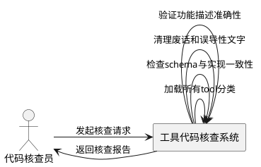
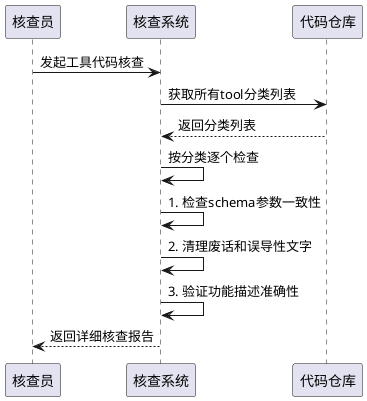

# **1. 组件定位**

## **1.1 核心职责**
本组件负责核查所有tool分类的schema文件与实现代码一致性，确保参数描述准确且无废话/误导性文字，实现功能与描述对应准确。

## **1.2 核心输入**
1. 用户指令：要求继续核查剩余9个分类的实现代码
2. 现有核查结果：file分类已完整核查，其他9个分类只检查了schema文件
3. 代码库中的tool实现文件

## **1.3 核心输出**
1. 详细的核查报告，包含每个tool分类的检查结果
2. 识别出的schema与实现不一致问题
3. 清理后的代码文件，去除废话和误导性文字
4. 验证功能与描述对应准确性的结果

## **1.4 职责边界**
1. 不负责修改业务逻辑，只核查一致性
2. 不负责添加新功能，只清理现有代码
3. 不负责性能优化，只关注代码准确性
4. 不负责测试代码编写，只验证功能描述准确性

# **2. 领域术语**

**tool分类**
: 按功能划分的工具类别，如file、shell、network、system、desktop、document、meta、win_registry等

**schema文件**
: 定义tool参数结构和描述的文件，通常命名为{category}_schema.py

**实现代码**
: 实际实现tool功能的代码文件，通常命名为{category}_tools.py

**参数一致性**
: schema文件中定义的参数与实现代码中的参数完全匹配

**废话清理**
: 去除代码中无实际意义的描述性文字和误导性内容

# **3. 角色与边界**

## **3.1 核心角色**
代码核查员：负责检查代码一致性和准确性

## **3.2 外部系统**
代码仓库：提供待核查的tool实现文件
开发环境：提供代码编辑和验证能力

## **3.3 交互上下文**

# **4. DFX约束**

## **4.1 性能**
1. 每个tool分类的核查必须在5分钟内完成
2. 系统在核查过程中不得影响现有tool功能

## **4.2 可靠性**
1. 核查过程必须保持代码功能不变
2. 清理操作必须有备份机制，防止数据丢失

## **4.3 安全性**
1. 不得修改任何敏感配置或安全相关代码
2. 所有修改必须经过人工确认

## **4.4 可维护性**
1. 核查过程必须生成详细日志
2. 所有修改必须添加注释说明修改原因

## **4.5 兼容性**
1. 清理操作必须保持向后兼容性
2. 不得破坏现有API接口

# **5. 核心能力**

## **5.1 工具代码核查**

### **5.1.1 业务规则**

1. **schema与实现一致性检查**：必须确保schema文件中的参数定义与实现代码中的参数完全一致
   a. 验收条件：[检查tool分类] → [验证所有参数名称、类型、描述的一致性]

2. **废话清理规则**：必须清理代码中无实际意义的描述性文字和误导性内容
   a. 验收条件：[发现废话内容] → [清理并保持功能不变]

3. **功能描述准确性验证**：必须验证tool功能与描述是否准确对应
   a. 验收条件：[检查tool实现] → [确认功能与描述匹配]

4. **禁止项**：禁止修改工具的核心业务逻辑
   a. 验收条件：[发现需要修改业务逻辑] → [保持原状并记录问题]

### **5.1.2 交互流程**

### **5.1.3 异常场景**

1. **schema文件缺失**
   a. 触发条件：某个tool分类缺少schema文件
   b. 系统行为：记录问题并跳过该分类
   c. 用户感知：在报告中标记为"schema缺失"

2. **实现文件缺失**
   a. 触发条件：某个tool分类缺少实现文件
   b. 系统行为：记录问题并跳过该分类
   c. 用户感知：在报告中标记为"实现缺失"

3. **参数严重不一致**
   a. 触发条件：schema与实现参数存在严重差异
   b. 系统行为：标记为高风险问题，需要人工干预
   c. 用户感知：在报告中标记为"高风险不一致"

# **6. 数据约束**

## **6.1 tool分类信息**

1. **分类名称**：必须与目录结构中的名称一致
2. **schema文件路径**：必须是有效的文件路径
3. **实现文件路径**：必须是有效的文件路径
4. **参数数量**：必须是非负整数
5. **问题严重程度**：只能是"低"、"中"、"高"三个等级

## **6.2 核查结果**

1. **分类名称**：被核查的tool分类名称
2. **检查状态**：只能是"通过"、"警告"、"失败"三种状态
3. **问题描述**：必须具体描述发现的问题
4. **修复建议**：必须提供具体的修复建议
5. **核查时间**：必须是有效的日期时间戳