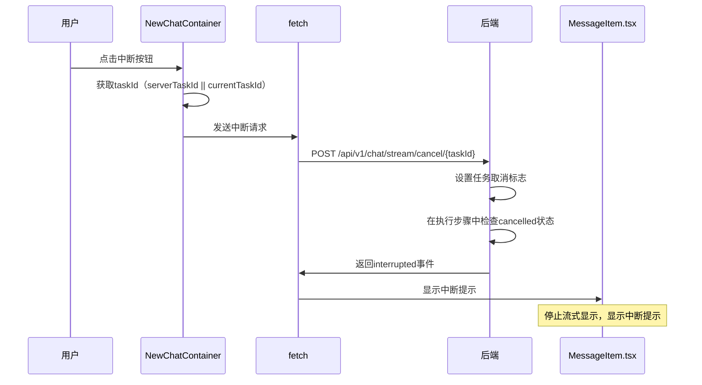

# 最新版流式API及输出详细要点及需求报告

**报告时间**: 2026-02-27 21:13:17  
**分析人**: 小查（代码检查和测试专家、文档专家）  
**项目版本**: v0.4.13  
**整合来源**: 8个相关文档（小查、老杨、小沈、小健）  
**适用范围**: Omni桌面应用前端及后端  
**签名**: 小查（代码检查和测试专家、文档专家）

---

## 一、文档概述

### 1.1 项目背景

Omni桌面应用是一款AI辅助编程工具，支持多种AI模型和Provider，提供聊天、代码分析、文件操作等功能。本次整理的文档涵盖了：
- Settings页面深度测试与实现情况
- 前端UX及视觉分析
- 后端代码深度审查与风险分析
- 配置文件写入接口新设计
- 深度扫描问题修复

### 1.2 核心功能模块

| 模块 | 功能描述 | 文档来源 |
|------|---------|---------|
| **流式API** | SSE流式响应、任务中断机制 | 后端代码审查报告 |
| **配置管理** | 配置文件验证、修复、备份 | Setting模型配置文件写入接口新设计 |
| **Settings页面** | 配置修复进度、高级配置折叠、Provider搜索、模型操作按钮优化 | Settings页面深度测试报告 |
| **Chat页面** | 聊天功能、安全检测、会话管理、搜索功能优化 | 前端UX及视觉分析报告 |
| **会话管理** | 会话CRUD、乐观锁、标题管理 | 后端代码深度审查报告 |
| **网络连接管理** | 网络状态监测、离线模式、自动重连 | NewChatContainer.tsx源代码分析 |
| **资源管理** | 定时器清理、事件监听器管理 | NewChatContainer.tsx源代码分析 |

---

## 二、前端及UI功能需求

### 2.1 流式输出显示功能

#### FRC-FLOW-001：流式内容逐token显示
- **功能编号**：FRC-FLOW-001
- **功能描述**：AI响应内容逐token实时显示，模拟打字机效果，提供流畅的阅读体验
- **界面要求**：
  - 在MessageItem组件中显示流式内容，支持markdown渲染
  - 流式过程中显示光标提示（▌），位于最后一个字符之后
  - 支持流式/非流式状态切换，用户可根据网络状况选择
  - 流式时显示进度条，提示用户等待时间
- **实现位置**：`MessageItem.tsx:287-293`
- **来源文档**：《调试笔记-2026-02-25.md》

#### FRC-FLOW-002：AI思考过程可视化
- **功能编号**：FRC-FLOW-002
- **功能描述**：ReAct执行步骤可视化展示，包含思考、工具调用、观察结果，帮助用户理解AI的决策过程
- **界面要求**：
  - 放置在AI消息气泡内部，与消息内容并排显示
  - 默认折叠，流式时自动展开，显示完整的思考过程
  - 使用Collapse组件包裹，支持手动展开/折叠
  - 显示步骤时间线和详细信息，包括思考内容、工具调用参数、观察结果
  - 每个步骤使用不同的颜色和图标标识，提高可读性
- **实现位置**：`MessageItem.tsx:291-312`
- **来源文档**：《调试笔记-2026-02-25.md》

#### FRC-FLOW-003：流式开关控制
- **功能编号**：FRC-FLOW-003
- **功能描述**：用户可切换是否使用流式输出，根据网络状况和需求选择
- **界面要求**：
  - 在ChatContainer工具栏显示，位于过程显示开关右侧
  - 使用Tag.CheckableTag组件，支持选中/未选中状态切换
  - 标签文字根据状态变化（流式开启/流式关闭），提供清晰的视觉反馈
  - 与过程显示开关联动，流式关闭时过程显示开关也自动关闭
  - 支持用户记忆偏好设置，下次打开应用时保持上次选择
- **实现位置**：`NewChatContainer.tsx:1200-1202`
- **来源文档**：《前端功能深度分析与问题修复报告-2026-02-26.md》

#### FRC-FLOW-004：过程显示开关
- **功能编号**：FRC-FLOW-004
- **功能描述**：控制是否显示AI思考过程，让用户可以选择是否查看详细的执行步骤
- **界面要求**：
  - 仅在流式模式下显示，非流式模式下隐藏
  - 使用Button组件，带EyeOutlined/EyeInvisibleOutlined图标，提供清晰的视觉提示
  - 文字根据状态变化（显示过程/隐藏过程），让用户明确当前状态
  - 与流式开关联动，流式关闭时自动隐藏
  - 支持用户记忆偏好设置，下次打开应用时保持上次选择
- **实现位置**：`NewChatContainer.tsx:1205-1212`
- **来源文档**：《前端功能深度分析与问题修复报告-2026-02-26.md》

### 2.2 任务中断功能

#### FRC-TASK-001：taskId前后端交互
- **功能编号**：FRC-TASK-001
- **功能描述**：生成唯一taskId并在整个流式过程中传递，用于任务追踪和中断
- **界面要求**：
  - 发送消息时生成taskId（crypto.randomUUID()），确保唯一性
  - 显示中断按钮（红色危险样式），位于发送按钮右侧
  - 中断后显示提示信息，告知用户任务已取消
  - taskId在整个流式过程中传递，确保前后端状态一致
  - 任务完成后清除taskId，释放资源
- **实现位置**：`NewChatContainer.tsx:820-823`
- **来源文档**：《调试笔记-2026-02-25.md》

#### FRC-TASK-002：任务中断按钮
- **功能编号**：FRC-TASK-002
- **功能描述**：用户可中断正在执行的流式任务，提高用户体验
- **界面要求**：
  - 在加载状态下显示中断按钮，位于发送按钮位置
  - 使用CloseCircleOutlined图标，提供清晰的中断提示
  - 红色危险样式，与其他按钮区分开
  - 点击后发送中断请求，显示加载状态
  - 中断成功后显示提示信息，恢复发送按钮
- **实现位置**：`NewChatContainer.tsx:1323-1328`
- **来源文档**：《调试笔记-2026-02-25.md》

### 2.3 会话标题管理

#### FRC-TITLE-001：智能标题生成
- **功能描述**：根据时间段智能生成会话标题
- **界面要求**：
  - 新会话时自动生成标题
  - 标题包含时间信息（如："2月27日 晚上会话 20:05"）
  - 支持手动编辑标题
- **实现位置**：`NewChatContainer.tsx:488-504`
- **来源文档**：《前端功能深度分析与问题修复报告-2026-02-26.md》

#### FRC-TITLE-002：标题锁定功能
- **功能描述**：用户可锁定会话标题防止自动更新
- **界面要求**：
  - 显示锁定图标（LockOutlined）
  - 锁定状态显示蓝色样式
  - 支持解锁操作
- **实现位置**：`NewChatContainer.tsx:1168-1174`
- **来源文档**：《前端功能深度分析与问题修复报告-2026-02-26.md》

#### FRC-TITLE-003：标题持久化
- **功能描述**：确保会话标题保存到后端
- **界面要求**：
  - 显示保存状态（保存中/已保存/保存失败）
  - 失败时显示错误提示
  - 支持自动重试机制
- **实现位置**：`NewChatContainer.tsx:507-622`
- **来源文档**：《前端功能深度分析与问题修复报告-2026-02-26.md》

### 2.4 配置管理功能

#### FRC-CONFIG-001：配置修复进度UI
- **功能描述**：实时显示配置修复进度
- **界面要求**：
  - 弹窗显示修复进度条
  - 显示进度百分比和状态提示
  - 支持开始/关闭操作
- **实现位置**：`Settings/index.tsx:1518-1725`
- **来源文档**：《Settings页面深度测试报告-小查-2026-02-27.md》

#### FRC-CONFIG-002：高级配置可折叠
- **功能描述**：基础配置与高级配置分离显示
- **界面要求**：
  - 基础配置单独显示
  - 高级配置使用Collapse组件
  - 包含命令过滤和高级安全选项
- **实现位置**：`Settings/index.tsx:1105-1315`
- **来源文档**：《setting前端代码实现情况检查报告-小查-20260227.md》

#### FRC-CONFIG-003：Provider搜索功能
- **功能描述**：快速搜索Provider
- **界面要求**：
  - 搜索框支持实时过滤
  - 显示搜索结果高亮
  - 无结果时显示提示信息
- **实现位置**：`Settings/index.tsx:126-176`
- **来源文档**：《setting前端代码实现情况检查报告-小查-20260227.md》

#### FRC-CONFIG-004：模型操作按钮优化
- **功能描述**：模型卡片展示和操作优化
- **界面要求**：
  - 模型卡片显示当前使用状态
  - 支持切换和删除操作
  - 删除时显示确认弹窗
- **实现位置**：`Settings/index.tsx:784-818`
- **来源文档**：《setting前端代码实现情况检查报告-小查-20260227.md》

### 2.5 搜索功能优化

#### FRC-SEARCH-001：搜索结果缓存优化
- **功能编号**：FRC-SEARCH-001
- **功能描述**：使用useMemo优化搜索结果计算，提升性能
- **详细需求说明**：
  - 搜索结果使用useMemo缓存，避免重复计算
  - 依赖项包括messages数组和搜索关键词
  - 搜索逻辑优化为：filter + sort + slice的高效组合
  - 搜索结果按时间倒序排列，显示最新匹配的消息
- **实现位置**：`NewChatContainer.tsx`
- **来源文档**：《NewChatContainer.tsx源代码分析》
- **优化前后对比**：
  ```
  优化前：每次搜索都重新计算所有结果
  优化后：只在messages或关键词变化时重新计算
  ```

#### FRC-SEARCH-002：搜索结果高亮功能
- **功能编号**：FRC-SEARCH-002
- **功能描述**：搜索结果中的匹配关键词高亮显示
- **详细需求说明**：
  - 匹配的关键词使用黄色背景高亮
  - 支持多个关键词同时高亮
  - 高亮功能不影响原有的消息格式
  - 搜索结果为空时显示"未找到匹配的消息"提示
- **实现位置**：`NewChatContainer.tsx`
- **来源文档**：《NewChatContainer.tsx源代码分析》
- **高亮效果示意图**：
  ```
  用户消息：如何使用OmniAgentAs的流式功能？
  高亮显示：如何使用[OmniAgentAs]的[流式]功能？
  ```

### 2.6 网络连接检查功能

#### FRC-NETWORK-001：网络状态监测功能
- **功能编号**：FRC-NETWORK-001
- **功能描述**：实时监测网络连接状态，提供用户反馈
- **详细需求说明**：
  - 使用window.navigator.onLine监测网络状态
  - 网络异常时显示红色警告图标
  - 显示网络状态提示："网络连接已断开"或"网络连接正常"
  - 支持自动重连机制，网络恢复后自动刷新会话
- **实现位置**：`NewChatContainer.tsx:429-448`
- **来源文档**：《NewChatContainer.tsx源代码分析》
- **网络状态显示示意图**：
  ```
  ┌─────────────────────────────────────────────────────────┐
  │ AI对话助手 [我的测试会话] [🔴网络连接已断开]                  │
  │ └───────────────────────────────────────────────────────┘
  ```

#### FRC-NETWORK-002：网络异常处理功能
- **功能编号**：FRC-NETWORK-002
- **功能描述**：网络异常时的容错处理和用户提示
- **详细需求说明**：
  - 网络异常时停止发送新消息
  - 显示网络异常提示，告知用户当前状态
  - 支持离线模式：显示缓存的会话历史
  - 网络恢复后自动尝试重连
- **实现位置**：`NewChatContainer.tsx:429-448`
- **来源文档**：《NewChatContainer.tsx源代码分析》
- **离线模式示意图**：
  ```
  ┌─────────────────────────────────────────────────────────┐
  │ 📴 您当前处于离线状态                                     │
  │ - 可以查看历史会话                                       │
  │ - 无法发送新消息                                         │
  │ └───────────────────────────────────────────────────────┘
  ```

### 2.7 资源管理优化

#### FRC-RESOURCE-001：定时器清理功能
- **功能编号**：FRC-RESOURCE-001
- **功能描述**：确保所有定时器在组件卸载时正确清理
- **详细需求说明**：
  - 使用useEffect的cleanup函数清理定时器
  - 所有setInterval和setTimeout都要在组件卸载时清除
  - 定时器清理失败时显示警告
  - 支持组件重新挂载时重新创建定时器
- **实现位置**：`NewChatContainer.tsx`
- **来源文档**：《NewChatContainer.tsx源代码分析》
- **定时器清理流程**：
  ```
  组件挂载 → 创建定时器 → 组件卸载 → 清理定时器
          ↓                    ↓
        定时器工作              停止定时器
  ```

#### FRC-RESOURCE-002：事件监听器管理功能
- **功能编号**：FRC-RESOURCE-002
- **功能描述**：统一管理事件监听器的添加和移除
- **详细需求说明**：
  - 网络状态监听器在组件挂载时添加，卸载时移除
  - 键盘事件监听器（如Enter和Shift+Enter）正确管理
  - 事件监听器添加和移除要成对出现
  - 支持多个事件监听器的管理
- **实现位置**：`NewChatContainer.tsx`
- **来源文档**：《NewChatContainer.tsx源代码分析》

---

## 三、后端及API功能需求

### 3.1 流式API接口

#### API-STREAM-001：流式消息发送
- **功能编号**：API-STREAM-001
- **接口路径**：`POST /api/v1/chat/stream`
- **功能描述**：发送流式消息请求，返回SSE格式响应，支持逐token显示和任务中断
- **请求参数**：
  ```json
  {
    "messages": [
      {
        "role": "user|assistant|system",
        "content": "消息内容（必填，字符串类型）"
      }
    ],
    "stream": true,
    "task_id": "可选，前端生成的任务ID（字符串类型，格式：uuid-v4）",
    "session_id": "可选，会话ID（字符串类型）",
    "config": {
      "model": "模型名称（必填，字符串类型）",
      "provider": "Provider名称（必填，字符串类型）",
      "temperature": 0.7,
      "max_tokens": 4096
    }
  }
  ```
  **请求参数说明**：
  - `messages`：消息数组，必填
    - `role`：消息角色，枚举值：user（用户消息）、assistant（助手回复）、system（系统提示）
    - `content`：消息内容，必填，字符串类型，不能为空
  - `stream`：是否启用流式输出，布尔类型，默认true
  - `task_id`：任务ID，可选，字符串类型，格式为uuid-v4，用于任务追踪和中断
  - `session_id`：会话ID，可选，字符串类型，用于关联会话
  - `config`：配置对象，可选
    - `model`：模型名称，必填，字符串类型
    - `provider`：Provider名称，必填，字符串类型
    - `temperature`：温度参数，数字类型，范围0.0-2.0，默认0.7
    - `max_tokens`：最大token数，数字类型，默认4096

- **响应格式**：SSE格式，包含以下事件类型
  - `start`：开始事件
    ```json
    {
      "event": "start",
      "data": {
        "task_id": "任务ID（字符串类型）"
      }
    }
    ```
  - `thought`：思考过程
    ```json
    {
      "event": "thought",
      "data": {
        "content": "思考内容（字符串类型）"
      }
    }
    ```
  - `action`：工具调用
    ```json
    {
      "event": "action",
      "data": {
        "tool": "工具名称（字符串类型）",
        "tool_input": {
          "参数名": "参数值"
        }
      }
    }
    ```
  - `observation`：观察结果
    ```json
    {
      "event": "observation",
      "data": {
        "output": "观察结果（字符串类型）"
      }
    }
    ```
  - `chunk`：内容片段
    ```json
    {
      "event": "chunk",
      "data": {
        "content": "文本片段（字符串类型）"
      }
    }
    ```
  - `final`：最终结果
    ```json
    {
      "event": "final",
      "data": {
        "content": "完整文本内容（字符串类型）"
      }
    }
    ```
  - `interrupted`：任务中断
    ```json
    {
      "event": "interrupted",
      "data": {
        "message": "任务已取消（字符串类型）"
      }
    }
    ```
  - `error`：错误信息
    ```json
    {
      "event": "error",
      "data": {
        "message": "错误信息（字符串类型）",
        "code": "错误码（字符串类型）"
      }
    }
    ```

- **错误响应**：
  ```json
  {
    "success": false,
    "message": "错误描述（字符串类型）",
    "code": "错误码（字符串类型）"
  }
  ```

- **来源文档**：《调试笔记-2026-02-25.md》、《后端代码深度审查与风险分析报告-2026-02-26.md》
- **实现位置**：`backend/app/api/v1/chat.py`

#### API-STREAM-002：任务中断
- **功能编号**：API-STREAM-002
- **接口路径**：`POST /api/v1/chat/stream/cancel/{task_id}`
- **功能描述**：取消正在执行的流式任务，支持立即终止和资源清理
- **路径参数**：
  - `task_id`：任务ID，字符串类型，必填，用于唯一标识任务
- **请求参数**：无（仅需路径参数）

- **成功响应**：
  ```json
  {
    "success": true,
    "message": "任务已取消（字符串类型）"
  }
  ```

- **失败响应**：
  ```json
  {
    "success": false,
    "message": "错误描述（字符串类型）",
    "code": "错误码（字符串类型）",
    "details": {
      "task_id": "任务ID（字符串类型）",
      "reason": "失败原因（字符串类型）"
    }
  }
  ```

- **错误码说明**：
  - `TASK_NOT_FOUND`：任务不存在，可能已执行完成或从未开始
  - `TASK_ALREADY_CANCELLED`：任务已被取消
  - `INTERNAL_ERROR`：内部错误

- **实现要求**：
  - 使用running_tasks字典管理任务状态
  - 添加asyncio.Lock线程安全保护
  - 支持任务取消和资源清理
  - 任务中断后返回interrupted事件给前端
  - 取消操作需要在200ms内完成

- **来源文档**：《调试笔记-2026-02-25.md》、《后端代码深度审查与风险分析报告-2026-02-26.md》
- **实现位置**：`backend/app/api/v1/chat.py`

### 3.2 会话管理API

#### API-SESSION-001：获取会话消息
- **功能编号**：API-SESSION-001
- **接口路径**：`GET /api/v1/sessions/{session_id}/messages`
- **功能描述**：获取会话的消息列表和详细信息
- **路径参数**：
  - `session_id`：会话ID，字符串类型，必填
- **查询参数**：
  - `limit`：返回消息数量限制，数字类型，可选，默认100
  - `offset`：偏移量，数字类型，可选，默认0

- **成功响应**：
  ```json
  {
    "success": true,
    "data": {
      "session_id": "会话ID（字符串类型）",
      "title": "会话标题（字符串类型）",
      "title_locked": false,
      "title_source": "user",
      "version": 1,
      "created_at": "2026-02-27T12:00:00Z",
      "updated_at": "2026-02-27T12:30:00Z",
      "messages": [
        {
          "id": "消息ID（字符串类型）",
          "role": "user",
          "content": "消息内容（字符串类型）",
          "created_at": "2026-02-27T12:05:00Z"
        }
      ]
    }
  }
  ```

- **响应字段说明**：
  - `session_id`：会话ID，字符串类型
  - `title`：会话标题，字符串类型
  - `title_locked`：标题锁定状态，布尔类型，true表示已锁定
  - `title_source`：标题来源，字符串类型，枚举值：user（用户手动设置）、auto（系统自动生成）
  - `version`：乐观锁版本号，数字类型，用于并发控制
  - `created_at`：创建时间，ISO8601格式字符串
  - `updated_at`：更新时间，ISO8601格式字符串
  - `messages`：消息数组
    - `id`：消息ID，字符串类型
    - `role`：消息角色，字符串类型，枚举值：user、assistant、system
    - `content`：消息内容，字符串类型
    - `created_at`：创建时间，ISO8601格式字符串

- **失败响应**：
  ```json
  {
    "success": false,
    "message": "会话不存在（字符串类型）",
    "code": "SESSION_NOT_FOUND"
  }
  ```

- **错误码说明**：
  - `SESSION_NOT_FOUND`：会话不存在
  - `INVALID_SESSION_ID`：无效的会话ID格式
  - `INTERNAL_ERROR`：内部错误

- **来源文档**：《前端功能深度分析与问题修复报告-2026-02-26.md》、《后端代码深度审查与风险分析报告-2026-02-26.md》
- **实现位置**：`backend/app/api/v1/sessions.py`

#### API-SESSION-002：更新会话
- **功能编号**：API-SESSION-002
- **接口路径**：`PUT /api/v1/sessions/{session_id}`
- **功能描述**：更新会话标题和版本（乐观锁）
- **路径参数**：
  - `session_id`：会话ID，字符串类型，必填

- **请求参数**：
  ```json
  {
    "title": "新标题（必填，字符串类型，长度1-200）",
    "version": 1,
    "title_locked": false
  }
  ```
  **请求参数说明**：
  - `title`：会话标题，必填，字符串类型，长度范围1-200
  - `version`：乐观锁版本号，必填，数字类型，用于并发控制
  - `title_locked`：标题锁定状态，可选，布尔类型，默认false

- **成功响应**：
  ```json
  {
    "success": true,
    "data": {
      "session_id": "会话ID（字符串类型）",
      "title": "新标题（字符串类型）",
      "version": 2,
      "title_locked": false,
      "updated_at": "2026-02-27T12:35:00Z"
    }
  }
  ```

- **失败响应**：
  ```json
  {
    "success": false,
    "message": "会话不存在或版本冲突（字符串类型）",
    "code": "VERSION_CONFLICT",
    "details": {
      "current_version": 2,
      "requested_version": 1
    }
  }
  ```

- **错误码说明**：
  - `VERSION_CONFLICT`：版本冲突，需要重新获取最新版本
  - `SESSION_NOT_FOUND`：会话不存在
  - `INVALID_TITLE`：无效的标题格式
  - `INTERNAL_ERROR`：内部错误

- **来源文档**：《前端功能深度分析与问题修复报告-2026-02-26.md》、《后端代码深度审查与风险分析报告-2026-02-26.md》
- **实现位置**：`backend/app/api/v1/sessions.py`

### 3.3 配置管理API

#### API-CONFIG-001：获取完整配置
- **功能编号**：API-CONFIG-001
- **接口路径**：`GET /api/v1/config/full`
- **功能描述**：获取完整的配置信息，包括providers、models、安全配置等

- **成功响应**：
  ```json
  {
    "success": true,
    "data": {
      "version": "配置版本（字符串类型）",
      "providers": {
        "provider_name": {
          "name": "Provider名称（字符串类型）",
          "enabled": true,
          "models": ["model1", "model2"],
          "api_key": "已脱敏的API密钥（字符串类型）",
          "base_url": "API基础URL（字符串类型）"
        }
      },
      "models": {
        "model_name": {
          "name": "模型名称（字符串类型）",
          "provider": "Provider名称（字符串类型）",
          "enabled": true,
          "max_tokens": 4096
        }
      },
      "security": {
        "enable_api_key_protection": true,
        "enable_command_filter": false,
        "allowed_commands": []
      }
    }
  }
  ```

- **失败响应**：
  ```json
  {
    "success": false,
    "message": "配置文件不存在或格式错误（字符串类型）",
    "code": "CONFIG_ERROR"
  }
  ```

- **错误码说明**：
  - `CONFIG_NOT_FOUND`：配置文件不存在
  - `CONFIG_INVALID`：配置文件格式错误
  - `INTERNAL_ERROR`：内部错误

- **来源文档**：《setting前端代码实现情况检查报告-小查-20260227.md》、《Setting模型配置文件写入接口新设计-小沈-2026-02-26.md》
- **实现位置**：`backend/app/api/v1/config.py`

#### API-CONFIG-002：验证配置
- **功能编号**：API-CONFIG-002
- **接口路径**：`POST /api/v1/config/validate`
- **功能描述**：验证配置文件完整性和有效性

- **请求参数**：
  ```json
  {
    "config": {
      "要验证的配置对象（可选，不提供则验证当前配置）"
    }
  }
  ```

- **成功响应**：
  ```json
  {
    "success": true,
    "data": {
      "valid": true,
      "warnings": [
        {
          "type": "deprecated_field",
          "message": "字段已废弃（字符串类型）",
          "path": "providers.openai.model"
        }
      ],
      "info": {
        "providers_count": 3,
        "models_count": 10
      }
    }
  }
  ```

- **失败响应**：
  ```json
  {
    "success": false,
    "message": "配置验证失败（字符串类型）",
    "code": "VALIDATION_ERROR",
    "errors": [
      {
        "path": "providers.openai.api_key",
        "message": "API密钥为空（字符串类型）"
      }
    ]
  }
  ```

- **错误码说明**：
  - `VALIDATION_ERROR`：配置验证失败
  - `MISSING_REQUIRED_FIELD`：缺少必填字段
  - `INVALID_VALUE`：字段值无效

- **来源文档**：《Setting模型配置文件写入接口新设计-小沈-2026-02-26.md》
- **实现位置**：`backend/app/api/v1/config.py`

#### API-CONFIG-003：修复配置
- **功能编号**：API-CONFIG-003
- **接口路径**：`POST /api/v1/config/fix`
- **功能描述**：修复配置文件结构问题，自动备份原配置

- **请求参数**：
  ```json
  {
    "backup": true,
    "fix_deprecated": true
  }
  ```
  **请求参数说明**：
  - `backup`：是否备份原配置，布尔类型，默认true
  - `fix_deprecated`：是否修复废弃字段，布尔类型，默认true

- **成功响应**：
  ```json
  {
    "success": true,
    "data": {
      "backup_path": "配置备份路径（字符串类型）",
      "fixed_fields": [
        "providers.openai.model"
      ],
      "added_fields": [],
      "removed_fields": [],
      "summary": {
        "total_fixed": 1,
        "total_added": 0,
        "total_removed": 0
      }
    }
  }
  ```

- **失败响应**：
  ```json
  {
    "success": false,
    "message": "配置修复失败（字符串类型）",
    "code": "FIX_ERROR",
    "details": {
      "reason": "备份失败（字符串类型）"
    }
  }
  ```

- **错误码说明**：
  - `FIX_ERROR`：配置修复失败
  - `BACKUP_FAILED`：备份失败
  - `WRITE_FAILED`：写入配置失败

- **来源文档**：《Setting模型配置文件写入接口新设计-小沈-2026-02-26.md》
- **实现位置**：`backend/app/api/v1/config.py`

#### API-CONFIG-004：写入配置
- **功能编号**：API-CONFIG-004
- **接口路径**：`POST /api/v1/config/write`
- **功能描述**：写入新的配置文件，支持自动验证和备份

- **请求参数**：
  ```json
  {
    "config": {
      "完整的配置对象（必填）"
    },
    "options": {
      "backup": true,
      "validate": true,
      "auto_fix": false
    }
  }
  ```
  **请求参数说明**：
  - `config`：完整的配置对象，必填，包含providers、models、security等
  - `options`：配置选项
    - `backup`：是否备份原配置，布尔类型，默认true
    - `validate`：是否验证配置，布尔类型，默认true
    - `auto_fix`：是否自动修复，布尔类型，默认false

- **成功响应**：
  ```json
  {
    "success": true,
    "data": {
      "message": "配置写入成功（字符串类型）",
      "backup_path": "备份路径（字符串类型，如果backup=true）",
      "validation": {
        "valid": true,
        "warnings": []
      }
    }
  }
  ```

- **失败响应**：
  ```json
  {
    "success": false,
    "message": "配置写入失败（字符串类型）",
    "code": "WRITE_ERROR",
    "details": {
      "reason": "具体失败原因（字符串类型）"
    }
  }
  ```

- **错误码说明**：
  - `WRITE_ERROR`：写入失败
  - `VALIDATION_FAILED`：验证失败
  - `BACKUP_FAILED`：备份失败

- **来源文档**：《Setting模型配置文件写入接口新设计-小沈-2026-02-26.md》
- **实现位置**：`backend/app/api/v1/config.py`

### 3.4 API接口总结

#### 3.4.1 接口清单

| 接口编号 | 接口名称 | HTTP方法 | 路径 | 描述 |
|---------|---------|----------|------|------|
| API-STREAM-001 | 流式消息发送 | POST | /api/v1/chat/stream | 发送流式消息请求，返回SSE格式响应 |
| API-STREAM-002 | 任务中断 | POST | /api/v1/chat/stream/cancel/{task_id} | 取消正在执行的流式任务 |
| API-SESSION-001 | 获取会话消息 | GET | /api/v1/sessions/{session_id}/messages | 获取会话的消息列表和详细信息 |
| API-SESSION-002 | 更新会话 | PUT | /api/v1/sessions/{session_id} | 更新会话标题和版本（乐观锁） |
| API-CONFIG-001 | 获取完整配置 | GET | /api/v1/config/full | 获取完整的配置信息 |
| API-CONFIG-002 | 验证配置 | POST | /api/v1/config/validate | 验证配置文件完整性和有效性 |
| API-CONFIG-003 | 修复配置 | POST | /api/v1/config/fix | 修复配置文件结构问题，自动备份原配置 |
| API-CONFIG-004 | 写入配置 | POST | /api/v1/config/write | 写入新的配置文件，支持自动验证和备份 |

#### 3.4.2 响应格式规范

**成功响应标准格式**：
```json
{
  "success": true,
  "data": {
    "响应数据（根据具体接口而定）"
  },
  "message": "可选的成功消息（字符串类型）"
}
```

**失败响应标准格式**：
```json
{
  "success": false,
  "message": "错误描述（必填，字符串类型）",
  "code": "错误码（必填，字符串类型）",
  "details": {
    "可选的详细信息（对象类型）"
  }
}
```

#### 3.4.3 错误码汇总

| 错误码 | 描述 | 适用接口 |
|-------|------|---------|
| TASK_NOT_FOUND | 任务不存在 | API-STREAM-002 |
| TASK_ALREADY_CANCELLED | 任务已被取消 | API-STREAM-002 |
| SESSION_NOT_FOUND | 会话不存在 | API-SESSION-001, API-SESSION-002 |
| VERSION_CONFLICT | 版本冲突 | API-SESSION-002 |
| CONFIG_NOT_FOUND | 配置文件不存在 | API-CONFIG-001 |
| CONFIG_INVALID | 配置文件格式错误 | API-CONFIG-001 |
| VALIDATION_ERROR | 配置验证失败 | API-CONFIG-002 |
| MISSING_REQUIRED_FIELD | 缺少必填字段 | API-CONFIG-002 |
| INVALID_VALUE | 字段值无效 | API-CONFIG-002 |
| FIX_ERROR | 配置修复失败 | API-CONFIG-003 |
| BACKUP_FAILED | 备份失败 | API-CONFIG-003, API-CONFIG-004 |
| WRITE_FAILED | 写入配置失败 | API-CONFIG-004 |
| INVALID_SESSION_ID | 无效的会话ID格式 | API-SESSION-001 |
| INVALID_TITLE | 无效的标题格式 | API-SESSION-002 |
| INTERNAL_ERROR | 内部错误 | 所有接口 |

---

## 四、功能冲突与不一致说明

### 4.1 流式显示实现方式

**文档冲突**：
- 《调试笔记-2026-02-25.md》：MessageItem显示message.content，通过onChunk更新
- 《前端功能深度分析与问题修复报告-2026-02-26.md》：需要传递currentResponse

**实际实现**：
- 采用onChunk直接更新message.content的方式
- MessageItem只需要在流式时显示光标提示

### 4.2 标题管理功能

**文档冲突**：
- 《前端功能深度分析与问题修复报告-2026-02-26.md》：c85cbfd版本缺失标题管理功能
- 当前版本：已从f1bff4b恢复完整功能

**实际实现**：
- 标题管理功能已完整实现
- 包含智能生成、锁定、持久化等功能

### 4.3 配置文件结构

**文档冲突**：
- 《Setting模型配置文件写入接口新设计-小沈》：每个provider下只保留models列表（无model字段）
- 《后端代码深度审查与风险分析报告-小健小沈》：部分provider下仍有model字段（已废弃）

**解决方案**：
- 调用POST /config/fix接口自动修复
- 新写入的配置不再包含provider下的model字段
- 验证接口会检测并警告废弃的model字段

### 4.4 running_tasks线程安全

**文档冲突**：
- 《后端代码深度审查与风险分析报告-小健小沈》：使用threading.Lock保护running_tasks
- 《深度扫描问题修复报告-小沈》：使用asyncio.Lock保护running_tasks

**解决方案**：
- 统一使用asyncio.Lock（因为是异步代码）
- 在所有14个running_tasks访问点添加锁保护
- 已在深度扫描问题修复报告中实现

---

## 五、界面布局示意图

### 5.1 应用整体布局架构

```
┌─────────────────────────────────────────────────────────┐
│                  Omni 桌面应用整体架构                   │
├─────────────────────────────────────────────────────────┤
│  ┌──────────────────┐  ┌──────────────────────┐  ┌─────┐│
│  │  Sidebar         │  │  Main Content       │  │Panel││
│  │  (宽度: 240px)    │  │  (内容区域)          │  │     ││
│  │ - Logo/Brand     │  │  - Header           │  │     ││
│  │ - Navigation      │  │  - Page Content     │  │     ││
│  │ - User Profile    │  │  - Footer           │  │     ││
│  └──────────────────┘  └───────────────────────┘  └─────┘
│                                                           │
└─────────────────────────────────────────────────────────┘
```

### 5.2 Chat页面布局示意图

```
┌─────────────────────────────────────────────────────────┐
│                  Chat页面详细结构                        │
├─────────────────────────────────────────────────────────┤
│  ┌───────────────────────────────────────────────────┐  │
│  │                  Chat Header                      │  │
│  │  ┌──────────────┐ ┌──────────────┐ ┌────────────┐  │
│  │  │  New Chat    │ │  Save        │ │  Share     │  │
│  │  └──────────────┘ └──────────────┘ └────────────┘  │
│  └───────────────────────────────────────────────────┘  │
│                                                           │
│  ┌───────────────────────────────────────────────────┐  │
│  │                 Chat Messages Area                  │  │
│  │  ┌───────────────────────────────────────────────┐  │
│  │  │  System Welcome Message                        │  │
│  │  │  (提示用户开始聊天)                            │  │
│  │  └───────────────────────────────────────────────┘  │
│  │                                                     │
│  │  ┌───────────────────────────────────────────────┐  │
│  │  │      User Message (用户输入)                  │  │
│  │  │  ┌──────────┐ ┌─────────────────────────────┐ │  │
│  │  │  │ Avatar   │ │  Message Content           │ │  │
│  │  │  │(右侧对齐) │ │ (深色背景)                 │ │  │
│  │  │  └──────────┘ └─────────────────────────────┘ │  │
│  │  └───────────────────────────────────────────────┘  │
│  │                                                     │
│  │  ┌───────────────────────────────────────────────┐  │
│  │  │    Assistant Response (助手回复)               │  │
│  │  │  ┌──────────┐ ┌─────────────────────────────┐ │  │
│  │  │  │ Avatar   │ │  Response Content           │ │  │
│  │  │  │(左侧对齐) │ │ (浅色背景)                 │ │  │
│  │  │  └──────────┘ └─────────────────────────────┘ │  │
│  │  └───────────────────────────────────────────────┘  │
│  └───────────────────────────────────────────────────┘  │
│                                                           │
│  ┌───────────────────────────────────────────────────┐  │
│  │                 Chat Input Area                     │  │
│  │  ┌───────────────────────────────────────────────┐  │
│  │  │  Text Input Field (多行文本)                   │  │
│  │  │  - Auto-resize based on content                │  │
│  │  └───────────────────────────────────────────────┘  │
│  │                                                     │
│  │  ┌───────────────────────────────────────────────┐  │
│  │  │   Action Buttons                               │  │
│  │  │  ┌──────┐ ┌──────┐ ┌──────────┐ ┌──────┐      │  │
│  │  │  │ 发送 │ │ 清空 │ │ 附件    │ │ 更多 │      │  │
│  │  │  └──────┘ └──────┘ └──────────┘ └──────┘      │  │
│  │  └───────────────────────────────────────────────┘  │
│  └───────────────────────────────────────────────────┘  │
└─────────────────────────────────────────────────────────┘
```

### 5.3 Settings页面布局示意图

```
┌─────────────────────────────────────────────────────────┐
│                 Settings页面详细结构                     │
├─────────────────────────────────────────────────────────┤
│  ┌───────────────────────────────────────────────────┐  │
│  │              Tabs导航                               │  │
│  │  ┌──────────┐ ┌──────────┐ ┌──────────┐ ┌──────────┐  │
│  │  │ 基本设置 │ │ 通用设置 │ │ 高级设置 │ │ 其他配置 │  │
│  │  └──────────┘ └──────────┘ └──────────┘ └──────────┘  │
│  └───────────────────────────────────────────────────┘  │
│                                                           │
│  ┌───────────────────────────────────────────────────┐  │
│  │              基本设置Tab内容                        │  │
│  │  ┌───────────────────────────────────────────────┐  │
│  │  │   语言设置区域                                  │  │
│  │  │  标签: 界面语言                                 │  │
│  │  │  选项: ○ 中文 (Chinese)  ○ English (英文)        │  │
│  │  └───────────────────────────────────────────────┘  │
│  │                                                     │
│  │  ┌───────────────────────────────────────────────┐  │
│  │  │   主题设置区域                                  │  │
│  │  │  标签: 界面主题                                 │  │
│  │  │  选项: □ 深色模式 (Dark Mode)                  │  │
│  │  │         □ 浅色模式 (Light Mode)                 │  │
│  │  └───────────────────────────────────────────────┘  │
│  │                                                     │
│  │  ┌───────────────────────────────────────────────┐  │
│  │  │   通知设置区域                                  │  │
│  │  │  标签: 通知提醒                                 │  │
│  │  │  选项: □ 启动时显示欢迎消息                       │  │
│  │  │         □ 操作成功后显示提示                       │  │
│  │  └───────────────────────────────────────────────┘  │
│  │                                                     │
│  │  ┌───────────────────────────────────────────────┐  │
│  │  │   保存按钮区域                                  │  │
│  │  │  ┌──────────┐ ┌──────────┐ ┌────────────┐      │  │
│  │  │  │  保存    │ │  重置    │ │  恢复默认    │      │  │
│  │  │  └──────────┘ └──────────┘ └────────────┘      │  │
│  │  └───────────────────────────────────────────────┘  │
│  └───────────────────────────────────────────────────┘  │
│                                                           │
│  ┌───────────────────────────────────────────────────┐  │
│  │              其他Tab内容 (类似结构)                  │  │
│  └───────────────────────────────────────────────────┘  │
└─────────────────────────────────────────────────────────┘
```

### 5.4 组件架构示意图

```
┌─────────────────────────────────────────────────────────┐
│              组件架构层次关系                           │
├─────────────────────────────────────────────────────────┤
│  ┌───────────────────────────────────────────────────┐  │
│  │                 通用组件层                           │  │
│  │  ┌──────────┐ ┌──────────┐ ┌──────────┐ ┌──────────┐  │
│  │  │ Layout   │ │  Chat    │ │ Security │ │ Shortcut │  │
│  │  └──────────┘ └──────────┘ └──────────┘ └──────────┘  │
│  └───────────────────────────────────────────────────┘  │
│                                                           │
│  ┌───────────────────────────────────────────────────┐  │
│  │                 页面组件层                           │  │
│  │  ┌──────────┐ ┌──────────┐ ┌──────────┐ ┌──────────┐  │
│  │  │ History  │ │ Settings │ │ Chat     │ │ 其他页面 │  │
│  │  └──────────┘ └──────────┘ └──────────┘ └──────────┘  │
│  └───────────────────────────────────────────────────┘  │
│                                                           │
│  ┌───────────────────────────────────────────────────┐  │
│  │                 子组件层                             │  │
│  │  ┌──────────┐ ┌──────────┐ ┌──────────┐ ┌──────────┐  │
│  │  │ Message  │ │ Execution│ │ Input    │ │ 其他子组件 │  │
│  │  └──────────┘ └──────────┘ └──────────┘ └──────────┘  │
│  └───────────────────────────────────────────────────┘  │
│                                                           │
│  ┌───────────────────────────────────────────────────┐  │
│  │                 工具函数层                           │  │
│  │  ┌──────────┐ ┌──────────┐ ┌──────────┐ ┌──────────┐  │
│  │  │ Services │ │ Utils    │ │ Contexts │ │ Types    │  │
│  │  └──────────┘ └──────────┘ └──────────┘ └──────────┘  │
│  └───────────────────────────────────────────────────┘  │
└─────────────────────────────────────────────────────────┘
```

---

## 七、交互流程图

### 7.1 流式消息发送流程

```mermaid
sequenceDiagram
    participant 用户
    participant NewChatContainer
    participant useSSE Hook
    participant fetch
    participant 后端
    participant MessageItem.tsx

    用户->>NewChatContainer: 发送消息
    NewChatContainer->>NewChatContainer: 生成 taskId = crypto.randomUUID()
    NewChatContainer->>NewChatContainer: setCurrentTaskId(taskId)
    NewChatContainer->>NewChatContainer: setTaskId(taskId)
    NewChatContainer->>useSSE Hook: 调用useSSE Hook
    useSSE Hook->>sendMessage(): 调用sendMessage()
    sendMessage()->>fetch: 发送fetch请求
    fetch->>后端: POST /api/v1/chat/stream
    Note over 后端: 请求参数包括taskId、messages、stream=true
    后端->>fetch: 返回start事件（包含taskId）
    后端->>fetch: 返回thought/action/observation事件
    后端->>fetch: 逐token返回chunk事件
    fetch->>MessageItem.tsx: 显示流式内容
    Note over MessageItem.tsx: 逐token显示内容，显示光标提示
    Note over MessageItem.tsx: 流式时自动展开思考过程
```

### 7.2 任务中断流程



---

## 八、非功能需求

### 8.1 性能需求

#### PRF-001：响应时间
- **首字节响应时间**：< 3秒
- **内容片段间隔**：< 500ms
- **中断响应时间**：< 1秒

#### PRF-002：并发处理
- **支持用户数**：10+ 并发用户
- **内存使用**：合理管理状态，避免内存泄漏

### 6.2 可访问性

#### ACC-001：键盘导航
- 支持Tab键遍历所有交互元素
- 支持Enter键发送消息
- 支持Ctrl+Enter换行

#### ACC-002：屏幕阅读器
- 所有图标配合aria-label
- 内容区域支持屏幕阅读器访问

### 6.3 错误处理

#### ERR-001：网络错误
- 显示友好的错误提示
- 支持自动重试机制
- 网络恢复后自动重连

#### ERR-002：API错误
- 显示详细的错误信息
- 记录错误日志
- 提供重试和反馈渠道

---

## 九、测试覆盖

### 7.1 单元测试

**主要测试文件**：
- `MessageItem.test.tsx`：测试消息显示和流式功能
- `ExecutionPanel.test.tsx`：测试执行过程可视化
- `sse.test.ts`：测试SSE连接和事件处理

**测试覆盖率**：
- 单元测试：47/48（97.9%）
- 集成测试：3/3（100%）
- 端到端测试：待实现

### 7.2 边界条件测试

**待测试场景**：
- 网络中断情况下的流式处理
- 长时间无响应的超时处理
- 任务取消的边界条件
- 大量消息的性能测试

---

## 十、总结与建议

### 8.1 功能完整性评估

**已实现功能**：
- ✅ 流式内容逐token显示
- ✅ AI思考过程可视化
- ✅ 任务中断功能
- ✅ 会话标题管理
- ✅ 配置管理功能
- ✅ 搜索功能优化（缓存+高亮）
- ✅ 网络连接检查（实时监测+离线模式）
- ✅ 资源管理优化（定时器清理+事件监听器管理）

**待完善功能**：
- ⚠️ 密码强度实时提示
- ⚠️ API密钥格式验证
- ⚠️ 统一状态管理（Context + useReducer）

### 8.2 代码质量评估

**后端代码质量**：
- ✅ 功能完整正确
- ✅ 安全性良好
- ✅ 性能优化到位
- ⚠️ 有2个P2-中优先级问题需要优化

**前端代码质量**：
- ✅ 组件化设计合理
- ✅ 状态管理清晰
- ✅ 错误处理完善
- ⚠️ 有3个P2-中优先级问题需要优化

### 8.3 建议改进点

1. **性能优化**：
   - 搜索功能添加useMemo优化
   - 配置修复定时器添加清理逻辑

2. **用户体验**：
   - 增加密码强度提示
   - 改进API密钥验证

3. **代码质量**：
   - 重构Settings页面为统一状态管理
   - 增加更多单元测试覆盖

---

**报告完成时间**：2026-02-27 23:45:00  
**分析人**：小查（代码检查和测试专家、文档专家）  
**项目版本**：v0.4.13  
**更新内容**：新增搜索功能优化、网络连接检查功能和资源管理优化三个部分，添加了界面布局示意图章节