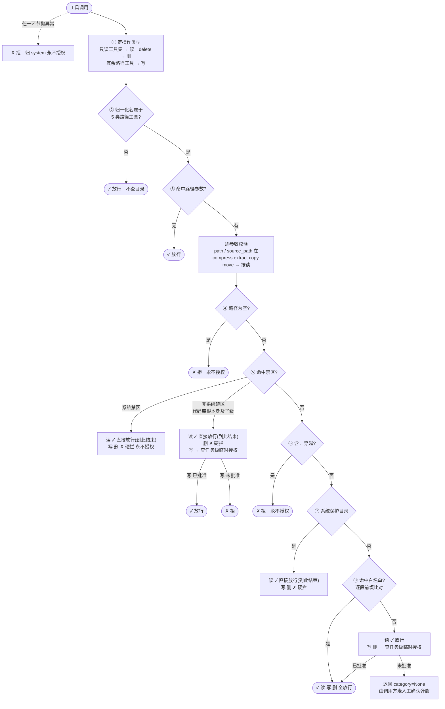
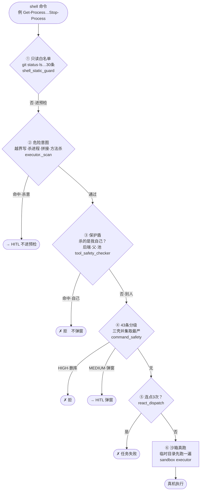

<!-- 编辑历史: 2026-10-06 小欧 - 异常兜底分支改为挂在入口的虚线旁注(原先 ERR 无入边被 mermaid 提到最前, 与「工具调用」并列, 看起来像流程第一步, 语义误导), 并去掉多一跳的 XE。 — 小欧-2026-10-06；2026-10-10 小欧 - 末尾新增「终端命令六道关」节(mermaid 流程 + 关表 + 三命令实例, 与 security_policy.md §一 8/9/10 同口径)；修正上节末句“照样能改”(越界写会被第②关拦下, 原表述与实码相反)。 — 小欧-2026-10-10 10:38:08；2026-10-10 小欧 - 「终端命令六道关」节前新增「方框总览」纯文本版(与 mermaid 图同义, 关序与实码一致: 保护盾③在 43 条④之前)。 — 小欧-2026-10-10 10:57:37 -->


## 八步速查

| 步 | 判定 | 读 | 写 | 删 |
|---|---|---|---|---|
| ① | 由工具名定操作类型 | — | — | — |
| ② | 不是路径类工具 | 放行 | 放行 | 放行 |
| ③ | 无路径参数 | 放行 | 放行 | 放行 |
| ④ | 路径为空 | 拒 | 拒 | 拒 |
| ⑤ | 系统禁区 | 放行 | 永不授权 | 永不授权 |
| ⑤ | 非系统禁区（代码库根本身及子级） | 放行 | 临时授权后放行 | 硬拦 |
| ⑥ | 含 `..` 穿越 | 拒 | 拒 | 拒 |
| ⑦ | 系统保护目录 | 放行 | 硬拦 | 硬拦 |
| ⑧ | 在白名单里 | 放行 | 放行 | 放行 |
| ⑧ | 不在白名单里 | 放行 | 临时授权 / 问你 | 临时授权 / 问你 |

> 读这一列几乎全绿——这就是「权限墙只挡写删」的直观依据。

## 白名单里有哪些

白名单是扁平的，只有「在不在列表里」一个状态，**没有只读/读写之分**：

- 用户主目录
- 项目根目录：{{project_root}}
- 授权目录：{{allowed_dirs}}
- `/tmp`
- `/var/tmp`

## 终端命令不走这张表

上表只管**文件类工具**。终端命令走下节六道关，**不查目录列表**——但写到工作区外面会被危险意图扫描拦下（见下节第②关），不是照样能改。

## 方框总览（与下图同义，纯文本版）

```text
agent 吐出一条命令
  例: Get-Process python | Stop-Process -Force
        │
        ▼
┌─────────────────────────────────────────────────┐
│ 第1关  只读白名单 (shell_static_guard)            │
│ "这是纯查询吗?" git status / ls / tasklist …30条  │
│ 是 → 直接放行(但要先过第2关)  否 → 下一关         │
└──────────────────┬──────────────────────────────┘
                   ▼
┌─────────────────────────────────────────────────┐
│ 第2关  危险意图扫描 (executor._scan)              │
│ "写到工作区外面了?/ 要杀进程?"                     │
│ 命中 → 弹窗问用户(不进预检)  通过 → 下一关         │
└──────────────────┬──────────────────────────────┘
                   ▼
┌─────────────────────────────────────────────────┐
│ 第3关  保护盾 (tool_safety_checker)               │
│ "杀的是不是我自己?"(后端/父进程/进程池, PID+名)    │
│ 命中 → 直接拒(天王老子来了也拒, 不弹窗)            │
└──────────────────┬──────────────────────────────┘
                   ▼
┌─────────────────────────────────────────────────┐
│ 第4关  43条分级 (execute_shell_command_safety)   │
│ HIGH 24条(diskpart/删库…): 直接拒                │
│ MEDIUM 19条(taskkill/reg…): 弹窗                │
│ (三壳并集: ps7/cmd/bash 各查一遍取最严)            │
└──────────────────┬──────────────────────────────┘
                   ▼
┌─────────────────────────────────────────────────┐
│ 第5关  弹窗计数 (react_dispatch)                  │
│ 同一拒绝连点3次 → 任务直接失败(防死循环弹窗)        │
└──────────────────┬──────────────────────────────┘
                   ▼
┌─────────────────────────────────────────────────┐
│ 第6关  沙箱真跑 (sandbox executor)                │
│ 临时目录里先跑一遍看效果, 干净才去真机跑            │
│ (JobObject: 限内存/进程数)                        │
└──────────────────┬──────────────────────────────┘
                   ▼
                真机执行
```

## 终端命令六道关

一句话：所有逻辑只防一件事——**别让 agent 的命令杀掉后端自己、删掉不该删的东西**。层数多是每次出事故补一块叠出来的，不是设计出来的。



| 关 | 问什么 | 命中会怎样 | 为哪次事故生的 |
|---|---|---|---|
| ① | 是纯查询吗（`ls`/`git status`…） | 是就直放 | 每次查询都弹窗就没法干活 |
| ② | 写到工作区外面了？要杀进程？ | 弹窗，不进预检 | 预检在宿主真跑，P9-03 后端被自己杀掉 |
| ③ | 杀的是后端自身/父进程/进程池？ | 直接拒，**不弹窗** | 两次弹窗点"允许"就能自杀 |
| ④ | 43 条里哪级（diskpart/删库…） | HIGH 拒，MEDIUM 弹窗 | 高危和中危不能一个待遇 |
| ⑤ | 同一拒绝连点 3 次？ | 任务直接失败 | agent 死循环弹同一窗 |
| ⑥ | 临时目录跑一遍看效果 | 干净才去真机 | 盲跑，跑错才知道 |

三条命令走一遍：

| 命令 | 路径 | 结论 |
|---|---|---|
| `git status` | ①是查询 → ②无危险 → … → 执行 | 全程无感 |
| `taskkill /F /IM notepad.exe`（杀别人的记事本） | ②有杀意 → 弹窗 → ③杀的不是我 → 放过 | 杀别人可以，问你一声 |
| `Get-Process python \| Stop-Process`（杀后端自己） | ②有杀意 → ③命中自己 → 直接拒 | 连弹窗都不给——你看不出这是自杀，问了也白问 |

> 第③关不弹窗的原因：弹窗默认"用户看得懂命令"。但 `python` 就是后端自己——一行命令里看不出自杀，**看不懂的确认框等于摆设**，所以杀自己的命令跳过人，由机器直接拒掉。
