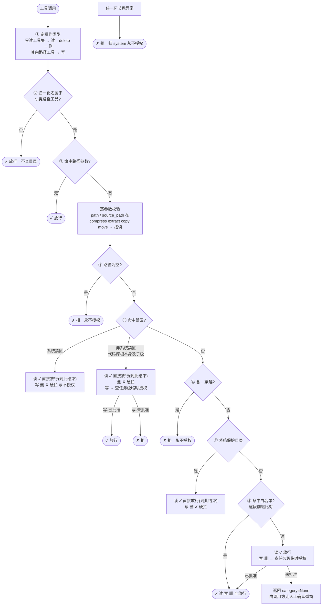

## 八步速查

| 步 | 判定 | 读 | 写 | 删 |
|---|---|---|---|---|
| ① | 由工具名定操作类型 | — | — | — |
| ② | 不是路径类工具 | 放行 | 放行 | 放行 |
| ③ | 无路径参数 | 放行 | 放行 | 放行 |
| ④ | 路径为空 | 拒 | 拒 | 拒 |
| ⑤ | 系统禁区 | 放行 | 永不授权 | 永不授权 |
| ⑤ | 非系统禁区（代码库根本身及子级） | 放行 | 临时授权后放行 | 硬拦 |
| ⑥ | 含 `..` 穿越 | 拒 | 拒 | 拒 |
| ⑦ | 系统保护目录 | 放行 | 硬拦 | 硬拦 |
| ⑧ | 在白名单里 | 放行 | 放行 | 放行 |
| ⑧ | 不在白名单里 | 放行 | 临时授权 / 问你 | 临时授权 / 问你 |

> 读这一列几乎全绿——这就是「权限墙只挡写删」的直观依据。

## 白名单里有哪些

白名单是扁平的，只有「在不在列表里」一个状态，**没有只读/读写之分**：

- 用户主目录
- 项目根目录：{{project_root}}
- 授权目录：{{allowed_dirs}}
- `/tmp`
- `/var/tmp`

## 终端命令不走这张表

上表只管**文件类工具**。终端命令另走确认弹窗，**不查目录列表**——白名单外的文件它照样能改。
