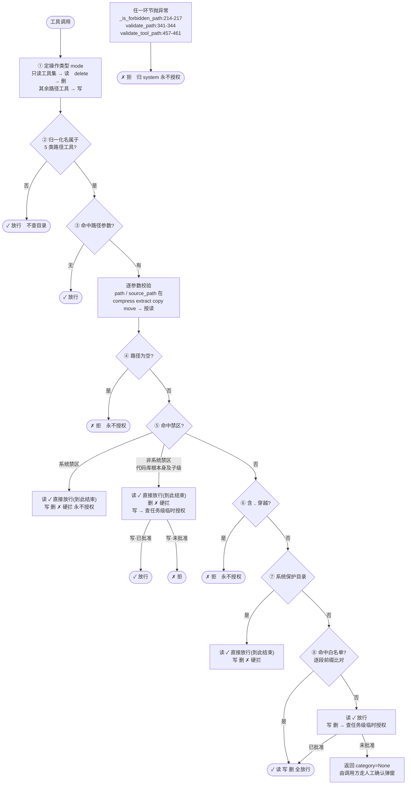
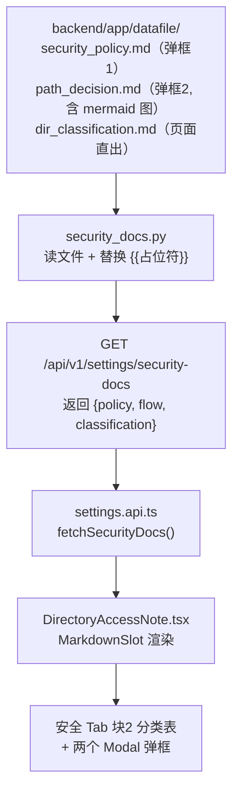
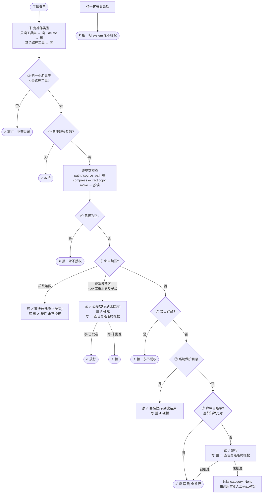

# [11]会话事务workspace及插话开关设计-小欧-2026-10-06.md

**创建时间**: 2026-10-06 08:30:53
**编写人**: 小欧

---

## 版本历史

| 版本 | 更新时间 | 更新人 | 修改简介 |
|------|----------|--------|----------|
| v2.11 | 2026-10-06 17:20:00 | 小欧 | **块 2 分类主轴按北京老陈纠正重建**：系统对目录的实际分类是「**禁区 / 白名单 / 白名单外**」三类（`validate_path` 的三条分支），而**系统目录是禁区的子分支**（`path_safe_check.py:295-306` 注释明写：`_is_forbidden_path` 仅精确锁 `WIN_EXACT` 本身，`C:\Windows\a.txt` 靠该处兜底归 `system`）、**项目根/授权目录/本会话目录是白名单的三个来源**（不是三种权限）、**临时授权不是分类而是一次性放行机制**（`is_temp_authorized`，且只作用于「禁区·非系统的写」与「白名单外的写删」，对系统禁区与删除无效）。块 2 据此改为**「三分类 × 读写能力」表**（禁区按 `system`/`non_system` 分两档共 4 行 × 读/写删两列）+ 两条归类注解 + 4 条说明。**并明确标注**：本表的"三类"按**权限判定**分，§4.1 的"三目录"按**配置来源**分，两个"三"不是一回事，勿混用——修正此前把两种分类混在一处表述的错误 |
| v2.10 | 2026-10-06 17:00:00 | 小欧 | 块 2 内容按北京老陈定稿收敛：**三行目录分类**（名称+作用域+读写能力）+ **§6.1.1 判定顺序的紧凑版**（5 步：空路径/穿越→拒；禁区→读放行写删硬拦；系统保护目录→读放行写删硬拦；在列表→读写删全放行；不在列表→读放行写删逐次确认）+ 3 条补充说明。**去掉全部跳转按钮与编辑控件**（设置入口在通用组/输入框按钮行，块 2 只负责讲清楚）；**去掉路径实际值**（按他给的格式不带）；因此块 2 **不读任何数据、无 props、不调接口、不需会话上下文**，与第四章 workspace 功能完全解耦（后者未实施也可独立上线）。新增**口径统一要求**：块 2 判定顺序必须与 §6.1.1 同源，改一处必须同步另一处 |
| v2.9 | 2026-10-06 16:45:00 | 小欧 | 块 2 标题按北京老陈纠正：由「目录权限与能力边界」改为「**目录分类及读写能力说明**」。理由：决策 37 已取消 `rw`/`ro`，系统内**不存在"权限"概念**，只有"每类目录的读写能力是什么"这一事实陈述，用"权限"一词既不准确、又会误导用户以为存在权限分级；块 2 内容本质是**先分类（项目根 / 授权目录 / 本会话目录三类）→ 再逐类说明读写能力**，故新标题更贴合。另补组件命名与标题一致性说明（`SecurityBoundaryNote` 可改名 `DirectoryAccessNote`） |
| v2.8 | 2026-10-06 16:30:00 | 小欧 | **§6.3 重写：先读真实界面实现再定方案**（北京老陈纠正"不看界面就瞎写"）。实读 `SettingsGroup.tsx`(224行) + `SettingRow.tsx` 后查明五件决定方案的事实：①**"块"= `sectionOf(group,key)` 返回值**，渲染时按 `items` 顺序遇分组变化插 `SectionTitle`（`:56-96`/`:183`），块**不是独立容器**，一个 key 只能在一个组一个位置；②**已有同款先例**——`appearance` 组分「登录与准入」/「外观」两块，编辑历史原文（`:15-22`）"准入控制 ≠ 外观偏好，混在一块会误导"，与本次诉求同一类，**做法完全同构**；③`SettingRow` 支持的 type 仅 `bool/select/range/int/float/textarea/model_ref/url`（`:243-344`），`readonly` 只是 `disabled` 标志（`:114`）**不是 type**；④**无"说明文本"类型** → 块 2 文案**无法走 registry**，只能按 `appearancePreview`(`:113-170`)/`AboutFiles` 同款**组件内特判插入**；⑤`values` 是**全量** settings record（`:40`）→ 项目根/授权目录**可直接读、无需新后端接口**。方案落地为两处改动：`sectionOf` 加 `if (group === 'security') return '人工确认'` 一行（现有 4 项自动归块1，块1 原样不动）+ `items.map` 循环后追加块2（`SectionTitle` + 新组件 `SecurityBoundaryNote`）；唯一新增数据来源是"本会话目录"（第四章 W5 读真源提供），无会话时显示 `—（未选择会话）` 不得报错 |
| v2.7 | 2026-10-06 15:50:00 | 小欧 | **新增第六章「读写与 Shell 安全策略梳理」**（北京老陈指令，三部分）。**§6.1 读写安全策略**：6.1.1 判定顺序 5 层实读全貌 / 6.1.2 关键事实一「白名单扁平、无 rw/ro」（`mode` 只服务禁区处理与白名单外临时授权，**不是**"目录允不允许写"的判据）/ 6.1.3 关键事实二「**读基本是敞开的**」（白名单内外+禁区读皆放行，权限墙只挡写删）/ 6.1.4 **风险清单 R1~R6**（R1 shell 完全绕过路径校验——`_PATH_PARAM_KEYS` 9 键不含 `command`；R2 读无边界；R3 无粒度；R4 前缀匹配"第一个命中即 return"，当前无害但**一旦引入权限即成漏洞**；R5 临时授权可被诱导升级；R6 删除硬拦/软评估两层不冗余）/ 6.1.5 shell 是另一套机制（HITL 人工确认，非无保护，"机器能判的机器判、判不了的让人判"）/ 6.1.6 结论表：哪些效果现有系统做不到。**§6.2 可设置 vs 硬编码**：可设置 11 项（目录 2 项在「通用」+ 安全 4 项 HITL + 沙箱 5 项）逐项列消费方；**硬编码 10 类**（`TOOL_TIMEOUTS` 30 工具、`SUBPROCESS_TIMEOUT_*`、`HTTPX_TIMEOUT`、`SHELL_OUTLIMIT_*`、`READ_OUTLIMIT_*`、`OBS_*` 约 30、`INBOX_MAX`、`MAX_SESSIONS`、`_SYSTEM_PROTECTED` 盘符集合）**用户全部无处可调**，其中影响"操作被中断/内容被截断"的项在用户遇到问题无从下手。**§6.3 安全 Tab 展示策略**：现状三个问题（标签不表意 P1／安全组与目录脱节 P2／黑盒不可见 P3）+ 三方案对比，**推荐 A**（不搬家 + 通用组标签表意 + 安全组加只读摘要说明区 + workspace 增删改留在输入框行），否决 C（同值两处存储违反单出口原则）、不选 B（破坏性调整），并给出说明区文案草案（含必须写明 shell 走人工确认，避免用户误以为目录列表能管住 shell） |
| v2.6 | 2026-10-06 15:15:00 | 小欧 | **决策 38：补齐目录列表的第四个消费方**（北京老陈追问"白名单不就两处用吗"→核查确认**共四处**）。四个消费方全部从 `get_project_root() + get_allowed_dirs()` 取全局根，不改则**静默不生效**：①`path_safe_check.py:130-131` 路径校验白名单【加】②`system_prompts.py:101-108` Prompt 注入【加】③`delete_file.py:95-110` `protected_roots_` 删除**硬拦**保护根【**不加**】④`delete_safety.py:46-48` `_get_allowed_roots()` 删除**软评估**白名单【**加，必须**】。**3 与 4 不冗余但只需加一个**——方向相反：3 管"目录本身能不能删"（限制更多），4 管"目录里的东西怎么删"（限制更少）；④必须是因为不加则 `delete_safety.py:82` `inside_proj` 判 False → 工作区内删临时文件被误拦成白名单外 → 弹临时授权 → 工作区废掉；③不加是因为会话目录是系统自动建的**临时工作区**非用户长期资产，加了会挡住"任务做完整个清理掉"这个高频需求（`delete_file.py:96` 注释亦明言"根内的具体用户文件/目录仍允许删除, 只禁各根自身及更上层"）。同步：§4.5.5 新增四个消费方表、§4.7 后端一览表由 9 行扩至 **10 行**（新增 `delete_safety.py`）并加"**明确不动** `delete_file.py`"警示、§五 W3 由 1 文件扩至 2 文件 |
| v2.5 | 2026-10-06 14:50:00 | 小欧 | **决策 37：取消 per-directory `rw`/`ro`**（北京老陈选 A）。实读定案：`path_safe_check` 只校验 9 个路径参数名（`:355 _PATH_PARAM_KEYS` **不含 `command`**），**shell 的路径完全不校验**（`trust_db.py:15` "无路径工具: shell"、`safety_gate.py:46` "shell 不在 trust 两集合…恒 None"）→ `ro` 只能拦文件类工具，模型一句 `del` 就能改，**属假安全感**（补充：shell 并非无保护，走 HITL 人工确认 `safety_gate.py:59/76/81-82`，是"机器能判的机器判、判不了的让人判"的主动分层）。**连带作废决策 27（最长前缀匹配）**——该规则只因不同根权限不同才必要，取消 `ro` 后命中宽根/窄根结果相同，现有"第一个命中即 return"（`:308-326`）无害，**省掉一处安全敏感改造**。同步：决策 22 表名去 `access_mode` 列、§4.4 建表语句去该列、§4.5 整节重写为"可访问性模型（无权限维度）"含 §4.5.4 OS 级只读替代方案（另议）、§4.6 改动量收窄、§4.7 第 7 行简化、§4.8 弹窗去掉读写下拉、§4.8.3 流程由 5 条减为 4 条、§五 W3 批次简化 |
| v2.4 | 2026-10-06 14:15:00 | 小欧 | ①**决策 36**（北京老陈）：目录名标题**只取前 3 个字**（原 30 字符截断），sanitize 表与落地示例同步（`20261006-143022-修复登`）；②**新增 §4.3.3 决策点3**（北京老陈问"本会话可读写目录放 system prompt 还是 user 消息"）——裁定 **system prompt**，四条理由：前两个目录已在 system prompt（分开放=两套出口违反 DRY）／workspace 是环境授权信息非用户表达（否则模型误以为用户说的）／user message 会持久化进历史留下**过期目录列表**诱导模型操作过期路径／user message 每轮重复浪费 token；③**可行性实读验证**：`initialize_run_state.py:78-79` system prompt **每个任务启动时构建一次**（挂当次 agent 实例，非会话级缓存），与 §4.6 ContextVar 快照时点天然对齐，故决策 31"同一份快照"在实现上成立；④由此新增**实施硬约束**：`agent._get_system_prompt()` 在 `initialize_run_state` 内调用，故 ContextVar 必须在 agent 初始化前 set，实施时须复核编排器入口与 agent 创建的先后 |
| v2.3 | 2026-10-06 13:50:00 | 小欧 | **补 §4.8 UI 形态与操作流程**（北京老陈定 UI 入口）：入口改为**输入框下方按钮行尾部**的「会话事务空间」按钮（`SubmitBar` 左侧开关排之后、发送按钮之前），点击弹 `Modal`（约 560px）显示目录列表——**放弃**上一轮我提议的"输入框上方常驻摘要行"；新增 **§4.8.0 UI 决策 32~35 就近记录**（入口位置 / 点击行为 / 徽标与未生效红点 / 新会话零操作与兜底），§4.3 加一行交叉索引指向 §4.8.0（UI 决策不并入 §4.3，北京老陈定"UI 决策写到 4.8 里面"）；补 §4.8.3 五条操作流程 + **§4.8.4 生效时序**（改列表后本任务不生效 → 按钮红点未消，否则 LLM 按老白名单被拒、反复重试耗 `agent.max_steps`） |
| v2.2 | 2026-10-06 13:30:00 | 小欧 | **文档改名**（北京老陈指令）：`[11]会话可插话开关设计-小欧-2026-10-06.md` → **`[11]会话事务workspace及插话开关设计-小欧-2026-10-06.md`**，标题同步。改名理由：本文档已含两件独立功能（原"插话开关" + 新增第四章"会话 workspace"），原名只涵盖前者、已名不副实。**保留 `[11]` 前缀**——全文 20 余处代码注释以 `文档[11]` 回引本设计（§3.4/§3.5 各 diff 内），保留前缀可避免改链；已核全仓无其他文档引用本文件名。注：北京老陈原话写作 "worksape"，判断为 `workspace` 笔误，按正确拼写落盘 |
| v2.1 | 2026-10-06 13:10:00 | 小欧 | **修第四章章节重排引发的 11 处不一致**（北京老陈重排 4.3~4.10 后自查）：①**决策跨章拆分归位**——workspace 决策 21~31 原被我错放进**第三章 §3.6 反向索引**、而 §4.3 里只有 28/29/30，现全部移入 **§4.3 独立决策表（11 条列全）**，§3.6 明确只管第三章 1~20，两章**不合并台账**（北京老陈："两个部分没有那么强相关的哦"）；②§4.3.2 标题"决策点1"重复（与 4.3.1 同名）改"决策点2"；③修 §4.3.2 引用过期"4.9 裁定"→§4.3.1、"4.5 决策 24"→§4.6；④修 §4.5 自引用错误"见 4.5 最长前缀"→§4.6；⑤**修 §4.8 UI 示例与决策 28 直接矛盾**（示例仍是被否决的 `workspaces\会话A` 形态，且与同小节正文自相矛盾），改为决策 28 形态并加禁例提示；⑥§4.7/§4.9 两张一览表"落点/对应决策"列共 8 行过期章节号全部校正，并补 `system_prompts.py` 第 9 行（决策 31 落点原先漏列）；⑦§4.1 表格"现键名"由"待定"改为实际表名；⑧**补 §五 workspace 实施顺序 W1~W7**（原先第四章 15 个文件完全没进实施计划）；⑨补 L729 `---` 与引用块间空行（防 markdown 误解析为 setext 标题） |
| v2.0 | 2026-10-06 12:45:00 | 小欧 | **第四章设计定稿**（§4.9 待裁定全部裁定完毕，零遗留）：**决策 28** 默认目录建项目根下**直接子目录**、不加 `workspaces` 中间层（北京老陈定，我原提议的 `~/.omniagent/` 被否）；**决策 29** 目录名 = `YYYYMMDD-HHMMSS-{标题}`，附 Windows 非法字符 sanitize + 30 字符截断 + 空标题回落，**根因是目录列表要喂 LLM、路径越短越不易被模型拼错**；**决策 30** 默认目录可删、删除后退化项目根兜底（项目根本就在白名单且恒 `rw`，功能不残）；**决策 31** 据 4.9 根因新增 §4.10「LLM 可见性」——目录列表必须注入 system prompt（并入既有 `system_prompts.py:101-108 _get_project_root_info()`），且**必须与安全校验共用同一份 ContextVar 快照**（否则 LLM 可见范围与实际放行不一致 → 反复撞权限墙，属正确性问题）。决策台账 27 → **31 条** |
| v1.9 | 2026-10-06 12:25:00 | 小欧 | 第四章落完整设计（北京老陈裁定 + 追问）：①**决策 22** 存储取 a（独立表 `chat_session_workspaces`，含 `access_mode`/`is_default`）；②**决策 23** 新增"每目录读写权限"——`rw`/`ro` 两态（不设 `none`，不在列表即无授权），判定**挂既有 `path_safe_check.py:411-419` mode 三态**不新造概念，全局两目录恒 `rw` 保零退化；③**决策 24** 依北京老陈纠正——workspace **随消息下发**（新任务及后续任务用新值，**不开独立端点**，决策 5 无例外），并据此把 4.5 的"每次查 DB"改为**任务启动取快照**（天然满足"本任务不受中途改动影响"）；④**决策 26** 会话上下文用 ContextVar 传**已解析列表**（存 id 会多一次 IO）；⑤**决策 27** 定**最长前缀匹配**（否则嵌套根会绕过只读意图）；⑥补 4.6 后端 8 文件 / 4.7 前端 6 文件一览表 + 4.8 UI 形态草案；⑦§3.0 决策台账由 20 条扩至 **27 条**（新增 21~27）；⑧留 2 项待裁定（默认目录建在哪 / 可否删除） |
| v1.8 | 2026-10-06 12:00:00 | 小欧 | §4.1 概念改用北京老陈原话框架——**三个并列目录空间**：①项目根目录（全局单目录，已有）②授权目录（全局列表，已有）③**本项目的 workspace**（会话级列表，本次新增）；并写明工具可写范围 = ①∪②∪③（叠加，非取代），确保不与 4.5 待裁定 2 的倾向冲突 |
| v1.7 | 2026-10-06 11:50:00 | 小欧 | **新增第四章「会话 Workspace（事务级可读写目录空间）」**（北京老陈指令，替换原占位半句）：①立论**会话 == 事务 == 项目**，会话 workspace = 该事务下新增的可读写目录空间（会话级 1:N，生命周期同会话）；②实读定位现有**全局**机制（`config.py:223 get_project_root` / `:236 get_allowed_dirs` 及 12 处消费方）；③沿用 §3.0 决策 4 判定不可进 registry（无 per-session 通道），且 1:N 需新表而非加列；④定核心技术障碍与解法——`validate_tool_path` 无会话参数，经 `app/tools/context.py:24 _current_task_id` 同构模式新增 `_current_session_id` ContextVar（并显式**不复用** logger 层 `_session_id_var`，避免两套口径）；⑤列 5 项待裁定（含决策 5 写入口是否开例外口子） |
| v1.6 | 2026-10-06 11:25:00 | 小欧 | **补回被误删的代码**（北京老陈纠正："相关代码在前端/后端代码小节里面有了吗"）：上一版把 3.5.8 内容并入决策章时，连同 diff 一起删掉，只剩表格指路 = 代码在代码章缺失。修复：①`useChatSend.ts` 的 `SESSION_BUSY` rethrow diff 归位 **§3.5.4 同文件第二处改动**（决策 20）；②新增 **§3.5.8 `services/error/handler.ts`**（`SESSION_BUSY` 枚举 + `ERROR_CONFIG_MAP` + `classifyError` 409 按 URL 细分，决策 19）；③新增 **§3.5.9 SSE `error` 事件消费处**（兜底路径，决策 12/13）。修正 3.5 小节序号断档（原 3.5.7→3.5.8 之间无内容）；顺带修掉上一版误产生的 3.5.7 重复标题 |
| v1.5 | 2026-10-06 11:10:00 | 小欧 | 决策入章 + 删冗余小节（北京老陈两次纠正）：①§3.0 决策台账补 **决策 19**（409 已被 `SESSION_CONFLICT` 占用，须新增 `SESSION_BUSY` 并按 URL 细分，同构既有 404 先例）、**决策 20**（"退回输入框"机制 `ChatInput.tsx:62-68` 已存在，但 `useChatSend.ts:174` 吞错误不 rethrow 使其失效，需仅放行 `SESSION_BUSY` 一条路径上抛）——两条均为实读代码发现，属决策不属实现细节，故入决策章；②**删除 §3.5.8「展示与错误处理」小节**（内容已全部并入决策 13/19/20，改由 §3.5.0 一览表第 13/17/18 行 + §3.6 反向索引承载）；③§3.5.0 一览表由 16 行扩至 **18 行**（新增 `handler.ts`、SSE error 消费处） |
| v1.4 | 2026-10-06 10:50:00 | 小欧 | **新增 §3.0 设计决策台账**（18 条裁定全量登记，北京老陈裁定项全署名日期，防止设计与决策在对话中丢失）+ **§3.6 反向索引**（决策 → 落码位置 + 对应验收用例）；§3.4.0 / §3.5.0 两张一览表加「对应决策」列，验收表加「对应决策」列 —— 实现代码与设计决策双向可追溯；落定 §3.3 方案①「门口就拦」（`messages.py:51` 落库前抛 409，零孤儿消息、无 TOCTOU、复用前端现成 409 处理）+ 编排器兜底；落定决策 13（拒插话**退回输入框+提示**，不自动新建会话）、决策 14（`onSend` 改**对象参数** + `SendOpts` 共享类型）；验收表从 6 项扩至 8 项（新增 1b 兜底路径、7 开关位置、8 写/读入口唯一性回归） |
| v1.3 | 2026-10-06 10:20:00 | 小欧 | 全量实读代码后的一致性修订（§四 按北京老陈指示不动）：①**否决选项 A(409)**——`chat_routes.py:66` `StreamingResponse` 先提交响应头，生成器内抛 `HTTPException` 无法转 409（`:135` 注释佐证），新增 **A′(SSE error 事件)** 为推荐，`stream_orchestrator.py:419` 行号订正（原文 346/392 均错）；②§3.4 重写：补"涉及修改代码一览表"+6 文件逐个 diff，**删除**"`createSession`/`get_session_info`/`list_sessions` 透出"（与 `session_service.py:34-35`、`chat_models.py:10` 已废止的双通道记录冲突），改挂唯一读真源 `get_session_messages`；③§3.5 重写：补一览表 + 8 小节 diff，前端实为 **16 文件**（`linkEnabled` 同构全链路），非原文 1 行；④§五 拆 7 批 + 验收加第 6 项（刷新保值回归）；⑤补插话开关"落值必须前置到 `:419` 之前"的次序理由（`link_enabled` 落值在注入之后，照抄会导致首条消息用不到新值） |
| v1.2 | 2026-10-06 09:05:00 | 小欧 | 命名统一为 `interject`（北京老陈定）："插话"取 interject（插入一句）而非 interrupt（打断）；DB 列 `allow_interject`、前端 `allowInterject`、函数 `get/set_session_interject`，与 `link_enabled`/`linkEnabled` 同构；此前文档内自造的 `interruptAllowed` 作废；开关位置细化为**附件按钮后面**（§3.5 已同步，顺序 `[指令+续聊] [模型选择框] [附件(置灰)] [插话开关]`） |
| v1.1 | 2026-10-06 08:45:00 | 小欧 | 北京老陈三问裁定回写：①3.4 加"用人话说一遍"（关=前端拦+后端拒才是真开关，否则是假开关）；②开关位置定为**模型选择框后面**、标签**插话开关**，语义=任务发出后输入框是否保持可用；③§五第1条裁定**取消先吸收完**（走现有 `_absorb_inbox` drain，不新增合并逻辑），§四用例3同步更新 |
| v1.0 | 2026-10-06 08:30:53 | 小欧 | 首版：现状分析（MAX_SESSIONS/串行层/inbox）+ 订正 + 会话级插话开关完整设计（DB 迁移 + 后端 + 前端 diff） |

---

## 一、现状分析

### 1.1 MAX_SESSIONS=32 是什么、在哪

**前端** `frontend/src/features/chat/streams/chatStreamStore.ts:89`，内存会话快照缓存上限，**不是后端限制**：

```ts
const MAX_SESSIONS = 32;          // 内存会话目标数量上限
const TERMINAL_TTL_MS = 600_000;  // 终态会话 10 分钟 TTL
```

| 机制 | 触发条件 | 动作 | 影响面 |
|---|---|---|---|
| `evictOverflow()`（:520） | `sessions.size > 32` | 按"可回收时间"排序，活跃/运行中豁免，只淘汰闲置快照 | 仅内存 |
| `scheduleTerminalEviction` | 任务进终态后 10 分钟 | 只删内存快照 | 不删 sessionStorage，不碰 DB |
| `MAX_MISSING_VIEWS = MAX_SESSIONS`（:161） | 缺视图缓存超 32 | 整表清空（可重建派生视图） | 不丢真实数据 |

**结论**：32 只是前端内存水位。淘汰的是快照，DB 与 sessionStorage 不受影响，刷新/回跳照样能从后端拿回来。

### 1.2 "同会话串行是铁则"——铁在哪一层

**铁在前端输入门，不在后端**：

```tsx
// frontend/.../ChatInput.tsx:61
if (!content || loading || isReceiving) return;  // 执行中直接吞掉发送
```

后端**没有**同会话锁。相反，后端对"同会话已有活跃任务时来新消息"有现成处理（2026-09-20，北京老陈定案），`backend/app/services/chat/stream_orchestrator.py:419-422`：

```python
_active_tid = await has_active_task_in_session(session_id)          # :419
if _active_tid:
    _injected_ok = await inject_message_to_task(_active_tid, user_input, _user_msg_id)  # :421
    # 新 task_id 作废，回"消息已合并"应答
```

新消息进活跃任务的 **inbox（可多条）**，agent 在**每轮 LLM 调用前**经 `_absorb_inbox` 合并吸收（定义 `react_step.py:204`，调用点 `react_step.py:320`，位于 `trim_history()` 之前），**工具执行不被打断**（安全底线）。

真实链路 = **前端 gate（串行假象）+ 后端 inbox（真并发吸收）**。

### 1.3 配套机制：TOCTOU 占位守卫

`stream_orchestrator.py:486-491` 另有 B-3 占位守卫：`register_task` 命中并发占位时返回占位 tid，本消息改道注入占位任务（注释"概率极低，交给外层异常兜底"）。插话开关**不碰**这条守卫——它是防并发建任务的，不是管用户插话的。

---

## 二、订正：registry 放不下会话级开关

上一轮我说"后端 registry 加 `session.interject_mode`"，**这是错的**，特此订正：

- `settings_registry.py` 共 79 个 `_item`，**全部是全局项**，无会话级项、无 per-session 读写通道；
- 会话级行为开关的正确位置是 `chat_sessions` 表的一列，与 `link_enabled` 同构：
  - 列定义：`db_initializer.py:213` `_ensure_column(conn, "chat_sessions", "link_enabled", "BOOLEAN DEFAULT FALSE")`
  - conn 级读写：`storage.py:646 get_session_link` / `:659 set_session_link_conn`（`COALESCE(...,0)`，会话不存在 fail-closed 返回 False；写方**不碰 `updated_at`**，见 `storage.py` 注释"改开关不是内容变更"，否则会话会被顶到列表首位）
  - 前端开关位置：输入框旁 `TaskTypeToggle.tsx` 的"续聊任务" Checkbox（**不在设置页**，上一轮"设置页会话区"说法一并订正）

---

## 三、设计：会话级插话开关与代码diff

### 3.0 设计决策台账（全部已裁定项，防丢失）

> 本节是**唯一裁定汇总处**。后续实施中若与正文其他章节冲突，以本节为准。裁定人除注明外均为北京老陈，日期 2026-10-06。

| # | 决策项 | 裁定结论 | 依据/备注 |
|---|---|---|---|
| 1 | 命名 | 插话取 **`interject`**（插入一句），非 interrupt（打断）。DB `allow_interject`、前端 `allowInterject`、函数 `get/set_session_interject` | 与 `link_enabled`/`linkEnabled` 同构；此前自造的 `interruptAllowed` 作废 |
| 2 | **默认值** | **关**。`BOOLEAN DEFAULT FALSE`；新会话=关 | 2026-10-06 实读代码确认，全库无 `interrupt` 命名可沿用，故同构自建 |
| 3 | 存量会话 | `ALTER` 后 NULL → 读方 `COALESCE` → 关（fail-closed）；**不写回填脚本** | YAGNI：NULL 即关，无需 UPDATE |
| 4 | 开关真源位置 | `chat_sessions` 表一列，**不做 registry 设置项** | 订正：`settings_registry.py` 79 个 `_item` 全是全局项，无 per-session 读写通道 |
| 5 | **写入口** | **唯一一条**：随消息携带 `allow_interject`。**不新增 PATCH 端点** | 仿 `link_enabled`——`sessions.py:19` 已废止 `PATCH /sessions/{id}/link`（"开关只准随消息发出，严禁独立影响后端"） |
| 6 | **读真源** | **唯一一条**：`GET /sessions/{id}/messages` 透出。**不加** `list_sessions`/`get_session_info`/`SessionResponse` | 仿 `link_enabled`——`session_service.py:34-35`、`chat_models.py:10` 已废止该做法（"同一真源两个 HTTP 读出口即双通道隐患"） |
| 7 | 开关位置 | 输入框底部功能行，**附件按钮后面**：`[指令+续聊] [模型选择框] [附件(置灰)] [插话开关]` | 2026-10-06 定（先定"模型选择框后"，后细化为附件之后） |
| 8 | 开关标签/样式 | 标签 **"插话开关"**，复用 Checkbox 样式，**不新造组件** | 仿 `TaskTypeToggle.tsx` 现有"续聊任务" |
| 9 | 开关语义 | **任务消息发出后，输入框是否保持可用**。开=执行中可用；关=执行中锁定 | 2026-10-06 确认 |
| 10 | 开关粘性 | **发送后不复位**（会话级粘性，勾上后本会话一直有效） | 仿 `ChatInput.tsx:58` 注释"linked 不再复位(违背用户粘性意图)" |
| 11 | **关态拒插话** | **① 门口就拦**：在 `messages.py:51` **落库之前**抛真 409，消息不入库 | 2026-10-06 裁定。否决"进门再赶出去"(②)与"照旧合并"(③)。理由：零孤儿消息、无 TOCTOU、复用前端现成 409 处理 |
| 12 | 拒插话兜底 | 编排器内保留关态校验 + SSE error 事件（仅覆盖竞态/绕过，量级极小） | 生成器内无法抛 409（`chat_routes.py:66`/`:135`），只能 error 事件 |
| 13 | **拒插话后前端** | **把该条消息退回输入框 + 提示**"任务执行中，插话开关未开启"；**不自动新建会话** | 2026-10-06 裁定。理由：同会话串行是铁则，自动新建=劈成两个并发会话，链归属与上下文全乱；退回输入框与今天体验一致 |
| 14 | **发送签名** | **对象参数** `onSend(content, { linkEnabled, allowInterject })` | 2026-10-06 裁定（自"位置参数"改判）。理由：两个相邻 boolean 位置参数 TS 拦不住错位；加字段不改签名。成本≈0（这 3 个文件本就必改） |
| 15 | 取消活跃任务 | inbox 未吸收消息**先全部吸收完**再进取消终态（不丢/不转/不退回） | 2026-10-06 裁定，走现有 `_absorb_inbox` drain，不新增合并逻辑 |
| 16 | 前端落库防漏 | 必须**一次改齐 3 处缓存写入点 + `beforeunload` + 备份落盘** | `chatHistory.ts:317` 原文："本写入点此前漏该字段…linkEnabled 同型事故 2026-10-03"，同型已踩 |
| 17 | 附件按钮 | 显示 + 置灰占位（上传仍暂缓） | 2026-10-06 定；改前默认 `visible=false` 不渲染 |
| 18 | 常量是否配置化 | `MAX_SESSIONS`/`TERMINAL_TTL_MS`/`INBOX_MAX` **不做设置项** | 2026-10-06 分析：无用户调整动机，性能水位无"调对更好"方向，YAGNI |
| 19 | **409 语义已被占用** | 新增 `ErrorType.SESSION_BUSY`，`classifyError` 的 `case 409` **按 URL 细分**：`url` 含 `/messages` → `SESSION_BUSY`，其余仍归 `SESSION_CONFLICT` | **2026-10-06 实读发现**：`handler.ts:932-933` 的 409 已绑 `SESSION_CONFLICT`（文案"会话冲突，请刷新页面重试"），而 409 现由 `session_service.py:182/208` 版本冲突占用。直接复用会让用户看到"请刷新页面"——**错误引导**（刷新无用，任务还在跑）。细分做法**完全同构于既有 404 先例**（`handler.ts:927-931`："404 仅当 url 含 sessions 才归 SESSION_NOT_FOUND"） |
| 20 | **"退回输入框"机制已存在但当前失效** | 复用 `ChatInput.tsx:59-69` 的乐观清空+回填；**只需让 `SESSION_BUSY` 一条路径 rethrow**，其余错误保持吞掉 | **2026-10-06 实读发现**：`ChatInput.tsx:62-68` 已有 `backup = draft` → `setDraft('')` → `catch { setDraft(backup) }`（2026-09-03 加的"防输入永久丢失"）。但 `useChatSend.ts:174` 是 `handleError(error, {source:'api'})` **catch 后不 rethrow**，导致该 `catch` 对发送失败**永不触发** —— 即 2026-09-03 那次修复实际已被 `:174` 抵消。**决策 13 因此几乎零新增代码**，但必须先修这条 rethrow，否则"退回输入框"是空话 |

### 3.1 语义与默认值

- 列名：`chat_sessions.allow_interject`，`BOOLEAN DEFAULT FALSE`
- `false` = 关态。前端执行中拦发送（今天的行为，逐字不变）；后端收到并发消息**拒插话**（**这是行为变更**，今天会注入合并，改后拒绝 —— 详见 3.3 的选项分析与破坏性变更声明）
- `true` = 该会话执行中允许发新消息，走 inbox 插话
- 与 `link_enabled` 同为"会话行为开关"，互不干扰，可独立开关

### 3.2 DB 迁移（`db_initializer.py`，仿 `link_enabled`）

```python
_ensure_column(conn, "chat_sessions", "allow_interject", "BOOLEAN DEFAULT FALSE")
```

- 存量行：`ALTER ADD COLUMN` 后为 NULL，读方 `COALESCE(allow_interject, 0)` → 关（fail-closed）
- 不写迁移回填脚本（YAGNI：NULL 即关，无需 UPDATE）

### 3.3 设计决策展开：关态下后端并发消息的去向（承接 §3.0 决策 11/12/13）

**用人话说一遍**：今天"不能插话"只靠前端输入框拦着（`ChatInput` 执行中直接吞掉发送）。但如果有人**绕过前端、直接调后端 API**，后端今天是**照单全收**（直接进 inbox 合并）。所以加了开关后必须回答：关着的时候，并发消息是**拦住**还是**照收**？

| | 做法 | 用户看到 | 数据库 |
|---|---|---|---|
| **① 采用** | **门口就拦，不让进** | 红色报错弹窗"任务执行中" | **消息不入库**，干净 |
| ② 否决 | 让进，进门后立刻说不行 | 页面已连上，再弹提示 | 已入库，多一条没回答的记录，还得专门写代码区分它和真错误 |
| ③ 否决 | 照旧存进去合并 | 无提示 | 入库（= 今天的行为，开关沦为只管前端） |

**本设计采用 ①**，理由：拦得干净；前端已有现成的 409 报错处理（`frontend/src/services/error/handler.ts`）可直接复用，**零新增错误分支**。

**关键前提（已实读代码确认）**：写库与开流是**两个独立请求**——

1. `POST /sessions/{id}/messages`（`app/api/v1/messages.py:51`）→ **落库拿 uid**
2. `POST /chat/stream`（`chat_routes.py:62`）→ 才开 SSE

所以关态判定放在**第 1 步落库之前**，一次拿到三个好处：真 409 / **零孤儿消息**（还没写库就拒了，不需任何回滚逻辑）/ **无 TOCTOU 窗口**（判定与落库之间没有任务状态变化）。

> **为何不能在 SSE 生成器里抛 409**（2026-10-06 实读否决）：注入点在生成器内，`chat_routes.py:66` 的 `StreamingResponse` 已先提交响应头（200），生成器内抛 `HTTPException` **无法转成 409**；`chat_routes.py:135` 原注释已写明"路由不迭代生成器，捕不到执行期异常"。若选"进门再赶出去"，只能用 SSE error 事件——故否决 ②。

**破坏性变更声明**：关态下"直接调 API 并发发消息"从"注入合并"变为 409 拒绝，需在接口注释与本文档写明。


### 3.4 后端代码

#### 3.4.0 涉及修改代码一览表

| # | 文件 | 改动 | 位置（已实读核准） | **对应决策** | 依据 |
|---|---|---|---|---|---|
| 1 | `app/db/db_initializer.py` | 新增 `_ensure_column` 一行 | `:213` 之后 | **2、3** | 仿 `link_enabled`（`:70` 注释 + `:213`） |
| 2 | `app/services/chat/storage.py` | 新增 `get_session_interject` / `set_session_interject_conn` | `:646` / `:659` 之后 | **1、4** | 仿 `link` 同族函数 |
| 3 | `app/api/v1/chat/models.py` | `ChatRequest` 增 `allow_interject` | `:36` 之后 | **1、5** | 仿 `link_enabled`（`:34` "唯一写入口" 注释） |
| 4 | `app/api/v1/chat/chat_routes.py` | 关键字透传 `allow_interject` | `:70` 之后 | **5** | 仿 `link_enabled=…` |
| 5 | `app/api/v1/messages.py` | **关态 409 主判定（落库之前）** | `:51` 之后 | **11** | 方案①，见 3.4.5 |
| 6 | `app/services/chat/stream_orchestrator.py` | ①import ②签名 ③**开关落值+取值（前置）** ④关态**兜底** | `:248` / `:347` / **`:419` 之前** / `:419-422` | **1、5、12** | 兜底防竞态，见 3.4.5 |
| 7 | `app/services/chat/message_service.py` | 读真源 SQL + 响应体透出 `allow_interject` | `:78` / `:164` | **6** | **唯一读真源**，见 3.4.6 警示 |

**不做**（避免重演已废止的双通道）：`session_service.py` 的 `list_sessions` / `get_session_info` **不加**该字段，`chat_models.py` 的 `SessionResponse` **不加**该字段，`sessions.py` **不新增** PATCH 端点。

#### 3.4.1 `db_initializer.py` — DB 列

```diff
@@ -213,6 +213,10 @@
         _ensure_column(conn, "chat_sessions", "link_enabled", "BOOLEAN DEFAULT FALSE")
+        # 2026-10-06 小欧 - 文档[11] 3.2: chat_sessions 增 allow_interject(会话级插话开关唯一真源)。
+        #   仿 link_enabled; 存量行 ALTER 后为 NULL, 读方 COALESCE → 关(fail-closed), 不写回填脚本(YAGNI)。
+        _ensure_column(conn, "chat_sessions", "allow_interject", "BOOLEAN DEFAULT FALSE")
```

#### 3.4.2 `storage.py` — conn 级读写

```diff
@@ -659,6 +659,36 @@
 def set_session_link_conn(conn: Connection, session_id: str, enabled: bool) -> int:
     ...

+def get_session_interject(conn: Connection, session_id: str) -> bool:
+    """取会话级插话开关（chat_sessions.allow_interject 唯一真源）— 文档[11] 3.2。
+    供编排器经 db.atxn offload 调用（与 get_session_link 同族同出口）。
+    COALESCE → ALTER 前存量 NULL 行（=关闭）；会话不存在返回 False（fail-closed）。"""
+    row = conn.execute(
+        "SELECT COALESCE(allow_interject, 0) FROM chat_sessions "
+        "WHERE id = ? AND is_deleted = FALSE",
+        (session_id,),
+    ).fetchone()
+    return bool(row[0]) if row else False
+
+
+def set_session_interject_conn(conn: Connection, session_id: str, enabled: bool) -> int:
+    """写会话插话开关，返回命中行数 — 文档[11] 3.4。
+    **不写 updated_at**（与 set_session_link_conn 同理，见 storage.py:118 副作用修复：
+    改开关非内容变更，顺带刷新会把会话顶到列表首位）。"""
+    cursor = conn.execute(
+        "UPDATE chat_sessions SET allow_interject = ? "
+        "WHERE id = ? AND is_deleted = FALSE",
+        (1 if enabled else 0, session_id),
+    )
+    return cursor.rowcount
```

#### 3.4.3 `chat/models.py` — 请求字段

```diff
@@ -36,3 +36,6 @@
     link_enabled: Optional[bool] = Field(default=None, description="会话link开关值(随消息携带; None=沿用会话当前值)")
+    # 2026-10-06 小欧 - 文档[11] 3.4.3: 会话插话开关值随消息携带, None=沿用会话当前值(与 link_enabled 同语义)。
+    #   唯一写入口同 link: 严禁另开 PATCH 端点(见 sessions.py:19 已废止先例)。
+    allow_interject: Optional[bool] = Field(default=None, description="会话插话开关值(随消息携带; None=沿用会话当前值)")
```

#### 3.4.4 `chat_routes.py` — 透传

```diff
@@ -70,3 +70,4 @@
             link_enabled=request.link_enabled,
+            allow_interject=request.allow_interject,   # 2026-10-06 小欧 - 文档[11] 3.4.4: 关键字透传(防与编排器形参错位)
```

#### 3.4.5 关态拒插话：主判定（`messages.py`）+ 兜底（`stream_orchestrator.py`）

**为什么必须落库之前判**（关联逻辑，已实读代码确认）：写库与开流是两个独立请求——`messages.py:51` 先落库拿 uid，`chat_routes.py:62` 才开 SSE。所以把关态判定放在 `messages.py`，可在**写库之前**返回 409：用户消息根本不入库（**零孤儿行，无需任何回滚逻辑**），且判定与落库之间无任务状态变化（**无 TOCTOU 窗口**）。

##### 3.4.5.1 主判定：`messages.py`（覆盖绝大多数情况，用户拿到标准 409）

```diff
@@ -51,1 +51,1 @@
 def save_session_messages(...):
+    # ── 插话开关: 关态且同会话有活跃任务 → 409(落库之前, 消息不入库) ──
+    #   2026-10-06 小欧 - 文档[11] 3.4.5: 方案①"门口就拦"。前端 services/error/handler.ts
+    #   已有 409 处理分支, 本方案零新增前端错误分支; 若改在 SSE 生成器内则无法转 409(见 3.3)。
+    _busy = await has_active_task_in_session(session_id)
+    if _busy:
+        _allow = await db.atxn(
+            "chat", lambda conn: get_session_interject(conn, session_id)
+        )
+        if not _allow:
+            raise HTTPException(
+                status_code=409,
+                detail="任务执行中，插话开关未开启；请等待完成或先取消",
+            )
```

##### 3.4.5.2 兜底：`stream_orchestrator.py`（防竞态/绕过，量级极小）

正常路径已被 3.4.5.1 拦住。此处仅覆盖两种漏网：**① 竞态**——两次请求之间开关被关掉；**② 绕过**——直接调 `/chat/stream` 而不经 `messages.py`。此时消息已入库，故只能以 SSE error 事件告知（生成器内无法抛 409，见 3.3）。

```diff
 # import（与 3.4.5 同族）
@@ -248,2 +249,3 @@
 from app.services.chat.storage import set_session_link_conn
+from app.services.chat.storage import get_session_interject       # 2026-10-06 小欧 - 文档[11] 3.4.5
+from app.services.chat.storage import set_session_interject_conn  # 2026-10-06 小欧 - 文档[11] 3.4.5

 # 签名
@@ -347,2 +349,3 @@
     link_enabled: Optional[bool] = None,
+    allow_interject: Optional[bool] = None,   # 2026-10-06 小欧 - 文档[11]: 插话开关值(随消息携带, None=沿用会话当前值)

 # 开关落值 + 取生效值 —— 必须插到 :419 之前
@@ -419,3 +422,24 @@
+    # ── 插话开关: 落值 → 取生效值（携带值优先）→ 关态兜底 ──────────
+    #   位置必须在 has_active_task_in_session 之前：link_enabled 的落值块在 :453（注入之后），
+    #   照抄位置会让"刚打开开关的第一条消息"读不到新值 —— 小欧 2026-10-06
+    #   判定与落值同处一次执行, 读到即生效。
+    _allow_interject = await db.atxn(
+        "chat", lambda conn: get_session_interject(conn, session_id)
+    )
+    if allow_interject is not None:
+        _rc = await db.atxn(
+            "chat", lambda conn: set_session_interject_conn(conn, session_id, allow_interject)
+        )
+        if _rc == 0:
+            logger.warning(f"[interject] 会话不存在, 开关未落库(session={session_id})")
+        _allow_interject = allow_interject   # fail-open 沿用携带值, 同 link 落值处理(:204 注释)
+
     _active_tid = await has_active_task_in_session(session_id)
     if _active_tid:
+        if not _allow_interject:
+            # 兜底(3.4.5.1 已拦下绝大多数): 生成器内无法抛 409, 只能以 SSE error 事件告知。
+            #   此路径消息已入库, 前端按 3.5.8 把该条退回输入框。
+            yield create_error_response(
+                error_type="session_busy",
+                error_message="任务执行中，插话开关未开启；请等待完成或先取消",
+            )
+            return
         _injected_ok = await inject_message_to_task(_active_tid, user_input, _user_msg_id)
```

> **残留事实（诚实记录）**：3.4.5.2 兜底路径触发时，那条用户消息**已落库**且没有回答——库里会留下一条孤立记录。**这是可接受的边缘情况**（正常用户走不到：前端 `ChatInput.tsx:61` 的门已在客户端拦下；仅竞态/绕过才触发）。前端按 3.5.8 把该条退回输入框并提示，用户重发时会新建一条消息。不为此路径写回滚逻辑（YAGNI）。


#### 3.4.6 `message_service.py` — 读真源透出

```diff
@@ -78,1 +78,1 @@
-                           COALESCE(link_enabled, 0) as link_enabled
+                           COALESCE(link_enabled, 0) as link_enabled,
+                           COALESCE(allow_interject, 0) as allow_interject   # 2026-10-06 小欧 - 文档[11]

@@ -164,1 +165,2 @@
             "link_enabled": bool(session['link_enabled']),
+            # 2026-10-06 小欧 - 文档[11] 3.4.6: 插话开关随会话下发(唯一读真源, 同 link_enabled)
+            "allow_interject": bool(session['allow_interject']),
```

> **警示（勿走老路）**：`session_service.py:34-35` 与 `chat_models.py:10` 留有明确废止记录——`SessionResponse.link_enabled` 与 `list_sessions`/`get_session_info` 的两处 `COALESCE(link_enabled)` **都曾被回退**，理由是"前端唯一读真源是 `GET /sessions/{id}/messages`，同一真源两个 HTTP 读出口即双通道隐患"。本设计据此**只**在 `get_session_messages` 一处透出。


### 3.5 前端代码

#### 3.5.0 涉及修改代码一览表

⚠️ **规模提示**：这不是"改 1 行判断"。`linkEnabled` 是会话级粘性开关，链路为 **state → 会话切换 → 持久化 → 备份 → 传输 → 请求体 → 读真源 → UI → 发送签名** 共 16 个文件。本表逐个列出，照 `linkEnabled` 同构复制（**只改导入路径与字段名，不重写逻辑**）。

| # | 文件 | 改动 | 位置（linkEnabled 现状） | **对应决策** |
|---|---|---|---|---|
| 1 | `src/types/chat.ts` | 请求体/历史结果两处类型补字段 + `SendOpts` | `:249` / `:334` | **1、5、6、14** |
| 2 | `src/features/chat/hooks/useChatState.ts` | **真源**：类型 + state + return 三处 | `:93` / `:217` / `:362` | **1、10** |
| 3 | `src/features/chat/hooks/useChatSession.ts` | 会话切换/新建/复位时带值 | `:108,243,288,399,494,538,619` | **6、10** |
| 4 | `src/features/chat/hooks/useChatPersistence.ts` | 保存载荷 + restoreState 两条路径 | `:77,117,154,177,195,355,422` | **6、16** |
| 5 | `src/features/chat/hooks/useChatLifecycle.ts` | `beforeunload` 写入点 | `:55` | **16** |
| 6 | `src/utils/chatHistory.ts` | 缓存 schema **3 处写入点** + 读侧 | `:70,227,247,266,311,324` | **16** |
| 7 | `src/utils/sessionStorage.ts` | 降级态载荷 | `:42` | **16** |
| 8 | `src/features/chat/streams/backupTypes.ts` | 备份类型 | `:146` | **16** |
| 9 | `src/features/chat/streams/chatStreamPersistence.ts` | legacy 迁移默认 | `:61` | **16** |
| 10 | `src/features/chat/streams/chatStreamStore.ts` | 会话快照字段 + `sendMessage` 落值 | `:266,414,599,698,1027` | **5、10** |
| 11 | `src/features/chat/streams/chatStreamTransport.ts` | **请求体**（随消息上送） | `:213` | **1、5** |
| 12 | `src/services/api/session.api.ts` | 读真源类型 + 映射 | `:56` / `:141` | **2、6** |
| 13 | `src/features/chat/hooks/useChatSend.ts` | 发送链路透传（对象参数）+ **`SESSION_BUSY` 路径 rethrow** | `:54,62,86,153` / **`:174`** | **14、20** |
| 14 | `src/features/chat/hooks/useChatPanels.tsx` | 解构 + 透传 + 签名 | `:88,146,302,358` | **14** |
| 15 | `src/features/chat/components/ChatInput.tsx` | props + **门条件** + Checkbox（draft 回填**复用既有**，零改动） | `:36,49,61,92` | **8、9、10、13** |
| 16 | `src/pages/ChatPage.tsx` + `src/features/chat/components/input/SubmitBar.tsx` | 发送签名 + **开关落位（附件之后）** | `:190,193` / `SubmitBar` 左侧 | **7、13、14、17** |
| 17 | `src/services/error/handler.ts` | **新增 `ErrorType.SESSION_BUSY`** + `ERROR_CONFIG_MAP` 配置 + `classifyError` 的 409 **按 URL 细分** | `:74` / `:268` 附近 / **`:932`** | **19** |
| 18 | SSE `error` 事件消费处（兜底路径） | `error_type === "session_busy"` → 提示 + 退回草稿，**不弹 critical** | 消费 `event: error` 的既有分支 | **12、13** |

**明确零改动的项**（免得实施时误改）：

| 项 | 说明 |
|---|---|
| `isReceiving` 展示逻辑 | **零改动**。插话消息发出后后端回"消息已合并"应答，前端按现有 ack 渲染（`build_merged_meta` 路径已存在） |
| `ChatInput` 的 draft 回填 | **零改动**（`ChatInput.tsx:62-68` 乐观清空 + `catch` 回填已存在），只需让 `useChatSend.ts:174` 对 `SESSION_BUSY` 上抛即可触发（决策 20） |
| 取消时的 inbox 吸收 | **零新增逻辑**，走现有 `_absorb_inbox` drain 路径（决策 15） |

#### 3.5.1 状态真源（真源在 `useChatState`，组件不得自持）

```diff
# useChatState.ts
@@ -93,1 +93,2 @@
   linkEnabled: boolean;
+  allowInterject: boolean;                        // 2026-10-06 小欧 - 文档[11] 3.5: 与会话同生命周期
@@ -217,1 +218,1 @@
   const [linkEnabled, setLinkEnabled] = useState<boolean>(false);
+  const [allowInterject, setAllowInterject] = useState<boolean>(false);
@@ -362,1 +363,1 @@
     linkEnabled,
+    allowInterject, setAllowInterject,             // 与 linkEnabled/setLinkEnabled 同组返回
```

```diff
# types/chat.ts
@@ -249,1 +249,2 @@
   link_enabled?: boolean;
+  allow_interject?: boolean;                      // 请求体随消息携带(后端唯一写入口)
@@ -334,1 +335,2 @@
   linkEnabled?: boolean;
+  allowInterject?: boolean;                       // 历史读取结果镜像
```

#### 3.5.2 输入门（`ChatInput.tsx:61`，本设计的核心一行）

```diff
# ChatInput.tsx
@@ -61,2 +61,3 @@
-    if (!content || loading || isReceiving) return;
+    // 2026-10-06 小欧 - 文档[11] 3.5: 执行中是否放行取决于会话级插话开关
+    //   (仅前端放行, 不做裁决; 真裁决在后端 stream_orchestrator, 防 TOCTOU)
+    if (!content || loading || (isReceiving && !allowInterject)) return;
@@ -65,1 +66,1 @@
-      await onSend(content, linkEnabled);
+      await onSend(content, { linkEnabled, allowInterject });   // 对象参数, 见 3.5.4
```

**关键约束（照抄 `ChatInput.tsx:58` 教训）**：开关**发送后不复位**——注释原文"linked 不再复位(违背用户粘性意图)"。插话开关同为会话级粘性，勾上后本会话内一直有效，不随每条消息复位。

#### 3.5.3 开关 UI（位置：`SubmitBar` 左侧，**附件按钮后面**）

```diff
# SubmitBar.tsx
@@ 左侧 Space 内, 当前顺序 @@
       {leftExtra}
       {modelPickerSlot}
       <AttachmentArea visible disabled />      {/* 附件(置灰占位), 2026-10-06 */}
+      {/* 插话开关: 放附件之后(2026-10-06 北京老陈定); 复用 TaskTypeToggle 样式不新造组件 */}
+      <Checkbox
+        checked={allowInterject}
+        onChange={(e) => onToggleInterject(e.target.checked)}
+      >插话开关</Checkbox>
```

- 语义（北京老陈确认）：**任务消息发出后，输入框是否保持可用**。开 = 执行中输入框可用；关 = 执行中锁定（今天的行为）
- 悬停提示建议："开启后任务执行中仍可发消息，新消息会在下一轮合并进当前任务"

#### 3.5.4 发送链路透传（4 层，**对象参数** — 决策 14）

**为什么用对象参数而不是位置参数**（北京老陈 2026-10-06 裁定）：位置参数会变成 `(content, linkEnabled, allowInterject)` —— 两个 `boolean` 连着排，**TypeScript 拦不住错位**（`onSend(text, true, false)` 编译通过，人也看不出哪个是哪个）。对象参数字段名写全，拼错/漏写编译即报错；将来加第 3 个开关（如"自动切模型"）**只加字段、不改签名、不动调用点结构**。

> **成本核算**：这 3 个文件（`useChatSend` / `useChatPanels` / `ChatPage`）**本来就要改**（必须新增第三个值），所以改对象参数的**额外成本≈0**，纯赚编译期防错 + 未来免改签名。

```diff
# useChatSend.ts
@@ -54,1 +54,3 @@
-  executeSend: (userMessage: Message, linkEnabled: boolean) => Promise<void>;
+  executeSend: (userMessage: Message, opts: SendOpts) => Promise<void>;
@@ -62,1 +64,4 @@
-  handleSend: (messageContent: string, linkEnabled: boolean) => Promise<void>;
+  handleSend: (messageContent: string, opts: SendOpts) => Promise<void>;
@@ -86,1 +91,1 @@
-    async (messageContent: string, linkEnabled: boolean) => {
+    async (messageContent: string, { linkEnabled, allowInterject }: SendOpts) => {
@@ -153,1 +159,1 @@
-        await executeSend(userMessage, linkEnabled);
+        await executeSend(userMessage, { linkEnabled, allowInterject });

# types/chat.ts —— 共享类型单点定义(两处各写字面量即 DRY 违规)
+export interface SendOpts {
+  linkEnabled: boolean;
+  allowInterject: boolean;
+}

# useChatPanels.tsx
@@ -88,1 +88,1 @@
-  handleSend: (content: string, linkEnabled: boolean) => void;
+  handleSend: (content: string, opts: SendOpts) => void;

# ChatPage.tsx
@@ -190,1 +190,1 @@
-    async (content: string, linkEnabled: boolean) => {
+    async (content: string, opts: SendOpts) => {
@@ -193,1 +193,1 @@
-      await chatSend.handleSend(content, linkEnabled);
+      await chatSend.handleSend(content, opts);
```

##### 同文件第二处改动：`SESSION_BUSY` 路径 rethrow（决策 20）

`ChatInput.tsx:62-68` 的乐观清空 + `catch { setDraft(backup) }` **已存在**，但本函数 `:174` 是 `handleError(...)` 后**不 rethrow**，该 `catch` 对发送失败永不触发。放行 `SESSION_BUSY` 一条路径即可激活"退回输入框"。

```diff
@@ -174,1 +174,8 @@
-        handleError(error, { source: 'api' });
+        // 2026-10-06 小欧 - 文档[11] 决策 20: SESSION_BUSY 必须 rethrow, 否则 ChatInput.tsx:67 的
+        //   draft 回填永不触发(本函数 catch 后不抛, 已把 2026-09-03 那次"防输入丢失"修复抵消),
+        //   "拒插话退回输入框"就是空话。其余错误维持吞掉(标记 failed + 清占位 + 兜底 loading), 行为不变。
+        if (classifyError(error) === ErrorType.SESSION_BUSY) {
+          handleError(error, { source: 'api' });   // 先按既有流程弹提示 + 标记 failed
+          throw error;                              // 再上抛, 触发 ChatInput draft 回填
+        }
+        handleError(error, { source: 'api' });
```

> **为何不让全部错误都抛**：`:159-173` 的消息 `failed` 标记、`isStreaming` 占位清理、`setLoading(false)` 兜底全靠这段 `catch`；全抛会改变现有全部发送失败的行为。只放行一条路径，其余**逐字节不变**。

#### 3.5.5 请求体与读真源

```diff
# chatStreamStore.ts（会话快照字段, 供 transport 直读）
@@ -266,1 +266,2 @@
   linkEnabled: boolean;
+  allowInterject: boolean;
@@ -698,1 +699,1 @@
       d.linkEnabled = linkEnabled;
+      d.allowInterject = allowInterject;   // 存会话快照, 续传/回放沿用(transport 直读本字段)

# chatStreamTransport.ts（唯一上送点）
@@ -213,1 +213,2 @@
     link_enabled: s.linkEnabled,
+    allow_interject: s.allowInterject,   // 2026-10-06 小欧 - 文档[11]: 随消息携带, 后端 None=沿用会话当前值

# session.api.ts（读真源）
@@ -141,1 +142,2 @@
       link_enabled: response.data.link_enabled ?? false, // 缺省 false(fail-closed)
+      allowInterject: response.data.allow_interject ?? false,   // 缺省 false(fail-closed)
```

#### 3.5.6 持久化与缓存（**最容易漏，已踩过 3 次同型事故**）

```diff
# chatHistory.ts —— 3 处写入点一处都不能漏(漏则刷新丢状态)
@@ -311,1 +312,2 @@
   linkEnabled: boolean = false,
+  allowInterject: boolean = false,
@@ -324,1 +326,2 @@
     linkEnabled,
+    allowInterject,     // 写入点①
@@ -227,1 +230,2 @@
     linkEnabled: state.linkEnabled === true,
+    allowInterject: state.allowInterject === true,   // 写入点②(读侧还原)

# sessionStorage.ts —— 写入点③(降级态)
@@ -42,1 +43,2 @@
       linkEnabled: s.linkEnabled,
+      allowInterject: s.allowInterject,

# useChatPersistence.ts —— restoreState 两条返回路径(轻量 result / 完整 fresh)都要带
@@ -355,1 +355,2 @@
               linkEnabled: (data.linkEnabled ?? result.linkEnabled) === true,
+              allowInterject: (data.allowInterject ?? result.allowInterject) === true,

# useChatLifecycle.ts —— beforeunload 写入点
@@ -55,1 +56,2 @@
       linkEnabled: chatState.linkEnabled,
+      allowInterject: chatState.allowInterject,

# backupTypes.ts / chatStreamPersistence.ts
@@ -146,1 +146,2 @@
   linkEnabled: boolean;
+  allowInterject: boolean;        // 随备份落盘/恢复(重连回放前提)
@@ -61,1 +61,2 @@
     linkEnabled: false,
+    allowInterject: false,        // legacy 迁移默认
```

> **事故清单（`chatHistory.ts:317` 原文）**："本写入点此前漏该字段，与另 3 处同为『刷新丢状态』的病根（linkEnabled 同型事故 2026-10-03）"。本次插话开关必须**一次改齐 3 处写入点 + `beforeunload`**，否则复现同一 bug。

#### 3.5.7 会话切换（`useChatSession.ts`，`applySessionState` 单一出口）

```diff
@@ -243,2 +243,4 @@
       if (snapshot.linkEnabled !== undefined)
         setLinkEnabled(snapshot.linkEnabled);
+      if (snapshot.allowInterject !== undefined)
+        setAllowInterject(snapshot.allowInterject);   // 切换会话时跟会话走
@@ -288,1 +290,1 @@   @@ -399,1 +402,1 @@   @@ -538,1 +542,1 @@
             linkEnabled: result.linkEnabled ?? false,
+            allowInterject: result.allowInterject ?? false,   // 三处"取历史结果"分支同步
@@ -302,1 +305,1 @@   @@ -428,1 +432,1 @@   @@ -619,1 +624,1 @@
           linkEnabled: false,
+          allowInterject: false,   // 新建/清空/失败 三处复位点同步(开关复位与会话同生命周期)
```

#### 3.5.8 `services/error/handler.ts` — 新增 `SESSION_BUSY`（决策 19）

**为什么要新增而不复用 409**：`:932-933` 的 `case 409` 已返回 `ErrorType.SESSION_CONFLICT`，其文案是"会话冲突，请刷新页面重试"（`:272`），而 409 现由 `session_service.py:182/208` 的**版本冲突**占用。本场景（任务执行中 + 插话关）复用它 = 给用户**错误引导**（刷新无用，任务还在跑）。

```diff
@@ ErrorType 枚举 @@
   SESSION_CONFLICT = 'session_conflict',
+  // 2026-10-06 小欧 - 文档[11] 决策 19: 会话有活跃任务且插话开关关 → 后端 messages.py 落库前 409。
+  //   必与 SESSION_CONFLICT(版本冲突)分开: 后者"请刷新页面重试"对本场景是错误引导。
+  SESSION_BUSY = 'session_busy',

@@ ERROR_CONFIG_MAP（约 :268 后）@@
   [ErrorType.SESSION_CONFLICT]: { ... },
+  [ErrorType.SESSION_BUSY]: {
+    retryable: false,        // 非瞬时故障: 需等任务结束或先取消, 自动重试无意义
+    maxRetries: 0,
+    retryDelay: 0,
+    message: '任务执行中，插话开关未开启；请等待完成或先取消',
+    severity: 'warning',     // 非 critical: 这是"现在不方便"而非"故障"
+  },

@@ classifyError :932 的 409 分支 @@
       case 409:
-        return ErrorType.SESSION_CONFLICT;
+        // 2026-10-06 小欧 - 文档[11] 决策 19: 按 URL 细分, 防版本冲突与插话拒发共用一个错误类型。
+        //   做法同构既有 404 先例(:927-931 "404 仅当 url 含 sessions 才归 SESSION_NOT_FOUND")。
+        if (err.response?.config?.url?.includes('/messages')) {
+          return ErrorType.SESSION_BUSY;
+        }
+        return ErrorType.SESSION_CONFLICT;
```

#### 3.5.9 SSE `error` 事件消费处 — 兜底路径（决策 12 / 13）

与 3.5.8 的 `SESSION_BUSY` 走**同一套动作**（提示 + 退回草稿），**不得**与现有 `error` 事件一律弹 critical 红（会把"任务执行中"当故障报）。

```diff
# 消费 event: error 的既有分支
- 统一按现有 error 分支处理(一律按 error_type 弹对应级别)
+ // 2026-10-06 小欧 - 文档[11] 3.5.9 决策 12/13: 编排器兜底路径下发的
+ //   error_type="session_busy", 与主路径 SESSION_BUSY 同一套动作:
+ //   提示(WARNING 级, 非 critical) + 退回输入框草稿; 其余 error_type 维持现有处理不变。
```

> 该路径**量级极小**（正常用户走不到：前端 `ChatInput.tsx:61` 的门已拦；仅"两次请求之间开关被关"的竞态、或绕过前端直调 `/chat/stream` 才触发）。

---

### 3.6 反向索引：决策 → 实现位置（代码可追溯到设计决策）

> 与 3.4.0 / 3.5.0 的"代码 → 决策"列互为反向。**任一决策都能定位到落码位置；任一处代码都能回溯到决策依据。**

| 决策 | 落地位置（后端 / 前端） | 验收用例 |
|---|---|---|
| 1 命名 `interject` | `storage.py` `get/set_session_interject` · `chat/models.py` `allow_interject` · `chatStreamTransport.ts:213` `allow_interject` · 全前端 `allowInterject` | — |
| 2 默认关 | `db_initializer.py` `BOOLEAN DEFAULT FALSE` · `session.api.ts:142` `?? false` | 1、5 |
| 3 存量 NULL→关 | `storage.py` `COALESCE(allow_interject, 0)`（无回填脚本） | 5 |
| 4 真源在 DB 列 | `db_initializer.py:213` 之后新增列（**不进 registry**） | — |
| 5 写入口唯一 | `chat/models.py` 字段 · `chat_routes.py:70` 透传 · `chatStreamTransport.ts:213` 请求体 · **无 PATCH 端点** | 8 |
| 6 读真源唯一 | `message_service.py:78`/`:164` · `session.api.ts:56`/`:141` · **不加 `list_sessions`/`get_session_info`** | 8 |
| 7 开关位置 | `SubmitBar.tsx` 左侧 `Space`（附件之后） | 7 |
| 8 标签/样式 | `SubmitBar.tsx` Checkbox（复用 `TaskTypeToggle` 样式） | 7 |
| 9 开关语义 | `ChatInput.tsx:61` 门条件 `(isReceiving && !allowInterject)` | 1、2 |
| 10 不复位 | `ChatInput.tsx` 发送后不清值（仿 `:58` 注释） · `useChatState.ts` 不在发送链复位 | 6 |
| 11 关态门口就拦 | **`messages.py:51` 落库前抛 409**（主判定） | 1 |
| 12 关态兜底 | `stream_orchestrator.py:419` 之前 `yield create_error_response(error_type="session_busy")` | 1b |
| 13 退回输入框+提示 | `handler.ts` 新增 `ErrorType.SESSION_BUSY`（决策 19）· `useChatSend.ts` SESSION_BUSY 路径 rethrow（决策 20，触发 `ChatInput.tsx:67` 既有回填） | 1、1b |
| 14 对象参数 | `types/chat.ts` `SendOpts` · `useChatSend.ts` · `useChatPanels.tsx` · `ChatPage.tsx` | — |
| 15 取消先吸收完 | `_absorb_inbox` drain（**现有逻辑，零新增**） | 3 |
| 16 前端防漏 | `chatHistory.ts` 3 处写入点 · `sessionStorage.ts` · `backupTypes.ts` · `chatStreamPersistence.ts` · `useChatPersistence.ts` · `useChatLifecycle.ts` | 6 |
| 17 附件置灰占位 | `AttachmentArea.tsx` `disabled` · `SubmitBar.tsx` `visible disabled` | 7 |
| 18 不做配置化 | `MAX_SESSIONS`/`TERMINAL_TTL_MS`/`INBOX_MAX` 保持代码常量 | 4 |
| 19 409 语义细分 | `handler.ts:74` 加 `SESSION_BUSY` · `handler.ts:268` 附近加 `ERROR_CONFIG_MAP` 配置 · `handler.ts:932` `case 409` 按 `url.includes('/messages')` 细分 | 1 |
| 20 退回草稿走既有机制 | `useChatSend.ts:174` 仅 `SESSION_BUSY` 分支 `throw`（其余仍吞）→ 触发 `ChatInput.tsx:67` 既有 `setDraft(backup)` | 1、1b |

> **本索引只覆盖第三章（插话开关，决策 1~20）。** 第四章（会话 workspace，决策 21~31）的决策与落码索引见 **§4.3** 与 §4.7 / §4.9——两者是**独立功能，不合并台账**。

**未落码的裁定**：决策 15（取消先吸收完）——经核实**现有 `_absorb_inbox` drain 路径已满足**，实施时只需补一条验收用例，不写新逻辑。

---

## 四、会话 Workspace（事务级可读写目录空间）

> 本章为**新增章节**（2026-10-06 北京老陈指令），与会话插话开关（第三章）是**两个独立功能，不合并台账**：决策独立编号 21~31、落点索引见 §4.7 / §4.9。仅在"会话级 vs 全局级"这个**方法论**上同构（故做法上与第三章一致：不进设置页、写入口随消息、读真源单一），但**无任何共享决策或共享落点**。

### 4.1 概念更新（本章立论基础）

**一句话**：在我们的系统里，**会话 == 事务 == 项目**；会话 Workspace 就是**针对某个项目（会话）的可读写目录空间**。

系统因此有**三个目录空间**，前两个早已存在、**针对所有会话**，本次新增第三个：

| # | 目录空间 | 现键名 | 作用域 | 数量 | 状态 |
|---|---|---|---|---|---|
| 1 | **项目根目录** | `workspace.project_root` | **所有会话**（全局） | 单个 | 已有（设置页「通用」组） |
| 2 | **授权目录** | `workspace.allowed_dirs` | **所有会话**（全局） | 列表 | 已有（设置页「通用」组） |
| 3 | **本项目的 workspace** | 表 `chat_session_workspaces`（会话级，见 §4.4） | **只针对某一个会话/项目** | 列表 | **本次新增** |

关键含义（四条，逐条都是设计后果）：

1. **作用域不同**：前两个是"所有会话共用"，第三个是"**只属于这一个项目**"。这是本质区别，不是配置层级差异。
2. **1:N**：一个项目/事务可以开**多个**可读写目录。
3. **授权语义**：三者同源——都是安全白名单的组成部分，只是作用域不同。工具的可写范围 = ①∪②∪**③**。
4. **不进设置页**：第三个是会话级，按 §3.0 决策 4，registry 装不下（79 个 `_item` 全是全局项、无 per-session 通道）。

### 4.2 现有机制（全局，实读代码定位）

系统当前**只有全局一套**，无任何 per-session 通道：

| 全局项 | 取数入口 | 消费方（实读定位） |
|---|---|---|
| `workspace.project_root`（单目录，默认空 → 回落 `Path.home()`） | `config.py:223 get_project_root()` | `path_safe_check.py:130/145`（安全白名单）· `delete_file.py:99`（删除保护根）· `download_file.py:47`（`项目根/download`）· `generate_chart.py:39`（`项目根/output`）· `project_context.py:38`（读 `OmniAgent.md`）· `system_prompts.py:107`（注入 Prompt）· `system_adapter.py:52`（环境信息） |
| `workspace.allowed_dirs`（列表，textarea） | `config.py:236 get_allowed_dirs()` | `path_safe_check.py:131`（白名单）· `delete_safety.py:48 _get_allowed_roots()` · `delete_file.py:101` · `system_prompts.py:108` |

`get_allowed_dirs()` 自带校验（`config.py:249-259`）：必须是 list、每项非空、**禁止指向代码库根及其父/子级**。


### 4.3 设计决策（本章全部裁定汇总，共 11 条）

> 本章决策**独立编号 21~31**，与第三章插话开关（决策 1~20）是**两个独立功能，不合并台账**。裁定人除注明外均为北京老陈，日期 2026-10-06。

| # | 决策项 | 裁定 | 落点 | 触发场景 |
|---|---|---|---|---|
| 21 | **三目录空间** | ①项目根目录 ②授权目录 **均为全局、针对所有会话**（已有）；③**本项目 workspace = 会话级列表**（新增）。工具可写范围 = ①∪②∪③（**叠加不取代**） | §4.1 | — |
| 22 | **存储形态** | **新建独立表** `chat_session_workspaces(session_id, path, is_default)`；1:N 不压进 `chat_sessions` 单列（将来可反查"某目录被哪些项目占用"） | §4.4 | 新增会话 |
| ~~23~~ | ~~每目录读写权限 `rw`/`ro`~~ | **已作废（2026-10-06 北京老陈选 A）** —— `ro` **拦不住 shell**，属假闸门。详见决策 37 与 §4.5 | §4.5 | — |
| 24 | **随消息下发** | `session_workspaces` 随消息携带 → 落库 → **新任务及后续任务用新值**；**不开独立端点**。任务启动时取快照，本任务执行中改列表不影响本任务 | §4.6 | 目录增删改 |
| 25 | **新会话自动建目录** | 新建会话自动创建一个目录并入列表，**默认读写**；同时支持添加已有目录 | §4.3.1、§4.8 | 新增会话 |
| 26 | **会话上下文传递** | 新增 `_current_session_workspaces` ContextVar（`app/tools/context.py`，**存已解析列表**不存 id，省一次 IO）；编排器入口 set、收尾 reset；**不复用** logger 层 `_session_id_var`（层级与口径不同） | §4.6 | — |
| ~~27~~ | ~~最长前缀匹配~~ | **已作废（2026-10-06 北京老陈选 A）** —— 该规则只因"不同根权限不同"才必要；取消 `ro` 后命中 `D:\a` 或 `D:\a\b` 结果相同，**现有"第一个命中即 return"无害**，无需改造 | §4.6 | — |
| 28 | **默认目录位置** | 建在**项目根下直接子目录**：`{项目根}\{时间戳}-{会话事务名}\`，**不加** `workspaces` 中间层 | §4.3.1 | 新增会话 |
| 29 | **目录名简洁（喂 LLM）** | 前缀 `YYYYMMDD-HHMMSS-` + 标题**只取前 3 个字**（+ sanitize：非法字符 `\/:*?"<>|` → `_`、空则 `session`）；**理由：目录列表要注入 Prompt 喂给 LLM，路径越短越不易被模型拼错** | §4.3.1、§4.3.2 | 新增会话 |
| 30 | **默认目录可删** | 可删除；删除后**退化到项目根兜底**（`workspace.project_root` 本就在白名单且恒 `rw`，功能不残） | §4.3.1 | 删除目录 |
| 31 | **目录列表必须注入 Prompt** | 注入 **system prompt**（**不放 user 消息**：①前两个目录已在 system prompt，分开放=两套出口违反 DRY；②workspace 是环境/授权信息不是用户表达；③user message 会持久化进历史→workspace 改过会留下**过期目录列表**诱导模型操作过期路径；④user message 每轮重复浪费 token）。**可行性已实读验证**：`initialize_run_state.py:78-79` system prompt **每个任务启动时构建一次**，与 §4.6 快照时点天然对齐 | §4.3.3、§4.3.2 | 每次任务 |
| 32~35 | **UI 相关决策** | 入口位置 / 点击行为 / 徽标与未生效红点 / 新会话零操作与兜底 —— **就近记录在 §4.8.0**（北京老陈定：UI 决策与 UI 说明放一处） | **§4.8.0** | UI 交互 |
| 36 | **目录名标题只取前 3 个字** | 目录名 = `YYYYMMDD-HHMMSS-{标题前3字}`，标题过长时截前 3 字符；喂 LLM 的路径越短越不易被模型拼错 | §4.3.1 | 新增会话 |
| 37 | **取消 per-directory 权限（`ro`）** | 目录**只有"在不在列表里"一个状态**，无 `rw`/`ro` 维度。**理由（2026-10-06 实读定案）**：`path_safe_check` 只校验 9 个路径参数名（`:355 _PATH_PARAM_KEYS`），**shell 的路径在 `command` 参数里 → 完全不校验**（`trust_db.py:15` "无路径工具: shell"、`safety_gate.py:46` "shell 不在 trust 两集合…恒 None"）。故 `ro` 只能拦住文件类工具，模型一句 `del` 就能改 → **假安全感比没有更危险**。若真要 OS 级只读（绕不过），需给目录设只读属性，代价是用户自己也不能写该目录 —— 另议 | §4.5 | — |
| 38 | **目录列表的四个消费方：只加 3 个里的 2 个** | 会话目录并入 ①路径校验白名单（`path_safe_check.py:130-131`）②Prompt 注入（`system_prompts.py:101-108`）④删除**软评估**白名单（`delete_safety.py:46-48`）；**不并入 ③删除硬拦保护根**（`delete_file.py:95-110`）。**④必须加**（不加则工作区内删文件被误拦成"白名单外"→弹临时授权→工作区废掉）；**③不加**（会话目录是系统自动建的**临时工作区**，非用户长期资产，加了会挡住"整个清理掉"这个高频需求） | §4.5.5 | — |

#### 4.3.1 决策点1 — 决策 28/29/30 的落地细则（目录命名）

| # | 裁定 | 说明 |
|---|---|---|
| 28 | **默认目录建在项目根下，直接建**，`{项目根}\{会话事务名+时间}` | **不加** `workspaces` 中间层——目录列表要喂给 LLM，路径越短越不容易被模型拼错 |
| 29 | **目录名 = 会话事务（标题）+ 时间**，标题**只取前 3 个字** | 同上理由：给 LLM 看，名字要简洁可辨（3 字足够模型判读，路径越短越不易拼错） |
| 30 | **默认目录可删除** | 删除后退化为**项目根兜底**——`workspace.project_root` 本就在白名单且恒 `rw`，故删掉默认目录后会话**仍有可写目录**，功能不残 |

**落地格式**（示例）：

```
项目根 = F:\我的项目
标题   = 修复登录 bug        ← 完整标题

目录名 = 20261006-143022-修复登        ← 只取前 3 个字（决策 29）
路径   = F:\我的项目\20261006-143022-修复登      ← 项目根的直接子目录
```

**目录名 sanitize 规则**（Windows 约束 + LLM 可读）：

| 规则 | 原因 |
|---|---|
| 前缀 `YYYYMMDD-HHMMSS-` | 一眼看出是哪个会话、什么时候建的，多个目录按时间天然有序 |
| 标题**只取前 3 个字** | 喂 LLM 的路径越短越不易被模型拼错（决策 29）；3 字足够模型判读用途 |
| 标题 Windows 非法字符替换为 `_`：``\ / : * ? " < > |`` | 标题由用户自由输入，可能含上述字符 |
| 标题首尾空格与结尾 `.` 去除 | Windows 目录名不允许以空格或点结尾 |
| 标题为空时回落 `session` | 会话创建瞬间标题可能还没生成 |
| 同名冲突时后缀 `-2`/`-3` | 同秒同名极端情况（`UNIQUE(session_id, path)` 兜底） |

#### 4.3.2 决策点2 — LLM 可见性（**这是 4.3.1 决策 29"名字要简洁"的根因，必须落码**）

目录列表既然要给 LLM 看，就必须**注入 system prompt**——否则 LLM 不知道能往哪写、会往错地方写。

**既有注入点（只注入了全局两个，新增会话目录要并入）**：

| 既有 | 位置 | 现状 |
|---|---|---|
| `_get_project_root_info()` | `system_prompts.py:101-108` | 已注入**项目根 + 授权目录**（`:107`/`:108`） |
| 拼装 | `system_prompts.py:142` | `parts.append(self._get_project_root_info())` |

**改造**：`_get_project_root_info()` 增一段"本会话可读写目录"，内容取自本任务启动时的 ContextVar 快照（见 **§4.6**，与安全校验**同一份快照**、**同一处出口**，避免两套口径）：

```
项目根目录：F:\我的项目
授权目录：D:\共享资料
本会话可读写目录：
  - 读写：F:\我的项目\20261006-143022-修复登录bug
  - 只读：F:\我的项目\docs
```

> ⚠️ **同源要求（必须）**：注入 Prompt 的目录列表与安全校验用的列表**必须来自同一份 ContextVar 快照**。若各读各的，LLM 看到的可写目录与实际被放行的目录可能不一致 → LLM 反复撞权限墙。DRY，且这是正确性问题不是风格问题。

#### 4.3.3 决策点3 — 注入位置：**system prompt**（不放 user 消息）

北京老陈问：本会话可读写目录，放 system prompt 好还是 user 消息好？——**裁定：放 system prompt**，理由四条：

| # | 理由 |
|---|---|
| 1 | **一致性 / DRY**：项目根目录、授权目录**已经**在 system prompt（`system_prompts.py:101-108`）。第三个若放 user 消息，就变成"两份授权信息两个出口"，正是决策 31 要防的**两套口径** |
| 2 | **语义正确**：workspace 是**环境/授权信息**，不是用户表达的内容。放 user 消息会让模型误以为"用户亲口说了这些目录" |
| 3 | **不会过期污染历史**：user message 会**持久化进对话历史**。workspace 改过之后翻历史会看到**过期目录列表**，模型可能照过期路径操作 → 而安全校验按新列表拒 → 撞墙 |
| 4 | **不重复浪费**：user message 每轮对话都带一遍；system prompt 一个任务一次 |

**关键可行性证据（2026-10-06 实读）**：`initialize_run_state.py:78` `sys_prompt = agent._get_system_prompt()` → `:79` `agent._sys_prompt = sys_prompt`——**system prompt 是每个任务启动时构建一次**（挂在当次的 agent 实例上，非会话级缓存）。

→ 故注入时点与 §4.6 的 ContextVar 取快照时点（任务启动）**天然对齐**，"同一份快照"在实现上成立，不是空话。

⚠️ **由此产生一条实施硬约束**：`agent._get_system_prompt()` 在 `initialize_run_state` 内被调用，故 **ContextVar 必须在 agent 初始化之前 `set`**。§4.6 注入点定在编排器入口（`stream_orchestrator.py:384`，`_current_task_id.set` 旁）之所以可行，是因为 agent 创建在其后（编排器中段）；实施时**必须复核此先后顺序**，若 agent 创建提前则快照为空 → LLM 看不到目录 → 全部撞墙。

---

### 4.4 存储设计（决策：独立表，2026-10-06 北京老陈定 a）

**不进 registry**（决策 4：`settings_registry.py` 79 个 `_item` 全是全局项、无 per-session 通道）；**不加 `chat_sessions` 列**（1:N 列表压一格，将来无法反查）。

```python
# app/db/db_initializer.py —— 新建表（不是 ALTER，是首版建表）
CREATE TABLE IF NOT EXISTS chat_session_workspaces (
    id           INTEGER PRIMARY KEY AUTOINCREMENT,
    session_id   TEXT    NOT NULL,
    path         TEXT    NOT NULL,
    is_default   INTEGER NOT NULL DEFAULT 0,      -- 1=新会话自动创建的默认目录
    created_at   ...,
    UNIQUE(session_id, path)          -- 同会话同路径不重复
);
CREATE INDEX IF NOT EXISTS idx_csw_session ON chat_session_workspaces(session_id);
```

**两态而非三态**：不设 `none`——没有授权就等于**不在列表里**，在列表里就至少可读。多一个 `none` 态就要处理"列表里但等于没授权"的矛盾（KISS/YAGNI）。

### 4.5 可访问性模型（**无权限维度** —— 决策 37）

**结论：会话 workspace 目录没有 `rw`/`ro`，只有"在不在列表里"一个状态。**

#### 4.5.1 为什么取消 `ro`（实读定案，不是拍脑袋）

原设计拟给每个目录挂 `rw`/`ro`，判定挂在 `path_safe_check` 既有 mode 三态（`:411-419`）上。核查后发现**该闸门拦不住 shell**：

| 证据 | 原文 |
|---|---|
| `path_safe_check.py:355` | `_PATH_PARAM_KEYS = ("path","source_path","target_path","file_path","directory","file_name","destination_path","output_path","dest")` —— **共 9 个键，不含 `command`** |
| `path_safe_check.py:440` | `hit_params = [key for key in _PATH_PARAM_KEYS if ...]` —— shell 的路径在 `command` 里 → 不命中 → **不校验** |
| `trust_db.py:15` | "path=None（**无路径工具: shell**/execute_sql/registry_*）" |
| `safety_gate.py:46` | "shell 不在 trust 两集合…`extract_trust_path` **恒 None**" |

**后果**：模型一句 `del /r D:\资料\*.md` 或 `echo x > file` 就能改掉标了"只读"的目录——文件类工具被拦住，shell 不拦。**这是假安全感，比没有更危险**（用户会放心把重要资料挂上去）。

> 补充：shell 并非"无保护"，它走的是**另一套机制**——HITL 人工确认（`safety_gate.py:59` "shell 确认门"、`:76` 按 command 全文分组弹窗，`:81-82` `if tool_name == "bash": _ref = "cmd:" + command`）。即**机器能判的让机器判，判不了的让人判**，是当年主动的分层设计，不是遗漏。

#### 4.5.2 那实际生效的规则是什么

不加 `ro` 后，会话目录只是**多几个白名单根**，完全复用现有语义：

| 规则 | 现状（既有代码，无需改） |
|---|---|
| 目录**在**列表里（会话根） | 读/写/删一律放行 —— `path_safe_check.py:308-326` 命中即 `return True`，不看 mode |
| 目录**不在**列表里 | 读放行；写/删走任务级临时授权（`:332-339`） |

**所以新增的只有一句话**：会话目录并入 `get_default_allowed_paths()` 返回的白名单。

#### 4.5.3 连带作废：决策 27（最长前缀匹配）随之作废

决策 27 要求"取最深匹配的根判权限"，**只因不同根权限不同才有必要**。取消 `ro` 后，命中 `D:\a`（宽根）还是 `D:\a\b`（窄根）结果完全相同 → **现有"第一个命中即 return"（`:308-326`）无害** → **无需把循环改成长匹配**。

砍掉一处安全敏感改造。

#### 4.5.4 若将来真要"只读"，正确做法（另议，不在本设计）

走 **OS 层**而非应用层解析：

| 方案 | 能绕吗 | 副作用 |
|---|---|---|
| **目录只读属性**（`attrib +r` / `chmod` 去写位） | ❌ OS 强制，绕不过 | 用户自己在资源管理器里也不能改，需手动恢复 |
| Windows ACL（deny-write） | ❌ 绕不过 | 权限管理复杂易乱 |
| 解析 shell 命令抽路径 | ⚠️ **可绕过，不建议** | `cd`+相对路径、`>` 重定向、`$(...)`、`*` 通配、别名、`python -c`、`%VAR%`、符号链接——任一正则/词法解析都会被绕过 |

> **不做 shell 命令路径解析**（YAGNI + 不可靠）：绕过手法清单见上，一旦有绕过比不做更糟。若要 shell 受限，正道是**限制 cwd** 或 **容器隔离**，那是独立设计。

#### 4.5.5 目录列表的**四个**消费方（决策 38：只加第 4 个）

2026-10-06 北京老陈追问"白名单不就两处用吗"——核查后确认**有四处**消费会话目录，全部从 `get_project_root() + get_allowed_dirs()` 取全局根，故**不改就静默不生效**：

| # | 消费方 | 取数位置 | 会话目录 | 理由 |
|---|---|---|---|---|
| 1 | 路径校验白名单 | `path_safe_check.py:130-131` | ✅ **加** | 核心诉求：目录内文件工具可访问 |
| 2 | Prompt 注入 | `system_prompts.py:101-108` | ✅ **加** | 让模型知道能去哪干活（决策 31） |
| 3 | 删除**硬拦**保护根 | `delete_file.py:95-110` `protected_roots_` | ❌ **不加** | 见下方论证 |
| 4 | 删除**软评估**白名单 | `delete_safety.py:46-48` `_get_allowed_roots()` | ✅ **加（必须）** | 见下方论证 |

**为什么 3 和 4 不是重复，但只需加一个**——两者方向相反：

| | 加 3（硬拦） | 加 4（软评估） |
|---|---|---|
| 管的是 | **目录本身**能不能删 | **目录里面的东西**怎么删 |
| 加了之后 | 工作区目录**永远删不掉** | 工作区里删文件**顺畅了**（不弹临时授权） |
| 方向 | **限制更多** | **限制更少** |

**决策 38：只加 4，不加 3。**

- **4 必须加**：不加则 `delete_safety.py:82` `inside_proj = _is_inside_any(p, allowed_roots)` 判 False → 在**自己工作区里删个临时文件**被判"白名单外删除" → 弹临时授权 → **工作区基本没法用**（功能退化）。
- **3 不加**：会话 workspace 是**系统为会话自动建的临时工作区**，不是用户长期资产；用户长期资产才配"根级保护"（`delete_file.py:96` 注释亦明言"根内的具体用户文件/目录仍允许删除, 只禁各根自身及更上层"）。加了会挡住**"任务做完了，把临时目录整个清掉"**这个合理且高频的需求。

### 4.6 安全校验改造（会话上下文怎么到工具层）

**障碍**：`validate_tool_path(tool_name, params)`（`:385`）签名无会话/任务参数，白名单纯由 `get_config()` 全局决定。

**解法（KISS + 同构复用既有 ContextVar 模式）**：

| 步骤 | 落点 | 做法 |
|---|---|---|
| ① 上下文载体 | `app/tools/context.py:24` 旁 | 新增 `_current_session_workspaces: ContextVar[Optional[list]]`，存**已解析好的目录+权限列表**（不是 session_id——存 id 还得回查 DB，存列表免一次 IO） |
| ② 入口注入 | `stream_orchestrator.py:384`（`_current_task_id.set` 旁） | `set_current_session_workspaces(await _load_workspaces(session_id))` |
| ③ 收尾 reset | `stream_orchestrator.py:686` 收尾段 | `reset_current_session_workspaces()`（`try/finally`，同 `_current_task_id` 防跨请求泄漏） |
| ④ 白名单计算 | `path_safe_check.py:130-131` | 全局根（恒 rw）**并入** 会话根（各自权限） |

**为什么快照而非每次查 DB**：① 一任务内只查一次，避免每路径参数都 IO；② **正好符合"新任务及后续任务用新的 workspace"**——任务启动时取快照，任务执行中用户改列表不影响本任务，新任务才生效。语义与需求天然一致。

**改动量（决策 37 后已收窄）**：会话目录只是**多几个白名单根**，完全复用现有判定——`path_safe_check.py:308-326` 命中任一根即放行（不看 mode），故**无需改判定逻辑**，只需让 `get_default_allowed_paths()` 并入会话根。**决策 27（最长前缀匹配）随之作废**（见 §4.5.3）。

### 4.7 后端代码一览表

| # | 文件 | 改动 | 落点 / 对应决策 |
|---|---|---|---|
| 1 | `app/db/db_initializer.py` | 建表 `chat_session_workspaces` | §4.4 |
| 2 | `app/services/chat/storage.py` | `get_session_workspaces(conn, sid)` / `set_session_workspaces_conn(conn, sid, list)`（整体覆盖式写） | §4.4 |
| 3 | `app/api/v1/chat/models.py` | `ChatRequest` 增 `session_workspaces: Optional[list]` | 决策 5（随消息携带） |
| 4 | `app/api/v1/chat/chat_routes.py` | 关键字透传 | 决策 5 |
| 5 | `app/services/chat/stream_orchestrator.py` | 落值（携带值/None=沿用当前）+ 入口注入 ContextVar + 收尾 reset | §4.6、决策 24 |
| 6 | `app/tools/context.py` | 新增 `_current_session_workspaces` ContextVar + set/reset | §4.6、决策 26 |
| 7 | `app/tools/security/path_safe_check.py` | **仅**白名单并入会话根（`get_default_allowed_paths()`），判定逻辑不动 | §4.5.2、决策 37 |
| 8 | `app/safety/delete_safety.py` | **仅** `_get_allowed_roots()`（`:46-48`）并入会话根 → 工作区内删除走 R4 确认而非临时授权 | §4.5.5、**决策 38（必须）** |
| 9 | `app/services/chat/message_service.py` | 读真源透出（随会话下发） | 决策 6 |
| 10 | `app/services/prompts/system_prompts.py` | `_get_project_root_info()` 增"本会话可读写目录"段 | §4.3.2、决策 31 |

> **明确不动**：`app/tools/file/delete_file.py:95-110` `protected_roots_`（删除硬拦保护根）——**决策 38 定：不加**。理由见 §4.5.5：会话目录是系统自动建的**临时工作区**，非用户长期资产；加了会挡住"整个清理掉"这个合理需求。**勿因"看起来对称"而顺手改它。**

### 4.8 UI 形态与操作流程

#### 4.8.0 UI 决策（就近记录在本小节，不并入 §4.3）

> 北京老陈定：UI 相关决策就地写在本节，与 UI 说明放在一起，便于一处看全。编号延续本章决策序列（21~31 之后）。

| # | 决策项 | 裁定 | 理由 |
|---|---|---|---|
| 32 | **入口位置** | **输入框下方按钮行尾部**：输入框**下方**按钮行（`SubmitBar`）上，左侧开关排（`指令` / `续聊任务` / `模型选择框` / `附件` / `插话开关`）**之后**、发送按钮**之前**，加一个按钮，标签**「会话事务空间」** | ①它是"这条消息怎么发"的约束，与同排的 `续聊开关`/`插话开关` 属同一类，**放一起才自洽**；②紧贴输入框 = 发送前最后一眼可见；③**不进全局设置页**（决策 4，会话级不进 registry）；④不占顶栏（顶栏是会话身份+统计）、不占右侧（右侧 `RightViewer` 是只读结果查看器，职责不对） |
| 33 | **点击行为** | 弹出**弹窗**（`Modal`，宽约 560px）显示目录列表 | 列表要增删改 + 每行有下拉和删除按钮，操作面较宽；`Popover` 太窄且易被输入框遮挡。**不采用"常驻完整列表"**——那会占掉整行高度，多数会话只有一个目录 |
| 34 | **按钮徽标 = 目录数量；未生效显红点** | 按钮上显示目录数量徽标（如 `②`）；改过列表但下一条消息未发出时，按钮显**红点** | 这是"取消常驻摘要行"后的补偿：授权范围仍有可见性（不点开也知道有几个目录），而生效时序可追溯（红点未消 = 改动还没生效）。见 4.8.4 |
| 35 | **新会话零操作；删光兜底项目根** | 建会话自动建默认目录（`rw`）并入列表，用户**无需任何操作**；列表被删空后**兜底为项目根** | 决策 25 + 30 的 UI 侧落地：默认目录开箱即用（不做等于让用户先想路径）；兜底保证"授权永不为空"，不会出现"LLM 一个目录都不能写"的死角 |

#### 4.8.1 入口：输入框下方按钮行尾部的「会话事务空间」按钮

**入口位置**：输入框**下方按钮行**（`SubmitBar`）的尾部，即左侧开关排（`指令` / `续聊任务` / `模型选择框` / `附件` / `插话开关`）**之后**、发送按钮**之前**。点击弹出弹窗管理目录列表。

```
┌────────────────────────────────────────────────────────────────┐
│ ┌────────────────────────────────────────────────────┐         │
│ │ 输入…                                              │         │
│ └────────────────────────────────────────────────────┘         │
│ [指令][续聊任务][模型选择框][附件(置灰)][插话开关]  [📂 会话事务空间 ②] [发送] │
└────────────────────────────────────────────────────────────────┘
```

| 项 | 内容 |
|---|---|
| 按钮标签 | **会话事务空间** |
| 位置 | `SubmitBar` 左侧开关排之后、发送按钮之前（按钮行尾部） |
| 点击行为 | 弹出弹窗（`Modal`，宽约 560px），显示下方目录列表 |
| 按钮徽标 | **显示目录数量**（如 `②`）——替代常驻摘要行，让用户不点开也知道授权了几个目录 |
| 未生效角标 | 改过列表但下一条消息未发出时，按钮上显示**红点**（见 4.8.3 时序） |

#### 4.8.2 弹窗内容

项目根 = `F:\我的项目`          ← 默认目录是它的直接子目录（决策 28：不加中间层）

```
┌ 会话事务空间 ──────────────────────────────────────────┐
│ 项目根：F:\我的项目                                     │
│ ┌────────────────────────────────────────────────────┐ │
│ │ 📁 20261006-143022-修复登                  [×] 默认│ │  ← is_default=1
│ │ 📁 ..\..\共享文档                          [×]    │ │  ← 已有目录
│ │ 📁 ..\..\素材库                            [×]    │ │  ← 已有目录
│ └────────────────────────────────────────────────────┘ │
│ ＋ 添加已有目录…                                        │
│                                        [取消]  [确定]  │
└────────────────────────────────────────────────────────┘
```

- 弹窗标题：**会话事务空间**
- 顶部回显**项目根**（说明默认目录建在哪，也是删除全部目录后的兜底）
- 每行：目录名 + 删除 `×`。**无读写下拉**（决策 37：不做 `ro`）
- 默认目录行标记「默认」
- 底部：`＋ 添加已有目录…` + 取消/确定

#### 4.8.3 操作流程

| # | 场景 | 用户操作 | 结果 |
|---|---|---|---|
| 1 | **新会话** | **零操作** | 建会话时后端自动建 `{项目根}\{时间戳}-{标题3字}` 并入列表；按钮徽标显示 `①` |
| 2 | **添加已有目录** | 点按钮 → 弹窗 → `＋ 添加已有目录` → 选路径 → **确定** | 列表新增一行；**本任务不生效**，按钮显红点 |
| 3 | **删除目录** | 弹窗内点行尾 `×` → 二次确认 → **确定** | 移除该行；**下一条消息才生效** |
| 4 | **删掉默认目录** | 同流程 3 | 列表清空 → 弹窗顶部仍回显项目根 → 兜底为**项目根**（本就恒可写，功能不残，决策 30） |

> **无"改权限"流程**（决策 37）：目录没有 `rw`/`ro`，所以没有第 3 条"改读写"操作。

#### 4.8.4 ⚠️ 生效时序（UI 必须显式告知，否则会被当成 bug）

因决策 24（随消息下发 + 任务启动取快照），真实时序是：

```
用户改列表 → 列表变了
           → 但【当前正在跑的任务】仍用旧快照  ← LLM 仍按老目录写
           → 用户发下一条消息 → 新值随消息落库
           → 下一个任务启动读新快照 → 生效
```

**因此**：流程 2/3/4 完成后，按钮上必须显示**未生效红点**，直到下一条消息发出才清除。理由——用户改完若以为立即生效，LLM 往新目录写却按老白名单被拒，模型反复重试浪费轮次（`agent.max_steps` 最高 10000），用户会判定功能有 bug。

> 关联：模型不知道哪些目录只读那个场景**已随决策 37 消失**（不再有只读目录）。注入 Prompt 的目的回归**单纯告诉模型"本会话可以在哪几个目录里干活"**（决策 31 仍然成立且必要——否则模型不知道往哪写）。

### 4.9 前端代码一览表

| # | 文件 | 改动 | 落点 / 对应决策 |
|---|---|---|---|
| 1 | `useChatState.ts` | 真源 `sessionWorkspaces` + setter（会话级，同 `linkEnabled` 模式） | §4.4 |
| 2 | `useChatSession.ts` | 会话切换/新建/复位带值 | 同上 |
| 3 | `session.api.ts` / `types/chat.ts` | 读真源类型 + 映射 + 请求体字段 | 决策 5、6 |
| 4 | `chatStreamStore.ts` / `chatStreamTransport.ts` | 快照字段 + **随消息上送** | 决策 5、24 |
| 5 | **新组件** `SessionWorkspacePanel.tsx` | 会话级目录列表 UI：增/删/改读写 | §4.5、§4.8 |
| 6 | `chatHistory.ts` / `sessionStorage.ts` / `backupTypes.ts` / `useChatPersistence.ts` / `useChatLifecycle.ts` | 持久化 3 处写入点 + `beforeunload` | 决策 16 同型事故 |


## 五、实施顺序与验收标准

**实施顺序**（后端先行，前端分 3 批；每批独立可测）

| 批次 | 内容 | 涉及文件数 |
|---|---|---|
| 1 | DB 列 + `get/set_session_interject(_conn)` + 单测（行级：fail-closed、NULL→关、rowcount、不写 `updated_at`） | 2 |
| 2 | 请求字段 + 路由透传 + **`messages.py` 关态 409（主判定）** + 编排器（落值前置 + 关态兜底）+ 接口注释 | 5 |
| 3 | **唯一读真源** `get_session_messages` 透出 `allow_interject` | 1 |
| 4 | 前端 A：真源 + 类型 + 会话切换（`useChatState` / `types` / `useChatSession`） | 3 |
| 5 | 前端 B：持久化与缓存 **3 处写入点 + `beforeunload` + 备份**（一次性改齐，防同型事故） | 6 |
| 6 | 前端 C：传输/请求体 + 发送链路**对象参数**签名 + `ChatInput` 门 + `SubmitBar` 开关 UI + **409 退回输入框**分支 | 7 |
| 7 | 插话验收表 **8 项**（含 1b/8）全过后再合入 | — |

**workspace 实施顺序**（第四章，独立于插话；同样后端先行）

| 批次 | 内容 | 涉及文件数 |
|---|---|---|
| W1 | 建表 `chat_session_workspaces` + `get/set_session_workspaces_conn` + 单测（1:N / UNIQUE / 两态权限） | 2 |
| W2 | 请求字段 + 路由透传 + 编排器（落值 + 入口注入 + 收尾 reset）+ `context.py` ContextVar | 4 |
| W3 | `path_safe_check` 白名单并入会话根（**判定逻辑不动**，决策 37）+ `delete_safety._get_allowed_roots()` 并入会话根（**决策 38 必须**，否则工作区内删除被误拦）+ 单测（工作区内可写 / 工作区内删除走 R4 确认而非临时授权 / `delete_file` 保护根**保持不变**） | 2 |
| W4 | `system_prompts._get_project_root_info()` 注入"本会话可读写目录"（**必须与 W3 同一份快照**，决策 31） | 1 |
| W5 | 唯一读真源 `get_session_messages` 透出 + 前端真源/类型/会话切换/持久化（3 处写入点 + `beforeunload`） | 8 |
| W6 | 前端 `SessionWorkspacePanel` UI + 随消息上送 + 新建会话自动建目录（sanitize 规则） | 4 |
| W7 | workspace 验收表全过后再合入 | — |

**验收标准**

| # | 用例 | 期望 | **对应决策** |
|---|---|---|---|
| 1 | 开关关（默认），执行中发消息 | 前端：输入框吞掉（今天的行为）。后端：**HTTP 409**，消息**不入库**、不注入、不建任务；前端把该条**退回输入框 + 提示** | **2、9、11、13** |
| 1b | 开关关，**绕过前端**直调 API（覆盖兜底路径） | SSE `event: error` + `error_type="session_busy"`；不注入、不建任务 | **12、13** |
| 2 | 开关开，执行中发消息 N 条 | N 条全部进 inbox；agent 下一轮前合并；工具执行不被打断；最终答复包含 N 条的合并处理 | **9** |
| 3 | 开关开，执行中**取消**原任务 | 原任务按现有取消路径终态；取消前先把 inbox 未吸收消息**全部吸收进历史**（已裁定：吸收完，不丢不转不退回），吸收完再进取消终态 | **15** |
| 4 | 32 会话上限 | 与本开关正交：`evictOverflow` 只看活跃/运行豁免，不读本开关 | **18** |
| 5 | 存量会话 | `allow_interject` 为 NULL → 读作关，无迁移脚本 | **3** |
| 6 | **刷新/切会话保值**（2026-10-03 `linkEnabled` 同型事故回归项） | 勾上插话开关 → 刷新页面、切走再切回、浏览器重启后恢复，`useChatLifecycle` 的 `beforeunload` 不把它覆盖成 `false` | **10、16** |
| 7 | 开关位置与标签 | 底部功能行顺序为 `[指令+续聊] [模型选择框] [附件(置灰)] [插话开关]`，标签为"插话开关" | **7、8、17** |
| 8 | **写入口唯一性**（防双通道回归） | 不存在 `PATCH /sessions/{id}/interject` 类端点；`list_sessions`/`get_session_info` 响应体**不含** `allow_interject` | **5、6** |

---

## 六、读写与 Shell 安全策略梳理

> 本章为**梳理与说明**（2026-10-06 北京老陈指令），目的是把"读写安全策略的实际形态与风险"讲清楚，并给出设置页的展示建议。**不含新的功能设计**（功能设计见第三、四章）。

### 6.1 读写安全策略（现状全貌，2026-10-06 实读核准）

#### 6.1.1 判定顺序（实读核准，**8 步**，与 §6.3.2.2 流程图同源同序号）

| 步 | 判定 | 位置 | 读 | 写 | 删 |
|---|---|---|---|---|---|
| ① | 由工具名定 `mode`（只读集→read／`delete`→delete／其余→write） | `:414-419` | — | — | — |
| ② | 归一化名不属于 5 类路径工具 → 放行 | `:436-437` | ✓ | ✓ | ✓ |
| ③ | 无命中路径参数 → 放行 | `:440-442` | ✓ | ✓ | ✓ |
| ④ | 路径为空 | `:244-248` | ✗ 拒 | ✗ 拒 | ✗ 拒 |
| ⑤ | 禁区 `_is_forbidden_path` | `:153-217` | 见下 | 见下 | 见下 |
| ⑥ | 含 `..` 穿越 | `:273-285` | ✗ 拒 | ✗ 拒 | ✗ 拒 |
| ⑦ | 系统保护目录（`windows` / `program files` / `program files (x86)` / `programdata` / `boot` / `recovery`） | `:295-306` | ✓ 放行 | ✗ 硬拦 | ✗ 硬拦 |
| ⑧ | 白名单前缀匹配（逐段比对 `parts`，防 `D:\ab` 误配 `D:\a`）／白名单外 | `:308-326` / `:332-339` | ✓ 放行 | 命中全放行<br/>未命中查临时授权 | 命中全放行<br/>未命中查临时授权 |

**⑤ 禁区内的分流**（`:250-268`，读放行 / 写删按档位处理）：

| 禁区档位 | 位置 | 读 | 写 | 删 |
|---|---|---|---|---|
| 系统禁区（磁盘根、Windows 精确/前缀、`FORBIDDEN_PATHS_*`、异常兜底） | `:174-189`、`:206-211`、`:214-217` | ✓ 放行 | ✗ 硬拦 永不授权 | ✗ 硬拦 永不授权 |
| 非系统禁区（代码库根**本身及子级**） | `:193-204` | ✓ 放行 | 查 `is_temp_authorized`<br/>已批准放行 | ✗ 硬拦 |

> ① 在 ② 之前（`:414-419` 先推断 mode，`:436` 才判 `path_tools`），故序号如此，非笔误。
> 读放行的理由：内容敏感性由 `contentFilter` 兜底（`:252`、`:301-303` 代码注释原话）。

#### 6.1.2 关键事实一：白名单是**扁平的**，没有 rw/ro

```python
# get_default_allowed_paths() 返回 List[Path] —— 只有路径，没有权限
paths = allowed_paths if allowed_paths is not None else get_default_allowed_paths()
for allowed in paths:
    if 前缀匹配(allowed, real_path):
        return True, None, None    # ← 读/写/删 一律放行，不看 mode
```

`mode`（`read`/`write`/`delete`）**只用于两件事**：

1. **禁区该怎么处理**（读放行 / 写硬拦）
2. **白名单外要不要走任务级临时授权**

**它不是"这个目录允不允许写"的判据。** 所以"目录级读写权限"这个能力在现有系统里**完全不存在**（这就是决策 37 取消 `ro` 的根因）。

#### 6.1.3 关键事实二：**读基本是敞开的**

把三处合起来看：

| 场景 | 读的结果 |
|---|---|
| 白名单内 | 放行 |
| 白名单外 | **放行**（`:332-335`） |
| 禁区（含系统目录、代码库根） | **放行**（`:253-254`） |

理由见代码注释：内容敏感性由 `contentFilter` 兜底。

**一句话概括现状：这个系统的路径权限本质上只有"能不能写/删"，读是敞开的。**

#### 6.1.4 风险清单（编号，便于讨论与验收）

| # | 风险 | 现状 | 影响 | 关联 |
|---|---|---|---|---|
| **R1** | **shell 完全绕过路径校验** | `path_safe_check` 只校验 9 个路径参数名（`:355 _PATH_PARAM_KEYS`，**不含 `command`**）；shell 的路径在 `command` 里 → 不命中 → 不校验 | 模型一句 `del /r D:\x\*.md` 可改**白名单外**的目录。任何应用层的路径权限（未来的 `ro`）都拦不住 shell | `trust_db.py:15`"无路径工具: shell"；`safety_gate.py:46`"shell 不在 trust 两集合…恒 None" |
| **R2** | **读无边界** | 白名单外、禁区读都放行（§6.1.3） | 模型可读取任意路径并把内容写进对话/日志。**权限墙只挡写删，不挡读**；若数据敏感，`contentFilter` 是唯一兜底 | `:253-254` / `:332-335` |
| **R3** | **白名单命中即全放行，无粒度** | 命中任一根 → 读写删全放行 | 无法表达"这个目录只能看不能改"；强行加 `ro` 只能拦文件类工具 → **假安全感**（模型用 shell 绕过），比没有更危险 | 决策 37 |
| **R4** | **前缀匹配"第一个命中即 return"** | `:308-326` 遍历 `paths`，命中即返回，**不是取最深匹配** | **当前无害**（命中宽根窄根结果相同）。但**一旦引入 per-directory 权限就会变成漏洞**（`D:\a`=rw 在前会放行 `D:\a\b`=ro 的访问）。故决策 27 随之作废——**若将来做权限，必须同时改这里** | `:308-326` |
| **R5** | **临时授权可"升级"白名单外写入** | 白名单外写/删走 `is_temp_authorized`，用户点同意即放行 | 设计如此（给用户决定权）。但模型可反复重试诱导点击（`agent.max_steps` 上限 10000） | `:263-266` / `:337-338` |
| **R6** | **删除有独立的硬拦/软评估两层** | 硬拦 `delete_file.py:95-110` `protected_roots_`（根自身及上级**永不可删**）；软评估 `delete_safety.py:46-48`（R3-R6 风险分级 → 走 HITL） | 两层方向相反、**不冗余**。会话目录只应进软评估（决策 38） | 见 §4.5.5 |

#### 6.1.5 shell 是**另一套**机制（不是无保护）

| 机制 | 位置 | 说明 |
|---|---|---|
| 路径白名单 | `path_safe_check.py` | **文件类工具**用，机器判 |
| **HITL 人工确认** | `safety_gate.py:59` "shell 确认门"；`:76` 按 command 全文分组（同命令合并、不同命令各弹）；`:81-82` `if tool_name == "bash": _ref = "cmd:" + command` | **shell** 用，用户判 |
| 沙箱 | `sandbox.*`（见 6.2.1） | 限内存/进程数/磁盘，**不限路径** |

**设计意图**：机器能判的让机器判，判不了的让人判。这是**主动的分层设计，不是遗漏**。

#### 6.1.6 结论：真正的权限墙是什么

| 想达到的效果 | 现有系统能不能 |
|---|---|
| 限制模型**不能改**白名单外的目录 | ✅ 文件类工具拦得住（R1 除外，见 shell） |
| 限制模型**不能删**工作区目录本身 | ✅ 硬拦层已有（但会话目录刻意不加，决策 38） |
| 让某个目录**只读** | ❌ **做不到**（R3）；要做必须走 OS 层只读属性，且用户自己也不能写（§4.5.4 另议） |
| 限制 shell 的写操作 | ❌ 做不到（R1）；**不建议**做命令解析（可绕过，见 §4.5.4） |

### 6.2 可设置项 vs 系统硬编码项

#### 6.2.1 目录与安全相关的**可设置**项（settings registry，用户能改）

| tab | 键 | 标签 | 默认 | 代码消费方 |
|---|---|---|---|---|
| **通用** | `workspace.project_root` | 项目根目录 | 空（→ `Path.home()`） | `config.py:223` → `path_safe_check.py:130/145`、`delete_safety.py:46`、`delete_file.py:99`、`download_file.py:47`、`generate_chart.py:39`、`project_context.py:38`、`system_prompts.py:107`、`system_adapter.py:52` |
| **通用** | `workspace.allowed_dirs` | 授权目录 | 空（list） | `config.py:236` → `path_safe_check.py:131`、`delete_safety.py:48`、`delete_file.py:101`、`system_prompts.py:108` |
| **安全** | `security.enabled` | HTL人工开关 | `False` | HITL 链路总闸 |
| **安全** | `security.confirmDangerousOps` | 危险操作确认 | `True` | 保存时二次确认（**后端拦截不依赖它**，见 registry notice） |
| **安全** | `security.auto_confirm_delay` | 自动确认延迟(秒) | `10` | 弹窗倒计时，到点自动放行 |
| **安全** | `security.hitl_timeout` | 人工确认超时(秒) | `120` | 弹窗最长等待 |
| **沙箱** | `sandbox.enabled` / `backend` | 沙箱开关 / 后端 | `True` / `job_object` | 沙箱预检；**仅支持 job_object**，且**不限路径** |
| **沙箱** | `sandbox.max_concurrent_sandboxes` | 最大并发沙箱数 | `3` | 并发上限 |
| **沙箱** | `sandbox.max_workspace_mb` / `max_shadow_mb` | 工作区 / 影子区上限(MB) | `500` / `100` | 磁盘占用与预演副本 |
| **沙箱** | `sandbox.process_memory_limit_mb` | 进程内存上限(MB) | `2048` | 超限终止进程 |
| **沙箱** | `sandbox.default_timeout_sec` / `max_timeout_sec` | 默认 / 最大超时(秒) | `60` / `300` | 命令超时 |

> ⚠️ **安全组只有 4 项、且全是 HITL 开关**——没有一项与"目录权限"相关。目录决定 LLM 能写哪（最核心的权限语义），却在**「通用」组**、标签叫"项目根目录/授权目录"，看不出是权限边界。→ 见 6.3。

#### 6.2.2 目录/安全相关但**硬编码**的项（用户看不到，实际生效）

| 硬编码项 | 值 | 位置 | 出事时用户去哪调 |
|---|---|---|---|
| `TOOL_TIMEOUTS`（30 个工具保险丝） | 10~120 秒 | `tool_constants.py:159` | **无处可调** |
| `SUBPROCESS_TIMEOUT_*` | 3/5/10/60 | `tool_constants.py:202-205` | **无处可调** |
| `HTTPX_TIMEOUT_DEFAULT` | 5.0 秒 | `tool_constants.py:220` | **无处可调** |
| `DEFAULT_TIMEOUT_SEC` | 30.0 秒 | `tool_constants.py:223` | **无处可调** |
| `SHELL_OUTLIMIT_STDOUT/STDERR_MAX_CHARS` | 50000 / 20000 | `tool_constants.py:315-316` | **无处可调**（日志被截断时用户不知为何） |
| `READ_OUTLIMIT_CHARS` 系列 | 500K | `tool_constants.py:328-330` | **无处可调** |
| `OBS_*`（约 30 个 observation 截断） | 各异 | `tool_constants.py:234-295` | **无处可调** |
| `INBOX_MAX` | 20 | `constants.py:137` | 无处可调（决策 18：不做配置项） |
| `MAX_SESSIONS` / `TERMINAL_TTL_MS`（前端） | 32 / 10 分钟 | `chatStreamStore.ts:88-89` | 无处可调（决策 18） |
| `_SYSTEM_PROTECTED` 盘符集合 | 6 项 | `path_safe_check.py:295-298` | **硬编码在判定函数里**，不可配 |

**结论**：安全域有 **11 项可配置**（6.2.1），但**至少 10 类硬编码参数用户完全无法调整**。其中 `TOOL_TIMEOUTS`、`SHELL_OUTLIMIT_*`、`READ_OUTLIMIT_*` 直接影响"操作会不会被中断/内容会不会被截断"——用户遇到问题时**无从下手**。是否配置化见 §五 讨论（此前已按 YAGNI 暂不做，登记为待议）。

### 6.3 安全 Tab 展示策略（新增块2）

**北京老陈定**：保留「安全」tab 现有块 1（人工确认 4 项，**原样不动**），**新增块 2** 说明目录分类及读写能力说明。**沙箱 tab、访问控制、「通用」组里的目录设置一律不搬。**

#### 6.3.1 现有实现机制（实读 `SettingsGroup.tsx`，决定了可行方案）

| 机制 | 事实 |
|---|---|
| **"块"是什么** | `sectionOf(group, key)`（`SettingsGroup.tsx:56-96`）按 key 前缀返回分组名；渲染时遇分组变化插 `<SectionTitle title={`── ${名} ──`} />`（`:183`） |
| **块是顺序产生的** | 块**不是独立容器**，而是按 `items` 顺序遇到 section 变化时插入标题。**一个 key 只能出现在一个组的一个位置** |
| **已有先例（正是同一类需求）** | `appearance` 组分「登录与准入」+「外观」两块（`:15-22` 编辑历史原文："准入控制 ≠ 外观偏好，混在一块会误导"）。**本次做法与之完全同构** |
| **`SettingRow` 支持的 type** | `bool` / `select` / `range` / `int` / `float` / `textarea` / `model_ref` / `url`（`:243-344`）。`readonly` 只是 `disabled` 标志（`:114`），**不是一种 type** |
| **没有"说明文本"类型** | → 块 2 的说明文案**无法走 registry**，只能像 `appearancePreview`（`:113-170`）/ `AboutFiles` 那样**组件内特判插入** |
| **`values` 是全量** | `SettingsGroup` 的 `values: Record<string, unknown>` 是全部设置项（`:40`）。**但本方案不用它** —— 块 2 文案改由后端 `datafile` 供_md（决策 40），不读 `values`、不拼表格（§6.3.4） |

#### 6.3.2 目标形态（块 1 不动，加块 2；块 2 为**纯说明**，无跳转/编辑按钮）

**页面示意图**

```
┌─ 设置 ─ 安全 ───────────────────────────────────────────────────────┐
│                                                                       │
│  ── 人工确认 ──                                                        │
│    HTL人工开关          [ 关 ]                                       │
│    危险操作确认         [ 开 ]                                       │
│    自动确认延迟(秒)     10                                           │
│    人工确认超时(秒)     120                                          │
│                                                                       │
│  ── 目录分类及读写能力说明 ──                                          │
│                                                                       │
│    ┌──────────┬─────────────────────────┬───────┬─────────────────┐  │
│    │ 分类     │ 目录列表                │ 读    │ 写 / 删         │  │
│    ├──────────┼─────────────────────────┼───────┼─────────────────┤  │
│    │禁区·系统 │ 磁盘根(系统盘根)        │ 放行  │ 硬拦,永不可放行 │  │
│    │          │ \Windows                │       │                 │  │
│    │          │ \Program Files          │       │                 │  │
│    │          │ \Program Files (x86)    │       │                 │  │
│    │          │ \Windows\System32\config\SAM    │      │        │  │
│    │          │ …（共 10 条, 后端取真实名单）│       │                 │  │
│    │          │ \ProgramData \Boot \Recovery     │      │        │  │
│    ├──────────┼─────────────────────────┼───────┼─────────────────┤  │
│    │禁区·非系统│ 代码库根本身及其子目录  │ 放行  │ 删硬拦;写需确认 │  │
│    ├──────────┼─────────────────────────┼───────┼─────────────────┤  │
│    │白名单内  │ 用户主目录/项目根/授权目录│ 放行  │放行(递归删需确认)│  │
│    │          │ /tmp  /var/tmp          │       │                 │  │
│    ├──────────┼─────────────────────────┼───────┼─────────────────┤  │
│    │白名单外  │ 禁区 + 白名单外的所有路径│ 放行  │逐次确认(递归直接拒)│ │
│    ├──────────┼─────────────────────────┼───────┼─────────────────┤  │
│    │无效路径  │ 含 .. 穿越 / 空 / 不可识别│ 拒绝  │ 拒绝            │  │
│    └──────────┴─────────────────────────┴───────┴─────────────────┘  │
│                                                                       │
│         [ 安全策略说明 ]      [ 读写判定流程 ]                          │
│           点开各弹一个框                                              │
└───────────────────────────────────────────────────────────────────────┘
```

> 表格内**目录列的路径值全部由后端插值**（`{{system_forbidden}}` / `{{code_root}}` / `{{user_home}}` / `{{project_root}}` / `{{allowed_dirs}}`，见决策 40）。`\Windows` 等按**与盘符无关的相对段**呈现（决策 42）—— 换到非 C 盘的系统，文案不必改。

**块 1（原样不动）**

| 序 | 项 | 类型 | 当前值 |
|---|---|---|---|
| 1 | HTL人工开关 | bool | 关 |
| 2 | 危险操作确认 | bool | 开 |
| 3 | 自动确认延迟(秒) | int | 10 |
| 4 | 人工确认超时(秒) | int | 120 |

**块 2（新增，纯说明）内容规格**

| 部分 | 内容 | 性质 | 实现载体 |
|---|---|---|---|
| 分类表 | 4 类 5 行 × 4 列（分类 / 目录列表 / 读 / 写·删） | 纯文本网格 | `datafile/dir_classification.md` |
| 按钮 1 | 「安全策略说明」→ §6.3.2.1：5 组 23 条（shell 7 / delete 5 / HTL 3 / 信任 3 / 沙箱 5） | 纯文本 | `datafile/security_policy.md` |
| 按钮 2 | 「读写判定流程」→ §6.3.2.2：**mermaid 流程图 + 八步表 + 白名单清单** | 图文混排 | `datafile/path_decision.md` |

> 三块的**正文全部在后端 md 里**（决策 39/40），前端只做「取一次数 + MarkdownSlot 渲染」，**零字符串逻辑**。

##### 6.3.2.1 「安全策略说明」按钮 · 弹框内容

> 表格下方第一个按钮点开的弹框。**纯文字，无交互**。共 5 组 23 条，五组**格式统一**（有序列表 + 陈述句）。

**一、shell 命令执行**

> 依据：`app/utils/shell_readonly.py`（`READONLY_PREFIXES:8-16` 共 30 条、`FAST_CHANNEL_FORBIDDEN:22` 共 12 种、`is_readonly_whitelisted:29-34`）；拒绝计数依据 `app/services/agent/handlers/safety_gate.py:49` 注释「(tool, reject_type) 计 3 次才 FAILED」。本节 5 条由守护测试绑到上述常量（§6.3.7 第 2 项）。

1. 命令命中只读白名单前缀（`READONLY_PREFIXES`，共 30 条，如 `ls` `cat` `git log` `pip list` `kubectl get`）且不含任何禁用载体时，直接执行，不弹确认框。
2. 禁用载体共 **12 种**，命中任一即不走直通：`|` `;` `&` `>` `>>` `$` `(` `)` 反引号 `<` 换行 `\r`。
3. 只读命令跳过沙箱预检直接执行；其余命令先做沙箱预检。
4. 其余命令按命令内容分组确认：同一批相同命令只问一次，不同命令各问一次。
5. 同一 **(工具, 拒绝类型)** 组合连续被拒 3 次后，该任务直接失败，不再重复询问；safety 与 sandbox **两个门各自独立计数**。
6. 终端命令不查目录列表——白名单外的文件，它照样能改。
7. 终端命令不受删除规则约束——没有「递归」概念，也没有目录根本身的保护。

**二、delete 命令执行**

1. 项目根和授权目录**本身及其所有上级目录（含盘根）**，拒绝删除；两个根**内部**的具体文件与子目录仍可删除。

> 上条的「项目根」「授权目录」在 `security_policy.md` 里写作 `{{project_root}}` 与 `{{allowed_dirs}}`（由 `security_docs._placeholder_values()` 从 `get_config().get_project_root()` / `get_config().get_allowed_dirs()` 实时取值插值）——**不写死示例路径**，否则用户看到的不是自己机器上的真实目录。依据 `delete_file.py:99-110`（`protected_roots_ = [项目根] + allowed_dirs`，逐个比 `p == root_` 与 `root_.parents`）。
2. 白名单内、非递归：放行免确认。
3. 白名单内、递归：需 HTL 确认。
4. 白名单外、非递归：需 HTL 确认。
5. 白名单外、递归：直接拒。

**三、HTL 人工确认**

1. 「HTL人工开关」关闭时，写文件、编辑文件、新建任务等操作不会弹窗确认，直接执行。
2. 「HTL人工开关」开启时，写操作执行前弹框 HTL 确认；目录已被信任、同一目标本任务内刚被你拒绝的情况不问。
3. 确认弹窗带倒计时，超时无人点击：关闭时自动放行，开启时按拒绝处理；两个倒计时分别由「自动确认延迟」和「人工确认超时」控制。

**四、信任**

1. 临时授权是任务级的，存在内存里，任务结束就清零。
2. 会话目录信任是会话级的，落库保存，任务结束不清零，即人工 HTL『信任本次会话』时落库。
3. 已被拒绝的目标，同一本任务内不再重复确认，保持被拒绝状态。

**五、沙箱与运行限制**

1. 沙箱对进程内存设上限，超限终止进程。
2. 沙箱对工作区磁盘占用设上限。
3. 删除、复制、移动等高危操作先在影子区做预演副本。
4. 单次执行有默认与最大超时，超出截断并转裁决。
5. 「沙箱开关」关闭后不再做沙箱预检，命令与文件操作直通执行。


##### 6.3.2.2 「读写判定流程」按钮 · 弹框内容

> 表格下方第二个按钮点开的弹框。**纯示意图，无交互**。
> 与 §6.3.2.1 同源同口径，改一处须同步另一处。
> 依据：`path_safe_check.py` `validate_tool_path`(`:385-461`) → `validate_path`(`:220-344`) → `_is_forbidden_path`(`:155-217`)，2026-10-06 逐行核对。

> **图与代码的三处口径校正（2026-10-06 复核）**
>
> | # | 图曾写成 | 代码真相 | 处置 |
> |---|---|---|---|
> | 1 | `src / source_path` 在 compress·extract·copy·move 时按读 | **`src` 是死分支**：`hit_params` 只从 `_PATH_PARAM_KEYS`(`:355-357`) 取，该元组**无 `src`**；`src` 在 `:425` `normalize_params` 已被别名表映射为 `path`（`tools_alias_mapper.py` 中 `"src": "path"` 出现 6 处，无例外）。故 `:450` 的 `key in ("src", "source_path")` 中 `"src"` 永不成立 | 图改为 **`path` / `source_path`**，照代码写 |
> | 2 | `F5S --> T6`（禁区读放行后继续往下走） | `:253-254` 禁区 + read **直接 `return True`**，不再走 ⑥⑦⑧ | 删该边，节点标注「读 ✓ 直接放行(到此结束)」 |
> | 3 | `F7 --> T8`（系统保护目录读放行后继续） | `:304-305` 同为 `return True` | 同上 |
>
> 另补：图中新增**异常兜底**分支——`_is_forbidden_path:214-217`、`validate_path:341-344`、`validate_tool_path:457-461` 三处 `except` 均归 `category="system"` 硬拦永不授权，原图无此路径。
>
> **遗留代码问题（本次不改，另立清理项）**：`path_safe_check.py:450` 的 `"src"` 判断为死代码。不影响功能（`copy/move` 的 `src` 归一后即 `path`，语义已覆盖），但会误导下一个读代码的人，宜删掉 `"src", ` 一项。**本设计不擅自改动判定代码**。



**同一流程的纯文本版**（不依赖 mermaid 渲染器也能看；内容与上图逐条一致）

```
                     ┌──────────────────────────────┐
   工具调用 ────────▶│ ① 定操作类型 mode            │
                     │  只读工具集 → 读              │
                     │  delete      → 删              │
                     │  其余路径工具 → 写             │
                     └──────────────┬───────────────┘
                                    ▼
                     ┌──────────────────────────────┐
                     │ ② 归一化名属于 5 类路径工具？ │
                     └───────┬──────────────┬───────┘
                       否 ───┘              └─── 是
                        ▼                        ▼
              ┌──────────────────┐   ┌──────────────────────────┐
              │ ✓ 放行           │   │ ③ 命中路径参数？         │
              │   不查目录        │   └────┬──────────────┬────┘
              └──────────────────┘   无 ──┘              └─── 有
                                       ▼                     ▼
                        ┌──────────────────┐   ┌──────────────────────────────┐
                        │ ✓ 放行           │   │ 逐参数校验                   │
                        └──────────────────┘   │  path / source_path 在       │
                                               │  compress extract copy move  │
                                               │  → 按读                      │
                                               └──────────────┬───────────────┘
                                                              ▼
                                               ┌──────────────────────────┐
                                               │ ④ 路径为空？              │
                                               └───┬──────────────────┬───┘
                                               是 ─┘                  └── 否
                                                ▼                      ▼
                                              ┌────┐   ┌──────────────────────────┐
                                              │ ✗  │   │ ⑤ 命中禁区？              │
                                              │ 拒 │   └──┬────────┬────────┬────┘
                                              └────┘      │        │        │
                                                       系统禁区  非系统禁区   否
                                                            │        │        │
                                                            ▼        ▼        ▼
                                       ┌──────────────────┐ ┌────────────────────┐
                                       │ 系统禁区         │ │ 非系统禁区         │
                                       │ 读 ✓ 放行(结束)  │ │ 读 ✓ 放行(结束)   │
                                       │ 写 删 ✗ 硬拦     │ │ 删 ✗ 硬拦         │
                                       │      永不授权    │ │ 写 → 查临时授权   │
                                       └──────────────────┘ └─────┬───────┬──────┘
                                                          已批准 ──┘       └── 未批准
                                                               ▼                ▼
                                                        ┌────────┐        ┌────┐
                                                        │ ✓ 放行 │        │ ✗ 拒│
                                                        └────────┘        └────┘
                                                                             │
                                       （非系统禁区读、系统禁区读：到此直接结束）│
                                                                             ▼
                                                            ┌──────────────────────────┐
                                                            │ ⑥ 含 .. 穿越？           │
                                                            └───┬──────────────────┬───┘
                                                            是 ──┘                  └── 否
                                                             ▼                          ▼
                                                           ┌────┐   ┌──────────────────────────┐
                                                           │ ✗  │   │ ⑦ 系统保护目录          │
                                                           │ 拒 │   └───┬──────────────────┬───┘
                                                           └────┘   是 ─┘                  └── 否
                                                                ▼                              ▼
                                              ┌──────────────────┐          ┌──────────────────────┐
                                              │ 读 ✓ 放行(结束)  │          │ ⑧ 命中白名单？       │
                                              │ 写 删 ✗ 硬拦     │          │    逐段前缀比对      │
                                              └──────────────────┘          └────┬────────────┬────┘
                                                                         是 ──┘            └── 否
                                                                          ▼                   ▼
                                                                   ┌──────────────┐   ┌──────────────────────┐
                                                                   │ ✓ 读写删全放行│   │ 读 ✓ 放行           │
                                                                   └──────────────┘   │ 写 删 → 查临时授权 │
                                                                                      └──┬────────────┬───┘
                                                                                已批准 ──┘            └── 未批准
                                                                                     ▼                      ▼
                                                                              ┌────────┐      ┌──────────────────────┐
                                                                              │ ✓ 放行 │      │ 返回 category=None  │
                                                                              └────────┘      │ 由调用方走人工确认  │
                                                                                            └──────────────────────┘

  【异常兜底】任一环节抛异常（_is_forbidden_path:214-217 / validate_path:341-344 /
              validate_tool_path:457-461） ──▶ ✗ 拒，归 system，永不授权
```

**八步口诀**（配图旁的说明文字，序号与上图一致）：

| 步 | 判定 | 读 | 写 | 删 |
|---|---|---|---|---|
| ① | 由工具名定操作类型 | — | — | — |
| ② | 不是路径类工具 | ✓ 放行 | ✓ 放行 | ✓ 放行 |
| ③ | 无路径参数 | ✓ 放行 | ✓ 放行 | ✓ 放行 |
| ④ | 路径为空 | ✗ 拒 | ✗ 拒 | ✗ 拒 |
| ⑤ | 系统禁区 | ✓ 放行 | ✗ 永不授权 | ✗ 永不授权 |
| ⑤ | 非系统禁区 | ✓ 放行 | 临时授权后放行 | ✗ 硬拦 |
| ⑥ | 含 `..` 穿越 | ✗ 拒 | ✗ 拒 | ✗ 拒 |
| ⑦ | 系统保护目录 | ✓ 放行 | ✗ 硬拦 | ✗ 硬拦 |
| ⑧ | 在白名单里 | ✓ 放行 | ✓ 放行 | ✓ 放行 |
| ⑧ | 不在白名单里 | ✓ 放行 | 临时授权 / 问你 | 临时授权 / 问你 |

> **注意**：read / write / delete 三列**全程只有"读"那一列几乎全绿**——这就是"权限墙只挡写删"的直观依据。
>
> ① 定 mode 在 ② 判路径工具**之前**（`path_safe_check.py:414-419` 先推断，`:436` 才判 `path_tools`），故序号如此，非笔误。

**分类表的数据来源**（实读，便于日后核对）：

| 分类 | 来源 | 位置 |
|---|---|---|
| 禁区·系统 | ①磁盘根（`C:\` 等）②系统敏感文件与目录（精确+前缀）③系统盘下的 `windows` / `program files` / `program files (x86)` / `programdata` / `boot` / `recovery` | ① `:174-176`　② `:182-189`、`:206-211`　③ `:295-298` `_SYSTEM_PROTECTED` |
| 禁区·非系统 | 代码库根**本身及其子级** | `:193-204`（`real == code_root` 或 `startswith(code_root + sep)`） |
| 白名单内 | **用户主目录** · `/tmp` · `/var/tmp`（**系统固定，不可配**）· 项目根目录 · 授权目录（**全局可配**）· 本会话目录（**会话级**，第四章新增） | `get_default_allowed_paths():124-132` / `chat_session_workspaces` |
| 白名单外 | 其余所有路径（无法穷举，故写"其余"） | — |
| 无效路径 | 含 `..` 穿越 · 空路径 · 路径解析异常 | `:244-248`（空）· `:273-285`（穿越）· `:341-344`（异常兜底） |

> ⚠️ **代码与注释不符（已按代码为准）**：`:191` 与 `:9` 的注释都写"代码库根及其**子/父级**全部禁止"，但 `:199-201` 实际只判**本身与子级**（`==` 与 `startswith(cr + sep)`），**父级不在此规则内**。表格按代码写"本身及其子级"。代码库根的父级若为盘根，另由 `:174-176` 的"磁盘根"规则以 `system` 身份拦——不是同一条规则。
>
> **口径统一要求**：本表必须与 §6.1.1 判定顺序、§6.1.2/6.1.3 两条关键事实**同源**，三处改一处必须同步另两处。
>
> **与 §6.1 术语对照**：本表的分类是**按权限判定**分——`禁区`（含系统/非系统两档）、`白名单内`、`白名单外`、`无效路径`，共 **4 类 5 行**；§4.1 的"三目录"是**按配置来源**分（白名单的成员来源）。**两套分类不是一回事**，本文已分别标注，勿混用。

#### 6.3.3 设计决策（北京老陈 2026-10-06 确认；编号接第四章决策 38）

| # | 决策 | 理由 |
|---|---|---|
| **39** | 说明文案存后端 `backend/app/datafile/`，放 **3 个** md（两个弹框各一个 + 分类表一个） | `app/` 整树已被 `OmniAgentBackend.spec:21-25` 的 `app_tree = Tree(BACKEND/"app", prefix="app")` 拷入 `_internal/app` → **零 spec 改动自动打包** |
| **40** | 占位符**后端渲染**（5 个） | 取值源全在后端；后端一次替换完 → 前端**零字符串逻辑** |
| **41** | **单接口返回 3 段**；两个弹框保持独立，各对应各自的文件；弹框 2 **同时给流程图与八步表** | 弹框 1=策略说明、弹框 2=读写判定（图 + 表），各有标题与内容，不合并 |
| **42** | 前端**装 mermaid**（`^12.1.0`）并在 MarkdownSlot 增加 mermaid 围栏分支 | `package.json` 原无 mermaid；`MarkdownText` 只自定义了 `code`/`pre`（`:184/:195`），` ```mermaid ` 会被当普通代码块显示源码。装上并特判该围栏即得流程图 |
| **43** | 禁用路径常量**改存与盘符无关的相对段**，去掉 `.replace("C:", ...)` 字符串替换 | 代码里不写死目录；且旧写法一旦某条漏写盘符前缀，`startswith("C:")` 守卫会**静默不替换** |
| **44** | 常量**直接用 `app.tools.tool_constants`，不迁移**到 `app/constants.py` | 该模块全部 import 只有 `tool_types` + `app.constants`，**不拉 `tool_registry`**，直接用零代价；迁移属多余动作 |
| **45** | `security_docs` **只 import `app.config` + `tool_constants`**，绝不 import `app.tools.security.path_safe_check` | 后者 `:71` 顶层 `from app.tools.registry import tool_registry`，为显示目录拖进整个工具注册表不成比例 |
| **46** | markdown 四件套上移中立层 `@/components/markdown/`；两个风险用**可执行守护测试**消除 | 沿用 `useSettings.ts:85-87` 把事件名上移 `@/constants/settingsEvents` 的既定手法，解除 settings2 → chat 反向依赖；风险靠测试消除而非文档记录 |

> **决策 40 的连带收益（重要）**：原方案要在 `settings_registry.py` 加 3 条 `readonly`、`settings_service._item_data` 加 3 个派生键，并受「两处 keys 一一对应、漏配抛 `KeyError`」的 fail-fast 约束。改由后端插值后，**这三处改动全部不需要**——`settings_registry.py` 与 `settings_service.py` **零改动**。

#### 6.3.4 实现方式

##### 6.3.4.1 总体链路



##### 6.3.4.2 后端

**改动 1 — 新建目录 `backend/app/datafile/`，放 3 个 md**

| 文件 | 供给 | 含占位符 |
|---|---|---|
| `security_policy.md` | 弹框 1「安全策略说明」——5 组 23 条 | ✅ 2 个（`{{project_root}}` `{{allowed_dirs}}`） |
| `path_decision.md` | 弹框 2「读写判定流程」——**mermaid 流程图 + 八步表 + 白名单清单** | ✅ 2 个 |
| `dir_classification.md` | 块 2 分类表（4 类 5 行），**页面内直出、不进弹框** | ✅ 2 个 |

> **两个弹框保持独立**（决策 41）：各有标题与内容，各占一个 md 文件——`security_policy.md`（弹框 1）、`path_decision.md`（弹框 2）。

**`datafile/security_policy.md`（新建，文件全文）**

```markdown
## 一、shell 命令执行

1. 命令命中只读白名单前缀（`READONLY_PREFIXES`，共 30 条，如 `ls` `cat` `git log` `pip list` `kubectl get`）且不含任何禁用载体时，直接执行，不弹确认框。
2. 禁用载体共 12 种，命中任一即不走直通：管道 `|`、语句分隔 `;`、后台 `&`、输出重定向 `>` 与 `>>`、变量 `$`、圆括号 `(` 与 `)`、反引号、输入重定向 `<`、换行符 `\r`。
3. 只读命令跳过沙箱预检直接执行；其余命令先做沙箱预检。
4. 其余命令按命令内容分组确认：同一批相同命令只问一次，不同命令各问一次。
5. 同一 (工具, 拒绝类型) 组合连续被拒 3 次后，该任务直接失败，不再重复询问；safety 与 sandbox 两个门各自独立计数。
6. 终端命令不查目录列表——白名单外的文件，它照样能改。
7. 终端命令不受删除规则约束——没有「递归」概念，也没有目录根本身的保护。

## 二、delete 命令执行

1. 项目根和授权目录本身及其所有上级目录（含盘根），拒绝删除；两个根内部的具体文件与子目录仍可删除。
   - 项目根：{{project_root}}
   - 授权目录：{{allowed_dirs}}
2. 白名单内、非递归：放行免确认。
3. 白名单内、递归：需 HTL 确认。
4. 白名单外、非递归：需 HTL 确认。
5. 白名单外、递归：直接拒。

## 三、HTL 人工确认

1. 「HTL人工开关」关闭时，写文件、编辑文件、新建任务等操作不会弹窗确认，直接执行。
2. 「HTL人工开关」开启时，写操作执行前弹框 HTL 确认；目录已被信任、同一目标本任务内刚被你拒绝的情况不问。
3. 确认弹窗带倒计时，超时无人点击：关闭时自动放行，开启时按拒绝处理；两个倒计时分别由「自动确认延迟」和「人工确认超时」控制。

## 四、信任

1. 你在弹框里点过「信任此目录」后，该目录记入信任库，本任务内不再重复问。
2. 信任按目录记，信任目录及其子目录都算；信任记录随任务结束失效，不跨任务。
3. shell 不走信任机制——终端命令一律走确认弹框，不因信任而放行。

## 五、沙箱与运行限制

1. 沙箱限制内存、进程数与磁盘占用，不限制路径。
2. 单次执行有超时上限，超时截断并转裁决。
3. 沙箱开关关闭后不再做沙箱预检，命令与文件操作直通执行。
4. 沙箱预检不替代路径校验——两者是并行的两道关，各自独立生效。
```

**`datafile/dir_classification.md`（新建，文件全文）**

```markdown
## 一、shell 命令执行

1. 命令命中只读白名单前缀（`READONLY_PREFIXES`，共 30 条，如 `ls` `cat` `git log` `pip list` `kubectl get`）且不含任何禁用载体时，直接执行，不弹确认框。
2. 禁用载体共 12 种，命中任一即不走直通：管道 `|`、语句分隔 `;`、后台 `&`、输出重定向 `>` 与 `>>`、变量 `$`、圆括号 `(` 与 `)`、反引号、输入重定向 `<`、换行符 `\r`。
3. 只读命令跳过沙箱预检直接执行；其余命令先做沙箱预检。
4. 其余命令按命令内容分组确认：同一批相同命令只问一次，不同命令各问一次。
5. 同一 (工具, 拒绝类型) 组合连续被拒 3 次后，该任务直接失败，不再重复询问；safety 与 sandbox 两个门各自独立计数。
6. 终端命令不查目录列表——白名单外的文件，它照样能改。
7. 终端命令不受删除规则约束——没有「递归」概念，也没有目录根本身的保护。

## 二、delete 命令执行

1. 项目根和授权目录本身及其所有上级目录（含盘根），拒绝删除；两个根内部的具体文件与子目录仍可删除。
   - 项目根：{{project_root}}
   - 授权目录：{{allowed_dirs}}
2. 白名单内、非递归：放行免确认。
3. 白名单内、递归：需 HTL 确认。
4. 白名单外、非递归：需 HTL 确认。
5. 白名单外、递归：直接拒。

## 三、HTL 人工确认

1. 「HTL人工开关」关闭时，写文件、编辑文件、新建任务等操作不会弹窗确认，直接执行。
2. 「HTL人工开关」开启时，写操作执行前弹框 HTL 确认；目录已被信任、同一目标本任务内刚被你拒绝的情况不问。
3. 确认弹窗带倒计时，超时无人点击：关闭时自动放行，开启时按拒绝处理；两个倒计时分别由「自动确认延迟」和「人工确认超时」控制。

## 四、信任

1. 你在弹框里点过「信任此目录」后，该目录记入信任库，本任务内不再重复问。
2. 信任按目录记，信任目录及其子目录都算；信任记录随任务结束失效，不跨任务。
3. shell 不走信任机制——终端命令一律走确认弹框，不因信任而放行。

## 五、沙箱与运行限制

1. 沙箱限制内存、进程数与磁盘占用，不限制路径。
2. 单次执行有超时上限，超时截断并转裁决。
3. 沙箱开关关闭后不再做沙箱预检，命令与文件操作直通执行。
4. 沙箱预检不替代路径校验——两者是并行的两道关，各自独立生效。

## 六、读写判定八步（文件类工具）

| 步 | 判定 | 读 | 写 | 删 |
|---|---|---|---|---|
| ① | 由工具名定操作类型 | — | — | — |
| ② | 不是路径类工具 | 放行 | 放行 | 放行 |
| ③ | 无路径参数 | 放行 | 放行 | 放行 |
| ④ | 路径为空 | 拒 | 拒 | 拒 |
| ⑤ | 系统禁区 | 放行 | 永不授权 | 永不授权 |
| ⑤ | 非系统禁区（代码库根本身及子级） | 放行 | 临时授权后放行 | 硬拦 |
| ⑥ | 含 `..` 穿越 | 拒 | 拒 | 拒 |
| ⑦ | 系统保护目录 | 放行 | 硬拦 | 硬拦 |
| ⑧ | 在白名单里 | 放行 | 放行 | 放行 |
| ⑧ | 不在白名单里 | 放行 | 临时授权 / 问你 | 临时授权 / 问你 |

**白名单里有哪些**（扁平列表，只有「在不在列表里」一个状态，没有只读/读写之分）：

- 用户主目录
- 项目根目录：{{project_root}}
- 授权目录：{{allowed_dirs}}
- `/tmp`
- `/var/tmp`

> 读这一列几乎全绿——这就是「权限墙只挡写删」的直观依据。
> 上表只管**文件类工具**；终端命令不查目录列表，另走确认弹框（见第一组第 6 条）。
```

**`datafile/dir_classification.md`（新建，文件全文）**

```markdown
## 一、shell 命令执行

1. 命令命中只读白名单前缀（`READONLY_PREFIXES`，共 30 条，如 `ls` `cat` `git log` `pip list` `kubectl get`）且不含任何禁用载体时，直接执行，不弹确认框。
2. 禁用载体共 12 种，命中任一即不走直通：管道 `|`、语句分隔 `;`、后台 `&`、输出重定向 `>` 与 `>>`、变量 `$`、圆括号 `(` 与 `)`、反引号、输入重定向 `<`、换行符 `\r`。
3. 只读命令跳过沙箱预检直接执行；其余命令先做沙箱预检。
4. 其余命令按命令内容分组确认：同一批相同命令只问一次，不同命令各问一次。
5. 同一 (工具, 拒绝类型) 组合连续被拒 3 次后，该任务直接失败，不再重复询问；safety 与 sandbox 两个门各自独立计数。
6. 终端命令不查目录列表——白名单外的文件，它照样能改。
7. 终端命令不受删除规则约束——没有「递归」概念，也没有目录根本身的保护。

## 二、delete 命令执行

1. 项目根和授权目录本身及其所有上级目录（含盘根），拒绝删除；两个根内部的具体文件与子目录仍可删除。
   - 项目根：{{project_root}}
   - 授权目录：{{allowed_dirs}}
2. 白名单内、非递归：放行免确认。
3. 白名单内、递归：需 HTL 确认。
4. 白名单外、非递归：需 HTL 确认。
5. 白名单外、递归：直接拒。

## 三、HTL 人工确认

1. 「HTL人工开关」关闭时，写文件、编辑文件、新建任务等操作不会弹窗确认，直接执行。
2. 「HTL人工开关」开启时，写操作执行前弹框 HTL 确认；目录已被信任、同一目标本任务内刚被你拒绝的情况不问。
3. 确认弹窗带倒计时，超时无人点击：关闭时自动放行，开启时按拒绝处理；两个倒计时分别由「自动确认延迟」和「人工确认超时」控制。

## 四、信任

1. 你在弹框里点过「信任此目录」后，该目录记入信任库，本任务内不再重复问。
2. 信任按目录记，信任目录及其子目录都算；信任记录随任务结束失效，不跨任务。
3. shell 不走信任机制——终端命令一律走确认弹框，不因信任而放行。

## 五、沙箱与运行限制

1. 只读命令跳过沙箱预检直接执行；其余命令先做沙箱预检。
2. 沙箱限制内存、进程数与磁盘占用，不限制路径。
3. 单次执行有超时上限，超时截断并转裁决。
4. 沙箱开关关闭后不再做沙箱预检，命令与文件操作直通执行。
5. 沙箱预检不替代路径校验——两者是并行的两道关，各自独立生效。
```

**`datafile/path_decision.md`（新建，文件全文）**

````markdown
## 读写判定流程



## 八步速查

| 步 | 判定 | 读 | 写 | 删 |
|---|---|---|---|---|
| ① | 由工具名定操作类型 | — | — | — |
| ② | 不是路径类工具 | 放行 | 放行 | 放行 |
| ③ | 无路径参数 | 放行 | 放行 | 放行 |
| ④ | 路径为空 | 拒 | 拒 | 拒 |
| ⑤ | 系统禁区 | 放行 | 永不授权 | 永不授权 |
| ⑤ | 非系统禁区（代码库根本身及子级） | 放行 | 临时授权后放行 | 硬拦 |
| ⑥ | 含 `..` 穿越 | 拒 | 拒 | 拒 |
| ⑦ | 系统保护目录 | 放行 | 硬拦 | 硬拦 |
| ⑧ | 在白名单里 | 放行 | 放行 | 放行 |
| ⑧ | 不在白名单里 | 放行 | 临时授权 / 问你 | 临时授权 / 问你 |

> 读这一列几乎全绿——这就是「权限墙只挡写删」的直观依据。

## 白名单里有哪些

白名单是扁平的，只有「在不在列表里」一个状态，**没有只读/读写之分**：

- 用户主目录
- 项目根目录：{{project_root}}
- 授权目录：{{allowed_dirs}}
- `/tmp`
- `/var/tmp`

## 终端命令不走这张表

上表只管**文件类工具**。终端命令另走确认弹窗，**不查目录列表**——白名单外的文件它照样能改。
````

**改动 1b — 去掉常量里的硬编码盘符**（关联检查：写死目录 + 字符串替换盘符）

**现状问题**（实读 `tool_constants.py:538-552` + `path_safe_check.py:183/187`）：

```python
FORBIDDEN_PATHS_WINDOWS_EXACT: set[str] = {
    r"C:\Windows",              # ← 盘符 C: 写死
    ...
}
```
```python
_f = forbidden.replace("C:", sys_drive, 1) if forbidden.upper().startswith("C:") else forbidden
#            ^^^^^^^^^^^^^^^^^^^^^ 靠字符串替换把 C: 换成真实盘符
```

两个毛病：**① 常量里写死了目录 `C:\...`**；**② 靠 `.replace("C:", ...)` 做字符串手术**，一旦某条漏写盘符前缀就静默不替换（`startswith` 守卫会把它当普通路径放过去）。

**改法：常量只存与盘符无关的相对段，真实盘符运行时拼接。**

```diff
# app/tools/tool_constants.py:538（常量改为相对段, 不含任何盘符）
-FORBIDDEN_PATHS_WINDOWS_EXACT: set[str] = {  # 【tool 级】使用对象: Windows 禁用路径(精确匹配)
-    r"C:\Windows",
-    r"C:\Program Files",
-    r"C:\Program Files (x86)",
-    r"C:\Windows\System32\config\SAM",
-    r"C:\Windows\System32\config\SYSTEM",
-    r"C:\Windows\System32\config\SECURITY",
-    r"C:\Windows\System32\config\SOFTWARE",
-    r"C:\Windows\System32\config\DEFAULT",
-}
+FORBIDDEN_PATHS_WINDOWS_REL_EXACT: set[str] = {  # 【tool 级】使用对象: Windows 禁用路径(精确匹配)
+    # 与盘符无关的相对段(不写死盘符); 真实盘符由 path_safe_check 运行时前置拼接
+    r"\Windows",
+    r"\Program Files",
+    r"\Program Files (x86)",
+    r"\Windows\System32\config\SAM",
+    r"\Windows\System32\config\SYSTEM",
+    r"\Windows\System32\config\SECURITY",
+    r"\Windows\System32\config\SOFTWARE",
+    r"\Windows\System32\config\DEFAULT",
+}
 
-FORBIDDEN_PATHS_WINDOWS_PREFIX: set[str] = {  # 【tool 级】使用对象: Windows 禁用路径(前缀匹配)
-    r"C:\Windows\System32\config",
-    r"C:\Windows\WinSxS",
+FORBIDDEN_PATHS_WINDOWS_REL_PREFIX: set[str] = {  # 【tool 级】使用对象: Windows 禁用路径(前缀匹配)
+    r"\Windows\System32\config",
+    r"\Windows\WinSxS",
 }
```

```diff
# app/tools/security/path_safe_check.py:180-189（改为盘符前置拼接, 不做字符串替换）
         if os.name == 'nt':
             sys_drive = get_system_drive()  # 真实系统盘符(写死C:模板作默认, 运行时动态替换) — 小欧 2026-08-04
-            for forbidden in FORBIDDEN_PATHS_WINDOWS_EXACT:
-                _f = forbidden.replace("C:", sys_drive, 1) if forbidden.upper().startswith("C:") else forbidden
+            # 2026-10-06 小欧 - 常量改存相对段后直接前置真实盘符, 去掉 .replace("C:", ...) 字符串替换:
+            #   漏写盘符前缀的条目不再静默漏替换(旧 startswith 守卫会把它当普通路径放过去)。
+            #   get_system_drive() 返回带冒号无反斜杠(如 "D:"), 拼接结果与旧逻辑逐条等价。
+            for forbidden in FORBIDDEN_PATHS_WINDOWS_REL_EXACT:
+                _f = sys_drive + forbidden
                 if real_path_lower == _f.lower():
                     return "system", f"路径位于系统禁区(敏感文件): {file_path}"
-            for forbidden_prefix in FORBIDDEN_PATHS_WINDOWS_PREFIX:
-                _f = forbidden_prefix.replace("C:", sys_drive, 1) if forbidden_prefix.upper().startswith("C:") else forbidden_prefix
+            for forbidden_prefix in FORBIDDEN_PATHS_WINDOWS_REL_PREFIX:
+                _f = sys_drive + forbidden_prefix
                 if real_path_lower.startswith(_f.lower()):
                     return "system", f"路径位于系统禁区(敏感目录): {file_path}"
```

**等价性核对**：`get_system_drive()` 返回带冒号无反斜杠（`path_safe_check.py:99` 原文「返回带冒号的盘符如 "C:" 或 "D:"(无反斜杠)」）。旧逻辑 `"C:\Windows".replace("C:", "D:")` = `D:\Windows`；新逻辑 `"D:" + "\Windows"` = `D:\Windows`。**逐条结果相同**。

**消费方与影响面（已核实）**：

| 检查项 | 结果 |
|---|---|
| `FORBIDDEN_PATHS_WINDOWS_*` 的消费方 | **仅** `path_safe_check.py:76/:77`（import）、`:182/:186`（使用） |
| 测试是否引用 | **无**（`tests/`、`e2etests/` 全仓 0 命中） |
| 判定行为变化 | **无**，仅去掉字符串替换这一层间接 |

**唯一残留的盘符字面量**：`path_safe_check.py:113` `return "C:"`（`get_system_drive` 三级探测全失败时的兜底）。这是**兜底默认值**、不是路径清单，保留但提为命名常量，消除 4 处散落的魔数：

```diff
# app/tools/tool_constants.py（新增, 紧邻 Windows 禁用路径段）
+# 系统盘符探测全部失败时的最后兜底值(非路径清单, 仅 get_system_drive 兜底分支用)
+FALLBACK_SYSTEM_DRIVE = "C:"
```

```diff
# app/tools/security/path_safe_check.py
-    return "C:"
+    return FALLBACK_SYSTEM_DRIVE
```

> 本次改动共消除硬编码盘符 **10 处**（8 条精确 + 2 条前缀）**并去掉 1 处字符串替换**；兜底值由 3 处散落（`:113/:183/:187`）收口为 1 个命名常量。


**占位符唯一清单**（**5 个**，`security_docs._placeholder_values()` 与 `_system_forbidden_lines()` 是唯一定义点）：

| 占位符 | 取值来源 | 出现处 |
|---|---|---|
| `{{code_root}}` | `app.config.get_code_root()`（`config.py:321`） | 代码库根本身及其子目录 |
| `{{user_home}}` | `Path.home()` | 用户主目录 |
| `{{project_root}}` | `app.config.get_config().get_project_root()` | 项目根目录、delete 保护根 |
| `{{allowed_dirs}}` | `app.config.get_config().get_allowed_dirs()`（转多行） | 授权目录、delete 保护根 |
| `{{system_forbidden}}` | `FORBIDDEN_PATHS_WINDOWS_REL_EXACT` + `_REL_PREFIX`（`tool_constants.py`，**已是相对段、不含盘符**） | 禁区·系统的真实目录清单 |

> **`security_docs` 只 import 两个轻量模块**：`app.config` 与 `app.tools.tool_constants`。
>
> `tool_constants` **不是重模块**——其全部 import 只有 `app.tools.tool_types`（typing/dataclasses/enum + logger）与 `app.constants`，**不拉 `tool_registry`**。真正拉注册表的是 `app.tools.security.path_safe_check`（`:71`），故**只引 `tool_constants`、绝不引 `path_safe_check`**，**无需迁移任何常量**。
>
> **不需要剥盘符**：改动 1b 之后常量本身已是相对段（`\Windows` 而非 `C:\Windows`），后端直接拼接展示即可，既无硬编码目录，也无需 `get_system_drive()`。

`dir_classification.md` 内容（真实文件全文）：

```markdown
| 分类 | 目录列表 | 读 | 写 / 删 |
|---|---|---|---|
| **禁区·系统** | 磁盘根（系统盘根）<br/>{{system_forbidden}}<br/>`\ProgramData`　`\Boot`　`\Recovery` | 放行 | 硬拦，永不可放行 |
| **禁区·非系统** | 代码库根本身及其子目录<br/>`{{code_root}}` | 放行 | 删硬拦；写需你确认后可放行 |
| **白名单内** | 用户主目录<br/>`{{user_home}}`<br/>项目根目录<br/>`{{project_root}}`<br/>授权目录<br/>`{{allowed_dirs}}`<br/>`/tmp`<br/>`/var/tmp` | 放行 | 放行（递归删除需确认） |
| **白名单外** | 禁区 + 白名单外的所有路径 | 放行 | 逐次确认（递归直接拒） |
| **无效路径** | 路径含 `..` 的穿越<br/>空路径<br/>不可识别的路径 | 拒绝 | 拒绝 |
```

> **「禁区·系统」是三套常量的合并展示，来源逐条可核**：
>
> | 段 | 来源常量 | 判定位置 |
> |---|---|---|
> | `\Windows` `\Program Files` `\Program Files (x86)` + 5 个注册表配置文件 | `FORBIDDEN_PATHS_WINDOWS_REL_EXACT`（8 条，`tool_constants.py:538-547`） | `path_safe_check.py:182-185` 精确比对 |
> | `\Windows\System32\config` `\Windows\WinSxS` | `FORBIDDEN_PATHS_WINDOWS_REL_PREFIX`（2 条，`:549-552`） | `:186-189` 前缀比对 |
> | `\ProgramData` `\Boot` `\Recovery` | `_SYSTEM_PROTECTED`（6 段名，`path_safe_check.py:295-298`） | `:300` 只判 `_real_parts[1]` |
>
> 这三套名单**由守护测试逐条绑到代码常量**（§6.3.7 第 1 项），不靠人工同步。
>
> **口径纪律（已由守护测试强制，非人工记忆）**：本表的分类/读写列必须与 §6.1.1 判定顺序、§6.1.4 风险清单**同源**。三处不一致时，`pytest -k security_docs` 会红（§6.3.7 第 1/3/6 项）。

**改动 2 — 新建 `backend/app/services/settings/security_docs.py`**

```python
# -*- coding: utf-8 -*-
"""
security_docs — 安全 Tab 说明文案源：读 app/datafile/*.md，把 {{占位符}} 替换成真实路径值。

为什么插值放后端而非前端:
  4 个占位符的值只有后端拿得到, 后端一次替换完 → 前端只把 md 交给 MarkdownSlot 渲染,
  零字符串逻辑。

分层: 本模块**只 import 两个轻量模块** app.config 与 app.tools.tool_constants, 且
  **绝不 import app.tools.security.path_safe_check** —— 后者 :71 顶层拉入整个 tool_registry。
  tool_constants 本身很轻(全部 import 只有 app.tools.tool_types 与 app.constants), 直接用即可,
  **不需要迁移任何常量**。

为什么不需要处理盘符:
  FORBIDDEN_PATHS_WINDOWS_REL_* 常量已改为**与盘符无关的相对段**(见 §6.3.4.2 改动 1b),
  既无硬编码盘符, 也无 .replace("C:", ...) 字符串替换。展示直接用相对段, 语义等价。

datafile 目录定位为什么不用 get_frozen_dir():
  get_frozen_dir()(config.py:296)服务 logs/files 等**可写**目录; datafile 是**只读**资源,
  随 app/ 整树打包(spec:21-25 app_tree), 源码与 exe 两种模式下 __file__ 相对路径一致,
  故不需要 frozen 分支(多一个分支就多一处要同步的判断)。

读文件为什么不用 safe_read_file(shell_engine.py:257)—— 只借它的硬化, 不引它的依赖:
  ① shell_engine 顶层 import subprocess/tempfile/threading, 为读几行文本拖进整套子进程栈不值当;
  ② safe_read_file 把「文件不存在」与「空文件」都返回 "", 而本模块要区分二者
     (缺失→给用户一句报错, 空→给空文案), 语义不匹配。
  故仅复用 errors="replace" 这一条硬化结论, 其余自实现。

编辑历史:
  2026-10-06 小欧 - 新建：读 3 个 md + {{占位符}} 插值 + 缺文件降级 + 失败落日志 + 轻量依赖。
"""
from pathlib import Path
from typing import Dict

from app.config import get_code_root, get_config
from app.logger import logger
from app.tools.tool_constants import (
    FORBIDDEN_PATHS_WINDOWS_REL_EXACT,
    FORBIDDEN_PATHS_WINDOWS_REL_PREFIX,
)

# 2026-10-06 小欧 - datafile 定位: app/services/settings/ 上溯两级 = app/, 同级 datafile/
DATAFILE_DIR = Path(__file__).resolve().parents[2] / "datafile"

# 2026-10-06 小欧 - md 文件名与返回键的唯一映射(DRY: 文件名只此一处出现)
_DOC_FILES = {
    "policy": "security_policy.md",
    "flow": "path_decision.md",
    "classification": "dir_classification.md",
}


def _placeholder_values() -> Dict[str, str]:
    """占位符 → 真实值的唯一映射点(4 个路径值)。

    allowed_dirs 由 list 转多行: get_allowed_dirs() 返回 List[Path],
    直接插值会渲染成 Python 字面量 ['a', 'b']。
    """
    return {
        "code_root": str(get_code_root()),
        "user_home": str(Path.home()),
        "project_root": str(get_config().get_project_root()),
        "allowed_dirs": "\n".join(str(p) for p in get_config().get_allowed_dirs()),
    }


def _system_forbidden_lines() -> str:
    """禁区·系统的真实目录清单(直接取工具常量, 不另抄一份)。

    常量已是与盘符无关的相对段, 故无需剥盘符、无需 get_system_drive。
    守护测试断言本函数输出与 dir_classification.md 的清单一致, 改常量即测试红。
    """
    paths = sorted(FORBIDDEN_PATHS_WINDOWS_REL_EXACT | FORBIDDEN_PATHS_WINDOWS_REL_PREFIX)
    return "\n".join(f"`{p}`" for p in paths)


def _render(filename: str) -> str:
    """读 md 并替换全部 5 个占位符; 未登记的占位符原样保留(便于发现拼写错误)。

    errors="replace" 借自 safe_read_file: 用户手改 md 若存成非 UTF-8, 不应让
    UnicodeDecodeError(属 ValueError, **不是** OSError)穿透成 500。
    """
    text = (DATAFILE_DIR / filename).read_text(encoding="utf-8", errors="replace")
    values = _placeholder_values()
    values["system_forbidden"] = _system_forbidden_lines()  # 类型同 Dict[str, str]
    for key, val in values.items():
        text = text.replace("{{" + key + "}}", val)
    return text


def load_security_docs() -> Dict[str, str]:
    """返回 {policy, flow, classification} 三段已插值 md(两个弹框 + 页面直出各一份)。

    单个文件缺失不抛异常: 该段降级为一行错误提示, 其余段仍可用——
    说明文案缺失不该让整个安全 Tab 打不开。
    """
    out: Dict[str, str] = {}
    for key, filename in _DOC_FILES.items():
        try:
            out[key] = _render(filename)
        except (OSError, ValueError) as exc:
            # 落日志: 文件缺失/不可读是真事件, 否则线上无从查起
            # (同 path_safe_check.py:284 logger.warning 既有范式)
            logger.warning(f"[security_docs] 说明文件读取失败: {filename} - {exc}")
            out[key] = f"> 说明文件读取失败：{filename}（{exc}）"
    return out
```

**改动 3 — `settings_routes.py` 加单接口**（`:37` 之后、`:39` `@router.get("/settings")` 之前）

```diff
 @router.get("/settings/mtime")
 @handle_config_errors("获取设置 mtime")
 async def get_settings_mtime():
     return svc.get_mtime()
 
 
+@router.get("/settings/security-docs")
+@handle_config_errors("获取安全说明文案")
+async def get_security_docs():
+    """安全 Tab 说明文案: policy 策略说明 / flow 判定流程 / classification 分类表(均已插值)。
+
+    刻意不并入 /settings 读组: 那条路返回的是"可配置项的值", 本条返回的是"只读说明内容",
+    混在一个响应里会让前端分不清哪个能改哪个不能改。
+    """
+    return docs_svc.load_security_docs()
+
+
 @router.get("/settings")
 @handle_config_errors("获取设置")
 async def get_settings(group: Optional[str] = Query(default=None)):
```

对应 import（`:21` 之后）：

```diff
 from app.services.model.config_helpers import handle_config_errors
 from app.services.settings import settings_service as svc
+from app.services.settings import security_docs as docs_svc
```

**改动 4 — `backend/FUNCTIONS.md` 登记新公用函数**（AGENTS.md 公用函数规范「及时更新」为硬性要求）

```diff
 ### 10.1 设置页服务（settings_service.py）
 
 | 函数名 | 功能 | 参数 | 返回值 |
 |--------|------|------|--------|
 | `get_all_groups` | 设置页 6 组全量读（data+sources+版本+mtime），env 标注 + secret 掩码 | 无 | Dict: {groups, version, mtime} |
+| `load_security_docs` | 安全 Tab 说明文案三段(policy/flow/classification)：读 `app/datafile/*.md` 并插值 5 个 `{{占位符}}`（含 `FORBIDDEN_PATHS_WINDOWS_REL_*` 相对段清单）；单文件缺失降级为一行提示 + 落 warning，不抛异常 | 无 | Dict: {policy, flow, classification}（值为已插值 md） |
 | `get_group` | 单组刷新（未知组名 ValueError 拒） | group: str | Dict: {data, sources, mtime} |
```

同批补该文件末尾的版本历史行（`| 版本 | 日期 | 变更 | 签名 |` 表）：

```diff
+| v4.30 | 2026-10-06 | 10.1 新增 load_security_docs（读 app/datafile/*.md + 占位符插值 + 缺文件降级）；FORBIDDEN_PATHS_WINDOWS_* 改存相对段以去硬编码盘符 | 小欧 |
```

> **必须同批做**：AGENTS.md 公用函数规范明文「新建公用函数后必须添加到 FUNCTIONS.md 清单」。不登记即清单缺失。

**后端修改代码表**

| # | 文件 | 位置 | 类型 | 增 | 内容 |
|---|---|---|---|---|---|
| 1 | `app/datafile/security_policy.md` | 新建文件 | 新增 | 待写 | 策略说明 5 组 23 条，含 `{{project_root}}` `{{allowed_dirs}}` |
| 2 | `app/datafile/path_decision.md` | 新建文件 | 新增 | 待写 | 判定流程 8 步表，含 `{{project_root}}` `{{allowed_dirs}}` |
| 3 | `app/datafile/dir_classification.md` | 新建文件 | 新增 | 待写 | 分类表 4 类 5 行，含 5 个占位符 |
| 4 | `app/tools/tool_constants.py` | `:538-552` | 改 | 2 改名 0 增 | Windows 禁用路径改存**相对段**（去硬编码盘符）；新增 `FALLBACK_SYSTEM_DRIVE` |
| 5 | `app/tools/security/path_safe_check.py` | `:76-77`、`:113`、`:180-189` | 改 | 3 改 5 | import 改新名；兜底值改常量；**去掉 `.replace("C:", ...)` 字符串替换**，改盘符前置拼接 |
| 6 | `app/services/settings/security_docs.py` | 新建文件 | 新增 | 约 78 | 定位 + 映射 + 5 个占位符插值 + 降级 + 落日志；只依赖 `app.config` + `tool_constants` |
| 7 | `app/api/v1/settings_routes.py` | `:21` 后 / `:37` 后 | 新增 | 14 | 1 行 import + 单接口 13 行 |
| 8 | `backend/FUNCTIONS.md` | `10.1` 表 + 末尾版本历史 | 新增 | 2 | 登记 `load_security_docs`（AGENTS.md 公用函数规范硬性要求） |
| 9 | `backend/tests/test_security_docs_sync.py` | 新建文件 | 新增 | 约 108 | 同步守护 **9 条**断言（§6.3.7 后端守护断言） |

| 汇总 | 项数 | 已定增行 | 待写 | 删 | 改 |
|---|---|---|---|---|---|
| 后端合计 | 9 | 约 191 | 3 个 md | 0 | 2 处 |

> **改动 4/5 是关联检查的产出**：它们不属于本功能，但不改就无法「不写死目录」—— 属于必须同批做的前置整改。

> **`settings_registry.py` / `settings_service.py` 零改动**——原方案加的 3 条 `readonly` + 3 个派生键全部不需要，附带的「两处 keys 一一对应 fail-fast」约束一并消失。

##### 6.3.4.3 前端

**改动 0 — 装 mermaid 并渲染流程图**（决策 42）

`mermaid` 是重包（ESM + d3 依赖），**必须动态导入**，否则纯文本用户也要下载——沿用 `MarkdownSlot.tsx:11` 对 `MarkdownText` 的 lazy 处理思路。

**改动 0a — `package.json` 加依赖**

```diff
   "dependencies": {
     "antd": "^5.12.0",
     "axios": "^1.6.0",
     "dayjs": "^1.11.19",
+    "mermaid": "^12.1.0",
     "react": "^18.2.0",
```

> **版本依据（已实测核对）**：mermaid 最新 `12.1.0`；其 `engines.node >= 22.12.0`，本机 node `v24.13.0` 满足；mermaid **无 `peerDependencies`**，不与 React 18 冲突。

**改动 0b — 新建 `src/components/mermaid/MermaidBlock.tsx`（文件全文）**

```tsx
// MermaidBlock.tsx — 把 mermaid 围栏渲染成 SVG 图（中立层，设置页与 chat 流水线共用）
// 编辑历史:
//   2026-10-06 小欧 - 新建：mermaid 懒加载 + 失败降级为原文 pre（见文档 §6.3.3 决策 42）。
import React, { useEffect, useId, useState } from 'react';
import { Colors, FontSize, Radius, Spacing } from '@/utils/stepStyles';

let initialized = false;

/** mermaid 懒加载(重包) + 单例初始化; 反复 render 不重复 initialize */
async function renderMermaid(code: string, id: string): Promise<string> {
  const { default: mermaid } = await import('mermaid');
  if (!initialized) {
    mermaid.initialize({
      startOnLoad: false,
      // strict: 禁掉 mermaid 注入的 onclick 与脚本, 图内不可点、不可执行
      securityLevel: 'strict',
      theme: 'default',
    });
    initialized = true;
  }
  return mermaid.render(id, code);
}

/**
 * 渲染失败(语法错/包未装)降级为原文 pre, 不让整篇说明打不开 ——
 * 与 security_docs 缺文件降级同口径: 说明内容缺失不该拖垮页面。
 */
export const MermaidBlock: React.FC<{ code: string }> = ({ code }) => {
  const reactId = useId();
  const [svg, setSvg] = useState<string | null>(null);
  const [failed, setFailed] = useState(false);

  useEffect(() => {
    let alive = true;
    renderMermaid(code, `mmd-${reactId}`)
      .then((out) => {
        if (alive) setSvg(out);
      })
      .catch(() => {
        if (alive) setFailed(true);
      });
    return () => {
      alive = false;
    };
  }, [code, reactId]);

  if (failed) {
    return (
      <pre
        style={{
          margin: `${Spacing.SM}px 0`,
          padding: Spacing.MD,
          background: Colors.BG.TERTIARY,
          borderRadius: Radius.SM,
          fontSize: FontSize.CODE,
          whiteSpace: 'pre-wrap',
          overflowWrap: 'anywhere',
        }}
      >
        {code}
      </pre>
    );
  }
  if (!svg) return null;
  // mermaid 输出已过 securityLevel:'strict'; 后端文案为本仓自有内容, 非用户输入
  return <div dangerouslySetInnerHTML={{ __html: svg }} />;
};
```

**改动 0c — `MarkdownText.tsx` 的 `code` 分支特判 mermaid 围栏**（`:184`）

```diff
   code: (props: MdProps) => (
+    // 2026-10-06 小欧 - mermaid 围栏特判: className 形如 "language-mermaid"。
+    //   info string 是 react-markdown 挂在 code 节点上的唯一可观测信息(见 :181-183 原注释),
+    //   故按它分流; 未命中才是真代码块。渲染交 MermaidBlock(重包懒加载)。
+    props.className === 'language-mermaid' ? (
+      <MermaidBlock code={String(props.children ?? '')} />
+    ) : (
     <code className={props.className} style={inlineCodeStyle}>
       {props.children}
     </code>
+    )
   ),
```

对应 import（`MarkdownText.tsx` import 区，`@/utils/stepStyles` 之后）：

```diff
 } from '@/utils/stepStyles';
+import { MermaidBlock } from '@/components/mermaid/MermaidBlock';
```

> **与 `MD_IMPL` 的关系**：`MD_IMPL=0` 的 `MarkdownText`（当前值，`MarkdownSlot.tsx:24`）才支持流程图；`MD_IMPL=1` 的 `MarkdownBody` 是零依赖手写正则、认不出 mermaid，该分支下围栏按纯文本显示。这是两个实现的取舍，不在本设计范围内改。

**改动 1 — markdown 三件套上移中立层**（解除 settings2 → chat 反向依赖）

> **沿用本仓已有先例**：`useSettings.ts:85-87` 把事件名上移到 `@/constants/settingsEvents`，注释原文「解除此前 settings2 → features/chat/components/pipeline 的跨 feature 反向依赖」。本次按同一手法处理 markdown 渲染器。

**依赖核实结论**：三件套对 chat 内部**零依赖**，可整体平移。

| 文件 | 外部依赖 |
|---|---|
| `MarkdownText.tsx` | `react` / `react-markdown` / `remark-gfm` / `remark-breaks` / `rehype-sanitize` / `@/utils/stepStyles`（中立） / `./CopyButton`（同目录） |
| `MarkdownBody.tsx` | `react` / `@/utils/stepStyles`（中立） / `./CopyButton`（同目录） |
| `MarkdownSlot.tsx` | `react` / `./MarkdownBody` / `lazy(./MarkdownText)` |
| `CopyButton.tsx` | `react` / `@/utils/stepStyles`（中立） |

| 动作 | 详情 |
|---|---|
| 新位置 | `src/components/markdown/`（中立层，与 `AuthorizationModal`/`HealthCheck` 等同級） |
| 平移文件 | `MarkdownText.tsx` `MarkdownBody.tsx` `MarkdownSlot.tsx` `CopyButton.tsx` 共 4 个 |
| 改 import 的调用方 | `pipeline/TextStream.tsx:31`、`pipeline/ResponseStream.tsx:33`、`chat/components/layout/TaskListPanel.tsx:52` 改指 `@/components/markdown/MarkdownSlot` |
| 改 import 的测试 | `tests/unit/markdown-text-fence.test.tsx:12` 改指 `@/components/markdown/MarkdownText` |
| 同目录相对引用 | 4 个文件内部互引 `./X` **不用改**（整体平移，相对关系不变） |

**改动 1b — 4 处调用方改 import**（真实行号已实读核对）

```diff
--- a/frontend/src/features/chat/components/pipeline/TextStream.tsx
+++ b/frontend/src/features/chat/components/pipeline/TextStream.tsx
@@ -29,7 +29,7 @@
 // 2026-10-05 小欧 v3.9: lazy + Suspense + 纯文本 fallback 三件事已抽到 MarkdownSlot(唯一入口),
 //   思考内容段与最终答复段共用同一开关同一逻辑, 此处不再重复一遍 —— 小欧-2026-10-05
-import { MarkdownSlot } from './MarkdownSlot';
+import { MarkdownSlot } from '@/components/markdown/MarkdownSlot';
 
 interface TextStreamProps {
```

```diff
--- a/frontend/src/features/chat/components/pipeline/ResponseStream.tsx
+++ b/frontend/src/features/chat/components/pipeline/ResponseStream.tsx
@@ -31,7 +31,7 @@
 import { FontSize, Spacing, stepMargin } from '@/utils/stepStyles';
 import { normalizeBlankLines } from '@/utils/textNormalize'; // 13.11 final 兜底 — 小欧 2026-08-30
-import { MarkdownSlot } from './MarkdownSlot'; // 2026-10-05 小欧: 思考排版开关统一入口 — 小欧-2026-10-05
+import { MarkdownSlot } from '@/components/markdown/MarkdownSlot'; // 2026-10-05 小欧: 思考排版开关统一入口 — 小欧-2026-10-05
 
 interface ResponseStreamProps {
```

```diff
--- a/frontend/src/features/chat/components/layout/TaskListPanel.tsx
+++ b/frontend/src/features/chat/components/layout/TaskListPanel.tsx
@@ -50,7 +50,7 @@
 // 2026-10-05 小欧 北京老陈指令(左列 task 卡 response 接 Markdown): 展开态渲染器, 恒开不受设置开关控制
 //   (用户明示"task 下的 mark 显示不受设置的开关的控制") —— 直接传 markdown={true} 绕过 MD_IMPL 之外的开关
-import { MarkdownSlot } from '../pipeline/MarkdownSlot';
+import { MarkdownSlot } from '@/components/markdown/MarkdownSlot';
 
 // 2026-09-30 小欧 [81]v1.4-H18: 左列任务状态标签——按后端 status 枚举正确显示。
```

```diff
--- a/frontend/src/tests/unit/markdown-text-fence.test.tsx
+++ b/frontend/src/tests/unit/markdown-text-fence.test.tsx
@@ -9,7 +9,7 @@
 import { render } from '@testing-library/react';
 import React from 'react';
 import MarkdownText, {
   findUnclosedFenceTail,
-} from '@/features/chat/components/pipeline/MarkdownText';
+} from '@/components/markdown/MarkdownText';
 
 describe('§3.3 围栏尾段切分算法 —— 8 条实测用例(文档标 8/8 通过)', () => {
```

> 4 处**只改 import 来源路径**，注释与代码逻辑一行不动。
> `markdown-text-fence.test.tsx` 属 `frontend/src/tests/`（被 `.gitignore:30` 排除），按 AGENTS.md「禁止 commit 测试 case 代码」只改本地、不入库。

**改动 2 — `settings.api.ts` 加一个 api 函数**（`:122` `export const settingsApi = {` 之后）

```diff
 export const settingsApi = {
+  /**
+   * 安全 Tab 说明文案（3 段已插值 md）。非设置项，只读。
+   * 2026-10-06 小欧 - 新增：文案源改后端 app/datafile/*.md，本函数取代原先
+   *   「分类表在前端用 paths.* props 拼」的做法，前端不再做任何插值。
+   */
+  fetchSecurityDocs: async (): Promise<SecurityDocsResponse> => {
+    const response = await api.get<SecurityDocsResponse>('/settings/security-docs');
+    return response.data;
+  },
   getSchema: async (): Promise<SettingsSchema> => {
```

> **客户端是 `api` 不是 `http`**：`settings.api.ts:7` 为 `import api from './client'`，既有方法（`:124/:129/:134`）统一 `const response = await api.get<T>(...); return response.data;`。此处照抄该范式。

配套类型（与后端 `_DOC_FILES` 3 个键一一对应，加在 `settings.api.ts` 类型声明区）：

```ts
export interface SecurityDocsResponse {
  policy: string;
  flow: string;
  classification: string;
}
```

**改动 3 — `SettingsGroup.tsx` 加 security 分节 + 块 2**（真实行号）

```diff
     if (key.startsWith('tuning.content.')) return '内容截断';
   }
+  // 2026-10-06 小欧 - security 组 4 项人工确认配置归入「人工确认」小节。
+  //   此前不匹配 general/system/appearance/tuning 任一分支 → 落到下方 return null，4 项无标题平铺。
+  if (group === 'security') return '人工确认';
   return null;
 }
```

```diff
         );
       })}
+      {/* 2026-10-06 小欧 - 块2「目录分类及读写能力说明」
+          文案源在后端 app/datafile/*.md（已插值），此处只做取数与 MarkdownSlot 渲染，
+          不再像早前方案那样从 values 读 5 个 paths.* 拼表格。 */}
+      {group === 'security' && (
+        <>
+          <SectionTitle title="── 目录分类及读写能力说明 ──" />
+          <DirectoryAccessNote />
+        </>
+      )}
     </div>
   );
 };
```

> 注意：与早前方案不同，**`DirectoryAccessNote` 不再接任何 props**——分类表也是 md，正文由后端插好。

**改动 4 — 新建 `settings2/components/DirectoryAccessNote.tsx`**

```tsx
// DirectoryAccessNote.tsx — 安全 Tab 块2：分类表 + 两个说明弹框（文案源=后端 app/datafile/*.md）
// 编辑历史:
//   2026-10-06 小欧 - 新建：取 /settings/security-docs 三段 md，分类表直出、两个 Modal 挂 MarkdownSlot。
import React, { useEffect, useState } from 'react';
import { Button, Modal, Spin } from 'antd';
import { MarkdownSlot } from '@/components/markdown/MarkdownSlot';
import { settingsApi } from '@/services/api/settings.api';
import type { SecurityDocsResponse } from '@/services/api/settings.api';
import { Spacing } from '@/utils/stepStyles';

/** 两个弹框的静态配置集中一处: 按钮与 Modal 由此派生, 不再手写两遍(DRY)。
 *  2026-10-06 小欧 */
const POPUPS = [
  { key: 'policy', title: '安全策略说明' },
  { key: 'flow', title: '读写判定流程' },
] as const;

export const DirectoryAccessNote: React.FC = () => {
  // docs === null 即加载中: 不另开 loading state(少一个状态、少一处要同步的分支)
  const [docs, setDocs] = useState<SecurityDocsResponse | null>(null);
  const [error, setError] = useState<string | null>(null);
  const [openKey, setOpenKey] = useState<(typeof POPUPS)[number]['key'] | null>(
    null
  );

  // 2026-10-06 小欧 - 挂载取一次: 说明文案只读、无失效需求, 不重取不轮询(YAGNI)。
  //   src/hooks/ 无公用取数 hook, 故就地实现, 不为此新造抽象(YAGNI)。
  useEffect(() => {
    let alive = true;
    settingsApi
      .fetchSecurityDocs()
      .then((d) => {
        if (alive) setDocs(d);
      })
      .catch(() => {
        if (alive) setError('安全说明读取失败');
      });
    return () => {
      alive = false;
    };
  }, []);

  if (error) return <div>{error}</div>;
  if (!docs) return <Spin tip="正在读取安全说明…" />;

  return (
    <div>
      <MarkdownSlot text={docs.classification} markdown />
      <div
        style={{
          display: 'flex',
          gap: Spacing.MD,
          marginTop: Spacing.MD,
        }}
      >
        {POPUPS.map(({ key, title }) => (
          <Button key={key} onClick={() => setOpenKey(key)}>
            {title}
          </Button>
        ))}
      </div>
      {POPUPS.map(({ key, title }) => (
        <Modal
          key={key}
          open={openKey === key}
          onCancel={() => setOpenKey(null)}
          footer={null}
          title={title}
        >
          <MarkdownSlot text={docs[key]} markdown />
        </Modal>
      ))}
    </div>
  );
};
```

> **不复用 `EMPTY` 常量、不本地定义 `Docs` 类型**：契约类型 `SecurityDocsResponse` 由 `settings.api.ts` 单点声明（前端唯一的类型来源），组件 `import type` 复用 —— 避免同一契约两处定义（DRY）。
>
> **`markdown` 恒为 true 是刻意的**：本组件渲染的是设置说明，用户没理由把它降级成纯文本；不接入「思考排版」开关（那是 chat 流水线的诉求，见 `MarkdownSlot.tsx:27-28`）。

**前端修改代码表**

| # | 文件 | 位置 | 类型 | 增 | 内容 |
|---|---|---|---|---|---|
| 1 | `src/components/markdown/` | 新建目录 | 平移 | 0 净增 | 4 个文件整体平移（`MarkdownText`/`MarkdownBody`/`MarkdownSlot`/`CopyButton`） |
| 2 | `src/features/chat/components/pipeline/TextStream.tsx` | `:31` | 改 import | 1 改 1 | 改指 `@/components/markdown/MarkdownSlot` |
| 3 | `src/features/chat/components/pipeline/ResponseStream.tsx` | `:33` | 改 import | 1 改 1 | 同上 |
| 4 | `src/features/chat/components/layout/TaskListPanel.tsx` | `:52` | 改 import | 1 改 1 | 同上 |
| 5 | `src/tests/unit/markdown-text-fence.test.tsx` | `:12` | 改 import | 1 改 1 | 改指 `@/components/markdown/MarkdownText` |
| 6 | `src/services/api/settings.api.ts` | `:122` 后 | 新增 | 约 14 | `SecurityDocsResponse` 类型 + `fetchSecurityDocs`（用 `api` 客户端，非 `http`） |
| 7 | `src/features/settings2/components/SettingsGroup.tsx` | `:94`↔`:95`、`:221`↔`:222` | 新增 | 约 8 | `sectionOf` security 分支 + 块 2（**不带 props**） |
| 8 | `src/features/settings2/components/DirectoryAccessNote.tsx` | 新建文件 | 新增 | 约 65 | 取数 + 分类表直出 + 2 Modal（`POPUPS` 派生，无重复） |
| 9 | `package.json` | `dependencies` | 加依赖 | 1 | `mermaid@^12.1.0`（决策 42） |
| 10 | `src/components/mermaid/MermaidBlock.tsx` | 新建文件 | 新增 | 约 65 | mermaid 懒加载渲染 + 失败降级为 pre |
| 11 | `src/features/chat/components/pipeline/MarkdownText.tsx` | `:184` + import | 改 | 6 改 1 | `code` 分支特判 `language-mermaid` 围栏 |
| 12 | `src/tests/unit/settings2-no-cross-feature-import.test.tsx` | 新建文件 | 新增 | 约 48 | 分层守护 3 条断言（§6.3.7 前端分层守护断言） |

| 汇总 | 项数 | 已定增行 | 待写/平移 | 删 | 改 |
|---|---|---|---|---|---|
| 前端合计 | 12 | 约 248 | 1 新组件 + 1 新 mermaid + 4 文件平移 + 1 测试 | 0 | 5 处 |

**核对约束**

| 约束 | 说明 |
|---|---|
| md 的 `{{占位符}}` 必须都在 5 个已知键内 | **已由 `pytest -k security_docs` 断言强制**（§6.3.7 第 4 项）。运行期拼错的占位符会原样显示给用户——那是**可见的副作用，不是校验**，校验由该断言承担 |
| 前端 `SecurityDocsResponse` 3 个键 ↔ 后端 `_DOC_FILES` 3 个键 | **已由 `pytest -k security_docs` 断言强制**（§6.3.7 第 5 项） |
| `MarkdownSlot` 必须在 `@/components/markdown/` | **已由 `settings2-no-cross-feature-import.test.tsx` 断言强制**（§6.3.7 第 1/2 项），退回 `features/chat/...` 即测试红 |

#### 6.3.5 数据依赖

**新接口 1 个**：`GET /api/v1/settings/security-docs` → `{policy, flow, classification}`（三段已插值 md）。

| 组成部分 | 数据来源 | 前端逻辑 |
|---|---|---|
| 分类表 4 类 5 行 | **后端** `dir_classification.md`（已插值） | **无** |
| 弹框 1：安全策略说明 5 组 23 条 | **后端** `security_policy.md` | **无** |
| 弹框 2：mermaid 流程图 + 八步表 + 白名单清单 | **后端** `path_decision.md` | **无**（mermaid 由 `MermaidBlock` 渲染，非插值） |
| 5 个占位符的值 | **后端** `security_docs._placeholder_values()` 4 个 + `_system_forbidden_lines()` 1 个 | **无** |

> **前端总逻辑量 = 0 处字符串处理**——只做「取一次数 + 交给 `MarkdownSlot` 渲染」。比早前「前端 2 处逻辑（盘符拼接 + 拆行）」进一步归零。
>
> 附带：§6.3.1「`values` 是全量」这条实读结论**不再需要采纳**——块 2 已不读 `values`。

> **无当前会话上下文依赖**，故不需会话 id、不判空。

#### 6.3.6 三条硬要求

| # | 要求 | 原因 |
|---|---|---|
| 1 | 块 1 **原样不动**，只做追加 | 不打乱现有用户心智；块 2 是纯增量 |
| 2 | 目录项**只读 + 无编辑控件** | 编辑入口唯一（通用组 / 输入框按钮）。若块 2 可编辑即产生第二处存储，**违反决策 5/6 单出口原则** |
| 3 | 安全策略说明里**必须保留「终端命令不查目录列表」那条** | §6.1 风险 **R1**：不写，用户会以为目录列表管得住终端命令 → 真出事时归因错误 |

> 原第 4 条「三个 md 与 §6.1 判定逻辑同源」已**升级为可执行守护**（后端单测把 md 事实绑到代码常量），由 §6.3.7 承接并列入 §6.3.9 验证门，故不再作为「注意事项」列在此处。

#### 6.3.7 两个风险的**解决方案**（不留风险说明，只留可执行守护）

> 下面两条不是「注意事项」，是**已落地的守护机制**。风险已被消除，故本文档不再保留任何风险描述。

**风险 1 — 文案漂移**（md 与后端判定逻辑分离，判定改了而 md 没改 → 界面说谎）

**解决：新增后端单测 `tests/test_security_docs_sync.py`，把 md 里的事实性断言绑到代码常量上。**

| # | 断言 | 绑定对象 | 漂移后果 |
|---|---|---|---|
| 1 | 10 条 Windows 禁用路径**逐条**出现在 `dir_classification.md` | `FORBIDDEN_PATHS_WINDOWS_REL_EXACT`(8) + `_REL_PREFIX`(2)，`tool_constants.py` | 改常量即测试红 |
| 2 | **30 条只读前缀**逐条出现在 `security_policy.md` 第一条；**12 种禁用载体**逐个出现在第二条 | `shell_readonly.READONLY_PREFIXES`（`:8-16`）、`FAST_CHANNEL_FORBIDDEN`（`:22`） | 改白名单不同步文案 → 测试红 |
| 3 | 9 个路径参数名**逐个**出现在 `path_decision.md` | `path_safe_check._PATH_PARAM_KEYS`（`:355-357`） | 同上 |
| 4 | md 的 `{{占位符}}` 全部在 5 个已知键内 | `security_docs._placeholder_values()` + `_system_forbidden_lines()` | 写错占位符名 → 测试红 |
| 5 | 3 个 md 均存在且非空；`load_security_docs()` 返回键恰为 3 个 | `DATAFILE_DIR` / `_DOC_FILES` | 漏建文件或键改名 → 测试红 |
| 6 | `path_decision.md` 步骤数为 8 | 判定顺序（§6.1.1） | 步骤增减未同步 → 测试红 |
| 7 | `tool_constants.py` 的 Windows 禁用路径**不含盘符**（无 `X:` 前缀） | 改动 1b 的「不写死目录」约束 | 有人把 `C:` 加回去 → 测试红 |
| 8 | **`security_docs` 不 import `app.tools.security.path_safe_check`** | 分层约束（`:71` 会拉入 tool_registry） | 图省事加回重依赖 → 测试红 |
| 9 | `path_decision.md` 的图与表**不含 `src` 字样**（应为 `path` / `source_path`） | `_PATH_PARAM_KEYS`(`:355-357`) 无 `src`；`src` 经别名归一为 `path` | 图又照抄 `:450` 死分支 → 测试红 |

> **效果**：文案不再是「靠人记得同步」，而是**改代码必红**。这是把风险真正消除，而不是记录风险。

**`backend/tests/test_security_docs_sync.py`（新建，文件全文）**

```python
# -*- coding: utf-8 -*-
"""
test_security_docs_sync — 安全 Tab 说明文案与后端判定逻辑的同步守护。

编辑历史:
  2026-10-06 小欧 - 新建：9 条断言把 app/datafile/*.md 的事实性内容绑到代码常量，
    改判定逻辑不同步文案即红(见设计文档 §6.3.7 后端守护断言)。
"""
import re

from app.services.settings import security_docs
from app.tools.tool_constants import (
    FORBIDDEN_PATHS_WINDOWS_REL_EXACT,
    FORBIDDEN_PATHS_WINDOWS_REL_PREFIX,
)
from app.utils.shell_readonly import FAST_CHANNEL_FORBIDDEN, READONLY_PREFIXES


def _read(name: str) -> str:
    path = security_docs.DATAFILE_DIR / name
    assert path.is_file(), f"说明文件缺失: {path}"
    text = path.read_text(encoding="utf-8")
    assert text.strip(), f"说明文件为空: {path}"
    return text


def test_1_windows_forbidden_paths_all_listed():
    """1. 10 条 Windows 禁用路径逐条出现在分类表"""
    text = _read("dir_classification.md")
    for p in FORBIDDEN_PATHS_WINDOWS_REL_EXACT | FORBIDDEN_PATHS_WINDOWS_REL_PREFIX:
        assert f"`{p}`" in text, f"分类表漏了禁用路径 {p}"


def test_2_shell_whitelist_in_policy():
    """2. 只读前缀 30 条 + 禁用载体 12 种逐条出现在策略说明"""
    text = _read("security_policy.md")
    assert str(len(READONLY_PREFIXES)) in text, "策略说明的只读前缀条数与常量不符"
    for prefix in READONLY_PREFIXES:
        assert prefix in text, f"策略说明漏了只读前缀 {prefix}"
    assert str(len(FAST_CHANNEL_FORBIDDEN)) in text, "禁用载体数量与常量不符"
    for token in FAST_CHANNEL_FORBIDDEN:
        assert token.strip() in text or repr(token) in text, f"策略说明漏了禁用载体 {token!r}"


def test_3_path_param_keys_listed():
    """3. 9 个路径参数名逐个出现在判定流程"""
    from app.tools.security.path_safe_check import _PATH_PARAM_KEYS

    text = _read("path_decision.md")
    for key in _PATH_PARAM_KEYS:
        assert key in text, f"判定流程漏了路径参数名 {key}"


def test_4_placeholders_are_known():
    """4. 三个 md 里的 {{占位符}} 全部在已知键集合内"""
    known = set(security_docs._placeholder_values()) | {"system_forbidden"}
    pattern = re.compile(r"\{\{(\w+)\}\}")
    for name in security_docs._DOC_FILES.values():
        for key in pattern.findall(_read(name)):
            assert key in known, f"{name} 出现未登记占位符 {{{{{key}}}}}"


def test_5_all_docs_present_and_keys_exact():
    """5. 三个 md 均存在非空, 且 load_security_docs 返回键恰为 3 个"""
    docs = security_docs.load_security_docs()
    assert set(docs) == set(security_docs._DOC_FILES)
    for key, value in docs.items():
        assert value.strip(), f"{key} 渲染结果为空"
        assert "{{" not in value, f"{key} 渲染后仍有未替换占位符"


def test_6_decision_step_count():
    """6. 判定流程为 8 步"""
    text = _read("path_decision.md")
    steps = {m for m in re.findall(r"[①②③④⑤⑥⑦⑧]", text)}
    assert len(steps) == 8, f"判定步骤数应为 8, 实得 {len(steps)}: {sorted(steps)}"


def test_7_no_hardcoded_drive_in_tool_constants():
    """7. 禁用路径常量不含盘符(决策 42: 代码里不写死目录)"""
    for p in FORBIDDEN_PATHS_WINDOWS_REL_EXACT | FORBIDDEN_PATHS_WINDOWS_REL_PREFIX:
        assert not re.match(r"^[A-Za-z]:", p), f"常量写死了盘符: {p}"


def test_8_no_heavy_path_safe_check_import():
    """8. security_docs 不得 import path_safe_check(会拉入整个 tool_registry)"""
    import ast
    import inspect

    tree = ast.parse(inspect.getsource(security_docs))
    for node in ast.walk(tree):
        if isinstance(node, ast.ImportFrom) and node.module:
            assert "path_safe_check" not in node.module, (
                f"security_docs 引了重模块 {node.module}"
            )


def test_9_no_src_in_decision_doc():
    """9. 判定流程文案不得出现 src(_PATH_PARAM_KEYS 无 src, 归一后为 path)"""
    text = _read("path_decision.md")
    assert "src" not in text, "文案出现 src: 该键在 _PATH_PARAM_KEYS 中不存在, 是 :450 的死分支"
    assert "source_path" in text, "文案应写 source_path"
```

**风险 2 — 分层退化**（`MarkdownSlot` 退回 `features/chat/...` → 重现 settings2 → chat 反向依赖）

**解决：新增前端单测 `src/tests/unit/settings2-no-cross-feature-import.test.tsx`，把导入方向断言死。**

| # | 断言 |
|---|---|
| 1 | `src/features/settings2/**` 下**任何**文件都不得出现 `from '@/features/chat/` 或 `'../../chat/` |
| 2 | `src/components/markdown/MarkdownSlot.tsx` 必须存在（中立层落位的存在性守卫） |
| 3 | `features/chat/**` 不得再从相对路径 `'./MarkdownSlot'` 取用（必须走 `@/components/markdown/` 中立层，保证只有一个入口） |

> **效果**：违反分层直接测试红。`useSettings.ts:85-87` 已确立的分层不再依赖后人自觉。

**`frontend/src/tests/unit/settings2-no-cross-feature-import.test.tsx`（新建，文件全文）**

```tsx
// settings2-no-cross-feature-import.test.tsx — 设置页分层守护(见设计文档 §6.3.7 前端分层守护断言)
// 编辑历史:
//   2026-10-06 小欧 - 新建：禁 settings2 反向依赖 features/chat；MarkdownSlot 必须落在中立层。
import { describe, it, expect } from 'vitest';
import { readdirSync, readFileSync, statSync } from 'node:fs';
import { join } from 'node:path';

const SRC = join(__dirname, '..', '..');

function walk(dir: string, out: string[] = []): string[] {
  for (const entry of readdirSync(dir)) {
    const full = join(dir, entry);
    if (statSync(full).isDirectory()) {
      if (entry === 'node_modules') continue;
      walk(full, out);
    } else if (/\.(ts|tsx)$/.test(entry)) {
      out.push(full);
    }
  }
  return out;
}

describe('设置页分层守护', () => {
  it('1. settings2 不得反向依赖 features/chat', () => {
    const offenders: string[] = [];
    for (const f of walk(join(SRC, 'features', 'settings2'))) {
      const text = readFileSync(f, 'utf-8');
      if (/from\s+['"]@\/features\/chat\//.test(text) || /from\s+['"][^'"]*\/chat\//.test(text)) {
        offenders.push(f.replace(SRC, ''));
      }
    }
    expect(offenders).toEqual([]);
  });

  it('2. MarkdownSlot 必须落在中立层 src/components/markdown/', () => {
    expect(() => readFileSync(join(SRC, 'components', 'markdown', 'MarkdownSlot.tsx'))).not.toThrow();
  });

  it('3. features/chat 不得再从相对路径取 MarkdownSlot', () => {
    const offenders: string[] = [];
    for (const f of walk(join(SRC, 'features', 'chat'))) {
      if (/from\s+['"][^'"]*MarkdownSlot['"]/.test(readFileSync(f, 'utf-8'))) {
        offenders.push(f.replace(SRC, ''));
      }
    }
    expect(offenders).toEqual([]);
  });
});
```

#### 6.3.8 工作量

| 项 | 数量 |
|---|---|
| **后端** | 4 个新文件（3 个 md + `security_docs.py`）+ `settings_routes.py` 14 行 + `FUNCTIONS.md` 登记 2 行 + `tests/test_security_docs_sync.py` 1 个（新） |
| **后端前置整改** | `tool_constants.py` 禁用路径改相对段 + `path_safe_check.py` 去字符串替换（见改动 1b，**必须同批做**） |
| **后端零改动** | `settings_registry.py` / `settings_service.py` |
| **前端** | 平移 4 个文件到 `src/components/markdown/` + 改指 4 处 import + `settings.api.ts` 约 14 行 + `SettingsGroup.tsx` 2 处 + `DirectoryAccessNote.tsx` 1 个（新） |
| **前端 mermaid** | `package.json` 加依赖 1 行 + `MermaidBlock.tsx` 1 个（新）+ `MarkdownText.tsx` `code` 分支特判 |
| **前端新守护** | `src/tests/unit/settings2-no-cross-feature-import.test.tsx` 1 个（新） |
| **打包** | **零 spec 改动**（`app/` 整树已由 `OmniAgentBackend.spec:21-25` 的 `app_tree` 携带） |
| **必跑回归** | `markdown-text-fence.test.tsx`（平移影响 chat 流水线渲染：`TextStream`/`ResponseStream`/`TaskListPanel`）+ 前端 `npm run check:full` + 后端 `pytest -k security_docs` |

#### 6.3.9 验证门（AGENTS.md 硬性，一项不过即返工）

| # | 验收项 | 命令 |
|---|---|---|
| 1 | datafile 三 md 与代码常量一致（含 9 条断言） | `pytest -k security_docs` 全绿 |
| 2 | 后端单测全绿 | `pytest -x --tb=short` |
| 3 | 前端跨 feature 零依赖 | `npm test -- settings2-no-cross-feature-import` |
| 4 | markdown 平移无回归 | `npm test -- markdown-text-fence` |
| 5 | 类型 + lint + 格式 | `npm run check:full` |
| 6 | 打包产物含 datafile | `pyinstaller OmniAgentBackend.spec` 后确认 `_internal/app/datafile/` 下 3 个 md 存在 |
| 7 | **mermaid 流程图真渲染出来**（不是源码文本） | 起前端 → 安全 Tab → 点「读写判定流程」→ **看到 SVG 图**，且控制台无 mermaid 报错 |
| 8 | **mermaid 降级路径可用** | 临时把 `path_decision.md` 的图语法改坏 → 弹框仍打开、显示 `<pre>` 原文而非空白 |
| 9 | `FUNCTIONS.md` 已登记 `load_security_docs` | 打开 `backend/FUNCTIONS.md` 搜 `load_security_docs` 有结果 |
| 10 | 禁用路径常量无硬编码盘符 | `pytest -k security_docs` 第 7 条断言（已含在第 1 项，可单独跑定位） |

---

---


