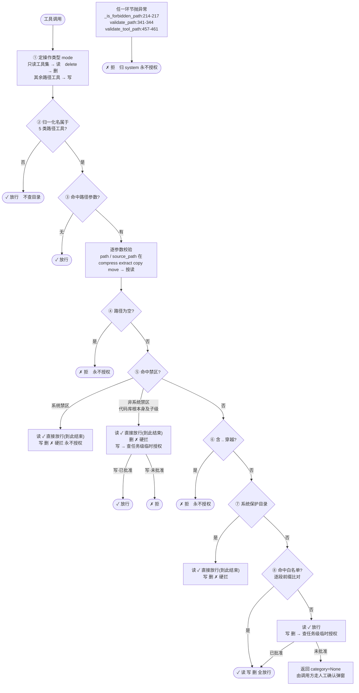
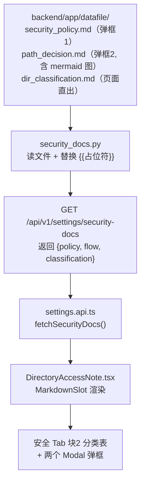
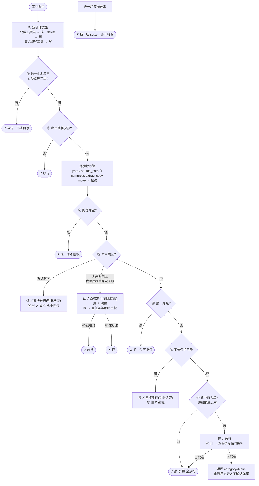

## 六、读写与 Shell 安全策略梳理

> 本章为**梳理与说明**（2026-10-06 北京老陈指令），目的是把"读写安全策略的实际形态与风险"讲清楚，并给出设置页的展示建议。**不含新的功能设计**（功能设计见第三、四章）。

### 6.1 读写安全策略（现状全貌，2026-10-06 实读核准）

#### 6.1.1 判定顺序（实读核准，**8 步**，与 §6.3.2.2 流程图同源同序号）

| 步 | 判定 | 位置 | 读 | 写 | 删 |
|---|---|---|---|---|---|
| ① | 由工具名定 `mode`（只读集→read／`delete`→delete／其余→write） | `:414-419` | — | — | — |
| ② | 归一化名不属于 5 类路径工具 → 放行 | `:436-437` | ✓ | ✓ | ✓ |
| ③ | 无命中路径参数 → 放行 | `:440-442` | ✓ | ✓ | ✓ |
| ④ | 路径为空 | `:244-248` | ✗ 拒 | ✗ 拒 | ✗ 拒 |
| ⑤ | 禁区 `_is_forbidden_path` | `:153-217` | 见下 | 见下 | 见下 |
| ⑥ | 含 `..` 穿越 | `:273-285` | ✗ 拒 | ✗ 拒 | ✗ 拒 |
| ⑦ | 系统保护目录（`windows` / `program files` / `program files (x86)` / `programdata` / `boot` / `recovery`） | `:295-306` | ✓ 放行 | ✗ 硬拦 | ✗ 硬拦 |
| ⑧ | 白名单前缀匹配（逐段比对 `parts`，防 `D:\ab` 误配 `D:\a`）／白名单外 | `:308-326` / `:332-339` | ✓ 放行 | 命中全放行<br/>未命中查临时授权 | 命中全放行<br/>未命中查临时授权 |

**⑤ 禁区内的分流**（`:250-268`，读放行 / 写删按档位处理）：

| 禁区档位 | 位置 | 读 | 写 | 删 |
|---|---|---|---|---|
| 系统禁区（磁盘根、Windows 精确/前缀、`FORBIDDEN_PATHS_*`、异常兜底） | `:174-189`、`:206-211`、`:214-217` | ✓ 放行 | ✗ 硬拦 永不授权 | ✗ 硬拦 永不授权 |
| 非系统禁区（代码库根**本身及子级**） | `:193-204` | ✓ 放行 | 查 `is_temp_authorized`<br/>已批准放行 | ✗ 硬拦 |

> ① 在 ② 之前（`:414-419` 先推断 mode，`:436` 才判 `path_tools`），故序号如此，非笔误。
> 读放行的理由：内容敏感性由 `contentFilter` 兜底（`:252`、`:301-303` 代码注释原话）。

#### 6.1.2 关键事实一：白名单是**扁平的**，没有 rw/ro

```python
# get_default_allowed_paths() 返回 List[Path] —— 只有路径，没有权限
paths = allowed_paths if allowed_paths is not None else get_default_allowed_paths()
for allowed in paths:
    if 前缀匹配(allowed, real_path):
        return True, None, None    # ← 读/写/删 一律放行，不看 mode
```

`mode`（`read`/`write`/`delete`）**只用于两件事**：

1. **禁区该怎么处理**（读放行 / 写硬拦）
2. **白名单外要不要走任务级临时授权**

**它不是"这个目录允不允许写"的判据。** 所以"目录级读写权限"这个能力在现有系统里**完全不存在**（这就是决策 37 取消 `ro` 的根因）。

#### 6.1.3 关键事实二：**读基本是敞开的**

把三处合起来看：

| 场景 | 读的结果 |
|---|---|
| 白名单内 | 放行 |
| 白名单外 | **放行**（`:332-335`） |
| 禁区（含系统目录、代码库根） | **放行**（`:253-254`） |

理由见代码注释：内容敏感性由 `contentFilter` 兜底。

**一句话概括现状：这个系统的路径权限本质上只有"能不能写/删"，读是敞开的。**

#### 6.1.4 风险清单（编号，便于讨论与验收）

| # | 风险 | 现状 | 影响 | 关联 |
|---|---|---|---|---|
| **R1** | **shell 完全绕过路径校验** | `path_safe_check` 只校验 9 个路径参数名（`:355 _PATH_PARAM_KEYS`，**不含 `command`**）；shell 的路径在 `command` 里 → 不命中 → 不校验 | 模型一句 `del /r D:\x\*.md` 可改**白名单外**的目录。任何应用层的路径权限（未来的 `ro`）都拦不住 shell | `trust_db.py:15`"无路径工具: shell"；`safety_gate.py:46`"shell 不在 trust 两集合…恒 None" |
| **R2** | **读无边界** | 白名单外、禁区读都放行（§6.1.3） | 模型可读取任意路径并把内容写进对话/日志。**权限墙只挡写删，不挡读**；若数据敏感，`contentFilter` 是唯一兜底 | `:253-254` / `:332-335` |
| **R3** | **白名单命中即全放行，无粒度** | 命中任一根 → 读写删全放行 | 无法表达"这个目录只能看不能改"；强行加 `ro` 只能拦文件类工具 → **假安全感**（模型用 shell 绕过），比没有更危险 | 决策 37 |
| **R4** | **前缀匹配"第一个命中即 return"** | `:308-326` 遍历 `paths`，命中即返回，**不是取最深匹配** | **当前无害**（命中宽根窄根结果相同）。但**一旦引入 per-directory 权限就会变成漏洞**（`D:\a`=rw 在前会放行 `D:\a\b`=ro 的访问）。故决策 27 随之作废——**若将来做权限，必须同时改这里** | `:308-326` |
| **R5** | **临时授权可"升级"白名单外写入** | 白名单外写/删走 `is_temp_authorized`，用户点同意即放行 | 设计如此（给用户决定权）。但模型可反复重试诱导点击（`agent.max_steps` 上限 10000） | `:263-266` / `:337-338` |
| **R6** | **删除有独立的硬拦/软评估两层** | 硬拦 `delete_file.py:95-110` `protected_roots_`（根自身及上级**永不可删**）；软评估 `delete_safety.py:46-48`（R3-R6 风险分级 → 走 HITL） | 两层方向相反、**不冗余**。会话目录只应进软评估（决策 38） | 见 §4.5.5 |

#### 6.1.5 shell 是**另一套**机制（不是无保护）

| 机制 | 位置 | 说明 |
|---|---|---|
| 路径白名单 | `path_safe_check.py` | **文件类工具**用，机器判 |
| **HITL 人工确认** | `safety_gate.py:59` "shell 确认门"；`:76` 按 command 全文分组（同命令合并、不同命令各弹）；`:81-82` `if tool_name == "bash": _ref = "cmd:" + command` | **shell** 用，用户判 |
| 沙箱 | `sandbox.*`（见 6.2.1） | 限内存/进程数/磁盘，**不限路径** |

**设计意图**：机器能判的让机器判，判不了的让人判。这是**主动的分层设计，不是遗漏**。

#### 6.1.6 结论：真正的权限墙是什么

| 想达到的效果 | 现有系统能不能 |
|---|---|
| 限制模型**不能改**白名单外的目录 | ✅ 文件类工具拦得住（R1 除外，见 shell） |
| 限制模型**不能删**工作区目录本身 | ✅ 硬拦层已有（但会话目录刻意不加，决策 38） |
| 让某个目录**只读** | ❌ **做不到**（R3）；要做必须走 OS 层只读属性，且用户自己也不能写（§4.5.4 另议） |
| 限制 shell 的写操作 | ❌ 做不到（R1）；**不建议**做命令解析（可绕过，见 §4.5.4） |

### 6.2 可设置项 vs 系统硬编码项

#### 6.2.1 目录与安全相关的**可设置**项（settings registry，用户能改）

| tab | 键 | 标签 | 默认 | 代码消费方 |
|---|---|---|---|---|
| **通用** | `workspace.project_root` | 项目根目录 | 空（→ `Path.home()`） | `config.py:223` → `path_safe_check.py:130/145`、`delete_safety.py:46`、`delete_file.py:99`、`download_file.py:47`、`generate_chart.py:39`、`project_context.py:38`、`system_prompts.py:107`、`system_adapter.py:52` |
| **通用** | `workspace.allowed_dirs` | 授权目录 | 空（list） | `config.py:236` → `path_safe_check.py:131`、`delete_safety.py:48`、`delete_file.py:101`、`system_prompts.py:108` |
| **安全** | `security.enabled` | HTL人工开关 | `False` | HITL 链路总闸 |
| **安全** | `security.confirmDangerousOps` | 危险操作确认 | `True` | 保存时二次确认（**后端拦截不依赖它**，见 registry notice） |
| **安全** | `security.auto_confirm_delay` | 自动确认延迟(秒) | `10` | 弹窗倒计时，到点自动放行 |
| **安全** | `security.hitl_timeout` | 人工确认超时(秒) | `120` | 弹窗最长等待 |
| **沙箱** | `sandbox.enabled` / `backend` | 沙箱开关 / 后端 | `True` / `job_object` | 沙箱预检；**仅支持 job_object**，且**不限路径** |
| **沙箱** | `sandbox.max_concurrent_sandboxes` | 最大并发沙箱数 | `3` | 并发上限 |
| **沙箱** | `sandbox.max_workspace_mb` / `max_shadow_mb` | 工作区 / 影子区上限(MB) | `500` / `100` | 磁盘占用与预演副本 |
| **沙箱** | `sandbox.process_memory_limit_mb` | 进程内存上限(MB) | `2048` | 超限终止进程 |
| **沙箱** | `sandbox.default_timeout_sec` / `max_timeout_sec` | 默认 / 最大超时(秒) | `60` / `300` | 命令超时 |

> ⚠️ **安全组只有 4 项、且全是 HITL 开关**——没有一项与"目录权限"相关。目录决定 LLM 能写哪（最核心的权限语义），却在**「通用」组**、标签叫"项目根目录/授权目录"，看不出是权限边界。→ 见 6.3。

#### 6.2.2 目录/安全相关但**硬编码**的项（用户看不到，实际生效）

| 硬编码项 | 值 | 位置 | 出事时用户去哪调 |
|---|---|---|---|
| `TOOL_TIMEOUTS`（30 个工具保险丝） | 10~120 秒 | `tool_constants.py:159` | **无处可调** |
| `SUBPROCESS_TIMEOUT_*` | 3/5/10/60 | `tool_constants.py:202-205` | **无处可调** |
| `HTTPX_TIMEOUT_DEFAULT` | 5.0 秒 | `tool_constants.py:220` | **无处可调** |
| `DEFAULT_TIMEOUT_SEC` | 30.0 秒 | `tool_constants.py:223` | **无处可调** |
| `SHELL_OUTLIMIT_STDOUT/STDERR_MAX_CHARS` | 50000 / 20000 | `tool_constants.py:315-316` | **无处可调**（日志被截断时用户不知为何） |
| `READ_OUTLIMIT_CHARS` 系列 | 500K | `tool_constants.py:328-330` | **无处可调** |
| `OBS_*`（约 30 个 observation 截断） | 各异 | `tool_constants.py:234-295` | **无处可调** |
| `INBOX_MAX` | 20 | `constants.py:137` | 无处可调（决策 18：不做配置项） |
| `MAX_SESSIONS` / `TERMINAL_TTL_MS`（前端） | 32 / 10 分钟 | `chatStreamStore.ts:88-89` | 无处可调（决策 18） |
| `_SYSTEM_PROTECTED` 盘符集合 | 6 项 | `path_safe_check.py:295-298` | **硬编码在判定函数里**，不可配 |

**结论**：安全域有 **11 项可配置**（6.2.1），但**至少 10 类硬编码参数用户完全无法调整**。其中 `TOOL_TIMEOUTS`、`SHELL_OUTLIMIT_*`、`READ_OUTLIMIT_*` 直接影响"操作会不会被中断/内容会不会被截断"——用户遇到问题时**无从下手**。是否配置化见 §五 讨论（此前已按 YAGNI 暂不做，登记为待议）。

### 6.3 安全 Tab 展示策略（新增块2）

**北京老陈定**：保留「安全」tab 现有块 1（人工确认 4 项，**原样不动**），**新增块 2** 说明目录分类及读写能力说明。**沙箱 tab、访问控制、「通用」组里的目录设置一律不搬。**

#### 6.3.1 现有实现机制（实读 `SettingsGroup.tsx`，决定了可行方案）

| 机制 | 事实 |
|---|---|
| **"块"是什么** | `sectionOf(group, key)`（`SettingsGroup.tsx:56-96`）按 key 前缀返回分组名；渲染时遇分组变化插 `<SectionTitle title={`── ${名} ──`} />`（`:183`） |
| **块是顺序产生的** | 块**不是独立容器**，而是按 `items` 顺序遇到 section 变化时插入标题。**一个 key 只能出现在一个组的一个位置** |
| **已有先例（正是同一类需求）** | `appearance` 组分「登录与准入」+「外观」两块（`:15-22` 编辑历史原文："准入控制 ≠ 外观偏好，混在一块会误导"）。**本次做法与之完全同构** |
| **`SettingRow` 支持的 type** | `bool` / `select` / `range` / `int` / `float` / `textarea` / `model_ref` / `url`（`:243-344`）。`readonly` 只是 `disabled` 标志（`:114`），**不是一种 type** |
| **没有"说明文本"类型** | → 块 2 的说明文案**无法走 registry**，只能像 `appearancePreview`（`:113-170`）/ `AboutFiles` 那样**组件内特判插入** |
| **`values` 是全量** | `SettingsGroup` 的 `values: Record<string, unknown>` 是全部设置项（`:40`）。**但本方案不用它** —— 块 2 文案改由后端 `datafile` 供_md（决策 40），不读 `values`、不拼表格（§6.3.4） |

#### 6.3.2 目标形态（块 1 不动，加块 2；块 2 为**纯说明**，无跳转/编辑按钮）

**页面示意图**

```
┌─ 设置 ─ 安全 ───────────────────────────────────────────────────────┐
│                                                                       │
│  ── 人工确认 ──                                                        │
│    HTL人工开关          [ 关 ]                                       │
│    危险操作确认         [ 开 ]                                       │
│    自动确认延迟(秒)     10                                           │
│    人工确认超时(秒)     120                                          │
│                                                                       │
│  ── 目录分类及读写能力说明 ──                                          │
│                                                                       │
│    ┌──────────┬─────────────────────────┬───────┬─────────────────┐  │
│    │ 分类     │ 目录列表                │ 读    │ 写 / 删         │  │
│    ├──────────┼─────────────────────────┼───────┼─────────────────┤  │
│    │禁区·系统 │ 磁盘根(系统盘根)        │ 放行  │ 硬拦,永不可放行 │  │
│    │          │ \Windows                │       │                 │  │
│    │          │ \Program Files          │       │                 │  │
│    │          │ \Program Files (x86)    │       │                 │  │
│    │          │ \Windows\System32\config\SAM    │      │        │  │
│    │          │ …（共 10 条, 后端取真实名单）│       │                 │  │
│    │          │ \ProgramData \Boot \Recovery     │      │        │  │
│    ├──────────┼─────────────────────────┼───────┼─────────────────┤  │
│    │禁区·非系统│ 代码库根本身及其子目录  │ 放行  │ 删硬拦;写需确认 │  │
│    ├──────────┼─────────────────────────┼───────┼─────────────────┤  │
│    │白名单内  │ 用户主目录/项目根/授权目录│ 放行  │放行(递归删需确认)│  │
│    │          │ /tmp  /var/tmp          │       │                 │  │
│    ├──────────┼─────────────────────────┼───────┼─────────────────┤  │
│    │白名单外  │ 禁区 + 白名单外的所有路径│ 放行  │逐次确认(递归直接拒)│ │
│    ├──────────┼─────────────────────────┼───────┼─────────────────┤  │
│    │无效路径  │ 含 .. 穿越 / 空 / 不可识别│ 拒绝  │ 拒绝            │  │
│    └──────────┴─────────────────────────┴───────┴─────────────────┘  │
│                                                                       │
│         [ 安全策略说明 ]      [ 读写判定流程 ]                          │
│           点开各弹一个框                                              │
└───────────────────────────────────────────────────────────────────────┘
```

> 表格内**目录列的路径值全部由后端插值**（`{{system_forbidden}}` / `{{code_root}}` / `{{user_home}}` / `{{project_root}}` / `{{allowed_dirs}}`，见决策 40）。`\Windows` 等按**与盘符无关的相对段**呈现（决策 42）—— 换到非 C 盘的系统，文案不必改。

**块 1（原样不动）**

| 序 | 项 | 类型 | 当前值 |
|---|---|---|---|
| 1 | HTL人工开关 | bool | 关 |
| 2 | 危险操作确认 | bool | 开 |
| 3 | 自动确认延迟(秒) | int | 10 |
| 4 | 人工确认超时(秒) | int | 120 |

**块 2（新增，纯说明）内容规格**

| 部分 | 内容 | 性质 | 实现载体 |
|---|---|---|---|
| 分类表 | 4 类 5 行 × 4 列（分类 / 目录列表 / 读 / 写·删） | 纯文本网格 | `datafile/dir_classification.md` |
| 按钮 1 | 「安全策略说明」→ §6.3.2.1：5 组 22 条（shell 7 / delete 5 / HTL 3 / 信任 3 / 沙箱 4） | 纯文本 | `datafile/security_policy.md` |
| 按钮 2 | 「读写判定流程」→ §6.3.2.2：**mermaid 流程图 + 八步表 + 白名单清单** | 图文混排 | `datafile/path_decision.md` |

> 三块的**正文全部在后端 md 里**（决策 39/40），前端只做「取一次数 + MarkdownSlot 渲染」，**零字符串逻辑**。

##### 6.3.2.1 「安全策略说明」按钮 · 弹框内容

> 表格下方第一个按钮点开的弹框。**纯文字，无交互**。共 5 组 22 条，五组**格式统一**（有序列表 + 陈述句）。

**一、shell 命令执行**

> 依据：`app/utils/shell_readonly.py`（`READONLY_PREFIXES:8-16` 共 30 条、`FAST_CHANNEL_FORBIDDEN:22` 共 12 种、`is_readonly_whitelisted:29-34`）；拒绝计数依据 `app/services/agent/handlers/safety_gate.py:49` 注释「(tool, reject_type) 计 3 次才 FAILED」。本组第 1、2、5 条由守护测试绑到上述常量（§6.3.7 第 2 项）。

1. 命令命中只读白名单前缀（`READONLY_PREFIXES`，共 30 条，如 `ls` `cat` `git log` `pip list` `kubectl get`）且不含任何禁用载体时，直接执行，不弹确认框。
2. 禁用载体共 12 种，命中任一即不走直通：管道 `|`、语句分隔 `;`、后台 `&`、输出重定向 `>` 与 `>>`、变量 `$`、圆括号 `(` 与 `)`、反引号、输入重定向 `<`、换行符 `\r`。
3. 只读命令跳过沙箱预检直接执行；其余命令先做沙箱预检。
4. 其余命令按命令内容分组确认：同一批相同命令只问一次，不同命令各问一次。
5. 同一 (工具, 拒绝类型) 组合连续被拒 3 次后，该任务直接失败，不再重复询问；safety 与 sandbox 两个门各自独立计数。
6. 终端命令不查目录列表——白名单外的文件，它照样能改。
7. 终端命令不受删除规则约束——没有「递归」概念，也没有目录根本身的保护。

**二、delete 命令执行**

1. 项目根和授权目录本身及其所有上级目录（含盘根），拒绝删除；两个根内部的具体文件与子目录仍可删除。
2. 白名单内、非递归：放行免确认。
3. 白名单内、递归：需 HTL 确认。
4. 白名单外、非递归：需 HTL 确认。
5. 白名单外、递归：直接拒。

> 第 1 条的「项目根」「授权目录」在 `security_policy.md` 里写作 `{{project_root}}` 与 `{{allowed_dirs}}`（由 `security_docs._placeholder_values()` 从 `get_config().get_project_root()` / `get_config().get_allowed_dirs()` 实时取值插值）——**不写死示例路径**，否则用户看到的不是自己机器上的真实目录。依据 `delete_file.py:99-110`（`protected_roots_ = [项目根] + allowed_dirs`，逐个比 `p == root_` 与 `root_.parents`）。

**三、HTL 人工确认**

1. 「HTL人工开关」关闭时，写文件、编辑文件、新建任务等操作不会弹窗确认，直接执行。
2. 「HTL人工开关」开启时，写操作执行前弹框 HTL 确认；目录已被信任、同一目标本任务内刚被你拒绝的情况不问。
3. 确认弹窗带倒计时，超时无人点击：关闭时自动放行，开启时按拒绝处理；两个倒计时分别由「自动确认延迟」和「人工确认超时」控制。

**四、信任**

1. 你在弹框里点过「信任此目录」后，该目录记入信任库，本任务内不再重复问。
2. 信任按目录记，信任目录及其子目录都算；信任记录随任务结束失效，不跨任务。
3. shell 不走信任机制——终端命令一律走确认弹框，不因信任而放行。

**五、沙箱与运行限制**

1. 沙箱限制内存、进程数与磁盘占用，不限制路径。
2. 单次执行有超时上限，超时截断并转裁决。
3. 沙箱开关关闭后不再做沙箱预检，命令与文件操作直通执行。
4. 沙箱预检不替代路径校验——两者是并行的两道关，各自独立生效。


##### 6.3.2.2 「读写判定流程」按钮 · 弹框内容

> 表格下方第二个按钮点开的弹框。**纯示意图，无交互**。
> 与 §6.3.2.1 同源同口径，改一处须同步另一处。
> 依据：`path_safe_check.py` `validate_tool_path`(`:385-461`) → `validate_path`(`:220-344`) → `_is_forbidden_path`(`:155-217`)，2026-10-06 逐行核对。

> **图与代码的三处口径校正（2026-10-06 复核）**
>
> | # | 图曾写成 | 代码真相 | 处置 |
> |---|---|---|---|
> | 1 | `src / source_path` 在 compress·extract·copy·move 时按读 | **`src` 是死分支**：`hit_params` 只从 `_PATH_PARAM_KEYS`(`:355-357`) 取，该元组**无 `src`**；`src` 在 `:425` `normalize_params` 已被别名表映射为 `path`（`tools_alias_mapper.py` 中 `"src": "path"` 出现 6 处，无例外）。故 `:450` 的 `key in ("src", "source_path")` 中 `"src"` 永不成立 | 图改为 **`path` / `source_path`**，照代码写 |
> | 2 | `F5S --> T6`（禁区读放行后继续往下走） | `:253-254` 禁区 + read **直接 `return True`**，不再走 ⑥⑦⑧ | 删该边，节点标注「读 ✓ 直接放行(到此结束)」 |
> | 3 | `F7 --> T8`（系统保护目录读放行后继续） | `:304-305` 同为 `return True` | 同上 |
>
> 另补：图中新增**异常兜底**分支——`_is_forbidden_path:214-217`、`validate_path:341-344`、`validate_tool_path:457-461` 三处 `except` 均归 `category="system"` 硬拦永不授权，原图无此路径。
>
> **遗留代码问题（本次不改，另立清理项）**：`path_safe_check.py:450` 的 `"src"` 判断为死代码。不影响功能（`copy/move` 的 `src` 归一后即 `path`，语义已覆盖），但会误导下一个读代码的人，宜删掉 `"src", ` 一项。**本设计不擅自改动判定代码**。



**同一流程的纯文本版**（不依赖 mermaid 渲染器也能看；内容与上图逐条一致）

```
                     ┌──────────────────────────────┐
   工具调用 ────────▶│ ① 定操作类型 mode            │
                     │  只读工具集 → 读              │
                     │  delete      → 删              │
                     │  其余路径工具 → 写             │
                     └──────────────┬───────────────┘
                                    ▼
                     ┌──────────────────────────────┐
                     │ ② 归一化名属于 5 类路径工具？ │
                     └───────┬──────────────┬───────┘
                       否 ───┘              └─── 是
                        ▼                        ▼
              ┌──────────────────┐   ┌──────────────────────────┐
              │ ✓ 放行           │   │ ③ 命中路径参数？         │
              │   不查目录        │   └────┬──────────────┬────┘
              └──────────────────┘   无 ──┘              └─── 有
                                       ▼                     ▼
                        ┌──────────────────┐   ┌──────────────────────────────┐
                        │ ✓ 放行           │   │ 逐参数校验                   │
                        └──────────────────┘   │  path / source_path 在       │
                                               │  compress extract copy move  │
                                               │  → 按读                      │
                                               └──────────────┬───────────────┘
                                                              ▼
                                               ┌──────────────────────────┐
                                               │ ④ 路径为空？              │
                                               └───┬──────────────────┬───┘
                                               是 ─┘                  └── 否
                                                ▼                      ▼
                                              ┌────┐   ┌──────────────────────────┐
                                              │ ✗  │   │ ⑤ 命中禁区？              │
                                              │ 拒 │   └──┬────────┬────────┬────┘
                                              └────┘      │        │        │
                                                       系统禁区  非系统禁区   否
                                                            │        │        │
                                                            ▼        ▼        ▼
                                       ┌──────────────────┐ ┌────────────────────┐
                                       │ 系统禁区         │ │ 非系统禁区         │
                                       │ 读 ✓ 放行(结束)  │ │ 读 ✓ 放行(结束)   │
                                       │ 写 删 ✗ 硬拦     │ │ 删 ✗ 硬拦         │
                                       │      永不授权    │ │ 写 → 查临时授权   │
                                       └──────────────────┘ └─────┬───────┬──────┘
                                                          已批准 ──┘       └── 未批准
                                                               ▼                ▼
                                                        ┌────────┐        ┌────┐
                                                        │ ✓ 放行 │        │ ✗ 拒│
                                                        └────────┘        └────┘
                                                                             │
                                       （非系统禁区读、系统禁区读：到此直接结束）│
                                                                             ▼
                                                            ┌──────────────────────────┐
                                                            │ ⑥ 含 .. 穿越？           │
                                                            └───┬──────────────────┬───┘
                                                            是 ──┘                  └── 否
                                                             ▼                          ▼
                                                           ┌────┐   ┌──────────────────────────┐
                                                           │ ✗  │   │ ⑦ 系统保护目录          │
                                                           │ 拒 │   └───┬──────────────────┬───┘
                                                           └────┘   是 ─┘                  └── 否
                                                                ▼                              ▼
                                              ┌──────────────────┐          ┌──────────────────────┐
                                              │ 读 ✓ 放行(结束)  │          │ ⑧ 命中白名单？       │
                                              │ 写 删 ✗ 硬拦     │          │    逐段前缀比对      │
                                              └──────────────────┘          └────┬────────────┬────┘
                                                                         是 ──┘            └── 否
                                                                          ▼                   ▼
                                                                   ┌──────────────┐   ┌──────────────────────┐
                                                                   │ ✓ 读写删全放行│   │ 读 ✓ 放行           │
                                                                   └──────────────┘   │ 写 删 → 查临时授权 │
                                                                                      └──┬────────────┬───┘
                                                                                已批准 ──┘            └── 未批准
                                                                                     ▼                      ▼
                                                                              ┌────────┐      ┌──────────────────────┐
                                                                              │ ✓ 放行 │      │ 返回 category=None  │
                                                                              └────────┘      │ 由调用方走人工确认  │
                                                                                            └──────────────────────┘

  【异常兜底】任一环节抛异常（_is_forbidden_path:214-217 / validate_path:341-344 /
              validate_tool_path:457-461） ──▶ ✗ 拒，归 system，永不授权
```

**八步口诀**（配图旁的说明文字，序号与上图一致）：

| 步 | 判定 | 读 | 写 | 删 |
|---|---|---|---|---|
| ① | 由工具名定操作类型 | — | — | — |
| ② | 不是路径类工具 | ✓ 放行 | ✓ 放行 | ✓ 放行 |
| ③ | 无路径参数 | ✓ 放行 | ✓ 放行 | ✓ 放行 |
| ④ | 路径为空 | ✗ 拒 | ✗ 拒 | ✗ 拒 |
| ⑤ | 系统禁区 | ✓ 放行 | ✗ 永不授权 | ✗ 永不授权 |
| ⑤ | 非系统禁区 | ✓ 放行 | 临时授权后放行 | ✗ 硬拦 |
| ⑥ | 含 `..` 穿越 | ✗ 拒 | ✗ 拒 | ✗ 拒 |
| ⑦ | 系统保护目录 | ✓ 放行 | ✗ 硬拦 | ✗ 硬拦 |
| ⑧ | 在白名单里 | ✓ 放行 | ✓ 放行 | ✓ 放行 |
| ⑧ | 不在白名单里 | ✓ 放行 | 临时授权 / 问你 | 临时授权 / 问你 |

> **注意**：read / write / delete 三列**全程只有"读"那一列几乎全绿**——这就是"权限墙只挡写删"的直观依据。
>
> ① 定 mode 在 ② 判路径工具**之前**（`path_safe_check.py:414-419` 先推断，`:436` 才判 `path_tools`），故序号如此，非笔误。

**分类表的数据来源**（实读，便于日后核对）：

| 分类 | 来源 | 位置 |
|---|---|---|
| 禁区·系统 | ①磁盘根（`C:\` 等）②系统敏感文件与目录（精确+前缀）③系统盘下的 `windows` / `program files` / `program files (x86)` / `programdata` / `boot` / `recovery` | ① `:174-176`　② `:182-189`、`:206-211`　③ `:295-298` `_SYSTEM_PROTECTED` |
| 禁区·非系统 | 代码库根**本身及其子级** | `:193-204`（`real == code_root` 或 `startswith(code_root + sep)`） |
| 白名单内 | **用户主目录** · `/tmp` · `/var/tmp`（**系统固定，不可配**）· 项目根目录 · 授权目录（**全局可配**）· 本会话目录（**会话级**，第四章新增） | `get_default_allowed_paths():124-132` / `chat_session_workspaces` |
| 白名单外 | 其余所有路径（无法穷举，故写"其余"） | — |
| 无效路径 | 含 `..` 穿越 · 空路径 · 路径解析异常 | `:244-248`（空）· `:273-285`（穿越）· `:341-344`（异常兜底） |

> ⚠️ **代码与注释不符（已按代码为准）**：`:191` 与 `:9` 的注释都写"代码库根及其**子/父级**全部禁止"，但 `:199-201` 实际只判**本身与子级**（`==` 与 `startswith(cr + sep)`），**父级不在此规则内**。表格按代码写"本身及其子级"。代码库根的父级若为盘根，另由 `:174-176` 的"磁盘根"规则以 `system` 身份拦——不是同一条规则。
>
> **口径统一要求**：本表必须与 §6.1.1 判定顺序、§6.1.2/6.1.3 两条关键事实**同源**，三处改一处必须同步另两处。
>
> **与 §6.1 术语对照**：本表的分类是**按权限判定**分——`禁区`（含系统/非系统两档）、`白名单内`、`白名单外`、`无效路径`，共 **4 类 5 行**；§4.1 的"三目录"是**按配置来源**分（白名单的成员来源）。**两套分类不是一回事**，本文已分别标注，勿混用。

#### 6.3.3 设计决策（北京老陈 2026-10-06 确认；编号接第四章决策 38）

| # | 决策 | 理由 |
|---|---|---|
| **39** | 说明文案存后端 `backend/app/datafile/`，放 **3 个** md（两个弹框各一个 + 分类表一个） | `app/` 整树已被 `OmniAgentBackend.spec:21-25` 的 `app_tree = Tree(BACKEND/"app", prefix="app")` 拷入 `_internal/app` → **零 spec 改动自动打包** |
| **40** | 占位符**后端渲染**（5 个） | 取值源全在后端；后端一次替换完 → 前端**零字符串逻辑** |
| **41** | **单接口返回 3 段**；两个弹框保持独立，各对应各自的文件；弹框 2 **同时给流程图与八步表** | 弹框 1=策略说明、弹框 2=读写判定（图 + 表），各有标题与内容，不合并 |
| **42** | 前端**装 mermaid**（`^12.1.0`）并在 MarkdownSlot 增加 mermaid 围栏分支 | `package.json` 原无 mermaid；`MarkdownText` 只自定义了 `code`/`pre`（`:184/:195`），` ```mermaid ` 会被当普通代码块显示源码。装上并特判该围栏即得流程图 |
| **43** | 禁用路径常量**改存与盘符无关的相对段**，去掉 `.replace("C:", ...)` 字符串替换 | 代码里不写死目录；且旧写法一旦某条漏写盘符前缀，`startswith("C:")` 守卫会**静默不替换** |
| **44** | 常量**直接用 `app.tools.tool_constants`，不迁移**到 `app/constants.py` | 该模块全部 import 只有 `tool_types` + `app.constants`，**不拉 `tool_registry`**，直接用零代价；迁移属多余动作 |
| **45** | `security_docs` **只 import `app.config` + `tool_constants`**，绝不 import `app.tools.security.path_safe_check` | 后者 `:71` 顶层 `from app.tools.registry import tool_registry`，为显示目录拖进整个工具注册表不成比例 |
| **46** | markdown 四件套上移中立层 `@/components/markdown/`；两个风险用**可执行守护测试**消除 | 沿用 `useSettings.ts:85-87` 把事件名上移 `@/constants/settingsEvents` 的既定手法，解除 settings2 → chat 反向依赖；风险靠测试消除而非文档记录 |

> **决策 40 的连带收益（重要）**：原方案要在 `settings_registry.py` 加 3 条 `readonly`、`settings_service._item_data` 加 3 个派生键，并受「两处 keys 一一对应、漏配抛 `KeyError`」的 fail-fast 约束。改由后端插值后，**这三处改动全部不需要**——`settings_registry.py` 与 `settings_service.py` **零改动**。

#### 6.3.4 实现方式

##### 6.3.4.1 总体链路



##### 6.3.4.2 后端

**改动 1 — 新建目录 `backend/app/datafile/`，放 3 个 md**

| 文件 | 供给 | 含占位符 |
|---|---|---|
| `security_policy.md` | 弹框 1「安全策略说明」——5 组 22 条 | ✅ 2 个（`{{project_root}}` `{{allowed_dirs}}`） |
| `path_decision.md` | 弹框 2「读写判定流程」——**mermaid 流程图 + 八步表 + 白名单清单** | ✅ 2 个 |
| `dir_classification.md` | 块 2 分类表（4 类 5 行），**页面内直出、不进弹框** | ✅ 2 个 |

> **两个弹框保持独立**（决策 41）：各有标题与内容，各占一个 md 文件——`security_policy.md`（弹框 1）、`path_decision.md`（弹框 2）。

**`datafile/security_policy.md`（新建，文件全文）**

```markdown
## 一、shell 命令执行

1. 命令命中只读白名单前缀（`READONLY_PREFIXES`，共 30 条，如 `ls` `cat` `git log` `pip list` `kubectl get`）且不含任何禁用载体时，直接执行，不弹确认框。
2. 禁用载体共 12 种，命中任一即不走直通：管道 `|`、语句分隔 `;`、后台 `&`、输出重定向 `>` 与 `>>`、变量 `$`、圆括号 `(` 与 `)`、反引号、输入重定向 `<`、换行符 `\r`。
3. 只读命令跳过沙箱预检直接执行；其余命令先做沙箱预检。
4. 其余命令按命令内容分组确认：同一批相同命令只问一次，不同命令各问一次。
5. 同一 (工具, 拒绝类型) 组合连续被拒 3 次后，该任务直接失败，不再重复询问；safety 与 sandbox 两个门各自独立计数。
6. 终端命令不查目录列表——白名单外的文件，它照样能改。
7. 终端命令不受删除规则约束——没有「递归」概念，也没有目录根本身的保护。

## 二、delete 命令执行

1. 项目根和授权目录本身及其所有上级目录（含盘根），拒绝删除；两个根内部的具体文件与子目录仍可删除。
   - 项目根：{{project_root}}
   - 授权目录：{{allowed_dirs}}
2. 白名单内、非递归：放行免确认。
3. 白名单内、递归：需 HTL 确认。
4. 白名单外、非递归：需 HTL 确认。
5. 白名单外、递归：直接拒。

## 三、HTL 人工确认

1. 「HTL人工开关」关闭时，写文件、编辑文件、新建任务等操作不会弹窗确认，直接执行。
2. 「HTL人工开关」开启时，写操作执行前弹框 HTL 确认；目录已被信任、同一目标本任务内刚被你拒绝的情况不问。
3. 确认弹窗带倒计时，超时无人点击：关闭时自动放行，开启时按拒绝处理；两个倒计时分别由「自动确认延迟」和「人工确认超时」控制。

## 四、信任

1. 你在弹框里点过「信任此目录」后，该目录记入信任库，本任务内不再重复问。
2. 信任按目录记，信任目录及其子目录都算；信任记录随任务结束失效，不跨任务。
3. shell 不走信任机制——终端命令一律走确认弹框，不因信任而放行。

## 五、沙箱与运行限制

1. 沙箱限制内存、进程数与磁盘占用，不限制路径。
2. 单次执行有超时上限，超时截断并转裁决。
3. 沙箱开关关闭后不再做沙箱预检，命令与文件操作直通执行。
4. 沙箱预检不替代路径校验——两者是并行的两道关，各自独立生效。
```

**`datafile/dir_classification.md`（新建，文件全文）**

```markdown
| 分类 | 目录列表 | 读 | 写 / 删 |
|---|---|---|---|
| **禁区·系统** | 磁盘根（系统盘根）<br/>{{system_forbidden}}<br/>`\ProgramData`　`\Boot`　`\Recovery` | 放行 | 硬拦，永不可放行 |
| **禁区·非系统** | 代码库根本身及其子目录<br/>`{{code_root}}` | 放行 | 删硬拦；写需你确认后可放行 |
| **白名单内** | 用户主目录<br/>`{{user_home}}`<br/>项目根目录<br/>`{{project_root}}`<br/>授权目录<br/>`{{allowed_dirs}}`<br/>`/tmp`<br/>`/var/tmp` | 放行 | 放行（递归删除需确认） |
| **白名单外** | 禁区 + 白名单外的所有路径 | 放行 | 逐次确认（递归直接拒） |
| **无效路径** | 路径含 `..` 的穿越<br/>空路径<br/>不可识别的路径 | 拒绝 | 拒绝 |
```

**`datafile/path_decision.md`（新建，文件全文）**

````markdown
## 读写判定流程



## 八步速查

| 步 | 判定 | 读 | 写 | 删 |
|---|---|---|---|---|
| ① | 由工具名定操作类型 | — | — | — |
| ② | 不是路径类工具 | 放行 | 放行 | 放行 |
| ③ | 无路径参数 | 放行 | 放行 | 放行 |
| ④ | 路径为空 | 拒 | 拒 | 拒 |
| ⑤ | 系统禁区 | 放行 | 永不授权 | 永不授权 |
| ⑤ | 非系统禁区（代码库根本身及子级） | 放行 | 临时授权后放行 | 硬拦 |
| ⑥ | 含 `..` 穿越 | 拒 | 拒 | 拒 |
| ⑦ | 系统保护目录 | 放行 | 硬拦 | 硬拦 |
| ⑧ | 在白名单里 | 放行 | 放行 | 放行 |
| ⑧ | 不在白名单里 | 放行 | 临时授权 / 问你 | 临时授权 / 问你 |

> 读这一列几乎全绿——这就是「权限墙只挡写删」的直观依据。

## 白名单里有哪些

白名单是扁平的，只有「在不在列表里」一个状态，**没有只读/读写之分**：

- 用户主目录
- 项目根目录：{{project_root}}
- 授权目录：{{allowed_dirs}}
- `/tmp`
- `/var/tmp`

## 终端命令不走这张表

上表只管**文件类工具**。终端命令另走确认弹窗，**不查目录列表**——白名单外的文件它照样能改。
````

**改动 1b — 去掉常量里的硬编码盘符**（关联检查：写死目录 + 字符串替换盘符）

**现状问题**（实读 `tool_constants.py:538-552` + `path_safe_check.py:183/187`）：

```python
FORBIDDEN_PATHS_WINDOWS_EXACT: set[str] = {
    r"C:\Windows",              # ← 盘符 C: 写死
    ...
}
```
```python
_f = forbidden.replace("C:", sys_drive, 1) if forbidden.upper().startswith("C:") else forbidden
#            ^^^^^^^^^^^^^^^^^^^^^ 靠字符串替换把 C: 换成真实盘符
```

两个毛病：**① 常量里写死了目录 `C:\...`**；**② 靠 `.replace("C:", ...)` 做字符串手术**，一旦某条漏写盘符前缀就静默不替换（`startswith` 守卫会把它当普通路径放过去）。

**改法：常量只存与盘符无关的相对段，真实盘符运行时拼接。**

```diff
# app/tools/tool_constants.py:538（常量改为相对段, 不含任何盘符）
-FORBIDDEN_PATHS_WINDOWS_EXACT: set[str] = {  # 【tool 级】使用对象: Windows 禁用路径(精确匹配)
-    r"C:\Windows",
-    r"C:\Program Files",
-    r"C:\Program Files (x86)",
-    r"C:\Windows\System32\config\SAM",
-    r"C:\Windows\System32\config\SYSTEM",
-    r"C:\Windows\System32\config\SECURITY",
-    r"C:\Windows\System32\config\SOFTWARE",
-    r"C:\Windows\System32\config\DEFAULT",
-}
+FORBIDDEN_PATHS_WINDOWS_REL_EXACT: set[str] = {  # 【tool 级】使用对象: Windows 禁用路径(精确匹配)
+    # 与盘符无关的相对段(不写死盘符); 真实盘符由 path_safe_check 运行时前置拼接
+    r"\Windows",
+    r"\Program Files",
+    r"\Program Files (x86)",
+    r"\Windows\System32\config\SAM",
+    r"\Windows\System32\config\SYSTEM",
+    r"\Windows\System32\config\SECURITY",
+    r"\Windows\System32\config\SOFTWARE",
+    r"\Windows\System32\config\DEFAULT",
+}
 
-FORBIDDEN_PATHS_WINDOWS_PREFIX: set[str] = {  # 【tool 级】使用对象: Windows 禁用路径(前缀匹配)
-    r"C:\Windows\System32\config",
-    r"C:\Windows\WinSxS",
+FORBIDDEN_PATHS_WINDOWS_REL_PREFIX: set[str] = {  # 【tool 级】使用对象: Windows 禁用路径(前缀匹配)
+    r"\Windows\System32\config",
+    r"\Windows\WinSxS",
 }
```

```diff
# app/tools/security/path_safe_check.py:180-189（改为盘符前置拼接, 不做字符串替换）
         if os.name == 'nt':
             sys_drive = get_system_drive()  # 真实系统盘符(写死C:模板作默认, 运行时动态替换) — 小欧 2026-08-04
-            for forbidden in FORBIDDEN_PATHS_WINDOWS_EXACT:
-                _f = forbidden.replace("C:", sys_drive, 1) if forbidden.upper().startswith("C:") else forbidden
+            # 2026-10-06 小欧 - 常量改存相对段后直接前置真实盘符, 去掉 .replace("C:", ...) 字符串替换:
+            #   漏写盘符前缀的条目不再静默漏替换(旧 startswith 守卫会把它当普通路径放过去)。
+            #   get_system_drive() 返回带冒号无反斜杠(如 "D:"), 拼接结果与旧逻辑逐条等价。
+            for forbidden in FORBIDDEN_PATHS_WINDOWS_REL_EXACT:
+                _f = sys_drive + forbidden
                 if real_path_lower == _f.lower():
                     return "system", f"路径位于系统禁区(敏感文件): {file_path}"
-            for forbidden_prefix in FORBIDDEN_PATHS_WINDOWS_PREFIX:
-                _f = forbidden_prefix.replace("C:", sys_drive, 1) if forbidden_prefix.upper().startswith("C:") else forbidden_prefix
+            for forbidden_prefix in FORBIDDEN_PATHS_WINDOWS_REL_PREFIX:
+                _f = sys_drive + forbidden_prefix
                 if real_path_lower.startswith(_f.lower()):
                     return "system", f"路径位于系统禁区(敏感目录): {file_path}"
```

**等价性核对**：`get_system_drive()` 返回带冒号无反斜杠（`path_safe_check.py:99` 原文「返回带冒号的盘符如 "C:" 或 "D:"(无反斜杠)」）。旧逻辑 `"C:\Windows".replace("C:", "D:")` = `D:\Windows`；新逻辑 `"D:" + "\Windows"` = `D:\Windows`。**逐条结果相同**。

**消费方与影响面（已核实）**：

| 检查项 | 结果 |
|---|---|
| `FORBIDDEN_PATHS_WINDOWS_*` 的消费方 | **仅** `path_safe_check.py:76/:77`（import）、`:182/:186`（使用） |
| 测试是否引用 | **无**（`tests/`、`e2etests/` 全仓 0 命中） |
| 判定行为变化 | **无**，仅去掉字符串替换这一层间接 |

**唯一残留的盘符字面量**：`path_safe_check.py:113` `return "C:"`（`get_system_drive` 三级探测全失败时的兜底）。这是**兜底默认值**、不是路径清单，保留但提为命名常量，消除 4 处散落的魔数：

```diff
# app/tools/tool_constants.py（新增, 紧邻 Windows 禁用路径段）
+# 系统盘符探测全部失败时的最后兜底值(非路径清单, 仅 get_system_drive 兜底分支用)
+FALLBACK_SYSTEM_DRIVE = "C:"
```

```diff
# app/tools/security/path_safe_check.py
-    return "C:"
+    return FALLBACK_SYSTEM_DRIVE
```

> 本次改动共消除硬编码盘符 **10 处**（8 条精确 + 2 条前缀）**并去掉 1 处字符串替换**；兜底值由 3 处散落（`:113/:183/:187`）收口为 1 个命名常量。


**占位符唯一清单**（**5 个**，`security_docs._placeholder_values()` 与 `_system_forbidden_lines()` 是唯一定义点）：

| 占位符 | 取值来源 | 出现处 |
|---|---|---|
| `{{code_root}}` | `app.config.get_code_root()`（`config.py:321`） | 代码库根本身及其子目录 |
| `{{user_home}}` | `Path.home()` | 用户主目录 |
| `{{project_root}}` | `app.config.get_config().get_project_root()` | 项目根目录、delete 保护根 |
| `{{allowed_dirs}}` | `app.config.get_config().get_allowed_dirs()`（转多行） | 授权目录、delete 保护根 |
| `{{system_forbidden}}` | `FORBIDDEN_PATHS_WINDOWS_REL_EXACT` + `_REL_PREFIX`（`tool_constants.py`，**已是相对段、不含盘符**） | 禁区·系统的真实目录清单 |

> **`security_docs` 只 import 两个轻量模块**：`app.config` 与 `app.tools.tool_constants`。
>
> `tool_constants` **不是重模块**——其全部 import 只有 `app.tools.tool_types`（typing/dataclasses/enum + logger）与 `app.constants`，**不拉 `tool_registry`**。真正拉注册表的是 `app.tools.security.path_safe_check`（`:71`），故**只引 `tool_constants`、绝不引 `path_safe_check`**，**无需迁移任何常量**。
>
> **不需要剥盘符**：改动 1b 之后常量本身已是相对段（`\Windows` 而非 `C:\Windows`），后端直接拼接展示即可，既无硬编码目录，也无需 `get_system_drive()`。

`dir_classification.md` 内容（真实文件全文）：

```markdown
| 分类 | 目录列表 | 读 | 写 / 删 |
|---|---|---|---|
| **禁区·系统** | 磁盘根（系统盘根）<br/>{{system_forbidden}}<br/>`\ProgramData`　`\Boot`　`\Recovery` | 放行 | 硬拦，永不可放行 |
| **禁区·非系统** | 代码库根本身及其子目录<br/>`{{code_root}}` | 放行 | 删硬拦；写需你确认后可放行 |
| **白名单内** | 用户主目录<br/>`{{user_home}}`<br/>项目根目录<br/>`{{project_root}}`<br/>授权目录<br/>`{{allowed_dirs}}`<br/>`/tmp`<br/>`/var/tmp` | 放行 | 放行（递归删除需确认） |
| **白名单外** | 禁区 + 白名单外的所有路径 | 放行 | 逐次确认（递归直接拒） |
| **无效路径** | 路径含 `..` 的穿越<br/>空路径<br/>不可识别的路径 | 拒绝 | 拒绝 |
```

> **「禁区·系统」是三套常量的合并展示，来源逐条可核**：
>
> | 段 | 来源常量 | 判定位置 |
> |---|---|---|
> | `\Windows` `\Program Files` `\Program Files (x86)` + 5 个注册表配置文件 | `FORBIDDEN_PATHS_WINDOWS_REL_EXACT`（8 条，`tool_constants.py:538-547`） | `path_safe_check.py:182-185` 精确比对 |
> | `\Windows\System32\config` `\Windows\WinSxS` | `FORBIDDEN_PATHS_WINDOWS_REL_PREFIX`（2 条，`:549-552`） | `:186-189` 前缀比对 |
> | `\ProgramData` `\Boot` `\Recovery` | `_SYSTEM_PROTECTED`（6 段名，`path_safe_check.py:295-298`） | `:300` 只判 `_real_parts[1]` |
>
> 这三套名单**由守护测试逐条绑到代码常量**（§6.3.7 第 1 项），不靠人工同步。
>
> **口径纪律（已由守护测试强制，非人工记忆）**：本表的分类/读写列必须与 §6.1.1 判定顺序、§6.1.4 风险清单**同源**。三处不一致时，`pytest -k security_docs` 会红（§6.3.7 第 1/3/6 项）。

**改动 2 — 新建 `backend/app/services/settings/security_docs.py`**

```python
# -*- coding: utf-8 -*-
"""
security_docs — 安全 Tab 说明文案源: 读 app/datafile/*.md(两个弹框各一个 + 分类表页面直出一个), 把 {{占位符}} 替换成真实路径值。

为什么插值放后端而非前端:
  占位符的值只有后端拿得到, 后端一次替换完 → 前端只把 md 交给 MarkdownSlot 渲染,
  零字符串逻辑。

分层: 本模块**只 import 两个轻量模块** app.config 与 app.logger, 且
  **绝不 import app.tools.security.path_safe_check** —— 后者 :71 顶层拉入整个 tool_registry。

为什么不需要处理盘符:
  FORBIDDEN_PATHS_WINDOWS_REL_* 常量已改为与盘符无关的相对段, 既无硬编码盘符,
  也无 .replace("C:", ...) 字符串替换。分类表直接展示相对段, 语义等价。

datafile 目录定位为什么不用 get_frozen_dir():
  get_frozen_dir()(config.py:296)服务 logs/files 等**可写**目录; datafile 是**只读**资源,
  随 app/ 整树打包(spec:21-25 app_tree), 源码与 exe 两种模式下 __file__ 相对路径一致,
  故不需要 frozen 分支(多一个分支就多一处要同步的判断)。

读文件为什么不用 safe_read_file(shell_engine.py:257)—— 只借它的硬化, 不引它的依赖:
  ① shell_engine 顶层 import subprocess/tempfile/threading, 为读几行文本拖进整套子进程栈不值当;
  ② safe_read_file 把「文件不存在」与「空文件」都返回 "", 而本模块要区分二者
     (缺失→给用户一句报错, 空→给空文案), 语义不匹配。
  故仅复用 errors="replace" 这一条硬化结论, 其余自实现。

编辑历史:
  2026-10-06 小欧 - 新建: 读 3 个 md + {{占位符}} 插值 + 缺文件降级 + 失败落日志 + 轻量依赖。
"""
from pathlib import Path
from typing import Dict

from app.config import get_code_root, get_config
from app.logger import logger
from app.tools.tool_constants import (
    FORBIDDEN_PATHS_WINDOWS_REL_EXACT,
    FORBIDDEN_PATHS_WINDOWS_REL_PREFIX,
)

# 2026-10-06 小欧 - datafile 定位: app/services/settings/ 上溯两级 = app/, 同级 datafile/
DATAFILE_DIR = Path(__file__).resolve().parents[2] / "datafile"

# 2026-10-06 小欧 - md 文件名与返回键的唯一映射(DRY: 文件名只此一处出现)
_DOC_FILES = {
    "policy": "security_policy.md",
    "flow": "path_decision.md",
    "classification": "dir_classification.md",
}


def _placeholder_values() -> Dict[str, str]:
    """占位符 → 真实值的唯一映射点(4 个路径值)。

    allowed_dirs 由 list 转多行: get_allowed_dirs() 返回 List[Path],
    直接插值会渲染成 Python 字面量 ['a', 'b']。
    """
    return {
        "code_root": str(get_code_root()),
        "user_home": str(Path.home()),
        "project_root": str(get_config().get_project_root()),
        "allowed_dirs": "\n".join(str(p) for p in get_config().get_allowed_dirs()),
    }


def _system_forbidden_lines() -> str:
    """禁区·系统的真实目录清单(直接取工具常量, 不另抄一份)。

    常量已是与盘符无关的相对段, 故无需剥盘符、无需 get_system_drive。
    守护测试断言本函数输出与 dir_classification.md 的清单一致, 改常量即测试红。
    """
    paths = sorted(FORBIDDEN_PATHS_WINDOWS_REL_EXACT | FORBIDDEN_PATHS_WINDOWS_REL_PREFIX)
    return "\n".join(f"`{p}`" for p in paths)


def _render(filename: str) -> str:
    """读 md 并替换全部 5 个占位符; 未登记的占位符原样保留(便于发现拼写错误)。

    errors="replace" 借自 safe_read_file: 用户手改 md 若存成非 UTF-8, 不应让
    UnicodeDecodeError(属 ValueError, **不是** OSError)穿透成 500。
    """
    text = (DATAFILE_DIR / filename).read_text(encoding="utf-8", errors="replace")
    values = _placeholder_values()
    values["system_forbidden"] = _system_forbidden_lines()  # 类型同 Dict[str, str]
    for key, val in values.items():
        text = text.replace("{{" + key + "}}", val)
    return text


def load_security_docs() -> Dict[str, str]:
    """返回 {policy, flow, classification} 三段已插值 md(两个弹框 + 页面直出各一份)。

    单个文件缺失不抛异常: 该段降级为一行错误提示, 其余段仍可用——
    说明文案缺失不该让整个安全 Tab 打不开。
    """
    out: Dict[str, str] = {}
    for key, filename in _DOC_FILES.items():
        try:
            out[key] = _render(filename)
        except (OSError, ValueError) as exc:
            # 落日志: 文件缺失/不可读是真事件, 否则线上无从查起
            # (同 path_safe_check.py:284 logger.warning 既有范式)
            logger.warning(f"[security_docs] 说明文件读取失败: {filename} - {exc}")
            out[key] = f"> 说明文件读取失败：{filename}（{exc}）"
    return out
```

**改动 3 — `settings_routes.py` 加单接口**（`:37` 之后、`:39` `@router.get("/settings")` 之前）

```diff
 @router.get("/settings/mtime")
 @handle_config_errors("获取设置 mtime")
 async def get_settings_mtime():
     return svc.get_mtime()
 
 
+@router.get("/settings/security-docs")
+@handle_config_errors("获取安全说明文案")
+async def get_security_docs():
+    """安全 Tab 说明文案: policy 策略说明 / flow 判定流程 / classification 分类表(均已插值)。
+
+    刻意不并入 /settings 读组: 那条路返回的是"可配置项的值", 本条返回的是"只读说明内容",
+    混在一个响应里会让前端分不清哪个能改哪个不能改。
+    """
+    return docs_svc.load_security_docs()
+
+
 @router.get("/settings")
 @handle_config_errors("获取设置")
 async def get_settings(group: Optional[str] = Query(default=None)):
```

对应 import（`:21` 之后）：

```diff
 from app.services.model.config_helpers import handle_config_errors
 from app.services.settings import settings_service as svc
+from app.services.settings import security_docs as docs_svc
```

**改动 4 — `backend/FUNCTIONS.md` 登记新公用函数**（AGENTS.md 公用函数规范「及时更新」为硬性要求）

```diff
 ### 10.1 设置页服务（settings_service.py）
 
 | 函数名 | 功能 | 参数 | 返回值 |
 |--------|------|------|--------|
 | `get_all_groups` | 设置页 6 组全量读（data+sources+版本+mtime），env 标注 + secret 掩码 | 无 | Dict: {groups, version, mtime} |
+| `load_security_docs` | 安全 Tab 说明文案三段(policy/flow/classification)：读 `app/datafile/*.md` 并插值 5 个 `{{占位符}}`（含 `FORBIDDEN_PATHS_WINDOWS_REL_*` 相对段清单）；单文件缺失降级为一行提示 + 落 warning，不抛异常 | 无 | Dict: {policy, flow, classification}（值为已插值 md） |
 | `get_group` | 单组刷新（未知组名 ValueError 拒） | group: str | Dict: {data, sources, mtime} |
```

同批补该文件末尾的版本历史行（`| 版本 | 日期 | 变更 | 签名 |` 表）：

```diff
+| v4.30 | 2026-10-06 | 10.1 新增 load_security_docs（读 app/datafile/*.md + 占位符插值 + 缺文件降级）；FORBIDDEN_PATHS_WINDOWS_* 改存相对段以去硬编码盘符 | 小欧 |
```

> **必须同批做**：AGENTS.md 公用函数规范明文「新建公用函数后必须添加到 FUNCTIONS.md 清单」。不登记即清单缺失。

**后端修改代码表**

| # | 文件 | 位置 | 类型 | 增 | 内容 |
|---|---|---|---|---|---|
| 1 | `app/datafile/security_policy.md` | 新建文件 | 新增 | 待写 | 策略说明 5 组 22 条，含 `{{project_root}}` `{{allowed_dirs}}` |
| 2 | `app/datafile/path_decision.md` | 新建文件 | 新增 | 待写 | 判定流程 8 步表，含 `{{project_root}}` `{{allowed_dirs}}` |
| 3 | `app/datafile/dir_classification.md` | 新建文件 | 新增 | 待写 | 分类表 4 类 5 行，含 5 个占位符 |
| 4 | `app/tools/tool_constants.py` | `:538-552` | 改 | 2 改名 0 增 | Windows 禁用路径改存**相对段**（去硬编码盘符）；新增 `FALLBACK_SYSTEM_DRIVE` |
| 5 | `app/tools/security/path_safe_check.py` | `:76-77`、`:113`、`:180-189` | 改 | 3 改 5 | import 改新名；兜底值改常量；**去掉 `.replace("C:", ...)` 字符串替换**，改盘符前置拼接 |
| 6 | `app/services/settings/security_docs.py` | 新建文件 | 新增 | 约 78 | 定位 + 映射 + 5 个占位符插值 + 降级 + 落日志；只依赖 `app.config` + `tool_constants` |
| 7 | `app/api/v1/settings_routes.py` | `:21` 后 / `:37` 后 | 新增 | 14 | 1 行 import + 单接口 13 行 |
| 8 | `backend/FUNCTIONS.md` | `10.1` 表 + 末尾版本历史 | 新增 | 2 | 登记 `load_security_docs`（AGENTS.md 公用函数规范硬性要求） |
| 9 | `backend/tests/test_security_docs_sync.py` | 新建文件 | 新增 | 约 108 | 同步守护 **9 条**断言（§6.3.7 后端守护断言） |

| 汇总 | 项数 | 已定增行 | 待写 | 删 | 改 |
|---|---|---|---|---|---|
| 后端合计 | 9 | 约 191 | 3 个 md | 0 | 2 处 |

> **改动 4/5 是关联检查的产出**：它们不属于本功能，但不改就无法「不写死目录」—— 属于必须同批做的前置整改。

> **`settings_registry.py` / `settings_service.py` 零改动**——原方案加的 3 条 `readonly` + 3 个派生键全部不需要，附带的「两处 keys 一一对应 fail-fast」约束一并消失。

##### 6.3.4.3 前端

**改动 0 — 装 mermaid 并渲染流程图**（决策 42）

`mermaid` 是重包（ESM + d3 依赖），**必须动态导入**，否则纯文本用户也要下载——沿用 `MarkdownSlot.tsx:11` 对 `MarkdownText` 的 lazy 处理思路。

**改动 0a — `package.json` 加依赖**

```diff
   "dependencies": {
     "antd": "^5.12.0",
     "axios": "^1.6.0",
     "dayjs": "^1.11.19",
+    "mermaid": "^12.1.0",
     "react": "^18.2.0",
```

> **版本依据（已实测核对）**：mermaid 最新 `12.1.0`；其 `engines.node >= 22.12.0`，本机 node `v24.13.0` 满足；mermaid **无 `peerDependencies`**，不与 React 18 冲突。

**改动 0b — 新建 `src/components/mermaid/MermaidBlock.tsx`（文件全文）**

```tsx
// MermaidBlock.tsx — 把 mermaid 围栏渲染成 SVG 图（中立层，设置页与 chat 流水线共用）
// 编辑历史:
//   2026-10-06 小欧 - 新建：mermaid 懒加载 + 失败降级为原文 pre（见文档 §6.3.3 决策 42）。
import React, { useEffect, useId, useState } from 'react';
import { Colors, FontSize, Radius, Spacing } from '@/utils/stepStyles';

let initialized = false;

/** mermaid 懒加载(重包) + 单例初始化; 反复 render 不重复 initialize */
async function renderMermaid(code: string, id: string): Promise<string> {
  const { default: mermaid } = await import('mermaid');
  if (!initialized) {
    mermaid.initialize({
      startOnLoad: false,
      // strict: 禁掉 mermaid 注入的 onclick 与脚本, 图内不可点、不可执行
      securityLevel: 'strict',
      theme: 'default',
    });
    initialized = true;
  }
  return mermaid.render(id, code);
}

/**
 * 渲染失败(语法错/包未装)降级为原文 pre, 不让整篇说明打不开 ——
 * 与 security_docs 缺文件降级同口径: 说明内容缺失不该拖垮页面。
 */
export const MermaidBlock: React.FC<{ code: string }> = ({ code }) => {
  const reactId = useId();
  const [svg, setSvg] = useState<string | null>(null);
  const [failed, setFailed] = useState(false);

  useEffect(() => {
    let alive = true;
    renderMermaid(code, `mmd-${reactId}`)
      .then((out) => {
        if (alive) setSvg(out);
      })
      .catch(() => {
        if (alive) setFailed(true);
      });
    return () => {
      alive = false;
    };
  }, [code, reactId]);

  if (failed) {
    return (
      <pre
        style={{
          margin: `${Spacing.SM}px 0`,
          padding: Spacing.MD,
          background: Colors.BG.TERTIARY,
          borderRadius: Radius.SM,
          fontSize: FontSize.CODE,
          whiteSpace: 'pre-wrap',
          overflowWrap: 'anywhere',
        }}
      >
        {code}
      </pre>
    );
  }
  if (!svg) return null;
  // mermaid 输出已过 securityLevel:'strict'; 后端文案为本仓自有内容, 非用户输入
  return <div dangerouslySetInnerHTML={{ __html: svg }} />;
};
```

**改动 0c — `MarkdownText.tsx` 的 `code` 分支特判 mermaid 围栏**（`:184`）

```diff
   code: (props: MdProps) => (
+    // 2026-10-06 小欧 - mermaid 围栏特判: className 形如 "language-mermaid"。
+    //   info string 是 react-markdown 挂在 code 节点上的唯一可观测信息(见 :181-183 原注释),
+    //   故按它分流; 未命中才是真代码块。渲染交 MermaidBlock(重包懒加载)。
+    props.className === 'language-mermaid' ? (
+      <MermaidBlock code={String(props.children ?? '')} />
+    ) : (
     <code className={props.className} style={inlineCodeStyle}>
       {props.children}
     </code>
+    )
   ),
```

对应 import（`MarkdownText.tsx` import 区，`@/utils/stepStyles` 之后）：

```diff
 } from '@/utils/stepStyles';
+import { MermaidBlock } from '@/components/mermaid/MermaidBlock';
```

> **与 `MD_IMPL` 的关系**：`MD_IMPL=0` 的 `MarkdownText`（当前值，`MarkdownSlot.tsx:24`）才支持流程图；`MD_IMPL=1` 的 `MarkdownBody` 是零依赖手写正则、认不出 mermaid，该分支下围栏按纯文本显示。这是两个实现的取舍，不在本设计范围内改。

**改动 1 — markdown 三件套上移中立层**（解除 settings2 → chat 反向依赖）

> **沿用本仓已有先例**：`useSettings.ts:85-87` 把事件名上移到 `@/constants/settingsEvents`，注释原文「解除此前 settings2 → features/chat/components/pipeline 的跨 feature 反向依赖」。本次按同一手法处理 markdown 渲染器。

**依赖核实结论**：三件套对 chat 内部**零依赖**，可整体平移。

| 文件 | 外部依赖 |
|---|---|
| `MarkdownText.tsx` | `react` / `react-markdown` / `remark-gfm` / `remark-breaks` / `rehype-sanitize` / `@/utils/stepStyles`（中立） / `./CopyButton`（同目录） |
| `MarkdownBody.tsx` | `react` / `@/utils/stepStyles`（中立） / `./CopyButton`（同目录） |
| `MarkdownSlot.tsx` | `react` / `./MarkdownBody` / `lazy(./MarkdownText)` |
| `CopyButton.tsx` | `react` / `@/utils/stepStyles`（中立） |

| 动作 | 详情 |
|---|---|
| 新位置 | `src/components/markdown/`（中立层，与 `AuthorizationModal`/`HealthCheck` 等同級） |
| 平移文件 | `MarkdownText.tsx` `MarkdownBody.tsx` `MarkdownSlot.tsx` `CopyButton.tsx` 共 4 个 |
| 改 import 的调用方 | `pipeline/TextStream.tsx:31`、`pipeline/ResponseStream.tsx:33`、`chat/components/layout/TaskListPanel.tsx:52` 改指 `@/components/markdown/MarkdownSlot` |
| 改 import 的测试 | `tests/unit/markdown-text-fence.test.tsx:12` 改指 `@/components/markdown/MarkdownText` |
| 同目录相对引用 | 4 个文件内部互引 `./X` **不用改**（整体平移，相对关系不变） |

**改动 1b — 4 处调用方改 import**（真实行号已实读核对）

```diff
--- a/frontend/src/features/chat/components/pipeline/TextStream.tsx
+++ b/frontend/src/features/chat/components/pipeline/TextStream.tsx
@@ -29,7 +29,7 @@
 // 2026-10-05 小欧 v3.9: lazy + Suspense + 纯文本 fallback 三件事已抽到 MarkdownSlot(唯一入口),
 //   思考内容段与最终答复段共用同一开关同一逻辑, 此处不再重复一遍 —— 小欧-2026-10-05
-import { MarkdownSlot } from './MarkdownSlot';
+import { MarkdownSlot } from '@/components/markdown/MarkdownSlot';
 
 interface TextStreamProps {
```

```diff
--- a/frontend/src/features/chat/components/pipeline/ResponseStream.tsx
+++ b/frontend/src/features/chat/components/pipeline/ResponseStream.tsx
@@ -31,7 +31,7 @@
 import { FontSize, Spacing, stepMargin } from '@/utils/stepStyles';
 import { normalizeBlankLines } from '@/utils/textNormalize'; // 13.11 final 兜底 — 小欧 2026-08-30
-import { MarkdownSlot } from './MarkdownSlot'; // 2026-10-05 小欧: 思考排版开关统一入口 — 小欧-2026-10-05
+import { MarkdownSlot } from '@/components/markdown/MarkdownSlot'; // 2026-10-05 小欧: 思考排版开关统一入口 — 小欧-2026-10-05
 
 interface ResponseStreamProps {
```

```diff
--- a/frontend/src/features/chat/components/layout/TaskListPanel.tsx
+++ b/frontend/src/features/chat/components/layout/TaskListPanel.tsx
@@ -50,7 +50,7 @@
 // 2026-10-05 小欧 北京老陈指令(左列 task 卡 response 接 Markdown): 展开态渲染器, 恒开不受设置开关控制
 //   (用户明示"task 下的 mark 显示不受设置的开关的控制") —— 直接传 markdown={true} 绕过 MD_IMPL 之外的开关
-import { MarkdownSlot } from '../pipeline/MarkdownSlot';
+import { MarkdownSlot } from '@/components/markdown/MarkdownSlot';
 
 // 2026-09-30 小欧 [81]v1.4-H18: 左列任务状态标签——按后端 status 枚举正确显示。
```

```diff
--- a/frontend/src/tests/unit/markdown-text-fence.test.tsx
+++ b/frontend/src/tests/unit/markdown-text-fence.test.tsx
@@ -9,7 +9,7 @@
 import { render } from '@testing-library/react';
 import React from 'react';
 import MarkdownText, {
   findUnclosedFenceTail,
-} from '@/features/chat/components/pipeline/MarkdownText';
+} from '@/components/markdown/MarkdownText';
 
 describe('§3.3 围栏尾段切分算法 —— 8 条实测用例(文档标 8/8 通过)', () => {
```

> 4 处**只改 import 来源路径**，注释与代码逻辑一行不动。
> `markdown-text-fence.test.tsx` 属 `frontend/src/tests/`（被 `.gitignore:30` 排除），按 AGENTS.md「禁止 commit 测试 case 代码」只改本地、不入库。

**改动 2 — `settings.api.ts` 加一个 api 函数**（`:122` `export const settingsApi = {` 之后）

```diff
 export const settingsApi = {
+  /**
+   * 安全 Tab 说明文案（3 段已插值 md）。非设置项，只读。
+   * 2026-10-06 小欧 - 新增：文案源改后端 app/datafile/*.md，本函数取代原先
+   *   「分类表在前端用 paths.* props 拼」的做法，前端不再做任何插值。
+   */
+  fetchSecurityDocs: async (): Promise<SecurityDocsResponse> => {
+    const response = await api.get<SecurityDocsResponse>('/settings/security-docs');
+    return response.data;
+  },
   getSchema: async (): Promise<SettingsSchema> => {
```

> **客户端是 `api` 不是 `http`**：`settings.api.ts:7` 为 `import api from './client'`，既有方法（`:124/:129/:134`）统一 `const response = await api.get<T>(...); return response.data;`。此处照抄该范式。

配套类型（与后端 `_DOC_FILES` 3 个键一一对应，加在 `settings.api.ts` 类型声明区）：

```ts
export interface SecurityDocsResponse {
  policy: string;
  flow: string;
  classification: string;
}
```

**改动 3 — `SettingsGroup.tsx` 加 security 分节 + 块 2**（真实行号）

```diff
     if (key.startsWith('tuning.content.')) return '内容截断';
   }
+  // 2026-10-06 小欧 - security 组 4 项人工确认配置归入「人工确认」小节。
+  //   此前不匹配 general/system/appearance/tuning 任一分支 → 落到下方 return null，4 项无标题平铺。
+  if (group === 'security') return '人工确认';
   return null;
 }
```

```diff
         );
       })}
+      {/* 2026-10-06 小欧 - 块2「目录分类及读写能力说明」
+          文案源在后端 app/datafile/*.md（已插值），此处只做取数与 MarkdownSlot 渲染，
+          不再像早前方案那样从 values 读 5 个 paths.* 拼表格。 */}
+      {group === 'security' && (
+        <>
+          <SectionTitle title="── 目录分类及读写能力说明 ──" />
+          <DirectoryAccessNote />
+        </>
+      )}
     </div>
   );
 };
```

> 注意：与早前方案不同，**`DirectoryAccessNote` 不再接任何 props**——分类表也是 md，正文由后端插好。

**改动 4 — 新建 `settings2/components/DirectoryAccessNote.tsx`**

```tsx
// DirectoryAccessNote.tsx — 安全 Tab 块2：分类表 + 两个说明弹框（文案源=后端 app/datafile/*.md）
// 编辑历史:
//   2026-10-06 小欧 - 新建：取 /settings/security-docs 三段 md，分类表直出、两个 Modal 挂 MarkdownSlot。
import React, { useEffect, useState } from 'react';
import { Button, Modal, Spin } from 'antd';
import { MarkdownSlot } from '@/components/markdown/MarkdownSlot';
import { settingsApi } from '@/services/api/settings.api';
import type { SecurityDocsResponse } from '@/services/api/settings.api';
import { Spacing } from '@/utils/stepStyles';

/** 两个弹框的静态配置集中一处: 按钮与 Modal 由此派生, 不再手写两遍(DRY)。
 *  2026-10-06 小欧 */
const POPUPS = [
  { key: 'policy', title: '安全策略说明' },
  { key: 'flow', title: '读写判定流程' },
] as const;

export const DirectoryAccessNote: React.FC = () => {
  // docs === null 即加载中: 不另开 loading state(少一个状态、少一处要同步的分支)
  const [docs, setDocs] = useState<SecurityDocsResponse | null>(null);
  const [error, setError] = useState<string | null>(null);
  const [openKey, setOpenKey] = useState<(typeof POPUPS)[number]['key'] | null>(
    null
  );

  // 2026-10-06 小欧 - 挂载取一次: 说明文案只读、无失效需求, 不重取不轮询(YAGNI)。
  //   src/hooks/ 无公用取数 hook, 故就地实现, 不为此新造抽象(YAGNI)。
  useEffect(() => {
    let alive = true;
    settingsApi
      .fetchSecurityDocs()
      .then((d) => {
        if (alive) setDocs(d);
      })
      .catch(() => {
        if (alive) setError('安全说明读取失败');
      });
    return () => {
      alive = false;
    };
  }, []);

  if (error) return <div>{error}</div>;
  if (!docs) return <Spin tip="正在读取安全说明…" />;

  return (
    <div>
      <MarkdownSlot text={docs.classification} markdown />
      <div
        style={{
          display: 'flex',
          gap: Spacing.MD,
          marginTop: Spacing.MD,
        }}
      >
        {POPUPS.map(({ key, title }) => (
          <Button key={key} onClick={() => setOpenKey(key)}>
            {title}
          </Button>
        ))}
      </div>
      {POPUPS.map(({ key, title }) => (
        <Modal
          key={key}
          open={openKey === key}
          onCancel={() => setOpenKey(null)}
          footer={null}
          title={title}
        >
          <MarkdownSlot text={docs[key]} markdown />
        </Modal>
      ))}
    </div>
  );
};
```

> **不复用 `EMPTY` 常量、不本地定义 `Docs` 类型**：契约类型 `SecurityDocsResponse` 由 `settings.api.ts` 单点声明（前端唯一的类型来源），组件 `import type` 复用 —— 避免同一契约两处定义（DRY）。
>
> **`markdown` 恒为 true 是刻意的**：本组件渲染的是设置说明，用户没理由把它降级成纯文本；不接入「思考排版」开关（那是 chat 流水线的诉求，见 `MarkdownSlot.tsx:27-28`）。

**前端修改代码表**

| # | 文件 | 位置 | 类型 | 增 | 内容 |
|---|---|---|---|---|---|
| 1 | `src/components/markdown/` | 新建目录 | 平移 | 0 净增 | 4 个文件整体平移（`MarkdownText`/`MarkdownBody`/`MarkdownSlot`/`CopyButton`） |
| 2 | `src/features/chat/components/pipeline/TextStream.tsx` | `:31` | 改 import | 1 改 1 | 改指 `@/components/markdown/MarkdownSlot` |
| 3 | `src/features/chat/components/pipeline/ResponseStream.tsx` | `:33` | 改 import | 1 改 1 | 同上 |
| 4 | `src/features/chat/components/layout/TaskListPanel.tsx` | `:52` | 改 import | 1 改 1 | 同上 |
| 5 | `src/tests/unit/markdown-text-fence.test.tsx` | `:12` | 改 import | 1 改 1 | 改指 `@/components/markdown/MarkdownText` |
| 6 | `src/services/api/settings.api.ts` | `:122` 后 | 新增 | 约 14 | `SecurityDocsResponse` 类型 + `fetchSecurityDocs`（用 `api` 客户端，非 `http`） |
| 7 | `src/features/settings2/components/SettingsGroup.tsx` | `:94`↔`:95`、`:221`↔`:222` | 新增 | 约 8 | `sectionOf` security 分支 + 块 2（**不带 props**） |
| 8 | `src/features/settings2/components/DirectoryAccessNote.tsx` | 新建文件 | 新增 | 约 65 | 取数 + 分类表直出 + 2 Modal（`POPUPS` 派生，无重复） |
| 9 | `package.json` | `dependencies` | 加依赖 | 1 | `mermaid@^12.1.0`（决策 42） |
| 10 | `src/components/mermaid/MermaidBlock.tsx` | 新建文件 | 新增 | 约 65 | mermaid 懒加载渲染 + 失败降级为 pre |
| 11 | `src/features/chat/components/pipeline/MarkdownText.tsx` | `:184` + import | 改 | 6 改 1 | `code` 分支特判 `language-mermaid` 围栏 |
| 12 | `src/tests/unit/settings2-no-cross-feature-import.test.tsx` | 新建文件 | 新增 | 约 48 | 分层守护 3 条断言（§6.3.7 前端分层守护断言） |

| 汇总 | 项数 | 已定增行 | 待写/平移 | 删 | 改 |
|---|---|---|---|---|---|
| 前端合计 | 12 | 约 248 | 1 新组件 + 1 新 mermaid + 4 文件平移 + 1 测试 | 0 | 5 处 |

**核对约束**

| 约束 | 说明 |
|---|---|
| md 的 `{{占位符}}` 必须都在 5 个已知键内 | **已由 `pytest -k security_docs` 断言强制**（§6.3.7 第 4 项）。运行期拼错的占位符会原样显示给用户——那是**可见的副作用，不是校验**，校验由该断言承担 |
| 前端 `SecurityDocsResponse` 3 个键 ↔ 后端 `_DOC_FILES` 3 个键 | **已由 `pytest -k security_docs` 断言强制**（§6.3.7 第 5 项） |
| `MarkdownSlot` 必须在 `@/components/markdown/` | **已由 `settings2-no-cross-feature-import.test.tsx` 断言强制**（§6.3.7 第 1/2 项），退回 `features/chat/...` 即测试红 |

#### 6.3.5 数据依赖

**新接口 1 个**：`GET /api/v1/settings/security-docs` → `{policy, flow, classification}`（三段已插值 md）。

| 组成部分 | 数据来源 | 前端逻辑 |
|---|---|---|
| 分类表 4 类 5 行 | **后端** `dir_classification.md`（已插值） | **无** |
| 弹框 1：安全策略说明 5 组 22 条 | **后端** `security_policy.md` | **无** |
| 弹框 2：mermaid 流程图 + 八步表 + 白名单清单 | **后端** `path_decision.md` | **无**（mermaid 由 `MermaidBlock` 渲染，非插值） |
| 5 个占位符的值 | **后端** `security_docs._placeholder_values()` 4 个 + `_system_forbidden_lines()` 1 个 | **无** |

> **前端总逻辑量 = 0 处字符串处理**——只做「取一次数 + 交给 `MarkdownSlot` 渲染」。比早前「前端 2 处逻辑（盘符拼接 + 拆行）」进一步归零。
>
> 附带：§6.3.1「`values` 是全量」这条实读结论**不再需要采纳**——块 2 已不读 `values`。

> **无当前会话上下文依赖**，故不需会话 id、不判空。

#### 6.3.6 三条硬要求

| # | 要求 | 原因 |
|---|---|---|
| 1 | 块 1 **原样不动**，只做追加 | 不打乱现有用户心智；块 2 是纯增量 |
| 2 | 目录项**只读 + 无编辑控件** | 编辑入口唯一（通用组 / 输入框按钮）。若块 2 可编辑即产生第二处存储，**违反决策 5/6 单出口原则** |
| 3 | 安全策略说明里**必须保留「终端命令不查目录列表」那条** | §6.1 风险 **R1**：不写，用户会以为目录列表管得住终端命令 → 真出事时归因错误 |

> 原第 4 条「三个 md 与 §6.1 判定逻辑同源」已**升级为可执行守护**（后端单测把 md 事实绑到代码常量），由 §6.3.7 承接并列入 §6.3.9 验证门，故不再作为「注意事项」列在此处。

#### 6.3.7 两个风险的**解决方案**（不留风险说明，只留可执行守护）

> 下面两条不是「注意事项」，是**已落地的守护机制**。风险已被消除，故本文档不再保留任何风险描述。

**风险 1 — 文案漂移**（md 与后端判定逻辑分离，判定改了而 md 没改 → 界面说谎）

**解决：新增后端单测 `tests/test_security_docs_sync.py`，把 md 里的事实性断言绑到代码常量上。**

| # | 断言 | 绑定对象 | 漂移后果 |
|---|---|---|---|
| 1 | 10 条 Windows 禁用路径**逐条**出现在 `dir_classification.md` | `FORBIDDEN_PATHS_WINDOWS_REL_EXACT`(8) + `_REL_PREFIX`(2)，`tool_constants.py` | 改常量即测试红 |
| 2 | **30 条只读前缀**逐条出现在 `security_policy.md` 第一条；**12 种禁用载体**逐个出现在第二条 | `shell_readonly.READONLY_PREFIXES`（`:8-16`）、`FAST_CHANNEL_FORBIDDEN`（`:22`） | 改白名单不同步文案 → 测试红 |
| 3 | 9 个路径参数名**逐个**出现在 `path_decision.md` | `path_safe_check._PATH_PARAM_KEYS`（`:355-357`） | 同上 |
| 4 | md 的 `{{占位符}}` 全部在 5 个已知键内 | `security_docs._placeholder_values()` + `_system_forbidden_lines()` | 写错占位符名 → 测试红 |
| 5 | 3 个 md 均存在且非空；`load_security_docs()` 返回键恰为 3 个 | `DATAFILE_DIR` / `_DOC_FILES` | 漏建文件或键改名 → 测试红 |
| 6 | `path_decision.md` 步骤数为 8 | 判定顺序（§6.1.1） | 步骤增减未同步 → 测试红 |
| 7 | `tool_constants.py` 的 Windows 禁用路径**不含盘符**（无 `X:` 前缀） | 改动 1b 的「不写死目录」约束 | 有人把 `C:` 加回去 → 测试红 |
| 8 | **`security_docs` 不 import `app.tools.security.path_safe_check`** | 分层约束（`:71` 会拉入 tool_registry） | 图省事加回重依赖 → 测试红 |
| 9 | `path_decision.md` 的图与表**不含 `src` 字样**（应为 `path` / `source_path`） | `_PATH_PARAM_KEYS`(`:355-357`) 无 `src`；`src` 经别名归一为 `path` | 图又照抄 `:450` 死分支 → 测试红 |

> **效果**：文案不再是「靠人记得同步」，而是**改代码必红**。这是把风险真正消除，而不是记录风险。

**`backend/tests/test_security_docs_sync.py`（新建，文件全文）**

```python
# -*- coding: utf-8 -*-
"""
test_security_docs_sync — 安全 Tab 说明文案与后端判定逻辑的同步守护。

编辑历史:
  2026-10-06 小欧 - 新建：9 条断言把 app/datafile/*.md 的事实性内容绑到代码常量，
    改判定逻辑不同步文案即红(见设计文档 §6.3.7 后端守护断言)。
"""
import re

from app.services.settings import security_docs
from app.tools.tool_constants import (
    FORBIDDEN_PATHS_WINDOWS_REL_EXACT,
    FORBIDDEN_PATHS_WINDOWS_REL_PREFIX,
)
from app.utils.shell_readonly import FAST_CHANNEL_FORBIDDEN, READONLY_PREFIXES


def _read(name: str) -> str:
    path = security_docs.DATAFILE_DIR / name
    assert path.is_file(), f"说明文件缺失: {path}"
    text = path.read_text(encoding="utf-8")
    assert text.strip(), f"说明文件为空: {path}"
    return text


def test_1_windows_forbidden_paths_all_listed():
    """1. 10 条 Windows 禁用路径逐条出现在分类表"""
    text = _read("dir_classification.md")
    for p in FORBIDDEN_PATHS_WINDOWS_REL_EXACT | FORBIDDEN_PATHS_WINDOWS_REL_PREFIX:
        assert f"`{p}`" in text, f"分类表漏了禁用路径 {p}"


def test_2_shell_whitelist_in_policy():
    """2. 只读前缀 30 条 + 禁用载体 12 种逐条出现在策略说明"""
    text = _read("security_policy.md")
    assert str(len(READONLY_PREFIXES)) in text, "策略说明的只读前缀条数与常量不符"
    for prefix in READONLY_PREFIXES:
        assert prefix in text, f"策略说明漏了只读前缀 {prefix}"
    assert str(len(FAST_CHANNEL_FORBIDDEN)) in text, "禁用载体数量与常量不符"
    for token in FAST_CHANNEL_FORBIDDEN:
        assert token.strip() in text or repr(token) in text, f"策略说明漏了禁用载体 {token!r}"


def test_3_path_param_keys_listed():
    """3. 9 个路径参数名逐个出现在判定流程"""
    from app.tools.security.path_safe_check import _PATH_PARAM_KEYS

    text = _read("path_decision.md")
    for key in _PATH_PARAM_KEYS:
        assert key in text, f"判定流程漏了路径参数名 {key}"


def test_4_placeholders_are_known():
    """4. 三个 md 里的 {{占位符}} 全部在已知键集合内"""
    known = set(security_docs._placeholder_values()) | {"system_forbidden"}
    pattern = re.compile(r"\{\{(\w+)\}\}")
    for name in security_docs._DOC_FILES.values():
        for key in pattern.findall(_read(name)):
            assert key in known, f"{name} 出现未登记占位符 {{{{{key}}}}}"


def test_5_all_docs_present_and_keys_exact():
    """5. 三个 md 均存在非空, 且 load_security_docs 返回键恰为 3 个"""
    docs = security_docs.load_security_docs()
    assert set(docs) == set(security_docs._DOC_FILES)
    for key, value in docs.items():
        assert value.strip(), f"{key} 渲染结果为空"
        assert "{{" not in value, f"{key} 渲染后仍有未替换占位符"


def test_6_decision_step_count():
    """6. 判定流程为 8 步"""
    text = _read("path_decision.md")
    steps = {m for m in re.findall(r"[①②③④⑤⑥⑦⑧]", text)}
    assert len(steps) == 8, f"判定步骤数应为 8, 实得 {len(steps)}: {sorted(steps)}"


def test_7_no_hardcoded_drive_in_tool_constants():
    """7. 禁用路径常量不含盘符(决策 42: 代码里不写死目录)"""
    for p in FORBIDDEN_PATHS_WINDOWS_REL_EXACT | FORBIDDEN_PATHS_WINDOWS_REL_PREFIX:
        assert not re.match(r"^[A-Za-z]:", p), f"常量写死了盘符: {p}"


def test_8_no_heavy_path_safe_check_import():
    """8. security_docs 不得 import path_safe_check(会拉入整个 tool_registry)"""
    import ast
    import inspect

    tree = ast.parse(inspect.getsource(security_docs))
    for node in ast.walk(tree):
        if isinstance(node, ast.ImportFrom) and node.module:
            assert "path_safe_check" not in node.module, (
                f"security_docs 引了重模块 {node.module}"
            )


def test_9_no_src_in_decision_doc():
    """9. 判定流程文案不得出现 src(_PATH_PARAM_KEYS 无 src, 归一后为 path)"""
    text = _read("path_decision.md")
    assert "src" not in text, "文案出现 src: 该键在 _PATH_PARAM_KEYS 中不存在, 是 :450 的死分支"
    assert "source_path" in text, "文案应写 source_path"
```

**风险 2 — 分层退化**（`MarkdownSlot` 退回 `features/chat/...` → 重现 settings2 → chat 反向依赖）

**解决：新增前端单测 `src/tests/unit/settings2-no-cross-feature-import.test.tsx`，把导入方向断言死。**

| # | 断言 |
|---|---|
| 1 | `src/features/settings2/**` 下**任何**文件都不得出现 `from '@/features/chat/` 或 `'../../chat/` |
| 2 | `src/components/markdown/MarkdownSlot.tsx` 必须存在（中立层落位的存在性守卫） |
| 3 | `features/chat/**` 不得再从相对路径 `'./MarkdownSlot'` 取用（必须走 `@/components/markdown/` 中立层，保证只有一个入口） |

> **效果**：违反分层直接测试红。`useSettings.ts:85-87` 已确立的分层不再依赖后人自觉。

**`frontend/src/tests/unit/settings2-no-cross-feature-import.test.tsx`（新建，文件全文）**

```tsx
// settings2-no-cross-feature-import.test.tsx — 设置页分层守护(见设计文档 §6.3.7 前端分层守护断言)
// 编辑历史:
//   2026-10-06 小欧 - 新建：禁 settings2 反向依赖 features/chat；MarkdownSlot 必须落在中立层。
import { describe, it, expect } from 'vitest';
import { readdirSync, readFileSync, statSync } from 'node:fs';
import { join } from 'node:path';

const SRC = join(__dirname, '..', '..');

function walk(dir: string, out: string[] = []): string[] {
  for (const entry of readdirSync(dir)) {
    const full = join(dir, entry);
    if (statSync(full).isDirectory()) {
      if (entry === 'node_modules') continue;
      walk(full, out);
    } else if (/\.(ts|tsx)$/.test(entry)) {
      out.push(full);
    }
  }
  return out;
}

describe('设置页分层守护', () => {
  it('1. settings2 不得反向依赖 features/chat', () => {
    const offenders: string[] = [];
    for (const f of walk(join(SRC, 'features', 'settings2'))) {
      const text = readFileSync(f, 'utf-8');
      if (/from\s+['"]@\/features\/chat\//.test(text) || /from\s+['"][^'"]*\/chat\//.test(text)) {
        offenders.push(f.replace(SRC, ''));
      }
    }
    expect(offenders).toEqual([]);
  });

  it('2. MarkdownSlot 必须落在中立层 src/components/markdown/', () => {
    expect(() => readFileSync(join(SRC, 'components', 'markdown', 'MarkdownSlot.tsx'))).not.toThrow();
  });

  it('3. features/chat 不得再从相对路径取 MarkdownSlot', () => {
    const offenders: string[] = [];
    for (const f of walk(join(SRC, 'features', 'chat'))) {
      if (/from\s+['"][^'"]*MarkdownSlot['"]/.test(readFileSync(f, 'utf-8'))) {
        offenders.push(f.replace(SRC, ''));
      }
    }
    expect(offenders).toEqual([]);
  });
});
```

#### 6.3.8 工作量

| 项 | 数量 |
|---|---|
| **后端** | 4 个新文件（3 个 md + `security_docs.py`）+ `settings_routes.py` 14 行 + `FUNCTIONS.md` 登记 2 行 + `tests/test_security_docs_sync.py` 1 个（新） |
| **后端前置整改** | `tool_constants.py` 禁用路径改相对段 + `path_safe_check.py` 去字符串替换（见改动 1b，**必须同批做**） |
| **后端零改动** | `settings_registry.py` / `settings_service.py` |
| **前端** | 平移 4 个文件到 `src/components/markdown/` + 改指 4 处 import + `settings.api.ts` 约 14 行 + `SettingsGroup.tsx` 2 处 + `DirectoryAccessNote.tsx` 1 个（新） |
| **前端 mermaid** | `package.json` 加依赖 1 行 + `MermaidBlock.tsx` 1 个（新）+ `MarkdownText.tsx` `code` 分支特判 |
| **前端新守护** | `src/tests/unit/settings2-no-cross-feature-import.test.tsx` 1 个（新） |
| **打包** | **零 spec 改动**（`app/` 整树已由 `OmniAgentBackend.spec:21-25` 的 `app_tree` 携带） |
| **必跑回归** | `markdown-text-fence.test.tsx`（平移影响 chat 流水线渲染：`TextStream`/`ResponseStream`/`TaskListPanel`）+ 前端 `npm run check:full` + 后端 `pytest -k security_docs` |

#### 6.3.9 验证门（AGENTS.md 硬性，一项不过即返工）

| # | 验收项 | 命令 |
|---|---|---|
| 1 | datafile 三 md 与代码常量一致（含 9 条断言） | `pytest -k security_docs` 全绿 |
| 2 | 后端单测全绿 | `pytest -x --tb=short` |
| 3 | 前端跨 feature 零依赖 | `npm test -- settings2-no-cross-feature-import` |
| 4 | markdown 平移无回归 | `npm test -- markdown-text-fence` |
| 5 | 类型 + lint + 格式 | `npm run check:full` |
| 6 | 打包产物含 datafile | `pyinstaller OmniAgentBackend.spec` 后确认 `_internal/app/datafile/` 下 3 个 md 存在 |
| 7 | **mermaid 流程图真渲染出来**（不是源码文本） | 起前端 → 安全 Tab → 点「读写判定流程」→ **看到 SVG 图**，且控制台无 mermaid 报错 |
| 8 | **mermaid 降级路径可用** | 临时把 `path_decision.md` 的图语法改坏 → 弹框仍打开、显示 `<pre>` 原文而非空白 |
| 9 | `FUNCTIONS.md` 已登记 `load_security_docs` | 打开 `backend/FUNCTIONS.md` 搜 `load_security_docs` 有结果 |
| 10 | 禁用路径常量无硬编码盘符 | `pytest -k security_docs` 第 7 条断言（已含在第 1 项，可单独跑定位） |

---

---
