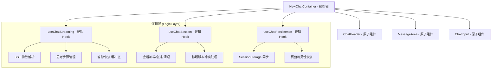

# NewChatContainer 架构重构专项方案

**版本**: v1.1
**日期**: 2026-04-21
**作者**: 小强 (资深前端开发)
**项目**: OmniAgentAs-desk
**状态**: 规划中

---

## 一、 重构背景与目标

### 1.1 现状分析 (Problem Statement)
当前 `NewChatContainer.tsx` 是一个典型的 **"God Component" (巨型组件)**，行数超过 2400 行，存在以下严重问题：
*   **逻辑高度耦合**：SSE 协议处理，会话生命周期、持久化策略、UI 交互全部交织在一起。
*   **性能瓶颈**：由于状态过多，任何微小的状态变更（如计时器）都会导致庞大的 DOM 树进行无效 Diff。
*   **维护高风险**：修改 SSE 回调极易破坏会话保存逻辑，代码改动"牵一发而动全身"。

### 1.2 重构目标 (Objectives)
*   **极致瘦身**：主组件代码量从 2400+ 行压缩至 400 行以内。
*   **职责解耦**：实现逻辑层 (Hooks) 与渲染层 (Components) 的彻底分离。
*   **功能无损**：确保 SSE 消息流，执行步骤，会话版本控制、自动滚动、持久化等功能 100% 正常。
*   **性能提升**：通过组件隔离和 `React.memo`，将核心交互（如输入）的渲染开销降低 70% 以上。

---

## 二、 核心架构设计

我们采用 **"Orchestrator + Smart Hooks + Dumb Components"** 的三层架构模式。

### 2.1 架构模型图 (Mermaid)

---

## 三、 详细拆分规格

### 3.1 逻辑层拆分 (Custom Hooks)

#### ① useChatStreaming (SSE 协议与流式状态)
*   **提取内容**：`useSSE` 及其配套的 `onStep`, `onChunk`, `onComplete`, `onError`, `onPaused`, `onResumed` 全套闭包。
*   **核心逻辑**：
    *   管理 `streamingContentRef` 与 `streamingStepsRef` 的累积。
    *   处理 UI 实时更新逻辑。
    *   **关键点**：必须保持 `isPausedRef` 等 Ref 引用，确保在异步回调中获取最新状态。
*   **输出接口**：`{ messages, isReceiving, executionSteps, sendMessage, interruptTask, clearSteps }`。

#### ② useChatSession (业务会话生命周期)
*   **提取内容**：`loadSession`, `handleNewSessionInternal`, `updateSessionTitle`, `handleClear` 等业务函数。
*   **核心逻辑**：
    *   URL 参数 `session_id` 的监听与路由分发。
    *   `sessionVersion` 与 `titleLocked` 的版本控制。
    *   409 冲突时的自动重试与数据同步。
*   **输出接口**：`{ sessionId, sessionTitle, titleLocked, sessionVersion, loadSession, handleNewSession, handleClear }`。

#### ③ useChatPersistence (状态持久化与恢复)
*   **提取内容**：`saveMessagesToStorage` 的防抖逻辑、`STORAGE_KEY` 管理。
*   **核心逻辑**：
    *   监听 `messages` 变化，自动触发持久化。
    *   **关键点**：解决页面可见性切换时的数据回灌竞争问题。

### 3.2 渲染层拆分 (Dumb Components)

| 组件名称 | 职责 (Responsibility) | 核心状态 (Props) |
| :--- | :--- | :--- |
| **ChatHeader** | 负责标题展示、编辑、锁定图标、TopBar 按钮组。 | `title`, `locked`, `onNew`, `onClear`, `onToggleStream` |
| **MessageArea** | 消息列表滚动区域、骨架屏、空状态。 | `messages`, `loading`, `isReceiving`, `showExecution` |
| **ChatInput** | 输入终端、发送/中断/暂停按钮、等待计时。 | `onSend`, `onInterrupt`, `isReceiving`, `waitTime`, `isPaused` |

---

## 四、 实施路线图 (Phase-based Roadmap)

> **核心原则**：每个Task完成后，必须**构建验证 + 功能测试**通过后，才能进入下一个Task。

### 第一阶段：组件拆分（UI区域拆分）

#### Task 1.1: 提取 ChatHeader 组件
**目标**：提取标题编辑区域为独立组件
**文件**：`src/components/Chat/ChatHeader.tsx`

已经完成

#### Task 1.2: 提取 ChatToolbar 组件
**目标**：提取顶部按钮组（新建会话/流式开关/清空对话）
**文件**：`src/components/Chat/ChatToolbar.tsx`
已经完成

#### Task 1.3: 提取 MessageArea 组件
**目标**：整合MessageList+骨架屏+滚动区域
**文件**：`src/components/Chat/MessageArea.tsx`
已经完成
---

### 第二阶段：Hook拆分（逻辑下沉）

#### Task 2.1: 创建 useChatStreaming Hook
**目标**：SSE协议与流式状态管理
**文件**：`src/hooks/chat/useChatStreaming.ts`

| 步骤 | 操作 | 验证方法 |
|------|------|---------|
| 2.1.1 | 分析SSE相关状态（streamingContentRef, streamingStepsRef等） | 列出待提取状态 |
| 2.1.2 | 分析SSE回调（onStep, onChunk, onComplete, onError） | 列出待提取回调 |
| 2.1.3 | 创建useChatStreaming.ts骨架 | 编译通过 |
| 2.1.4 | 迁移流式状态管理逻辑 | 类型检查通过 |
| 2.1.5 | 迁移SSE回调闭包 | 编译通过 |
| 2.1.6 | 导出接口：messages, isReceiving, sendMessage, interruptTask | 类型检查 |
| 2.1.7 | **验证1**：NewChatContainer保持原样，暂不使用新Hook | 构建通过 ✅ |
| 2.1.8 | **验证2**：[可选]切换到新Hook，功能正常 | 手动测试 ✅ |

#### Task 2.2: 创建 useChatSession Hook
**目标**：会话生命周期管理
**文件**：`src/hooks/chat/useChatSession.ts`

| 步骤 | 操作 | 验证方法 |
|------|------|---------|
| 2.2.1 | 分析会话状态（sessionId, sessionTitle, sessionVersion等） | 列出待提取状态 |
| 2.2.2 | 分析会话函数（loadSession, handleNewSession, handleClear） | 列出待提取函数 |
| 2.2.3 | 创建useChatSession.ts骨架 | 编译通过 |
| 2.2.4 | 迁移会话状态管理 | 类型检查通过 |
| 2.2.5 | 迁移会话函数 | 编译通过 |
| 2.2.6 | 导出接口 | 类型检查 |
| 2.2.7 | **验证1**：NewChatContainer保持原样 | 构建通过 ✅ |
| 2.2.8 | **验证2**：[可选]切换到新Hook，功能正常 | 手动测试 ✅ |

#### Task 2.3: 创建 useChatPersistence Hook
**目标**：状态持久化与恢复
**文件**：`src/hooks/chat/useChatPersistence.ts`

| 步骤 | 操作 | 验证方法 |
|------|------|---------|
| 2.3.1 | 分析持久化代码（saveMessagesToStorage, STORAGE_KEY） | 标记提取范围 |
| 2.3.2 | 创建useChatPersistence.ts | 编译通过 |
| 2.3.3 | 迁移防抖保存逻辑 | 类型检查通过 |
| 2.3.4 | 迁移页面可见性处理 | 编译通过 |
| 2.3.5 | **验证**：构建通过 | 构建通过 ✅ |

---

### 第三阶段：编排器重写

#### Task 3.1: 切换到Hooks
**目标**：NewChatContainer使用拆分的Hooks

| 步骤 | 操作 | 验证方法 |
|------|------|---------|
| 3.1.1 | 导入所有Hooks | 编译通过 |
| 3.1.2 | 替换状态为Hook返回值 | 类型检查 |
| 3.1.3 | 替换函数为Hook返回值 | 编译通过 |
| 3.1.4 | **验证**：功能100%正常 | 手动测试 ✅ |
| 3.1.5 | **回归测试**：发送消息、接收消息、中断功能 | 手动测试 ✅ |

#### Task 3.2: 清理冗余代码
**目标**：移除NewChatContainer中已迁移的冗余代码

| 步骤 | 操作 | 验证方法 |
|------|------|---------|
| 3.2.1 | 确认所有Hook已迁移完成 | 代码审查 |
| 3.2.2 | 删除冗余状态定义 | 编译通过 |
| 3.2.3 | 删除冗余函数定义 | 编译通过 |
| 3.2.4 | 清理未使用的import | 编译通过 |
| 3.2.5 | **验证**：构建通过 | 构建 ✅ |
| 3.2.6 | **最终验收**：全部功能正常 | 手动测试 ✅ |

---

## 五、 验收检查清单

### 5.1 构建验收
- [ ] TypeScript编译无错误
- [ ] ESLint检查无警告
- [ ] 生产构建成功

### 5.2 功能验收
- [ ] 新建会话功能正常
- [ ] 发送消息功能正常
- [ ] 接收消息（流式）功能正常
- [ ] 中断功能正常
- [ ] 暂停/恢复功能正常
- [ ] 标题编辑功能正常
- [ ] 标题锁定功能正常
- [ ] 自动滚动功能正常
- [ ] 页面刷新后消息恢复
- [ ] SessionStorage持久化正常

### 5.3 性能验收
- [ ] 输入框输入不触发消息列表重渲染
- [ ] 滚动流畅无卡顿

---

## 六、 风险控制与代码守恒原则

1.  **Ref 引用闭环**：在迁移 Hook 时，必须确保所有的 Ref（如 `currentSessionIdRef`）被正确传递或初始化，防止闭包过时。
2.  **错误处理统筹**：所有迁移的逻辑必须继续调用 `errorHandler.ts` 中的统一处理函数，严禁私自修改错误提示方式。
3.  **日志记录对齐**：保留 `logAIComplete`, `logUserSend` 等所有监控埋点。
4.  **每步验证**：每个Task完成后必须构建+测试，禁止连续跨越多个Task不验证。

---

## 七、 版本记录

| 版本 | 时间 | 更新内容 | 作者 |
|------|------|---------|------|
| v1.1 | 2026-04-21 13:35:00 | 完善实施路线图，增加每Task验证步骤 | 小沈 |
| v1.0 | 2026-04-21 13:28:00 | 初始版本 | 小强 |

---

**编写人：** 小强 (资深前端开发)  
**更新人：** 小沈  
**日期：** 2026-04-21 13:35:00
