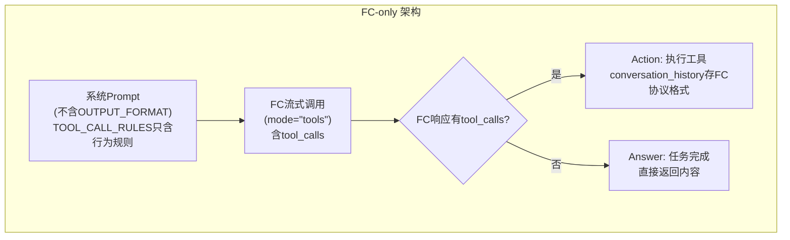

# 002LLM Prompt与Message Conversation History全系统分析

**创建时间**: 2026-06-10 15:15:59  
**版本**: v1.5  
**作者**: 小沈  
**复查次数**: 5遍  

---

## 版本历史

| 版本 | 时间 | 签名 | 更新内容 |
|------|------|------|---------|
| v1.0 | 2026-06-10 15:15:59 | 小沈 | 初始版本，全系统分析完成 |
| v1.1 | 2026-06-11 04:43:57 | 小沈 | 逐问题验证准确性+10大原则符合性+补充遗漏关键问题 |
| v1.2 | 2026-06-11 | 小健 | 逐问题修复复核，标注修复状态（✅已修复/⚠️未修复/✅不修改） |
| v1.3 | 2026-06-11 09:19:07 | 小沈 | 新增FC-only全系统文件检查清单（补充第2/3/4/5章未覆盖范围）|
| v1.4 | 2026-06-11 09:37:46 | 小沈 | 六↔七章节号互换；新增7.1.1降级路径必要性分析 |
| v1.5 | 2026-06-11 | 小沈 | 7.5.5补充_utils.py/_tool_params.py；7.5.6补充fc_context构建代码+L144删除说明；7.8.4精确区分mock类型；第三章新增P0历史污染问题；第五章新增3个P2问题 |
| v1.6 | 2026-06-11 14:30:00 | 小健 | 7.5.7补充审核发现6个问题（#1 fc_context死代码 #2 L144多余消息 #3 handler不写入history #4 yield协议变更崩溃P0 #5 answer_handler.strip依赖 #6 trim分离逻辑），推荐方案A保持str类型

---
## 一、核心架构总览

### 1.1 三层架构

```
┌─────────────────────────────────────────────────────────────┐
│  第一层：Prompt构建层（BasePrompts + 子类）                    │
│  职责：生成System Prompt + Task Prompt                       │
│  入口：build_full_system_prompt()                            │
└─────────────────────────────────────────────────────────────┘
                            ↓
┌─────────────────────────────────────────────────────────────┐
│  第二层：Message管理层（MessageBuilder）                      │
│  职责：管理conversation_history状态                           │
│  核心：init_history / add_assistant / add_observation        │
└─────────────────────────────────────────────────────────────┘
                            ↓
┌─────────────────────────────────────────────────────────────┐
│  第三层：LLM调用层（BaseAIService）                           │
│  职责：发送messages给LLM，接收响应                             │
│  入口：request_stream(messages, mode, tools)                 │
└─────────────────────────────────────────────────────────────┘
```

### 1.2 数据流向图

```
用户请求
    ↓
chat_stream_v2.py (路由层)
    ↓
AgentFactory.create(intent_type)
    ↓
UniversalAgent.__init__()
    ├─ 加载Prompt模板: config.prompt_class()
    └─ 初始化工具: ToolManager.init_tools()
    ↓
run_react_cycle() ─────────────────────────────────────┐
    ↓                                                  │
_initialize_run_state()                                │
    ├─ _get_system_prompt()                            │
    │   └─ prompts.build_full_system_prompt()          │
    ├─ _get_task_prompt(task, context)                 │
    └─ message_builder.init_history(sys, task)         │
        └─ conversation_history = [system, user]       │
    ↓                                                  │
循环开始 ←─────────────────────────────────────────────┤
    ↓                                                  │
_call_llm()                                            │
    ├─ message_builder.prepare_messages_for_llm()      │
    │   └─ 返回 conversation_history + temp_history    │
    ├─ llm_client.request_stream(messages, mode, tools)│
    └─ yield ("chunk", ChunkStep) / ("response", str)  │
    ↓                                                  │
parse_llm_response(llm_response)                       │
    └─ 返回 {type, thought, tool_name, tool_params}    │
    ↓                                                  │
handler分派                                            │
    ├─ action → 执行工具                               │
    │   ├─ yield ThoughtStep                           │
    │   ├─ 执行工具 → result                           │
    │   ├─ yield ActionToolStep                        │
    │   ├─ yield ObservationStep                       │
    │   └─ message_builder.add_observation()           │
    ├─ answer → 任务完成                               │
    │   └─ yield FinalStep                             │
    └─ chunk → 累积内容                                │
        └─ temp_history.append(chunk)                  │
    ↓                                                  │
判断是否继续循环 ───────────────────────────────────────┘
```

---

## 二、Prompt构建层详细分析

### 2.1 BasePrompts基类（base_prompt_template.py）

**文件路径**: `backend/app/services/prompts/base_prompt_template.py`

**核心职责**:
- 定义Prompt模板基类接口
- 统一System Prompt组装顺序
- 提供公共规则常量

**关键常量**:

#### 2.1.1 OUTPUT_FORMAT（JSON输出格式规则）

```python
OUTPUT_FORMAT = """【Response Format - 必须遵守】:
必须使用JSON格式输出,只能返回以下两种情况之一:

情况1:调用工具(继续执行)
{
  "thought": "分析当前状态和下一步决策",
  "reasoning": "为什么选这个工具、参数如何确定",
  "tool_name": "get_current_time",
  "tool_params": {"action": "now"}
}

情况2:任务完成(退出循环)
{
  "thought": "任务已完成",
  "reasoning": "完成说明",
  "tool_name": "finish",
  "tool_params": {"result": "最终结果"}
}

【字段要求】:
- thought: 必需
- reasoning: 必需
- tool_name: 必需(实际工具名或finish)
- tool_params: 必需(参数对象或{})

【禁止项】:
- ❌ 禁止同时返回多个tool_name
- ❌ 禁止tool_name存在但tool_params缺失
- ❌ 禁止使用 [TOOL_CALL] 格式(如:[TOOL_CALL]{{...}}[/TOOL_CALL])
- ❌ 禁止使用XML标签格式(如:<longcat_tool_call> <arg_key>等任何XML/HTML标签)
- ❌ 禁止在content中嵌入工具调用(工具调用必须通过tool_name+tool_params字段)
- ❌ 禁止使用任意自定义标签或特殊标记包裹工具名和参数

【示例】:
{"thought": "用户询问时间", "reasoning": "调用get_current_time", "tool_name": "get_current_time", "tool_params": {"format": "%Y-%m-%d"}}
{"thought": "已完成", "tool_name": "finish", "tool_params": {"result": "当前时间是2026-05-09"}}"""
```

**注**: 【SAFETY WARNING】已于2026-06-11（小健审查）合并到TOOL_CALL_RULES，消除SRP/DRY违反。

**分析**:
- ✅ 明确规定两种返回情况（调用工具/任务完成）
- ✅ 字段要求清晰（thought/reasoning/tool_name/tool_params）
- ✅ 禁止项详细（含具体格式示例供LLM参考）
- ⚠️ **问题**: 禁止项过多，可能导致LLM困惑

#### 2.1.2 TOOL_CALL_RULES（工具调用规则）

```python
TOOL_CALL_RULES = """【Tool Call Rules】:
- 确认用户意图后立即调用工具,不要在thought中反复讨论该用哪个工具
- reasoning简短说明选择理由即可(1-2句),不要写长篇分析
- ❌ 禁止:仅用文字回复而不调用工具 — 用户请求需要实际操作时,MUST调用工具
- ✅ 正确:确认意图→直接调用→根据结果决定下一步
- ⚠️ 任务完成时必须返回 tool_name="finish",否则会进入死循环
- 始终用中文回复用户
- 工具返回错误时向用户解释错误并建议替代方案

【IMPERATIVE: 必须使用工具执行操作】:
- 用户请求需要实际操作时,MUST调用对应的工具(非闲聊场景)
- 不得仅回复"好的,我将..."之类的文字确认而不调用工具
- 只有任务完成总结结果时,才能使用 tool_name="finish" 结束
- 如果不确定用什么工具,选择最合理的工具并调用,不要用文字回复代替"""
```

**注**: 原OUTPUT_FORMAT中的【SAFETY WARNING】已于2026-06-11合并至此（小健审查），消除SRP/DRY违反。原2条详细禁止项"禁止在thought中列举多个工具"和"禁止在thought中分析参数"已删除以减少重复；标题后缀"- 极其重要"已移除。

**分析**:
- ✅ 强调立即调用工具，不反复讨论
- ✅ 明确禁止仅文字回复
- ✅ 整合SAFETY WARNING消除冗余
- ⚠️ **问题**: 规则重复强调，可能与OUTPUT_FORMAT冲突

#### 2.1.3 AVOID_REPEAT_RULES（避免重复规则 — 类常量）

```python
AVOID_REPEAT_RULES = """
【避免重复规则】
- 同一命令/URL成功后不要重复执行(结果不会变)
- 同一命令/URL失败3次后必须换工具或换URL,禁止再试同方式
- 已获取的信息直接使用,不需要重新获取
- 失败后优先尝试替代方法,而非反复重试同一方法"""
```

**注**: 2026-06-11（小沈）从 build_full_system_prompt() 硬编码提取为类常量，#1 fix。

#### 2.1.4 build_full_system_prompt()（唯一组装入口）

```python
def build_full_system_prompt(self, strategy: Optional[str] = None) -> str:
    """构建完整的系统 Prompt(唯一组装入口)
    
    组装顺序:
    ① get_system_prompt()       — 分类特有(角色+工具+示例)
    ② OUTPUT_FORMAT             — 公共:JSON输出格式(FC模式跳过,由API生成)
    ③ TOOL_CALL_RULES           — 公共:工具调用规则
    ④ get_safety_reminder()     — 分类特有:安全提醒
    ⑤ get_rollback_instructions()— 公共:回滚说明
    ⑥ AVOID_REPEAT_RULES        — 公共:避免重复操作
    
    Args:
        strategy: "tools"(FC模式,跳过OUTPUT_FORMAT), None(默认,包含OUTPUT_FORMAT)
    """
    parts = [self.get_system_prompt()]
    
    if strategy != "tools":
        parts.append(self.OUTPUT_FORMAT)
    parts.append(self.TOOL_CALL_RULES)
    
    safety = self.get_safety_reminder()
    if safety:
        parts.append(safety)
    
    rollback = self.get_rollback_instructions()
    if rollback:
        parts.append(rollback)
    
    parts.append(self.AVOID_REPEAT_RULES)
    
    return "\n\n".join(parts)
```

**组装顺序分析**:
```
① get_system_prompt()         [分类特有] → 角色+工具+示例
② OUTPUT_FORMAT               [公共]     → JSON格式规则(FC模式跳过)
③ TOOL_CALL_RULES             [公共]     → 工具调用规则
④ get_safety_reminder()       [分类特有] → 安全提醒
⑤ get_rollback_instructions() [公共]     → 回滚说明
⑥ AVOID_REPEAT_RULES          [公共]     → 避免重复规则
```

**分析**:
- ✅ 组装顺序合理：先角色定义，后规则约束
- ✅ 公共规则统一注入，避免重复
- ✅ strategy参数：FC模式跳过OUTPUT_FORMAT（由API Schema约束格式）
- ✅ AVOID_REPEAT_RULES提取为类常量（2026-06-11小沈修复）

---

### 2.2 FileOperationPrompts子类（file_prompts.py）

**文件路径**: `backend/app/services/prompts/file/file_prompts.py`

**核心职责**:
- 定义文件操作Agent的System Prompt
- 注入服务器OS信息（通过中间层）
- 动态生成工具描述

**get_system_prompt()实现**:

```python
def get_system_prompt(self) -> str:
    """获取增强版系统Prompt"""
    # 1. 注入服务器OS信息
    system_info = get_system_prompt_string(include_commands=False)
    
    # 2. 动态生成工具描述
    tools = [
        "read_file", "write_text_file", "list_directory",
        "search_files", "grep_file_content", "edit_file",
        "rename_file", "file_operation", "archive_tool",
        "read_media_file", "data_file_format",
    ]
    tool_descriptions = self.build_tool_descriptions(tools, category_label="FILE")
    
    # 3. 组装Prompt
    prompt = f"{system_info}\n\n# File Operation Tools\n\n{tool_descriptions}"
    
    # 4. 追加示例
    return prompt + """
【Tool Call Examples】:
Example 1: 读取文件
{"thought": "用户要读取配置文件", "reasoning": "调用read_file单文件模式", "tool_name": "read_file", "tool_params": {"file_paths": ["C:/config.json"]}}

Example 2: 搜索文件内容
{"thought": "搜索包含TODO的Python文件", "reasoning": "使用grep_file_content搜索", "tool_name": "grep_file_content", "tool_params": {"pattern": "TODO", "search_dir": "D:/project", "glob": "*.py"}}

Example 3: 写入文件
{"thought": "用户要写入新文件", "reasoning": "使用write_text_file写入", "tool_name": "write_text_file", "tool_params": {"file_path": "D:/output.txt", "text": "Hello World"}}

Example 4: 任务完成
{"thought": "文件操作已完成", "reasoning": "全部操作成功,结果已返回", "tool_name": "finish", "tool_params": {"result": "已读取配置文件并完成搜索"}}

【⚠️ P17互斥参数规则 - 极其重要】:
- read_file: file_paths传1个路径=单文件, 传多个=批量
- edit_file: old_string 和 edits 不能同时使用
- rename_file: path 和 directory 不能同时使用
- archive_tool: compress模式需要source+destination,extract模式需要source
- file_operation: move/copy需要destination,delete不需要

【⚠️ write_text_file text规则 - 极其重要】:
- text参数必须传入实际的文件内容(代码、文本、正文等)
- ❌ 绝对禁止将你的思考/计划/状态确认当作text传入
- ❌ 错误示例: text="已成功创建并写入第一章,需要继续创建第二章"
- ✅ 正确示例: text="第一章:觉醒\n\n林凡是一名普通的大学生..."""
```

**分析**:
- ✅ 动态生成工具描述，避免硬编码
- ✅ 示例清晰，包含完整JSON格式
- ✅ 参数规则详细，防止误用
- ⚠️ **问题**: 示例硬编码在字符串中，应提取为模板池

---

### 2.3 SystemAdapter中间层（system_adapter.py）

**文件路径**: `backend/app/services/prompts/middle/system_adapter.py`

**核心职责**:
- 根据服务器OS生成系统自适应Prompt
- 提供路径格式、命令格式映射

**generate_system_prompt()实现**:

```python
def generate_system_prompt(self, include_commands: bool = True) -> str:
    """生成系统信息Prompt"""
    system_name = self.get_system_name()
    path_format = self.get_path_format()
    
    prompt = f"""【当前系统】
{system_name}

【路径格式】
- 当前系统: {path_format}
"""
    if include_commands:
        commands = self.get_commands()
        cmd_lines = "\n".join(f"- {k}: {v}" for k, v in commands.items())
        prompt += f"""
【命令格式】
{cmd_lines}
"""
    
    prompt += """
【路径规则】
- 必须使用绝对路径(禁止相对路径如 ./file.txt)
- 禁止用 ~ 表示家目录
- ❌ 路径中的中文字符必须原样保留,禁止翻译或转换!
"""
    
    return prompt
```

**分析**:
- ✅ 系统自适应，支持Windows/Linux/macOS
- ✅ include_commands参数控制是否注入命令格式
- ✅ 路径规则清晰，防止LLM转换中文路径
- ✅ 使用lru_cache单例，避免重复计算

---

### 2.4 UniversalAgent的Prompt组装（universal_agent.py）

**文件路径**: `backend/app/services/agent/universal_agent.py`

**_get_system_prompt()实现**:

```python
def _get_system_prompt(self) -> str:
    """构建完整system prompt — 含prompts守卫 + strategy参数"""
    if not hasattr(self, 'prompts') or not self.prompts:
        return "System: 通用助手"
    
    # 1. FC模式传递strategy="tools"(跳过OUTPUT_FORMAT,由API Schema约束)
    strategy = "tools" if self.tool_category is not None else None
    base_prompt = self.prompts.build_full_system_prompt(strategy=strategy)
    
    # 2. 候选意图提示
    candidates_hint = self._build_candidates_hint()
    
    # 3. 跨分类工具提示
    cross_tool_hint = self._build_cross_tool_hint()
    
    # 4. 组装
    parts = [base_prompt]
    if candidates_hint:
        parts.append(candidates_hint)
    if cross_tool_hint:
        parts.append(cross_tool_hint)
    
    return "\n\n".join(parts)
```

**_build_candidates_hint()实现**:

```python
def _build_candidates_hint(self) -> str:
    """构建候选意图提示"""
    if not self._candidates:
        return ""
    
    from app.services.agent.agent_config import resolve_agent_config
    names = []
    for c in self._candidates:
        cfg = resolve_agent_config(c)
        if cfg:
            names.append(f"{cfg.category_display_name}({c})")
    
    if not names:
        return ""
    
    return f"【候选意图】用户任务可能属于以下分类: {', '.join(names)}。如当前工具无法完成,可尝试其他分类的工具。"
```

**_build_cross_tool_hint()实现**:

```python
def _build_cross_tool_hint(self) -> str:
    """构建跨分类工具提示"""
    loaded = getattr(self, '_loaded_categories', set())
    if len(loaded) <= 1:
        return ""
    
    from app.services.agent.agent_config import AGENT_REGISTRY
    loaded_names = []
    for intent_type, cfg in AGENT_REGISTRY.items():
        if cfg.category.value in loaded:
            loaded_names.append(cfg.category_display_name)
    
    if not loaded_names:
        return ""
    
    return f"【跨分类工具】当前已加载多分类工具: {', '.join(loaded_names)}。可跨分类调用工具完成任务。"
```

**完整Prompt组装顺序**:

```
① get_system_prompt()         [分类特有] → 角色+工具+示例
② OUTPUT_FORMAT               [公共]     → JSON格式规则(FC模式跳过)
③ TOOL_CALL_RULES             [公共]     → 工具调用规则
④ get_safety_reminder()       [分类特有] → 安全提醒
⑤ get_rollback_instructions() [公共]     → 回滚说明
⑥ AVOID_REPEAT_RULES          [公共]     → 避免重复规则
⑦ _build_candidates_hint()    [运行时]   → 候选意图提示
⑧ _build_cross_tool_hint()    [运行时]   → 跨分类工具提示
```

**分析**:
- ✅ 运行时动态注入候选意图和跨分类工具提示
- ✅ 组装顺序合理（FC模式跳过②，由API Schema约束格式）
- ✅ prompts守卫防止未初始化时崩溃
- ⚠️ **问题**: 候选意图提示可能干扰LLM判断

---

## 三、Message管理层详细分析

### 3.1 MessageBuilder类（message_builder.py）

**文件路径**: `backend/app/services/agent/message_builder.py`

**核心职责**:
- 管理conversation_history状态
- 提供消息操作统一入口
- 实现智能截断和容量感知裁剪

**核心属性**:

```python
class MessageBuilder:
    def __init__(self, max_context_chars: int = MAX_CONTEXT_CHARS):
        self.conversation_history: List[Dict[str, Any]] = []  # 正式对话历史
        self.temp_history: List[Dict[str, Any]] = []          # 临时历史（流式chunk缓冲）
        self.MAX_CONTEXT_CHARS = max_context_chars            # 最大上下文字符数（150000）
```

**核心方法分析**:

#### 3.1.1 init_history() - 初始化对话历史

```python
def init_history(self, sys_prompt: str, task_prompt: str) -> None:
    """初始化conversation_history"""
    self.conversation_history = [
        {"role": "system", "content": sys_prompt},
        {"role": "user", "content": task_prompt}
    ]
```

**分析**:
- ✅ 初始化为[system, user]两条消息
- ✅ 简单直接，无冗余逻辑

#### 3.1.2 add_assistant() - 追加assistant消息

```python
def add_assistant(self, content: str) -> None:
    """追加assistant消息"""
    self.conversation_history.append({"role": "assistant", "content": content})
```

**分析**:
- ✅ 简单追加，无自动trim（由_call_llm统一调度）

#### 3.1.3 add_observation() - 追加observation消息

```python
def add_observation(self, observation_text: str, llm_call_count: int = 0, fc_context: Optional[Dict] = None) -> None:
    """追加observation消息 — 含智能截断 + [Observation]前缀归一化 + trim"""
    # 1. 准备observation文本（截断+归一化）
    observation_text = self._prepare_observation_text(observation_text, llm_call_count)
    
    # 2. 追加observation消息
    self._append_observation(observation_text, fc_context)
    
    # 3. 触发历史裁剪
    self.trim_history()
```

**_prepare_observation_text()实现**:

```python
def _prepare_observation_text(self, observation_text: str, llm_call_count: int) -> str:
    """准备observation文本 — 截断+归一化"""
    # 1. 计算可用预算
    budget = self._get_observation_budget(llm_call_count)
    
    # 2. 智能截断
    if len(observation_text) > budget:
        observation_text = smart_truncate_text(observation_text, budget=budget)
    
    # 3. 归一化前缀
    observation_text = self._normalize_observation_prefix(observation_text)
    
    return observation_text
```

**_get_observation_budget()实现**:

```python
@staticmethod
def _get_observation_budget(llm_call_count: int) -> int:
    """计算observation可用预算"""
    # 公式: MIN + DECAY * max(0, 5 - llm_call_count)
    # 常量: MIN=20000, DECAY=10000, MAX=50000
    budget = OBSERVATION_BUDGET_MIN + OBSERVATION_BUDGET_DECAY * max(0, 5 - llm_call_count)
    return min(budget, OBSERVATION_BUDGET_MAX)
```

**预算计算示例**:

| llm_call_count | budget计算 | 结果 |
|----------------|-----------|------|
| 0 | 20000 + 10000 * 5 | 50000（MAX） |
| 1 | 20000 + 10000 * 4 | 50000（MAX） |
| 2 | 20000 + 10000 * 3 | 50000（MAX） |
| 3 | 20000 + 10000 * 2 | 40000 |
| 4 | 20000 + 10000 * 1 | 30000 |
| 5+ | 20000 + 10000 * 0 | 20000（MIN） |

**分析**:
- ✅ 预算随调用次数递减，防止observation过长
- ✅ 智能截断保留关键信息
- ✅ 前缀归一化防止双重[Observation]

**_append_observation()实现**:

```python
def _append_observation(self, observation_text: str, fc_context: Optional[Dict] = None) -> None:
    """追加observation消息 — 方案G: role=system→user+[Tool Result]"""
    if fc_context and fc_context.get("tool_call_id"):
        # FC模式：按OpenAI协议注入
        tool_call_id = fc_context["tool_call_id"]
        tool_calls = fc_context.get("tool_calls")
        if tool_calls:
            self.conversation_history.append({"role": "assistant", "content": None, "tool_calls": tool_calls})
        self.conversation_history.append({"role": "tool", "content": observation_text, "tool_call_id": tool_call_id})
    else:
        # Text模式：user+[Tool Result]
        self.conversation_history.append({"role": "user", "content": f"[Tool Result]\n{observation_text}"})
```

**分析**:
- ✅ 支持FC协议（role=tool + tool_call_id）
- ✅ Text模式使用user+[Tool Result]标识
- ✅ 两种模式清晰分离

#### 3.1.4 prepare_messages_for_llm() - 准备发给LLM的消息

```python
def prepare_messages_for_llm(self) -> List[Dict[str, Any]]:
    """准备发给LLM的完整消息列表"""
    # 1. 复制正式历史
    messages = list(self.conversation_history)
    
    # 2. 追加临时历史
    if self.temp_history:
        messages = messages + list(self.temp_history)
    
    # 3. temp_history容量保护
    self._cap_temp_history()
    
    return messages
```

**_cap_temp_history()实现**:

```python
def _cap_temp_history(self):
    """对temp_history加字符容量限制(最多50000字符)"""
    while self._total_chars(self.temp_history) > TEMP_HISTORY_CHAR_LIMIT and len(self.temp_history) > 1:
        self.temp_history.pop(0)  # 从最旧开始移除
```

**分析**:
- ✅ 合并正式历史和临时历史
- ✅ temp_history有容量保护（50000字符）
- ⚠️ **问题**: 每次调用都检查容量，可能影响性能

#### 3.1.5 trim_history() - 容量感知裁剪

```python
def trim_history(self) -> None:
    """容量感知的对话历史裁剪"""
    # 1. 检查是否需要裁剪（超80%才触发）
    total = self._total_chars(self.conversation_history)
    if total < self.MAX_CONTEXT_CHARS * 0.8:
        return
    
    # 2. 消息太少不裁剪
    if len(self.conversation_history) <= 2:
        return
    
    # 3. 分类消息
    system_msgs, obs_list, assistant_msgs = self._classify_messages()
    
    # 4. 计算预算
    budget = int(self.MAX_CONTEXT_CHARS * 0.7)
    
    # 5. 裁剪observation
    trimmed_obs = self._trim_to_budget(obs_list, assistant_msgs, budget)
    
    # 6. 重组并验证
    rebuilt = self._rebuild_and_validate(system_msgs, trimmed_obs, assistant_msgs)
    
    if rebuilt is not None:
        self.conversation_history = rebuilt
```

**_classify_messages()实现**:

```python
def _classify_messages(self):
    """将消息分类为 system / observation / assistant 三组"""
    system_msgs = []
    obs_list = []
    assistant_msgs = []
    
    for msg in self.conversation_history:
        role = msg.get("role", "")
        if role == "assistant":
            assistant_msgs.append(msg)
        elif self._is_observation_role(msg):
            obs_list.append(msg)
        else:
            system_msgs.append(msg)
    
    return system_msgs, obs_list, assistant_msgs
```

**_is_observation_role()实现**:

```python
@staticmethod
def _is_observation_role(msg: Dict) -> bool:
    """判断消息是否为observation"""
    # 三种形式:
    # 1. text策略: role=user + content含[Tool Result]
    # 2. tools策略(FC协议): role=tool
    if msg.get("role") == "tool":
        return True
    content = msg.get("content", "")
    return msg.get("role") == "user" and "[Tool Result]" in content
```

**_trim_to_budget()实现**:

```python
def _trim_to_budget(self, obs_list, assistant_msgs, budget):
    """去重+截断observation,优先保留FC配对obs(tool-role),非FC text-obs先裁剪"""
    obs_list = self._dedup_by_fingerprint(obs_list)
    # P4: 优先保留含tool_calls的assistant消息,保护FC配对完整性 — 小欧 2026-06-11
    tool_call_msgs = [m for m in assistant_msgs if m.get("tool_calls")]
    text_msgs = [m for m in assistant_msgs if not m.get("tool_calls")]
    tool_call_msgs = tool_call_msgs[-10:]
    text_msgs = text_msgs[-5:]
    assistant_msgs = text_msgs + tool_call_msgs
    obs_list = obs_list[-30:]
    # 分离tool-role(FC配对)和text-role(非FC),优先保留FC配对obs
    tool_obs = [o for o in obs_list if o.get("role") == "tool"]
    text_obs = [o for o in obs_list if o.get("role") != "tool"]
    # 先裁text-obs(非FC),保留最近15条tool-obs(FC配对)
    tool_obs = tool_obs[-15:]
    combined = text_obs + tool_obs
    while combined and self._total_chars(combined) > budget:
        combined.pop(0)
    return combined
```

**_dedup_by_fingerprint()实现**:

```python
@staticmethod
def _dedup_by_fingerprint(obs_list: List[Dict]) -> List[Dict]:
    """基于指纹去重observation"""
    seen = set()
    result = []
    
    for obs in obs_list:
        # FC协议消息不参与去重
        if obs.get("role") == "tool" and obs.get("tool_call_id"):
            result.append(obs)
            continue
        
        # 基于content计算指纹
        content = obs.get("content", "")
        fp = hashlib.md5(content.encode()).hexdigest()[:16]
        
        if fp not in seen:
            seen.add(fp)
            result.append(obs)
    
    return result
```

**分析**:
- ✅ 超过80%才触发裁剪，避免频繁操作
- ✅ 分类裁剪：system保留，observation去重+截断，assistant保留最新10条
- ✅ FC配对保护：assistant按tool_calls/text分离保留；observation按tool/text分离优先保留FC配对
- ✅ FC协议消息不参与去重，防止配对断裂
- ⚠️ **问题**: 裁剪后可能丢失重要上下文

#### 3.1.6 _trim_fc_pairs() - FC协议配对裁剪

```python
@staticmethod
def _trim_fc_pairs(messages: List[Dict]) -> List[Dict]:
    """FC协议配对裁剪:确保role:tool与role:assistant(tool_calls)严格配对"""
    # 1. 收集所有tool_call_id
    assistant_ids: set = set()
    tool_ids: set = set()
    
    for msg in messages:
        if msg.get("role") == "assistant":
            for tc in msg.get("tool_calls") or []:
                if tc.get("id"):
                    assistant_ids.add(tc["id"])
        elif msg.get("role") == "tool":
            if msg.get("tool_call_id"):
                tool_ids.add(msg["tool_call_id"])
    
    # 2. 计算配对ID
    paired_ids = assistant_ids & tool_ids
    
    # 3. 过滤消息
    result = []
    for msg in messages:
        if msg.get("role") == "assistant":
            # 保留配对的tool_calls
            tcs = msg.get("tool_calls") or []
            kept_tcs = [tc for tc in tcs if tc.get("id") in paired_ids]
            if not kept_tcs and tcs:
                continue  # 全部未配对，移除整条assistant
            new_msg = dict(msg)
            new_msg["tool_calls"] = kept_tcs
            result.append(new_msg)
        elif msg.get("role") == "tool":
            # 保留配对的tool消息
            if msg.get("tool_call_id") in paired_ids:
                result.append(msg)
        else:
            result.append(msg)
    
    return result
```

**分析**:
- ✅ 确保FC协议配对完整性
- ✅ 未配对的消息被移除
- ⚠️ **问题**: 可能移除重要上下文

---

### 3.2 conversation_history完整生命周期

```
初始化阶段:
┌─────────────────────────────────────────────────────────────┐
│ _initialize_run_state()                                     │
│   ├─ message_builder.reset_per_run()                        │
│   │   └─ conversation_history = []                          │
│   │   └─ temp_history = []                                  │
│   ├─ sys_prompt = _get_system_prompt()                      │
│   ├─ task_prompt = _get_task_prompt(task, context)          │
│   └─ message_builder.init_history(sys_prompt, task_prompt)  │
│       └─ conversation_history = [                           │
│             {"role": "system", "content": sys_prompt},      │
│             {"role": "user", "content": task_prompt}        │
│           ]                                                 │
└─────────────────────────────────────────────────────────────┘

循环阶段（每轮）:
┌─────────────────────────────────────────────────────────────┐
│ _call_llm()                                                 │
│   ├─ message_builder.trim_history()                         │
│   ├─ messages = message_builder.prepare_messages_for_llm()  │
│   │   └─ 返回 conversation_history + temp_history           │
│   └─ llm_client.request_stream(messages, mode, tools)       │
└─────────────────────────────────────────────────────────────┘
                            ↓
┌─────────────────────────────────────────────────────────────┐
│ parse_llm_response(llm_response)                            │
│   └─ 返回 {type, thought, tool_name, tool_params}           │
└─────────────────────────────────────────────────────────────┘
                            ↓
┌─────────────────────────────────────────────────────────────┐
│ handle_action()                                             │
│   ├─ yield ThoughtStep                                      │
│   ├─ 执行工具 → result                                       │
│   ├─ yield ActionToolStep                                   │
│   ├─ yield ObservationStep                                  │
│   ├─ message_builder.add_assistant(llm_response)            │
│   │   └─ conversation_history.append(                       │
│   │         {"role": "assistant", "content": llm_response}  │
│   │       )                                                 │
│   └─ message_builder.add_observation(obs_text, count, fc)   │
│       └─ conversation_history.append(                       │
│             {"role": "user", "content": "[Tool Result]..."} │
│           )                                                 │
└─────────────────────────────────────────────────────────────┘

conversation_history结构示例:
[
  {"role": "system", "content": "System Prompt..."},
  {"role": "user", "content": "Task: 读取config.json"},
  {"role": "assistant", "content": '{"thought": "读取文件", "tool_name": "read_file", ...}'},
  {"role": "user", "content": "[Tool Result]\nObservation: 文件内容..."},
  {"role": "assistant", "content": '{"thought": "任务完成", "tool_name": "finish", ...}'},
]
```

**⚠️ 问题 P0: task为空时历史消息污染** — 小沈 2026-06-11

`init_history()`将`task_prompt`直接存入`conversation_history[1]`（user消息），未校验`task`是否为空。若调用方传入空字符串`""`，`_get_task_prompt()`仍会返回带时间戳和模板的非空字符串（如`"Task: \nCurrent time: ...\n请完成此文件管理任务..."`），但核心任务内容为空。后续LLM基于空任务推理，产出无意义结果，且该空user消息在`trim_history()`中不会被裁剪（因`len<=2`保护），永久污染conversation_history。

**触发路径**: `chat_router.py` → `agent.run(task="")` → `initialize_run_state()` → `_get_task_prompt("")` → `init_history(sys_prompt, "Task: \n...")`

**修复建议**: `init_history()`中增加`task`非空校验，空任务时抛出`ValueError`或返回默认提示。

---

## 四、LLM调用层详细分析

### 4.1 BaseAIService类（llm_core.py）

**文件路径**: `backend/app/services/llm_core/llm_core.py`

**核心职责**:
- 提供request/request_stream/chat方法
- 处理SSE流解析
- 支持FC协议和Text模式

**核心方法分析**:

#### 4.1.1 request_stream() - 流式请求

```python
async def request_stream(
    self,
    messages: List[Dict],
    mode: str = "text",
    tools: Optional[List[Dict]] = None,
    tool_choice: str = "auto",
) -> AsyncGenerator[StreamChunk, None]:
    """流式请求 - SSE服务层/Agent用"""
    self.reset_cancel()
    self._ensure_client()
    
    retry_count = 0
    max_retries = 3
    
    while retry_count <= max_retries:
        try:
            tool_call_accumulator = {}
            
            async for data_str in self._llm_sdk.request_stream(
                messages=messages,
                mode=mode,
                tools=tools,
                tool_choice=tool_choice,
                max_tokens=self.max_tokens,
                temperature=self.temperature,
                seed=self.seed,
            ):
                # 1. 检查取消/暂停状态
                if await self._check_task_cancelled_or_paused():
                    yield self._create_cancelled_chunk()
                    return
                
                # 2. 跨chunk聚合tool_calls
                tc_data = self._extract_tool_calls(data_str)
                for idx, entry in tc_data.items():
                    tool_call_accumulator.setdefault(idx, {"name": "", "arguments": ""})
                    if entry.get("name"):
                        tool_call_accumulator[idx]["name"] = entry["name"]
                    if entry.get("arguments"):
                        tool_call_accumulator[idx]["arguments"] += entry["arguments"]
                
                # 3. 解析SSE data
                chunk = self._parse_sse_data(data_str)
                if chunk:
                    yield chunk
                    if chunk.is_done:
                        return
            
            # 4. 流结束后，注入聚合的tool_calls
            if tool_call_accumulator:
                for idx in sorted(tool_call_accumulator):
                    tc = tool_call_accumulator[idx]
                    if tc["name"]:
                        params = json.loads(tc["arguments"]) if tc["arguments"] else {}
                        action_json = json.dumps({"tool_name": tc["name"], "tool_params": params})
                        yield StreamChunk(content=action_json, model=self.model, is_done=False, is_reasoning=False)
            
            yield StreamChunk(content="", model=self.model, is_done=True)
            return
        
        except Exception as e:
            if self._should_retry(e) and retry_count < max_retries:
                retry_count += 1
                wait_time = 2 ** retry_count
                await asyncio.sleep(wait_time)
                continue
            else:
                yield self._create_stream_error_chunk(e)
                return
```

**分析**:
- ✅ 支持重试机制（最多3次，指数退避）
- ✅ 跨chunk聚合tool_calls，支持FC协议
- ✅ 定期检查取消/暂停状态
- ⚠️ **问题**: 重试逻辑可能导致重复执行

#### 4.1.2 _parse_sse_data() - 解析SSE数据

```python
def _parse_sse_data(self, data_str: str) -> Optional[StreamChunk]:
    """解析SSE data字符串为StreamChunk"""
    try:
        data = parse_json(data_str)
        if data is None:
            return None
        
        choices = data.get("choices", [])
        if not choices:
            return None
        
        delta = choices[0].get("delta", {})
        content = delta.get("content", "") or ""
        reasoning_content = extract_reasoning_from_chunk(delta) or ""
        
        if content:
            return StreamChunk(content=content, model=self.model, is_done=False, is_reasoning=False)
        if reasoning_content:
            return StreamChunk(content=reasoning_content, model=self.model, is_done=False, is_reasoning=True)
        
        return None
    
    except Exception as e:
        return None
```

**分析**:
- ✅ 支持reasoning_content提取（思考模型）
- ✅ 返回StreamChunk统一格式
- ⚠️ **问题**: 解析失败静默返回None，可能丢失信息

---

### 4.2 UniversalAgent的LLM调用（universal_agent.py）

**_call_llm()实现**:

```python
async def _call_llm(self):
    """调用LLM — FC优先,降级text流式 — 小沈 2026-06-11"""
    self.llm_call_count += 1
    self.message_builder.trim_history()
    
    messages = self.message_builder.prepare_messages_for_llm()
    
    executed_summary = self._build_executed_tool_summary()
    if executed_summary:
        messages.append({"role": "system", "content": executed_summary})
    
    # 工具提醒惰性注入:不永久写入conversation_history — 小沈 2026-06-11
    if getattr(self, '_tool_reminder_needed', False):
        from app.services.prompts.base_prompt_template import BasePrompts
        messages.append({"role": "system", "content": BasePrompts.TOOL_REMINDER})
        self._tool_reminder_needed = False
    
    openai_tools = self._get_openai_tools()
    
    if not openai_tools:
        logger.error(f"[call_llm] 无可用工具, category={self.tool_category}")
    
    # FC优先:所有场景都过FC流式,无工具也走(由API处理)
    async for item in self._call_llm_fc_stream(messages, openai_tools):
        yield item
```

**_build_executed_tool_summary()实现**:

```python
def _build_executed_tool_summary(self) -> str:
    """构建已执行工具汇总"""
    if not hasattr(self, '_executed_tool_summary') or not self._executed_tool_summary:
        return ""
    
    # 只取成功的工具
    done = [s for s in self._executed_tool_summary if '→success' in s]
    if not done:
        return ""
    
    parts = []
    for entry in done[-8:]:  # 保留最新8条
        if '|' in entry:
            tool_status, data_hint = entry.split('|', 1)
            parts.append(f"{tool_status}({data_hint})")
        else:
            parts.append(entry)
    
    return ("【已执行工具(勿重复)】" + "; ".join(parts)
            + "\n注意:上述工具已成功执行,结果已在Observation中,禁止再次调用!")
```

**分析**:
- ✅ 注入已执行工具汇总，防止重复调用
- ✅ FC优先：所有场景都过FC流式（2026-06-11小沈重构：无工具时由API处理）
- ✅ 工具提醒惰性注入：不永久写入conversation_history，通过标志位动态注入（2026-06-11小沈）
- ⚠️ **问题**: executed_summary在每次调用时都注入，可能增加上下文长度

**_call_llm_fc_stream()实现**:

```python
async def _call_llm_fc_stream(self, messages: list, openai_tools: list):
    """FC模式流式调用 — 异常/纯文本降级text流式 — 小沈 2026-06-11"""
    from app.services.agent.steps import ChunkStep
    
    full_content = ""
    full_reasoning = ""
    stream_error = None
    chunk_step_count = 0
    
    try:
        async for chunk in self.llm_client.request_stream(
            messages=messages,
            mode="tools",
            tools=openai_tools,
            tool_choice="auto",
        ):
            if chunk.stream_error:
                stream_error = chunk.stream_error
                break
            
            if chunk.content:
                chunk_step_count += 1
                if getattr(chunk, "is_reasoning", False):
                    full_reasoning += chunk.content
                    yield ("chunk", ChunkStep(
                        step=self.llm_call_count,
                        content=chunk.content,
                        is_reasoning=True,
                    ))
                else:
                    full_content += chunk.content
                    yield ("chunk", ChunkStep(
                        step=self.llm_call_count,
                        content=chunk.content,
                        is_reasoning=False,
                    ))
            
            if chunk.is_done:
                break
        
        logger.info(f"[FC] 流式完成, content_len={len(full_content)}, reasoning_len={len(full_reasoning)}, chunks={chunk_step_count}")
    
    except Exception as e:
        logger.warning(f"[FC] request_stream异常,降级text流式: {e}")
        text_messages = self._convert_fc_messages_to_text(messages)
        async for item in self._call_llm_text_stream(text_messages):
            yield item
        return
    
    if stream_error:
        logger.error(f"[FC] 流式错误,降级text流式: {stream_error}")
        text_messages = self._convert_fc_messages_to_text(messages)
        async for item in self._call_llm_text_stream(text_messages):
            yield item
        return
    
    if full_content:
        parsed = parse_json(full_content)
        if parsed and "tool_name" in parsed:
            yield ("response", full_content)
            return
    
    if full_content.strip():
        logger.warning("[FC] LLM返回纯文本(无tool_name),降级text流式")
        text_messages = self._convert_fc_messages_to_text(messages)
        async for item in self._call_llm_text_stream(text_messages):
            yield item
        return
    
    if full_reasoning and not full_content:
        full_content = full_reasoning
    
    yield ("response", full_content.strip())
```

**分析**:
- ✅ 实时输出chunk给前端
- ✅ 支持reasoning分离
- ✅ 降级机制：FC失败→_convert_fc_messages_to_text()转换→_call_llm_text_stream()流式降级（2026-06-11小沈改为流式降级，非非流式）
- ✅ 纯文本兜底：FC模式下LLM返回纯文本(无tool_name)时同样降级text流式
- ✅ 无默认finish：空响应时返回空字符串（2026-06-11小欧P7修复）

#### _call_llm_text_stream()（Text模式流式 — 2026-06-09小沈新增）

```python
async def _call_llm_text_stream(self, messages: list):
    """Text模式流式调用 — 实时输出内容 - 小沈 2026-06-09"""
    from app.services.agent.steps import ChunkStep
    
    full_content = ""
    full_reasoning = ""
    chunk_step_count = 0
    
    try:
        async for chunk in self.llm_client.request_stream(
            messages=messages, mode="text",
        ):
            if chunk.stream_error:
                logger.error(f"[text] 流式错误: {chunk.stream_error}")
                break
            
            if chunk.content:
                chunk_step_count += 1
                if getattr(chunk, "is_reasoning", False):
                    full_reasoning += chunk.content
                    yield ("chunk", ChunkStep(
                        step=self.llm_call_count, content=chunk.content, is_reasoning=True,
                    ))
                else:
                    full_content += chunk.content
                    yield ("chunk", ChunkStep(
                        step=self.llm_call_count, content=chunk.content, is_reasoning=False,
                    ))
            
            if chunk.is_done:
                break
        
        logger.info(f"[text] 流式调用完成, content_len={len(full_content)}, reasoning_len={len(full_reasoning)}, chunks={chunk_step_count}")
    
    except Exception as e:
        logger.error(f"[text] request_stream失败,降级text: {e}")
        response = await self._call_llm_text_nostream(messages)
        yield ("response", response)
        return
    
    if not full_content and full_reasoning:
        full_content = full_reasoning
    
    yield ("response", full_content.strip())
```

**分析**:
- ✅ Text模式流式降级路径（与FC流式结构一致）
- ✅ 支持reasoning分离（思考模型）
- ✅ 异常降级到非流式 `_call_llm_text_nostream()`

#### _convert_fc_messages_to_text()（FC→Text消息转换 — 2026-06-11小欧P7修复）

```python
@staticmethod
def _convert_fc_messages_to_text(messages: list) -> list:
    """将FC配对(assistant+tool_calls, role:tool)转为Text格式"""
    result = []
    i = 0
    while i < len(messages):
        msg = messages[i]
        if msg.get("role") == "assistant" and msg.get("tool_calls"):
            tool_calls = msg.get("tool_calls", [])
            tc_descs = []
            for tc in tool_calls:
                fn = tc.get("function", {}) if isinstance(tc.get("function"), dict) else {}
                tc_descs.append(fn.get("name", "unknown"))
            result.append({
                "role": "assistant",
                "content": f"[Tool calls: {', '.join(tc_descs)}]"
            })
            i += 1
            while i < len(messages) and messages[i].get("role") == "tool":
                tool_content = messages[i].get("content", "")
                if tool_content:
                    result.append({
                        "role": "user",
                        "content": f"[Tool Result]\n{tool_content}"
                    })
                i += 1
            continue
        else:
            result.append(msg)
            i += 1
    return result
```

**分析**:
- ✅ FC降级前将FC协议(assistant+tool_calls + role:tool)转为Text格式(assistant+[Tool Result])
- ✅ 解决Text模式LLM无法理解FC协议消息的问题
- ✅ 在 `_call_llm_fc_stream` 的3个降级点（异常/stream_error/纯文本）前调用

---

## 五、ReAct循环详细分析

### 5.1 run_react_cycle()（react_cycle.py）

**文件路径**: `backend/app/services/agent/core_agent/react_cycle.py`

**核心职责**:
- 循环调度
- 类型分派
- 产出Step事件

**实现**:

```python
async def run_react_cycle(
    agent,
    task: str,
    context: Optional[Dict[str, Any]] = None,
    max_steps: Optional[int] = None,
    task_id: Optional[str] = None,
):
    """ReAct循环:调用LLM→解析→分派handler→产出Step"""
    from app.config import get_config
    if max_steps is None:
        max_steps = get_config().get_max_steps()
    
    # 1. 初始化运行状态
    chunk_buffer = agent._initialize_run_state(task, task_id, context)
    
    step_counter = [0]
    agent.status = AgentStatus.EXECUTING
    
    try:
        while step_counter[0] < max_steps:
            # 2. 处理单步循环
            async for event in _process_single_step(agent, step_counter, chunk_buffer):
                yield event
            
            # 3. 检查是否完成
            if agent.status in (AgentStatus.COMPLETED, AgentStatus.FAILED):
                break
            
            # 4. 检查chunk累积超时
            if chunk_buffer.should_force_stop():
                logger.warning(f"[run_react_cycle] chunk累积超时({step_counter[0]}步),强制停止")
                agent.status = AgentStatus.COMPLETED
                break
    
    except Exception as e:
        logger.error(f"[run_react_cycle] 异常: {e}", exc_info=True)
        yield agent._step_emitter.exit_with_error(
            step_count=step_counter[0], error_type="runtime_error", error_message=str(e),
        )
        agent.status = AgentStatus.FAILED
    
    finally:
        # 5. FAILED时补发FinalStep
        if agent.status == AgentStatus.FAILED and agent.steps:
            last_err = None
            for s in reversed(agent.steps):
                if hasattr(s, '_error_message') and getattr(s, '_error_message', None):
                    last_err = s._error_message
                    break
            yield agent._step_emitter.emit(FinalStep(
                step=step_counter[0],
                response=last_err or "任务执行失败",
                thought="",
            ))
        
        agent._on_after_loop()
        agent._complete_tracked_task(agent.status == AgentStatus.COMPLETED)
```

**_process_single_step()实现**:

```python
async def _process_single_step(agent, step_counter: list, chunk_buffer) -> AsyncGenerator:
    """处理单步循环 — async generator"""
    step_counter[0] += 1
    
    llm_response = None
    
    # 1. 调用LLM
    async for chunk_or_response in agent._call_llm():
        chunk_type, chunk_data = chunk_or_response
        
        if chunk_type == "chunk":
            yield agent._step_emitter.emit(chunk_data)
        elif chunk_type == "response":
            llm_response = chunk_data
    
    # 2. 空响应检查
    if not llm_response or not isinstance(llm_response, str):
        logger.error(f"[run_react_cycle] _call_llm返回无效响应: {type(llm_response)}")
        yield agent._step_emitter.exit_with_error(
            step_count=step_counter[0], error_type="empty_response",
            error_message="LLM返回空响应",
        )
        agent.status = AgentStatus.FAILED
        return
    
    # 3. 取消检查
    if getattr(getattr(agent, 'llm_client', None), '_cancelled', False):
        yield agent._create_cancelled_chunk()
        yield agent._step_emitter.emit(FinalStep(
            step=step_counter[0],
            response="任务已被中断",
            thought="",
        ))
        agent.status = AgentStatus.COMPLETED
        return
    
    # 4. 解析LLM响应
    parsed = parse_llm_response(llm_response)
    parsed_type = parsed.get("type", "parse_error")
    
    # 5. 发射reasoning chunk
    reasoning = parsed.get("reasoning")
    if reasoning:
        yield agent._step_emitter.emit(ChunkStep(
            step=step_counter[0], content=reasoning, is_reasoning=True,
        ))
    
    # 6. 分派handler
    handler = _TYPE_HANDLERS.get(parsed_type, _DEFAULT_HANDLER)
    async for event in handler(agent, parsed, llm_response, step_counter, chunk_buffer):
        yield event
    
    # 7. 工具提醒: 设标志位,由_call_llm()动态注入(不永久写入conversation_history) — 小沈 2026-06-11
    if parsed_type == "chunk" and not _has_tool_call(agent):
        logger.warning(f"[react_cycle] LLM text-only response (step {step_counter[0]}), set tool_reminder flag")
        agent._tool_reminder_needed = True
```

**_TYPE_HANDLERS映射**:

```python
_TYPE_HANDLERS: OrderedDict[str, callable] = OrderedDict([
    ("action", handle_action),
    ("answer", handle_answer),
    ("implicit", handle_answer),
    ("chunk", handle_chunk),
    ("parse_error", handle_parse_error),
])
_DEFAULT_HANDLER = handle_unknown
```

**_TOOL_REMINDER来源**（2026-06-11 小欧M1修复：从react_cycle.py移入base_prompt_template.py）：

```python
# react_cycle.py 引用：
from app.services.prompts.base_prompt_template import BasePrompts
_TOOL_REMINDER = BasePrompts.TOOL_REMINDER

# base_prompt_template.py 定义：
TOOL_REMINDER = (
    "【系统提示·工具调用提醒】\n"
    "你刚才的回复没有调用任何工具。用户请求需要实际操作才能完成，"
    "你必须使用工具来执行。\n"
    "请重新输出JSON格式，包含 tool_name 和 tool_params。\n"
    '示例: {"thought": "分析", "reasoning": "理由", "tool_name": "write_text_file", "tool_params": {"file_path": "D:/test.txt", "text": "hello"}}\n'
    "如果不需要工具（用户只是闲聊），请用 tool_name: finish 结束。"
)
```

**分析**:
- ✅ 薄调度设计，业务逻辑在handlers
- ✅ 支持流式chunk实时输出
- ✅ 工具提醒采用惰性注入（设标志位→_call_llm()动态注入），不永久写入conversation_history
- ✅ TOOL_REMINDER与OUTPUT_FORMAT/TOOL_CALL_RULES同级（base_prompt_template.py），消除硬编码
- ⚠️ **问题**: TOOL_REMINDER与OUTPUT_FORMAT规则部分重复

**⚠️ 问题 P2-1: observation_formatter fallback提示不精准** — 小沈 2026-06-11

`_get_failure_hint()`（observation_formatter.py L35-53）在`tool_registry`未注册工具或获取异常时，返回通用兜底提示`"请尝试其他可用工具,不要重复调用同一失败操作。"`。该提示未区分错误类型（网络超时/权限不足/参数错误），LLM可能反复重试同一无效操作。建议根据`result.get("code")`分类返回差异化提示。

**⚠️ 问题 P2-2: chunk_buffer提升与add_observation时序冲突** — 小沈 2026-06-11

`handle_chunk()`（chunk_handler.py L14-25）在累积chunk后调用`handle_chunk_buffer_promotion()`，该函数仅发射`ThoughtStep`和`ChunkStep`事件，**不写入conversation_history**。但`flush_temp_to_history()`（message_builder.py L110-114）将累积文本通过`add_assistant()`写入history。若`flush_temp_to_history()`在`add_observation()`之前调用，LLM会看到一条孤立的assistant文本消息（无对应tool_call），可能产生幻觉推理。需确认`flush_temp_to_history()`的调用时序。

**⚠️ 问题 P2-3: 前端SSE error事件缺少timestamp字段** — 小沈 2026-06-11

`exit_with_error()`（step_emitter相关）产出的error类型Step事件中，`timestamp`字段使用`new Date()`生成前端本地时间，而非后端`StreamChunk.timestamp`。当前端与后端时区不一致时，导出的JSON中error步骤的timestamp与其他步骤（使用后端时间）偏差可达8小时。建议error事件统一使用后端传入的timestamp。

---

### 5.2 parse_llm_response()（parse_llm_response.py）

**文件路径**: `backend/app/services/agent/llm_response_parser/parse_llm_response.py`

**核心职责**:
- 解析LLM响应为统一格式
- 支持多种输入格式（dict/list/JSON/混合文本）

**解析链**:

```python
_HANDLERS = [
    _handle_dict_input,          # dict直接返回
    _handle_list_input,          # list处理
    _handle_json_array_string,   # JSON数组字符串
    _handle_empty_input,         # 空输入处理
    _handle_standard_json,       # 标准JSON提取
    _handle_mixed_text_json,     # 混合文本JSON
]
```

**解析流程图**:

```
输入(str)
    ↓
_handle_dict_input
    ├─ 是dict → 返回action结果
    └─ 否 → 继续
    ↓
_handle_list_input
    ├─ 是list → 返回action结果
    └─ 否 → 继续
    ↓
_handle_json_array_string
    ├─ 是JSON数组 → 返回action结果
    └─ 否 → 继续
    ↓
_handle_empty_input
    ├─ 是空 → 返回parse_error
    └─ 否 → 继续
    ↓
_handle_standard_json
    ├─ 是标准JSON → 返回处理结果
    └─ 否 → 继续
    ↓
_handle_mixed_text_json
    ├─ 提取JSON块
    │   ├─ 有tool_name="finish" → 返回answer
    │   ├─ 有tool_name → 返回action
    │   └─ 无tool_name → 返回implicit/chunk
    └─ 无JSON → 返回chunk
    ↓
返回parse_error（兜底）
```

**分析**:
- ✅ 链式解析，支持多种格式
- ✅ 优先级合理：dict > list > JSON > 混合文本
- ⚠️ **问题**: 解析链过长，可能影响性能

---

## 六、重构前的完整流程示例

### 6.1 示例场景：用户要求读取config.json

**Step 1: 用户请求**

```
用户输入: "读取C:/config.json文件内容"
```

**Step 2: 路由层处理**

```python
# chat_stream_v2.py
intent_type = "file"  # CRSS评分判断
agent = AgentFactory.create(intent_type="file", task_id="xxx")
```

**Step 3: Agent初始化**

```python
# UniversalAgent.__init__()
config = resolve_agent_config("file")
self.prompts = FileOperationPrompts()
self.tool_category = ToolCategory.FILE
```

**Step 4: 初始化运行状态**

```python
# _initialize_run_state()
self._on_session_init(task, context)          # 会话初始化回调
sys_prompt = self._get_system_prompt()
# 组装顺序(FC模式跳过OUTPUT_FORMAT):
# ① system_info (服务器OS信息)
# ② tool_descriptions (FILE工具描述)
# ③ Tool Call Examples
# ④ OUTPUT_FORMAT(FC模式跳过)
# ⑤ TOOL_CALL_RULES
# ⑥ safety_reminder
# ⑦ rollback_instructions
# ⑧ AVOID_REPEAT_RULES
# ⑨ _build_candidates_hint()(动态)
# ⑩ _build_cross_tool_hint()(动态)

task_prompt = self._get_task_prompt("读取C:/config.json文件内容")
# Task: 读取C:/config.json文件内容
# Current time: 2026-06-10 15:15:59
# 请完成此文件管理任务,按以下步骤:
# 1. 分析需要做什么操作
# 2. 使用合适的工具完成任务
# 3. 用中文总结结果

self._on_before_loop(sys_prompt, task_prompt, context)  # loop前回调
message_builder.init_history(sys_prompt, task_prompt)
# conversation_history = [
#   {"role": "system", "content": sys_prompt},
#   {"role": "user", "content": task_prompt}
# ]
```

**Step 5: 第一轮LLM调用**

```python
# _call_llm()
messages = message_builder.prepare_messages_for_llm()
# messages = [
#   {"role": "system", "content": sys_prompt},
#   {"role": "user", "content": task_prompt}
# ]

# LLM返回
llm_response = '{"thought": "用户要读取配置文件", "reasoning": "调用read_file工具", "tool_name": "read_file", "tool_params": {"file_paths": ["C:/config.json"]}}'
```

**Step 6: 解析LLM响应**

```python
parsed = parse_llm_response(llm_response)
# parsed = {
#   "type": "action",
#   "thought": "用户要读取配置文件",
#   "reasoning": "调用read_file工具",
#   "tool_name": "read_file",
#   "tool_params": {"file_paths": ["C:/config.json"]}
# }
```

**Step 7: 执行工具**

```python
# handle_action()
result = await agent._execute_tool("read_file", {"file_paths": ["C:/config.json"]})
# result = {
#   "code": "SUCCESS",
#   "data": {"content": '{"name": "myapp", "version": "1.0"}'},
#   "message": "文件读取成功"
# }
```

**Step 8: 构建observation**

```python
obs_text = build_observation_text(result, "read_file", {"file_paths": ["C:/config.json"]})
# obs_text = "[Observation] 文件读取成功\n内容: {"name": "myapp", "version": "1.0"}"

message_builder.add_assistant(llm_response)
# conversation_history.append({"role": "assistant", "content": llm_response})

message_builder.add_observation(obs_text, llm_call_count=1)
# conversation_history.append({"role": "user", "content": "[Tool Result]\n[Observation] ..."})
```

**Step 9: 第二轮LLM调用**

```python
# conversation_history = [
#   {"role": "system", "content": sys_prompt},
#   {"role": "user", "content": task_prompt},
#   {"role": "assistant", "content": '{"thought": "...", "tool_name": "read_file", ...}'},
#   {"role": "user", "content": "[Tool Result]\n[Observation] ..."}
# ]

# LLM返回
llm_response = '{"thought": "文件已成功读取", "reasoning": "任务完成", "tool_name": "finish", "tool_params": {"result": "文件内容: {"name": "myapp", "version": "1.0"}"}}'
```

**Step 10: 解析并结束**

```python
parsed = parse_llm_response(llm_response)
# parsed = {"type": "answer", ...}

# handle_answer()
agent.status = AgentStatus.COMPLETED
yield FinalStep(response="文件内容: ...")
```

---

## 七、FC-only架构重构方案

**创建时间**: 2026-06-11  
**作者**: 小沈  
**设计决策**: 纯FC模式，彻底删除Text降级路径  
**设计原则**: 不留死角，不保留死代码，不向后兼容  
**设计约束**: 从系统开始运行的地方开始检查，除了第2/3/4/5章已分析的Prompt/Message/LLM/ReAct层，所有其他文件一并检查，不留死角，不保留死代码，不向后兼容

### 7.1 总体设计原则



**三条不可违背的铁律**：

| 铁律 | 含义 | 违反后果 |
|------|------|---------|
| **无降级** | 不从FC降级到Text模式 | 引入向后兼容，架构重新变脏 |
| **无finish标记** | LLM完成时直接回复内容，不输出`tool_name="finish"` | 混淆LLM，导致FC响应异常 |
| **无TiText格式** | conversation_history只存FC协议格式 | 双格式共存导致修剪逻辑复杂 |

#### 7.1.1 降级路径必要性分析

**2026-06-11 09:37:46 — 小沈 — 结论：Text降级路径可以安全彻底删除**

当前代码中存在三条FC→Text降级路径，逐一分析其必要性：

| # | 降级触发条件 | 当前行为 | 分析 | 结论 |
|---|------------|---------|------|------|
| 1 | `request_stream` 异常<br/>(网络超时/连接断开) | 捕获Exception → `_convert_fc_messages_to_text()` → `_call_llm_text_stream()` | 降级走同一API endpoint，仅`mode`从`"tools"`改`"text"`。FC因网络问题失败，text必然同样失败 | ❌ **降级无意义** → 应retry FC |
| 2 | `chunk.stream_error` 为真<br/>(流式传输中断) | 同上 | 同一传输通道，text模式一样会遇到流式错误 | ❌ **降级无意义** → 应retry FC |
| 3 | FC响应为纯文本<br/>(JSON中无`tool_name`字段) | 同上 | 旧假设：LLM"忘了调工具"。**正确认知**：FC协议中LLM返回文本=任务完成，直接回复答案，不是错误 | ❌ **降级基于错误假设** → 直接作为answer处理 |

**关键论证**：

1. **API层面**：降级1和2走的是同一个`request_stream()`调用，只是切换`mode`参数。如果FC的API调用失败，text模式的调用一样会失败。降级并不能绕过网络问题。正确做法是**retry FC**（指数退避）。

2. **语义层面**：降级3基于一个错误的假设——"FC模式下LLM返回纯文本意味着LLM忘了调工具"。实际上FC协议的设计意图很清楚：
   - LLM需要调工具 → 返回`tool_calls`
   - LLM不需要调工具 → 直接返回文本（就是最终答案）

3. **降级本身有损**：`_convert_fc_messages_to_text()`会将FC格式的conversation_history转为text格式，**丢失了tool_calls调用记录和tool返回结果的结构化信息**。降级后的LLM看不到完整的工具调用上下文，回答质量反而更差。

**结论**：三种降级场景，零个真正需要text降级。**`_call_llm_text_stream()`、`_call_llm_text_nostream()`、`_convert_fc_messages_to_text()`三个方法及所有相关逻辑可以安全彻底删除。**

### 7.2 Prompt构建层改造（对照第二章）

#### 7.2.1 `OUTPUT_FORMAT` — 删除

**当前问题**: FC模式下跳过OUTPUT_FORMAT，但常量定义仍占用代码，OCP违反（后续修改需同步两份）。

**FC-only**: 彻底删除。FC API Schema天然约束工具调用格式，LLM不需要知道JSON结构。

```python
# 删除 OUTPUT_FORMAT 常量（~35行）
```

#### 7.2.2 `TOOL_CALL_RULES` — 精简行为规则

**当前问题**: 规则中混入了`tool_name="finish"`相关描述，这是Text模式概念。

**FC-only**: 只保留行为规则，移除finish引用。

```python
TOOL_CALL_RULES = """【Tool Call Rules】:
- 确认用户意图后立即调用工具,不要在thought中反复讨论该用哪个工具
- reasoning简短说明选择理由即可(1-2句),不要写长篇分析
- ❌ 禁止:仅用文字回复而不调用工具 — 用户请求需要实际操作时,MUST调用工具
- ✅ 正确:确认意图→直接调用→根据结果决定下一步
- 始终用中文回复用户
- 工具返回错误时向用户解释错误并建议替代方案

【IMPERATIVE: 必须使用工具执行操作】:
- 用户请求需要实际操作时,MUST调用对应的工具(非闲聊场景)
- 不得仅回复"好的,我将..."之类的文字确认而不调用工具
- 任务完成时直接回复总结内容,无需调用任何工具
- 如果不确定用什么工具,选择最合理的工具并调用,不要用文字回复代替"""
```

#### 7.2.3 `TOOL_REMINDER` — 删除

**当前问题**: 当LLM返回文本无tool_name时注入"提醒调工具"，因为当前架构把文本响应视为"忘了调工具"。**FC-only中文本响应就是正常答复，不是错误。**

```python
# 删除 TOOL_REMINDER 常量（~8行）
```

#### 7.2.4 `build_full_system_prompt()` — 简化

**当前问题**: `strategy`参数导致了两条路径。

**FC-only**: 移除参数，始终不注入OUTPUT_FORMAT。

```python
def build_full_system_prompt(self) -> str:
    """构建完整的系统Prompt — FC-only: 无OUTPUT_FORMAT,由API Schema约束格式"""
    parts = [self.get_system_prompt()]
    parts.append(self.TOOL_CALL_RULES)
    safety = self.get_safety_reminder()
    if safety:
        parts.append(safety)
    rollback = self.get_rollback_instructions()
    if rollback:
        parts.append(rollback)
    parts.append(self.AVOID_REPEAT_RULES)
    return "\n\n".join(parts)
```

#### 7.2.5 子类示例 — 移除finish示例

**当前问题**: `FileOperationPrompts.get_system_prompt()` 的Example 4是finish示例。

**FC-only**: 删除Example 4（finish示例在FC模式下不存在，LLM完成时直接输出文本）。

```python
# 删除 Example 4:
# {"thought": "文件操作已完成", "reasoning": "全部操作成功,结果已返回", "tool_name": "finish", ...}
```

#### 7.2.6 `_get_system_prompt()` — 移除strategy判断

**当前问题**: `strategy = "tools" if self.tool_category is not None else None` 双路径判断。

**FC-only**: 直接调无参数版本。

```python
def _get_system_prompt(self) -> str:
    if not hasattr(self, 'prompts') or not self.prompts:
        return "System: 通用助手"
    base_prompt = self.prompts.build_full_system_prompt()
    # 运行时动态提示不变
    candidates_hint = self._build_candidates_hint()
    cross_tool_hint = self._build_cross_tool_hint()
    parts = [base_prompt]
    if candidates_hint:
        parts.append(candidates_hint)
    if cross_tool_hint:
        parts.append(cross_tool_hint)
    return "\n\n".join(parts)
```

### 7.3 Message管理层改造（对照第三章）

#### 7.3.1 `_append_observation()` — 只保留FC协议分支

**当前问题**: 双分支（FC + Text）。且代码审计发现：**`fc_context`没有任何调用方传值，FC分支是全死代码。** 当前系统所有observation存在Text格式。

**FC-only**: `fc_context`改为必传参数，删掉Text分支。

```python
def _append_observation(self, observation_text: str, fc_context: Dict) -> None:
    """追加FC协议observation消息 — fc_context必传"""
    tool_call_id = fc_context["tool_call_id"]
    tool_calls = fc_context.get("tool_calls")
    if tool_calls:
        self.conversation_history.append({"role": "assistant", "content": None, "tool_calls": tool_calls})
    self.conversation_history.append({"role": "tool", "content": observation_text, "tool_call_id": tool_call_id})
```

#### 7.3.2 `add_observation()` — `fc_context`改为必传

```python
def add_observation(self, observation_text: str, llm_call_count: int, fc_context: Dict) -> None:
    """FC-only: fc_context必传"""
    observation_text = self._prepare_observation_text(observation_text, llm_call_count)
    self._append_observation(observation_text, fc_context)
    self.trim_history()
```

#### 7.3.3 `add_assistant()` — 支持FC格式

**当前问题**: 始终存Text格式 `{"role": "assistant", "content": json_str}`。同时`_append_observation()`的FC分支也存assistant消息，造成重复。

**FC-only**: 统一由`_append_observation()`管理FC协议assistant消息。`add_assistant()`只存LLM的文本回复（finish/chat场景）。

```python
def add_assistant(self, content: str) -> None:
    """追加assistant消息 — 用于LLM的文本回复(tool_calls由_append_observation管理)"""
    self.conversation_history.append({"role": "assistant", "content": content})
```

注意：tool调用场景下，assistant(tool_calls)由`_append_observation()`添加，`add_assistant()`不被调用。finish/chat场景下LLM返回纯文本，`add_assistant()`存储文本内容。

#### 7.3.4 `_is_observation_role()` — 简化

```python
@staticmethod
def _is_observation_role(msg: Dict) -> bool:
    """FC-only: observation只有role=tool一种形式"""
    return msg.get("role") == "tool"
```

#### 7.3.5 `_trim_to_budget()` — 删除FC/Text分离逻辑

**当前问题**: 分离text_obs和tool_obs各保留不同数量，text_msgs和tool_call_msgs分离保留。

**FC-only**: 全部消息遵循FC协议，统一按时间裁剪。

```python
def _trim_to_budget(self, obs_list, assistant_msgs, budget):
    """FC-only: 统一裁剪,无FC/Text分离"""
    obs_list = obs_list[-30:]
    assistant_msgs = assistant_msgs[-15:]
    combined = obs_list + assistant_msgs
    while combined and self._total_chars(combined) > budget:
        combined.pop(0)
    return combined
```

#### 7.3.6 `_dedup_by_fingerprint()` — 删除

**当前问题**: 专门为Text模式observation去重而设计，FC协议消息跳过。纯FC下所有消息都跳过去重（不同tool_call_id的相同内容不能去重），此方法为空操作。

**FC-only**: 删除。

#### 7.3.7 `_trim_fc_pairs()` — 保留

FC-only仍然需要确保assistant(tool_calls)与role:tool的配对完整性。保留，逻辑不变。

#### 7.3.8 `conversation_history` 格式统一

**当前（混合架构，FC分支死代码）**:
```json
[
  {"role": "system", "content": "System Prompt..."},
  {"role": "user", "content": "Task: 读取config.json"},
  {"role": "assistant", "content": "{\"tool_name\":\"read_file\",\"tool_params\":{...}}"},
  {"role": "user", "content": "[Tool Result]\n文件内容..."},
  {"role": "assistant", "content": "{\"tool_name\":\"finish\",\"tool_params\":{...}}"}
]
```

**FC-only**:
```json
[
  {"role": "system", "content": "System Prompt..."},
  {"role": "user", "content": "Task: 读取config.json"},
  {"role": "assistant", "content": null, "tool_calls": [{"id": "call_1", "type": "function", "function": {"name": "read_file", "arguments": "{\"file_paths\": [\"C:/config.json\"]}"}}]},
  {"role": "tool", "content": "文件内容...", "tool_call_id": "call_1"},
  {"role": "assistant", "content": "文件内容为: {\"name\": \"myapp\", \"version\": \"1.0\"}"}
]
```

### 7.4 LLM调用层改造（对照第四章）

#### 7.4.1 `_extract_tool_calls()` — 增加`id`捕获

**当前问题**: 只捕获`name`和`arguments`，不捕获`id`。这导致无法使用FC协议格式存储消息（缺少tool_call_id）。

**FC-only**: 增加`id`字段提取。

```python
def _extract_tool_calls(self, data_str: str) -> Dict[int, Dict]:
    """从SSE delta中提取tool_calls增量 — FC-only: 含id捕获"""
    try:
        data = parse_json(data_str)
        if not data:
            return {}
        choices = data.get("choices", [])
        if not choices:
            return {}
        delta = choices[0].get("delta", {})
        tool_calls = delta.get("tool_calls", [])
        result = {}
        for tc in tool_calls:
            idx = tc.get("index")
            if idx is None:
                continue
            entry = {}
            # 首次出现时捕获id和name
            if tc.get("id"):
                entry["id"] = tc["id"]
            if tc.get("function", {}).get("name"):
                entry["name"] = tc["function"]["name"]
            if tc.get("function", {}).get("arguments"):
                entry["arguments"] = tc["function"]["arguments"]
            if entry:
                result[idx] = entry
        return result
    except Exception:
        return {}
```

#### 7.4.2 `request_stream()` — tool_call_accumulator增加id存储

**FC-only**: accumulator数据结构从 `{name, arguments}` 扩展为 `{id, name, arguments}`。

#### 7.4.3 `_call_llm()` — 删除TOOL_REMINDER注入

**FC-only**: 删掉 `_tool_reminder_needed` 标志位检查。`executed_summary`保留。

```python
async def _call_llm(self):
    self.llm_call_count += 1
    self.message_builder.trim_history()
    messages = self.message_builder.prepare_messages_for_llm()

    executed_summary = self._build_executed_tool_summary()
    if executed_summary:
        messages.append({"role": "system", "content": executed_summary})

    openai_tools = self._get_openai_tools()
    async for item in self._call_llm_fc_stream(messages, openai_tools):
        yield item
```

#### 7.4.4 `_call_llm_fc_stream()` — 移除所有Text降级

**当前问题**: 3处降级到Text模式（异常/stream_error/纯文本），是架构的核心缺陷。

**FC-only**: 异常→重试后报错；stream_error→报错；纯文本→视为answer。

```python
async def _call_llm_fc_stream(self, messages, openai_tools):
    """FC模式流式调用 — 纯FC,无降级"""
    full_content = ""
    full_reasoning = ""
    stream_error = None
    chunk_step_count = 0

    try:
        async for chunk in self.llm_client.request_stream(
            messages=messages, mode="tools",
            tools=openai_tools, tool_choice="auto",
        ):
            if chunk.stream_error:
                stream_error = chunk.stream_error
                break

            if chunk.content:
                chunk_step_count += 1
                if getattr(chunk, "is_reasoning", False):
                    full_reasoning += chunk.content
                    yield ("chunk", ChunkStep(step=self.llm_call_count, content=chunk.content, is_reasoning=True))
                else:
                    full_content += chunk.content
                    yield ("chunk", ChunkStep(step=self.llm_call_count, content=chunk.content, is_reasoning=False))

            if chunk.is_done:
                break
    except Exception as e:
        logger.error(f"[FC] 流式异常: {e}")
        yield ("response", {"type": "answer", "content": f"LLM调用异常: {e}"})
        return

    if stream_error:
        logger.error(f"[FC] 流式错误: {stream_error}")
        yield ("response", {"type": "answer", "content": f"LLM流式错误: {stream_error}"})
        return

    # 判断是action还是answer
    parsed = parse_json(full_content)
    if parsed and "tool_name" in parsed:
        yield ("response", {"type": "action", **parsed})
        return

    # 无tool_name → 这是LLM的最终答复(answer)
    content = full_content or full_reasoning or ""
    yield ("response", {"type": "answer", "content": content, "thought": ""})
```

关键变化：
- yield协议从 `("response", str)` 变为 `("response", dict)`
- dict包含 `type` 字段（`"action"` 或 `"answer"`）
- `_process_single_step()` 不再需要 `parse_llm_response()`

#### 7.4.5 可删除方法

| 方法 | 行数 | 删除理由 |
|------|------|---------|
| `_call_llm_text_stream()` | 49行 | FC-only不需要Text模式流式 |
| `_call_llm_text_nostream()` | 21行 | FC-only不需要Text模式非流式 |
| `_convert_fc_messages_to_text()` | 35行 | FC-only无降级，不需要格式转换 |

### 7.5 ReAct循环改造（对照第五章）

#### 7.5.1 `_process_single_step()` — 简化

**当前问题**: 调用 `parse_llm_response()` 解析JSON字符串，再根据解析结果的`type`字段分派。FC-only中`_call_llm_fc_stream()`已经确定了type。

**FC-only**: 直接使用`_call_llm()`返回的dict中的type字段。

```python
async def _process_single_step(agent, step_counter, chunk_buffer):
    step_counter[0] += 1
    llm_response = None

    async for chunk_or_response in agent._call_llm():
        chunk_type, chunk_data = chunk_or_response
        if chunk_type == "chunk":
            yield agent._step_emitter.emit(chunk_data)
        elif chunk_type == "response":
            llm_response = chunk_data  # now a dict, not string

    if not llm_response or not isinstance(llm_response, dict):
        logger.error(f"[run_react_cycle] _call_llm返回无效响应: {type(llm_response)}")
        yield agent._step_emitter.exit_with_error(
            step_count=step_counter[0], error_type="empty_response",
            error_message="LLM返回空响应",
        )
        agent.status = AgentStatus.FAILED
        return

    # 取消检查(不变)
    if getattr(getattr(agent, 'llm_client', None), '_cancelled', False):
        ...

    parsed_type = llm_response.get("type", "answer")
    handler = _TYPE_HANDLERS.get(parsed_type, _DEFAULT_HANDLER)
    async for event in handler(agent, llm_response, json.dumps(llm_response), step_counter, chunk_buffer):
        yield event
```

关键变化：
- 删除 `parse_llm_response()` 调用
- `llm_response` 直接从 `_call_llm()` 接收dict
- handler签名兼容：第三个参数传json序列化后的字符串

#### 7.5.2 `_TOOL_REMINDER` — 删除

**FC-only**: LLM文本答复就是正常finish，不是"忘了调工具"。删除常量定义和引用。

#### 7.5.3 `_has_tool_call()` — 可删除

当前只在`_tool_reminder_needed`中使用。FC-only中无此需求。

#### 7.5.4 `_TYPE_HANDLERS` — 简化

只保留action和answer两种类型。

```python
_TYPE_HANDLERS = OrderedDict([
    ("action", handle_action),
    ("answer", handle_answer),
])
_DEFAULT_HANDLER = handle_answer  # 默认视为answer
```

#### 7.5.5 `parse_llm_response()` 及相关 — 删除

**当前问题**: 整个 `llm_response_parser/` 目录仅被 `_process_single_step()` 调用。FC-only中不再需要。

**FC-only**: 删除以下文件：

| 文件 | 说明 |
|------|------|
| `llm_response_parser/parse_llm_response.py` | 主入口，6个handler的解析链 |
| `llm_response_parser/_result_builders.py` | 结果构造器（含FC旧格式支持） |
| `llm_response_parser/_utils.py` | 内部工具函数（parse_json等，约168行） |
| `llm_response_parser/_tool_params.py` | 工具参数处理（约231行） |
| `llm_response_parser/__init__.py` | 导出parse_llm_response |

> 注：以上5个文件全部仅被`llm_response_parser/`内部引用，无外部依赖，可安全整目录删除。

#### 7.5.6 `action_handler.py` — 增加FC上下文传递

**当前问题**: `_update_message_builder()`调用`add_observation()`时不传`fc_context`，导致FC分支代码不通。且`build_observation()` L144调用`add_assistant(llm_response)`会在tool调用路径写入重复assistant消息。

**FC-only**: 需要在 `_call_llm_fc_stream()` 到 `_update_message_builder()` 的传递链中增加fc_context。

**A. fc_context构建代码**

`action_json`必须包含`tool_call_id`和FC格式`tool_calls`数组，否则后续handler无法构建fc_context。

当前`llm_core.py` action_json构建（丢失id）：
```python
# llm_core.py L209 — 当前代码
action_json = _json.dumps({"tool_name": tc["name"], "tool_params": params})
```

FC-only改为：
```python
# llm_core.py L209 — FC-only
action_json = _json.dumps({
    "tool_name": tc["name"],
    "tool_params": params,
    "tool_call_id": tc.get("id"),           # 新增:传递tool_call_id
    "tool_calls": [{                          # 新增:FC协议格式数组
        "id": tc.get("id"),
        "type": "function",
        "function": {
            "name": tc["name"],
            "arguments": tc.get("arguments", "")
        }
    }]
})
```

`_call_llm_fc_stream()`解析后yield dict需附带fc_context：
```python
# _call_llm_fc_stream() FC-only
parsed = parse_json(full_content)
if parsed and "tool_name" in parsed:
    fc_context = {
        "tool_call_id": parsed.get("tool_call_id"),
        "tool_calls": parsed.get("tool_calls", [])
    }
    yield ("response", {"type": "action", "fc_context": fc_context, **parsed})
    return
```

**B. 传递路径**
```
_extract_tool_calls() 捕获 {id, name, arguments}
    ↓
tool_call_accumulator 存储 {id, name, arguments}
    ↓
request_stream() 注入StreamChunk(content=action_json)  ← action_json含tool_call_id+FC格式tool_calls
    ↓
_call_llm_fc_stream() 解析full_content → dict(含fc_context)
    ↓
_process_single_step() 接收llm_response(dict，含fc_context)
    ↓
handle_action() 提取fc_context传给_update_message_builder
    ↓
_update_message_builder(agent, result, tool_name, tool_params, fc_context)
    ↓
add_observation(obs_text, llm_call_count, fc_context)
```

**C. build_observation() 适配**

需在`build_observation()`循环中为每个tool_call单独构建fc_context，并删除L144的`add_assistant(llm_response)`调用：

```python
# action_handler.py build_observation() FC-only
for idx, call in enumerate(all_calls):
    # ... 执行工具 ...
    # 为每个tool_call构建独立fc_context
    fc_context = {
        "tool_call_id": call.get("tool_call_id"),
        "tool_calls": call.get("tool_calls", [])
    }
    _update_message_builder(agent, result, tool_name=call["tool_name"], tool_params=call["tool_params"], fc_context=fc_context)
    # ... 事件产出 ...

# ❌ 删除 L144: agent.message_builder.add_assistant(llm_response)
# FC-only下assistant消息由_append_observation()以FC协议格式添加，不需要文本JSON格式的assistant消息
```

### 7.6 删除清单总表

| 层级 | 文件 | 删除内容 | 行数 |
|------|------|---------|------|
| Prompt | `base_prompt_template.py` | `OUTPUT_FORMAT` 常量 | ~35 |
| Prompt | `base_prompt_template.py` | `TOOL_REMINDER` 常量 | ~8 |
| Prompt | `base_prompt_template.py` | `build_full_system_prompt()`的strategy参数 | ~5 |
| Prompt | `file_prompts.py` | Example 4 finish示例 | ~3 |
| Call | `universal_agent.py` | `_call_llm_text_stream()` | ~49 |
| Call | `universal_agent.py` | `_call_llm_text_nostream()` | ~21 |
| Call | `universal_agent.py` | `_convert_fc_messages_to_text()` | ~35 |
| Call | `universal_agent.py` | `_tool_reminder_needed`逻辑 | ~10 |
| Call | `llm_core.py` | `mode="text"`路径支持 | ~10 |
| Message | `message_builder.py` | `_dedup_by_fingerprint()` | ~18 |
| Message | `message_builder.py` | `_is_observation_role()` Text检测 | ~4 |
| Message | `message_builder.py` | `_append_observation()` Text分支 | ~5 |
| Message | `message_builder.py` | `_trim_to_budget()` FC/Text分离 | ~12 |
| ReAct | `react_cycle.py` | `_TOOL_REMINDER` | ~8 |
| ReAct | `react_cycle.py` | `_has_tool_call()` | ~5 |
| ReAct | `react_cycle.py` | `parse_llm_response()`调用 | ~10 |
| ReAct | `react_cycle.py` | `_TYPE_HANDLERS`中chunk/parse_error | ~5 |
| Parser | `llm_response_parser/` | 整个目录 | ~200 |
| **合计** | | | **~443行** |

### 7.7 保留不变的部分

| 层级 | 内容 | 理由 |
|------|------|------|
| Prompt | `TOOL_CALL_RULES`（精简后） | FC下仍然需要行为规则 |
| Prompt | `get_safety_reminder()` | 安全提醒与模式无关 |
| Prompt | `get_rollback_instructions()` | 回滚说明与模式无关 |
| Prompt | `AVOID_REPEAT_RULES` | 避免重复与模式无关 |
| Prompt | 候选意图/跨分类提示 | 运行时动态注入，与模式无关 |
| Message | `init_history()` | [system, user]初始化不变 |
| Message | `_trim_fc_pairs()` | FC配对完整性保护仍然需要 |
| Message | `_rebuild_and_validate()` | 重建验证仍然需要（简化） |
| Message | `_total_chars()` | 字符统计不变 |
| Message | `_cap_temp_history()` | temp容量保护不变 |
| Call | `executed_summary` | 防止重复调用的提示仍然需要 |
| Call | `request_stream()` tool_call_accumulator | FC流式聚合仍然需要（但需加id） |
| ReAct | `run_react_cycle()` | 循环调度逻辑不变 |
| ReAct | `handle_action()` / `handle_answer()` | handler逻辑基本不变 |


### 7.8 全系统文件检查清单（补充第2/3/4/5章未覆盖范围）

**设计约束**: 从系统从开始运行的地方开始检查，修改为支持FC模式的，除了第2/3/4/5章已分析的Prompt/Message/LLM/ReAct层，还有哪些需要修改清理，都一并考虑到。不留死角，不保留死代码，不向后兼容。

#### 7.8.1 系统入口→出口完整调用链

```
API路由层 (chat_router.py)
    ↓
API入口层 (chat_stream_v2.py)     ← 无mode/FC逻辑，无需修改
    ↓
SSE流运行器 (run_sse_stream.py)   ← 无mode/FC逻辑，无需修改
    ↓
AgentFactory.create()             ← 无mode/FC逻辑，无需修改
    ↓
UniversalAgent.__init__()         ← 第2章已覆盖
    → strategy判断 → _get_system_prompt()
    ↓
BaseAgent.__init__()              ← 无mode/FC逻辑，无需修改
    ↓
run_react_cycle()                 ← 第5章已覆盖
    ↓
_process_single_step()            ← 第5章已覆盖
    ↓
_call_llm()                       ← 第2章已覆盖 (TOOL_REMINDER)
    ↓
_call_llm_fc_stream()             ← 第4章已覆盖 (3处Text降级)
    ↓
BaseAIService.request_stream()    ← 第4章已覆盖 (mode参数+id捕获)
    ↓
LLMClient.request_stream()        ← **新增** → 第4章未覆盖
    ↓
_build_request_body()             ← **新增** → 第4章未覆盖
    ↓
HTTP POST → LLM API
    ↓ (返回SSE流)
BaseAIService._parse_sse_data()   ← 无mode逻辑，无需修改
    ↓ (StreamChunk)
_call_llm_fc_stream()                ← yield ("response", str→dict)
    ↓
_process_single_step()               ← 解析 parse_llm_response()
    ↓
handler: handle_action/handle_answer ← action_handler.py 新增fc_context传递需求
    ↓
message_builder.add_observation()    ← 第3章已覆盖 (fc_context必传)
    ↓
conversation_history (FC格式)
```

#### 7.8.2 第4章未覆盖的文件分析

**A. `backend/app/services/llm/client_sdk.py`（核心遗漏）**

| 位置 | 内容 | FC-only修改 |
|------|------|------------|
| L25-50 | `_build_request_body(mode, tools)` | 删`mode`参数，`tools`不为None时始终注入body |
| L96-114 | `LLMClient.request(mode)` | 删`mode`参数，调用处同步更新 |
| L116-145 | `LLMClient.request_stream(mode)` | 删`mode`参数，调用处同步更新 |

**当前逻辑** (L46):
```python
if mode == "tools" and tools:
    body["tools"] = tools
```

**FC-only**: 删`mode`参数，`tools`参数不为None时始终注入body。
```python
def _build_request_body(messages, model, tools=None, tool_choice=None, ...):
    ...
    if tools:
        body["tools"] = tools
        if tool_choice:
            body["tool_choice"] = tool_choice
```

**影响范围**:
- `LLMClient.request()` 调用者（仅`BaseAIService.request()`）
- `LLMClient.request_stream()` 调用者（仅`BaseAIService.request_stream()`）

**B. `backend/app/services/llm_core/llm_core.py` — 补充**

| 位置 | 内容 | FC-only修改 |
|------|------|------------|
| L226-234 | `chat()`方法硬编码`mode="text"` | 删`mode="text"`参数 |
| L104-142 | `request()`方法`mode`参数 | 删`mode`参数 |
| L144-224 | `request_stream()`方法`mode`参数 | 删`mode`参数 |
| L237-264 | `_extract_tool_calls()`缺失`id`捕获 | 增加`id`字段（7.4.1已覆盖）|

#### 7.8.3 工具与辅助层

**A. `backend/app/utils/prompt_logger.py` — `call_type`参数**

| 位置 | 内容 | FC-only修改 |
|------|------|------------|
| L187 | `call_type: str = "text"` 默认值 | 改为 `call_type: str = "tools"` |

`PromptLogger.log_llm_call()` 的 `call_type` 参数仅用于日志记录，不影响功能。修改默认值为语义正确。

**B. `backend/app/services/llm/model_adapters/reasoning.py`**

| 位置 | 内容 | FC-only修改 |
|------|------|------------|
| L34-40 | `fix_thinking_messages()` 检查`tool_calls` | **无需修改**。FC协议消息包含`tool_calls`字段，`fix_thinking_messages()`兼容`tool_calls`存在时跳过修复。 |

**C. `backend/app/services/llm/core.py` — `ChatResponse`、`StreamChunk`**

| 位置 | 内容 | FC-only修改 |
|------|------|------------|
| L27-37 | `ChatResponse.tool_calls` | **无需修改**。数据类，兼容FC协议。 |
| L40-51 | `StreamChunk` | **无需修改**。数据类，无mode逻辑。 |

#### 7.8.4 测试文件影响清单

**铁律**: 测试文件中的mock、断言必须与FC-only架构保持一致，不能保留Text模式模拟。

| 文件 | 位置 | 内容 | FC-only修改 |
|------|------|------|------------|
| `tests/conftest.py` | L53-77 | `MockLLMClient._call_llm()` — LLM客户端层mock | **无需改FC格式**。它mock的是`client_sdk`层的`_call_llm()`方法（返回str），不涉及Agent层的`_call_llm()`生成器。如果`client_sdk`删`mode`参数，此mock不受影响（它不实现`request_stream`）。 |
| `tests/test_react_cycle.py` | L21-25 | `agent._call_llm = AsyncMock(return_value=llm_response)` | **需改**。`_process_single_step()`现在`async for chunk in agent._call_llm()`遍历生成器。需改为yield tuples：`_call_llm = AsyncMock(return_value=aiter([("chunk", "content"), ("response", dict)]))` |
| `tests/test_react_cycle_business.py` | L60 | `agent._call_llm = AsyncMock(return_value='{"tool_name":...}')` | **需改**。同上，需改为yield FC格式dict，且`_process_single_step()`删除`parse_llm_response()`后直接用dict |
| `tests/test_shell_security.py` | L66-108 | FC协议消息配对测试 | 保留FC，删除Text模式用例 |
| `tests/conftest_e2e.py` | L125,258,389,595-615 | FC `tool_calls` 期望SSE结构 | 保留 |
| `tests/test_e2e_full_link.py` | 多处 | `tool_calls` 断言（~50处） | 保留 |

#### 7.8.5 清理清单总表（补充7.6删除清单）

| 层级 | 文件 | 删除/修改内容 | 行数 | 优先级 |
|------|------|-------------|------|--------|
| SDK | `client_sdk.py` | `_build_request_body()`的`mode`参数+条件分支 | ~15 | P0 |
| SDK | `client_sdk.py` | `request()`/`request_stream()`的`mode`参数 | ~10 | P0 |
| Core | `llm_core.py` | `chat()`方法`mode="text"`硬编码 | ~1 | P1 |
| Core | `llm_core.py` | `_extract_tool_calls()`的`id`捕获（修改非删除） | ~5 | P0 |
| Core | `llm_core.py` | `request()`的`mode`参数 | ~5 | P0 |
| Utils | `prompt_logger.py` | `call_type`默认值`"text"→"tools"` | ~1 | P3 |
| Tests | `conftest.py` | `MockLLMClient` mock格式 | ~20 | P0 |
| Tests | `test_react_cycle.py` | `_call_llm` mock格式 | ~5 | P0 |
| Tests | `test_react_cycle_business.py` | `_call_llm` mock格式 | ~5 | P0 |
| Tests | `test_shell_security.py` | Text模式测试用例 | ~30 | P2 |
| **合计补充** | | | **~97行** | |

#### 7.8.6 重构后待修复问题

以下问题因与FC-only重构流程有依赖关系，需在重构完成后修复：

| 问题 | 严重程度 | 原因 | 涉及文件 |
|------|---------|------|---------|
| chunk_buffer提升与add_observation时序冲突 | P2 | FC-only会改chunk/observation流程，现在修可能白做 | `chunk_handler.py`, `message_builder.py` |
| 前端SSE error事件缺少timestamp字段 | P2 | FC-only可能统一Step事件格式，现在修可能被覆盖 | 前端SSE handler |

> 详见第三章3.1节（P0已修复）和第五章5.1节（P2-1已修复）。

### 7.9 改造实施顺序建议

**设计原则**: 依赖前置，每批次内部原子化完成（中间不可提交），批次间可以提交验证。

```
第一轮: 核心改造（原子批次，必须一次性完成）
  ⑥ 删除 llm_response_parser/ 整个目录（须在⑯之后执行）
  ⑬ _extract_tool_calls() → 增加id捕获
  ⑭ tool_call_accumulator → 增加id存储
  ⑮ _call_llm_fc_stream() → yield协议变更 ("response", str)→dict, 删除Text降级, 不再传mode
  ⑯ _process_single_step() → 不再使用parse_llm_response()
  ⑰ action_handler.py → fc_context传递链路打通
  ㉑ client_sdk.py → _build_request_body()删mode参数
  ㉒ llm_core.py → chat()删mode="text"硬编码
  ㉓ llm_core.py → request()/request_stream()删mode参数

第二轮: 安全删除（完全独立，不改变数据流）
  ① OUTPUT_FORMAT 常量
  ② TOOL_REMINDER 常量 + _tool_reminder_needed逻辑
  ③ _call_llm_text_stream()
  ④ _call_llm_text_nostream()
  ⑤ _convert_fc_messages_to_text()
  ⑪ OUTPUT_FORMAT示例精简（删除finish相关示例）
  ⑫ TOOL_CALL_RULES精简（移除finish引用）
  ⑱ _get_system_prompt() / build_full_system_prompt() → 移除strategy

第三轮: 简化（去掉不必要的分支）
  ⑦ _append_observation() → 只留FC分支, fc_context必传
  ⑧ _is_observation_role() → 只检查role="tool"
  ⑨ _trim_to_budget() → 删除FC/Text分离
  ⑩ _dedup_by_fingerprint() → 删除

第四轮: 杂项
  ㉔ prompt_logger.py → call_type默认值"text"→"tools"

第五轮: 测试文件更新
  ㉕ conftest.py → MockLLMClient mock改为FC流式格式
  ㉖ test_react_cycle.py → _call_llm mock改为FC格式
  ㉗ test_react_cycle_business.py → _call_llm mock改为FC格式
  ㉘ test_shell_security.py → 删除Text模式测试用例

第六轮: 验证
  ⑲ 所有单元测试
  ⑳ 实际场景跑测（FC只走tool_calls, FC返回文本=直接作为answer处理）
```


---

## 七.10 补充发现（审核确认）

**创建时间**: 2026-06-11 14:30:00  
**作者**: 小健（代码深度审查）  
**用途**: 核实第7章方案中遗漏的关键问题及修改方法

---

### 7.10.1 问题 #1: `fc_context`始终为None，FC分支是死代码 — 已确认

**代码事实**:

1. `action_handler.py:195` — `_update_message_builder()`调用`add_observation()`时**不传fc_context**：
   ```python
   agent.message_builder.add_observation(obs_text, llm_call_count=llm_call_count)
   # ^ 没有fc_context参数！
   ```

2. `message_builder.py:94-101` — `add_observation()`默认`fc_context=None`：
   ```python
   def add_observation(self, observation_text: str, llm_call_count: int = 0, fc_context: Optional[Dict] = None) -> None:
       ...
       self._append_observation(observation_text, fc_context)
   ```

3. `message_builder.py:83-90` — `_append_observation()`当fc_context=None时走Text分支：
   ```python
   if fc_context and fc_context.get("tool_call_id"):
       # FC协议分支 → 永远不会执行！
   else:
       # Text模式分支 → 永远走这里
       self.conversation_history.append({"role": "user", "content": f"[Tool Result]\n{observation_text}"})
   ```

**结论**: FC分支是**死代码**。当前conversation_history中所有observation都是`role=user + [Tool Result]`格式，没有任何一个observation是FC格式的`role=tool + tool_call_id`。

**修改方案**: （与7.3.1-7.3.2一致）
- `action_handler.py:_update_message_builder()`签名增加fc_context参数
- 调用`add_observation()`时传入fc_context
- `message_builder.py:add_observation()`fc_context改为必传
- `message_builder.py:_append_observation()`删除Text分支

---

### 7.10.2 问题 #2: `add_assistant()`在action路径写入多余消息 — 已确认

**代码事实**（`action_handler.py:144`）：
```python
agent.message_builder.add_assistant(llm_response)
```

这段代码在`build_observation()`（处理action工具调用）中被调用，`llm_response`是`{"tool_name": "read_file", ...}`这样的JSON字符串。

**问题**:
1. FC协议下assistant(tool_calls)应由`_append_observation()`通过FC协议格式添加（role=assistant with tool_calls）
2. 但L144写入了一条多余的Text格式assistant消息（role=assistant, content=JSON字符串）
3. 这条消息会在后续LLM调用时被包含在messages里，造成冗余

**修改方案**:
- 删除`action_handler.py:L144`的`add_assistant(llm_response)`调用
- FC-only下assistant消息由`_append_observation()`以FC协议格式添加（见7.3.3）
- finish/chat场景下LLM返回纯文本，才由`add_assistant()`存储

---

### 7.10.3 问题 #3: `answer_handler`和`error_handler`不写入conversation_history — 已确认（严重）

**代码事实**:

1. `answer_handler.py:15-33` — `handle_answer()`只发射`ThoughtStep`和`FinalStep`，**不调任何write操作**：
   ```python
   async def handle_answer(agent, parsed: Dict, llm_response: str, step_counter: list, chunk_buffer):
       # 只发射事件，不写入conversation_history
       yield agent._step_emitter.emit(FinalStep(...))
       agent.status = AgentStatus.COMPLETED
   ```

2. `error_handler.py:15-28` — `handle_parse_error()`只发射`FinalStep`，**不写入conversation_history**：
   ```python
   if llm_response and isinstance(llm_response, str) and len(llm_response.strip()) > 5:
       yield agent._step_emitter.emit(FinalStep(response=llm_response.strip(), ...))
       agent.status = AgentStatus.COMPLETED
   ```

3. `chunk_handler.py:14-25` — `handle_chunk()`只发射`ChunkStep`，**不写入conversation_history**：
   ```python
   async def handle_chunk(agent, parsed: Dict, llm_response: str, step_counter: list, chunk_buffer):
       yield agent._step_emitter.emit(ChunkStep(...))
       async for event in handle_chunk_buffer_promotion(...):
           yield event
   ```

**结论**: answer、parse_error、chunk三种handler都不写入conversation_history。只有action路径（`action_handler.py:144`）才写入。

**文档第6.1节Step 10示例显示conversation_history包含finish消息，但实际代码不写入。**

**修改方案**: （FC-only下LLM文本回复=answer，不需要额外处理。但需确认历史对话场景下是否需要保留最后的answer消息。）

- FC-only方案：answer场景LLM返回纯文本（最终答案），conversation_history不需要写入assistant消息，因为这是最终回复
- 但如果需要保留对话历史（如多轮对话），则需要在`handle_answer()`中添加：
  ```python
  agent.message_builder.add_assistant(llm_response.strip())
  ```
- 同样`handle_parse_error()`和`handle_chunk()`也需考虑是否需要写入

**建议**: FC-only下，answer/parse_error/chat场景都是"最终回复"，不需要写入conversation_history作为工具调用上下文。但如果前端需要显示最后一条assistant消息（用于export JSON），则需要在每个handler结尾统一写入。

---

### 7.10.4 问题 #4: `_call_llm_fc_stream()` yield协议变更导致3个handler崩溃 — 已确认（严重P0）

**代码事实**:

1. `react_cycle.py:90` — handler调用签名：
   ```python
   async for event in handler(agent, parsed, llm_response, step_counter, chunk_buffer):
       yield event
   ```
   第三个参数`llm_response`当前是**str**（LLM原始响应）。

2. `answer_handler.py:21` — 使用`llm_response.strip()`：
   ```python
   content = parsed.get("content", "") or llm_response.strip()
   # ^ 如果llm_response是dict，.strip()会AttributeError崩溃
   ```

3. `error_handler.py:21` — 使用`isinstance(llm_response, str)`和`llm_response.strip()`：
   ```python
   if llm_response and isinstance(llm_response, str) and len(llm_response.strip()) > 5:
   # ^ 如果llm_response是dict，isinstance检查会返回False，但.strip()调用在条件内
   ```

4. `chunk_handler.py:20` — 使用`llm_response.strip()`：
   ```python
   content = parsed.get("content", llm_response.strip())
   # ^ 如果llm_response是dict，.strip()会AttributeError崩溃
   ```

**结论**: 文档7.4.4假设`_call_llm_fc_stream()` yield协议从`("response", str)`变为`("response", dict)`。如果`llm_response`从str变成dict，**3个handler（answer/error/chunk）都会崩溃**，因为它们的第3个参数期望是str，尝试`.strip()`操作。

**修改方案**:

**方案A（推荐）**: 保持`llm_response`为str，在dict中用额外字段传递解析结果。
```python
# _call_llm_fc_stream() FC-only
parsed = parse_json(full_content)
if parsed and "tool_name" in parsed:
    yield ("response", full_content)  # 仍传str
    return
# 无tool_name → 这是LLM的最终答复(answer)
yield ("response", full_content.strip())  # 仍传str
```
`_process_single_step()`仍然调用`parse_llm_response()`，但简化逻辑：
```python
# 如果LLM返回的是纯JSON且有tool_name → action
# 如果LLM返回的是纯文本 → answer
# 删除parse_llm_response()的混合解析链，改用简单的parse_json + 字段检查
```

**方案B（风险高）**: 变更yield协议为dict，同时修改所有handler签名。
```python
# 每个handler签名的第3个参数改为Optional[Dict]
async def handle_answer(agent, parsed: Dict, llm_response: Optional[Dict], ...):
    content = llm_response.get("content", "") if llm_response else ""
```
- 需要修改3个handler文件（answer_handler.py、error_handler.py、chunk_handler.py）
- 需要修改handler调用处的参数传递

**推荐方案A**：不变更yield协议，保持`llm_response`为str，避免handler签名变更。

---

### 7.10.5 问题 #5: `answer_handler`依赖`llm_response.strip()`作为fallback — 已确认

**代码事实**（`answer_handler.py:21`）：
```python
content = parsed.get("content", "") or llm_response.strip()
```

当前`llm_response`是str，所以`.strip()`有效。但如果按方案B变更协议，这段代码需要重写。

如果按方案A保持`llm_response`为str，这段代码不需要修改。

---

### 7.10.6 问题 #6: `message_builder.py:_trim_to_budget()`的FC配对保护逻辑 — 已确认保留

**代码事实**（`message_builder.py:174-192`）：
```python
def _trim_to_budget(self, obs_list, assistant_msgs, budget):
    # 分离tool_call_msgs和text_msgs
    tool_call_msgs = [m for m in assistant_msgs if m.get("tool_calls")]
    text_msgs = [m for m in assistant_msgs if not m.get("tool_calls")]
    # 分离tool_obs和text_obs
    tool_obs = [o for o in obs_list if o.get("role") == "tool"]
    text_obs = [o for o in obs_list if o.get("role") != "tool"]
```

**结论**: FC-only下`assistant_msgs`不会再有`text_msgs`（因为没有Text模式写入），`obs_list`不会再有`text_obs`（因为没有`role=user + [Tool Result]`）。所以这些分离逻辑在FC-only后会自动简化为：全部保留为tool类型。

**修改方案**: （与7.3.5一致）删除分离逻辑，统一按时间裁剪。

---

### 7.10.7 总结：补充发现的问题

| # | 问题 | 严重程度 | 结论 |
|---|------|---------|------|
| #1 | `fc_context`始终为None，FC分支是死代码 | P0 | 已确认，修改方案与7.3.1-7.3.2一致 |
| #2 | `add_assistant()`在action路径写入多余消息 | P1 | 已确认，需删除L144调用 |
| #3 | `answer_handler`/`error_handler`/`chunk_handler`不写入conversation_history | P1 | 已确认，FC-only下answer视为最终回复，不需要写入；如需要导出JSON则需补充 |
| #4 | yield协议变更导致3个handler崩溃 | **P0（严重）** | 已确认，**推荐方案A：保持str类型，不变更yield协议** |
| #5 | `answer_handler`依赖`llm_response.strip()` fallback | P1 | 依赖#4的修复方案 |
| #6 | `_trim_to_budget()`分离逻辑在FC-only后自动简化 | P3 | 已确认，修改方案与7.3.5一致 |

**最严重的遗漏是#4**：handler签名依赖`llm_response`为str，文档7.4.4的yield协议变更会导致系统崩溃。推荐保持str类型，不变更协议。

---

**补充审核完成时间**: 2026-06-11 14:30:00  
**审核人**: 小健  
**审核结果**: ✅ 6个问题全部核实确认，修改方案已补充  