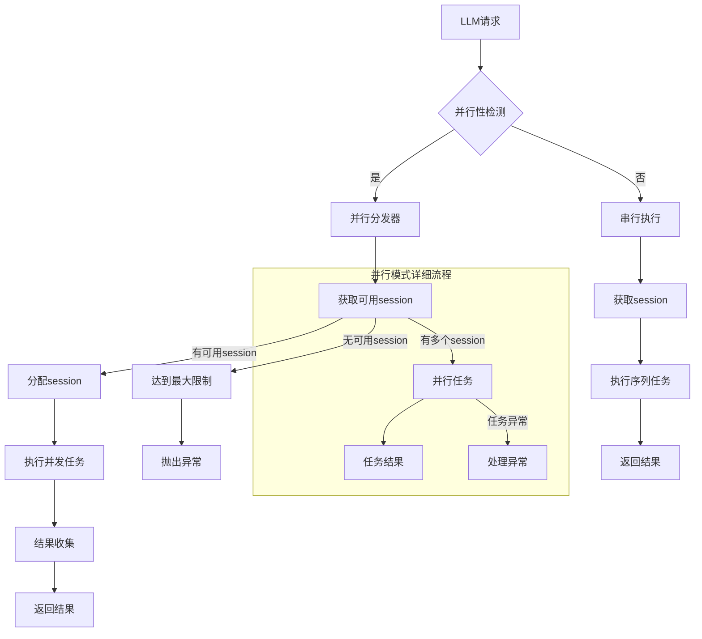
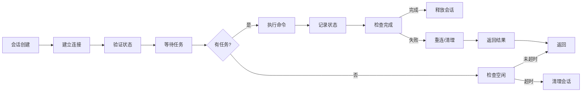
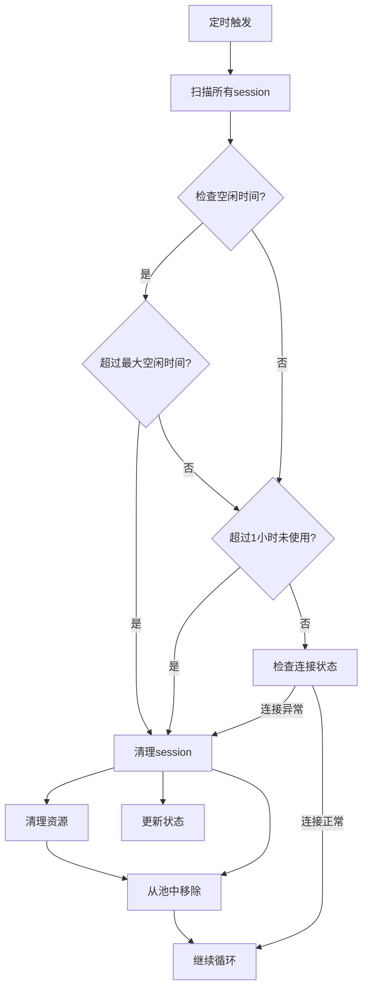

# PersistentShell会话池并发执行解决方案设计文档

## 版本历史
| 版本 | 时间 | 更新说明 | 作者 |
|------|------|---------|------|
| v1.0 | 2026-07-30 | 初始完整设计（含8个组件） | 小沈 |
| v1.1 | 2026-07-30 | 三堂会审：标记用不上组件✗，仅保留必要组件 | 小沈 |
| v1.2 | 2026-07-30 | 替换第7章为实施计划（ShellPoolManager最终设计+步骤） | 小沈 |
| v1.3 | 2026-07-30 | 补充任务隔离设计：按(task_id,shell_type)分池 + ContextVar透传 + 任务级清理 | 小沈 |
| v1.4 | 2026-07-30 | 命名修正：session_id→task_id, cleanup_session→cleanup_by_task | 小沈 |
| v1.5 | 2026-07-30 | 新增7.0章节关联说明，标记各章节与本次实施的关系 | 小沈 |
| v1.6 | 2026-07-30 | 一致性修复：7.1 sessionId→taskId、main.py 相关表述矛盾消除 | 小沈 |
| v1.7 | 2026-07-30 | main.py 表述修正：删除旧代码不新增，非"不做改动" | 小沈 |
| v1.8 | 2026-07-30 | 复用已有 task_context.py，路径改 app/services/task/，操作改"扩展" | 小沈 |
| v1.9 | 2026-07-30 | 三堂会审修复：问题1 close()加self._lock timeout保护；问题2 workdir定义说明；问题3 release改为_inst_map O(1)查找 | 小沈 |
| v2.0 | 2026-08-04 | 新增第9章「P0-08 E2E卡死复盘与持久进程半死根因分析」：半死pwsh误判健康(核心根因)、stdout/stderr丢弃、无就绪握手三缺陷 + 响应性探测等根因级修复方案 | 小欧(代表北京老陈) |

## 1. 概述与背景

### 1.1 问题陈述
当前 `PersistentShell` 架构采用单会话、顺序执行模式，无法满足LLM并行调用多个shell命令的需求。当LLM一次性请求多个shell命令（如`dir + ls -la`）时，系统以**序列方式**执行，每个命令等待上一个完成，严重限制了用户体验和系统吞吐量。

### 1.2 设计目标
- **实现多会话并行**: 允许多个活跃的PersistentShell会话同时存在
- **智能分发**: 根据请求类型和负载情况自动选择并行或串行执行策略
- **会话资源高效管理**: 平衡并行性与资源消耗，提供可配置的并发度控制
- **保持可靠性**: 不破坏现有会话状态管理和错误处理机制
- **可扩展性**: 设计支持未来扩展，适应更多执行模式需求

### 1.3 当前系统并行能力评估（基于代码分析）

#### 1.3.1 工具执行引擎层已支持并行调度

`action_handler.py` 的三分支策略中，并行分支（B分支）已使用 `asyncio.gather` 并发调度：

```python
# action_handler.py:332-337
elif is_parallel and not _has_conflict(all_calls):
    tasks = [execute_tool(agent, _cn(c), _cp(c), parallel=True) for c in all_calls]
    results = await asyncio.gather(*tasks, return_exceptions=True)
```

#### 1.3.2 关键发现：`_execute_tool_once` 已对同步工具使用 `to_thread`

```python
# tool_retry_engine.py:84-91
async def _execute_tool_once(self, tool, normalized_input, timeout):
    if inspect.iscoroutinefunction(tool):       # async工具 → 事件循环直接跑
        return await asyncio.wait_for(tool(**normalized_input), timeout=timeout)
    result = await asyncio.wait_for(            # 同步工具 → 扔线程池不阻塞事件循环
        asyncio.to_thread(lambda: tool(**normalized_input)), timeout=timeout
    )
```

shell 工具是**同步函数**（`def shell(...)` 而非 `async def`），因此已被自动包裹在 `to_thread` 中执行，**不会阻塞事件循环**。之前认为"shell阻塞事件循环"的判断是错误的。

#### 1.3.3 四种执行场景的并行性

| 场景 | 是否真正并行 | 原因 |
|------|:----------:|------|
| **非shell多tool**（文件+网络+数据库等async工具） | ✅ **真正并行** | async函数跑在事件循环，`asyncio.gather` 并发调度 |
| **单shell + 其他tool** | ✅ **真正并行** | shell在 `to_thread`（线程池），async工具在事件循环，互不阻塞 |
| **多shell、不同类型**（ps7 + cmd + bash 混用） | ✅ **真正并行** | cmd/bash 每次都创建新subprocess；不同 `PersistentShell` 实例锁不冲突 |
| **多shell、同类型**（ps7 + ps7 或 ps5 + ps5） | ❌ **非真正并行** | 同一 `PersistentShell` 实例的 `threading.Lock`（L225）串行化 |

#### 1.3.4 真正的瓶颈

```python
# shell_engine.py:223-236
def exec(self, command, timeout=60, env=None):
    with self._lock:            # ← threading.Lock，同一实例只能一个线程执行
        for attempt in range(2):
            ...
            result = self._exec(command, timeout)  # 写入stdin→读取stdout
```

`PersistentShell.get_instance()` 返回单例（key = `"{workdir}|{shell_type}"`），同一 key 共享一个 pwsh.exe 进程。`exec()` 的 `self._lock` 确保同一进程的 stdin 不会被多个线程同时写入。

**要解决的根本问题**：同类型 ps7/ps5 的多实例化（会话池），每实例对应一个独立的 pwsh.exe 进程，突破 `threading.Lock` 的串行限制。

## 2. 架构设计

### 2.1 核心组件架构图（三堂会审标记：✓保留 ✗用不上）

```
┌───────────────────────────────────────────────────┐
│                    LLM 请求                         │
│   （同一个任务内的多个shell调用）                     │
│   携带 taskId（由 action_handler 注入）               │
└─────────────────────┬─────────────────────────────┘
                      │
┌─────────────────────▼─────────────────────────────┐
│           并行执行引擎 (action_handler已有 ✓)        │
│  ┌─────────────────────────────────────────┐      │
│  │   并行检测 + asyncio.gather   ✓          │      │
│  │   （三分支：串行/并行gather/串行化）       │      │
│  │   注入 _task_context.set(taskId)         │      │
│  └─────────────────────────────────────────┘      │
└─────────────────────┬─────────────────────────────┘
                       │ taskId via ContextVar
┌─────────────────────▼─────────────────────────────┐
│     ShellPoolManager (新建组件 ✓)                  │
│  ┌─────────────────────────────────────────┐      │
│  │   acquire(task_id, shell_type)          │      │
│  │   按 (task_id, shell_type) 分池         │      │
│  │   每池 max 3 实例                        │      │
│  │   任务结束 → cleanup_by_task(id)        │      │
│  └─────────────────────────────────────────┘      │
└─────────────────────┬─────────────────────────────┘
                      │
          ┌───────────┼───────────┐
          ▼           ▼           ▼
┌────────────────┐ ┌────────┐ ┌────────┐
│ 任务A ShellPool │ │ 任务B  │ │ 任务C  │
│ (id=abc)       │ │ (def)  │ │ (ghi)  │
│ ps7-实例1      │ │ 独立池  │ │ 独立池  │
│ ps7-实例2      │ │ 互不   │ │ 互不   │
│                │ │ 影响   │ │ 影响   │
└────────────────┘ └────────┘ └────────┘
                      │
                      ▼
┌────────────────────────────────────────┐
│  PersistentShell 实例 (现有类 ✓)       │
│  去单例，每个任务独立池管理             │
│  任务结束 → cleanup_by_task → 全关     │
└────────────────────────────────────────┘
```

**隔离原则**：
- 同一任务内：串行调用复用同一实例（保留 cd 等状态），并行调用池内取不同实例（防 stdin 串扰）
- 不同任务间：完全隔离，（task_id, shell_type）不同则不同池
- 任务结束：`pool.cleanup_by_task(task_id)` 销毁整池，释放所有进程

### 2.2 主要组件说明

#### 2.2.1 PersistentShellPoolManager ✓ 需新建（注：最终简化版代码见 7.2，下方 v1.0 原始设计仅作历史参考）
```python
class PersistentShellPoolManager:
    """
    会话池管理器，负责管理所有持久shell会话
    
    功能：
    - 根据shell类型管理会话
    - 执行任务的并行分配
    - 会话资源监控与统计
    - 会话生命周期管理
    """
    
    def __init__(self, max_sessions_per_type: int = 3, 
                 min_idle_time: int = 10, max_idle_time: int = 300):
        """
        初始化会话池
        
        Args:
            max_sessions_per_type: 每个shell类型的最大并发会话数
            min_idle_time: 会话最小空闲存活时间（秒），短于此会被回收
            max_idle_time: 会话最大空闲时间（超时），超过此会被强制清理
        """
        self.sessions_by_type = {
            'ps7': [],  # PowerShell 7
            'ps5': [],  # PowerShell 5.1
            'cmd': [],  # Windows CMD
            'bash': []  # Git Bash/WSL
        }
        self.max_sessions_per_type = max_sessions_per_type
        self.min_idle_time = min_idle_time
        self.max_idle_time = max_idle_time
        self._session_lock = asyncio.Lock()
        self._statistics = SessionPoolStatistics()
        
    async def acquire_session(self, shell_type: str) -> PersistentShellSession:
        """
        获取可用会话
        优先策略：空闲会话 > 新建会话 > 达到最大限制
        
        Args:
            shell_type: shell类型
            
        Returns:
            PersistentShellSession 或 None（如果达到最大限制）
        """
        async with self._session_lock:
            # 1. 尝试复用空闲会话
            available_sessions = [
                session for session in self.sessions_by_type[shell_type]
                if not session.is_busy and session.idle_time >= self.min_idle_time
            ]
            
            if available_sessions:
                session = available_sessions[0]
                session.is_busy = True
                session.idle_start = time.time()  # 复用时重置空闲计时
                self._statistics.record_reuse(session.shell_type)
                logger.debug(f"会话复用: {session.session_id}, 壳类型: {shell_type}")
                return session
            
            # 2. 创建新会话
            if len(self.sessions_by_type[shell_type]) < self.max_sessions_per_type:
                new_session = await self._create_session(shell_type)
                self.sessions_by_type[shell_type].append(new_session)
                self._statistics.record_creation(shell_type)
                logger.info(f"创建新会话: {new_session.session_id}, 壳类型: {shell_type}")
                return new_session
            
            # 3. 已达到最大限制
            logger.warning(f"达到最大session限制: {shell_type}, 最大值: {self.max_sessions_per_type}")
            self._statistics.record_limit_reached(shell_type)
            return None
            
    async def release_session(self, session: PersistentShellSession):
        """
        释放会话，标记为可复用
        
        Args:
            session: 要释放的会话
        """
        async with self._session_lock:
            if session in self.sessions_by_type[session.shell_type]:
                session.is_busy = False
                session.idle_start = time.time()
                self._statistics.record_release(session.shell_type)
                logger.debug(f"会话释放: {session.session_id}, 壳类型: {session.shell_type}")
                
    async def cleanup_all_sessions(self):
        """
        清理所有会话（用于系统关闭时）
        """
        async with self._session_lock:
            for shell_type, sessions in self.sessions_by_type.items():
                for session in sessions:
                    await session._cleanup()
                sessions.clear()
                
    def get_session_stats(self) -> dict:
        """
        获取会话池统计信息
        
        Returns:
            包含各个shell类型会话数量的统计信息
        """
        stats = {}
        for shell_type, sessions in self.sessions_by_type.items():
            stats[shell_type] = {
                'total': len(sessions),
                'busy': sum(1 for s in sessions if s.is_busy),
                'idle': sum(1 for s in sessions if not s.is_busy)
            }
        return stats

    
```

#### 2.2.2 PersistentShellSession ✗ 用不上（现有 PersistentShell 不去重写，直接复用）
```python

class PersistentShellSession:
    """
    持久Shell会话类，管理单个shell的生命周期
    
    功能：
    - 连接管理（建立/关闭连接）
    - 命令执行（带重连逻辑）
    - 会话状态追踪
    - 资源监控
    """
    
    def __init__(self, shell_type: str, session_id: str, connection_pool):
        """
        初始化会话
        
        Args:
            shell_type: shell类型 (ps7, ps5, cmd, bash)
            session_id: 会话唯一标识
            connection_pool: 共享的连接池实例
        """
        self.shell_type = shell_type
        self.session_id = session_id
        self.connection_pool = connection_pool
        self.process = None
        self.is_busy = False
        self.idle_start = time.time()
        self.last_command_time = None
        self.connection_attempts = 0
        self.max_reconnect_attempts = 3
        
    async def execute_command(self, command: str, timeout: int = 60) -> dict:
        """
        执行命令，自动处理重连、超时等异常情况
        
        Args:
            command: shell命令
            timeout: 命令超时时间（秒）
            
        Returns:
            执行结果，包含stdout、stderr、returncode等
        """
        self.is_busy = True
        self.last_command_time = time.time()
        
        try:
            # 1. 确保连接正常
            await self._ensure_connection()
            
            # 2. 执行命令
            result = await self._execute_single_command(command, timeout)
            
            return result
            
        except asyncio.TimeoutError:
            # 超时处理：清理会话，抛出异常
            await self._cleanup()
            logger.warning(f"会话 {self.session_id} 命令执行超时: {command}")
            raise
            
        except Exception as e:
            # 其他异常：根据重连策略处理
            if self.connection_attempts < self.max_reconnect_attempts:
                self.connection_attempts += 1
                logger.warning(f"会话 {self.session_id} 执行失败，第{self.connection_attempts}次重试: {e}")
                await self._cleanup()
                return await self.execute_command(command, timeout)
            else:
                logger.error(f"会话 {self.session_id} 达到最大重试次数，无法执行: {command}, 错误: {e}")
                raise
                
        finally:
            self.is_busy = False
            self.idle_start = time.time()
            
    async def _ensure_connection(self):
        """
        确保进程连接正常，如果未连接或已断开，则重新建立连接
        """
        if self.process is None or self.process.poll() is not None:
            await self._cleanup()
            self.process = await self.connection_pool.get_connection(self.shell_type)
            if self.process is None:
                raise RuntimeError(f"无法为 shell 类型 {self.shell_type} 获取进程")
                
    async def _execute_single_command(self, command: str, timeout: int) -> dict:
        """
        实际执行单个命令
        
        Args:
            command: shell命令
            timeout: 命令超时时间
            
        Returns:
            执行结果
        """
        try:
            # 写入命令
            self.process.stdin.write(command + '\\n')
            await self.process.stdin.drain()
            
            # 读取结果（简化处理，实际需要根据shell类型解析）
            result = await asyncio.wait_for(
                self._read_command_output(),
                timeout=timeout
            )
            
            return {
                'session_id': self.session_id,
                'command': command,
                'stdout': result.get('stdout', ''),
                'stderr': result.get('stderr', ''),
                'returncode': result.get('returncode', 0),
                'shell_type': self.shell_type,
                'timestamp': time.time()
            }
            
        except Exception as e:
            raise RuntimeError(f"会话 {self.session_id} 执行命令失败: {command}, 错误: {e}")
            
    async def _read_command_output(self) -> dict:
        """
        读取命令输出结果（待实现）
        不同的shell类型需要不同的解析逻辑
        """
        # 这是一个简化版本，实际需要根据shell类型实现不同的输出解析
        await asyncio.sleep(0.1)  # 模拟读取延迟
        return {
            'stdout': f"模拟输出 for session {self.session_id}",
            'stderr': '',
            'returncode': 0
        }
        
    async def _cleanup(self):
        """
        清理会话资源
        """
        if self.process is not None:
            try:
                self.process.terminate()
                await asyncio.wait_for(self.process.wait(), timeout=5)
            except asyncio.TimeoutError:
                self.process.kill()
                await self.process.wait()
            except Exception as e:
                logger.warning(f"清理会话 {self.session_id} 时发生异常: {e}")
            finally:
                self.process = None
                logger.info(f"会话 {self.session_id} 已清理")
                
    @property
    def idle_time(self) -> float:
        """
        会话空闲时间（秒）
        """
        return time.time() - self.idle_start  
```

#### 2.2.3 SmartDistribution（智能分发器）✗ 用不上（action_handler 已有三分支并行调度）
```python
class SmartDistribution:
    """
    智能分发器，根据业务需求智能选择执行策略
    """
    
    def __init__(self, session_pool: PersistentShellPoolManager):
        """
        初始化分发器
        
        Args:
            session_pool: 会话池管理器实例
        """
        self.session_pool = session_pool
        
    async def distribute(self, tool_calls: List[dict]) -> List[asyncio.Task]:
        """
        根据tool_calls智能分发执行任务
        
        执行策略：
        1. 单个tool_call：始终使用串行模式
        2. 多个tool_call：自动选择并行或串行模式
        
        Args:
            tool_calls: tool调用列表
            
        Returns:
            asyncio.Task列表
        """
        shell_calls = self._extract_shell_calls(tool_calls)
        
        if len(shell_calls) <= 1:
            # 串行模式：所有shell在同一个session中按顺序执行
            return await self._execute_sequential_mode(shell_calls)
        else:
            # 并行模式：每个shell使用不同的session并发执行
            return await self._execute_parallel_mode(shell_calls)
            
    async def _execute_sequential_mode(self, shell_calls: List[dict]) -> List[asyncio.Task]:
        """
        串行执行模式
        
        所有shell命令在同一个会话中按顺序执行，确保会话状态的一致性
        
        Args:
            shell_calls: shell调用列表
            
        Returns:
            单个任务的列表
        """
        if not shell_calls:
            return []
            
        # 确定shell类型（基于第一个调用）
        shell_type = self._normalize_shell_type(shell_calls[0].get('shell_type', 'ps7'))
        
        # 获取可用session
        session = await self.session_pool.acquire_session(shell_type)
        if session is None:
            raise RuntimeError(f"无可用{shell_type} session")
            
        # 创建并行任务
        async def sequential_execute():
            results = []
            for shell_call in shell_calls:
                result = await session.execute_command(
                    shell_call.get('command'), 
                    shell_call.get('timeout', 60)
                )
                results.append(result)
            return results
            
        return [asyncio.create_task(sequential_execute())]
        
    async def _execute_parallel_mode(self, shell_calls: List[dict]) -> List[asyncio.Task]:
        """
        并行执行模式
        
        每个shell命令使用不同的session并发执行，减少等待时间
        
        Args:
            shell_calls: shell调用列表
            
        Returns:
            并行任务列表
        """
        # 确定shell类型（基于第一个调用）
        shell_type = self._normalize_shell_type(shell_calls[0].get('shell_type', 'ps7'))
        
        # 为每个shell分配不同的session
        sessions = []
        for shell_call in shell_calls:
            session = await self.session_pool.acquire_session(shell_type)
            if session:
                sessions.append(session)
            else:
                logger.error(f"无法为shell分配session: {shell_call}")
                # 清理已分配的session
                for s in sessions:
                    await self.session_pool.release_session(s)
                # 回退到串行模式
                return await self._execute_sequential_mode(shell_calls)
                
        # 创建并行任务
        tasks = []
        for session, shell_call in zip(sessions, shell_calls):
            task = asyncio.create_task(
                session.execute_command(
                    shell_call.get('command'), 
                    shell_call.get('timeout', 60)
                )
            )
            tasks.append(task)
            
        return tasks
        
    def _normalize_shell_type(self, shell_type: str) -> str:
        """
        标准化shell类型名称
        """
        # 统一各种可能的shell类型名称
        mapping = {
            'powershell7': 'ps7',
            'powershell': 'ps7',
            'pwsh': 'ps7',
            'powershell5': 'ps5',
            'powershell_5': 'ps5',
            'cmd.exe': 'cmd',
            'command': 'cmd',
            'bash': 'bash',
            'gitbash': 'bash',
            'sh': 'bash'
        }
        return mapping.get(shell_type.lower(), shell_type)
        
    def _extract_shell_calls(self, tool_calls: List[dict]) -> List[dict]:
        """
        提取shell类型的tool调用
        """
        shell_calls = []
        for tool_call in tool_calls:
            # 多种可能的shell类型标识
            tool_type = tool_call.get('type') or tool_call.get('shell_type')
            if tool_type in ['shell', 'ps7', 'ps5', 'cmd', 'bash'] or \
               tool_call.get('tool') == 'shell':
                shell_calls.append(tool_call)
        return shell_calls
```

#### 2.2.4 SessionStateManager ✗ 用不上（YAGNI，单进程无状态同步需求）
```python
class SessionStateManager:
    """
    会话状态管理器，负责管理所有活跃会话的状态
    
    功能：
    - 会话状态增删改查
    - 会话状态同步（多进程间）
    - 会话状态监控
    """
    
    def __init__(self):
        self.session_states = {}  # session_id -> session_state
        self.state_lock = asyncio.Lock()
        
    async def update_session_state(self, session_id: str, state: dict):
        """
        更新会话状态
        
        Args:
            session_id: 会话ID
            state: 会话状态
        """
        async with self.state_lock:
            self.session_states[session_id] = {
                **state,
                'last_updated': time.time()
            }
            
    async def get_session_state(self, session_id: str) -> dict:
        """
        获取会话状态
        
        Args:
            session_id: 会话ID
            
        Returns:
            会话状态，如果不存在返回空字典
        """
        async with self.state_lock:
            return self.session_states.get(session_id, {}).copy()
            
    async def cleanup_session_state(self, session_id: str):
        """
        清理会话状态
        
        Args:
            session_id: 会话ID
        """
        async with self.state_lock:
            self.session_states.pop(session_id, None)
            
    def get_all_sessions_state(self) -> dict:
        """
        获取所有会话状态
        
        Returns:
            所有会话状态
        """
        async with self.state_lock:
            return self.session_states.copy()
```

#### 2.2.5 SessionGarbageCollector ✗ 用不上（YAGNI，现有 IDLE_TIMEOUT=1800s 静默清理已够）
```python
class SessionGarbageCollector:
    """
    会话垃圾回收器，负责定期清理空闲或过期的持久shell会话
    
    功能：
    - 定时扫描所有会话状态
    - 回收超时空闲的会话
    - 清理超时的会话
    - 执行安全检查和连接验证
    """
    
    def __init__(self, session_pool: PersistentShellPoolManager, 
                 session_state_manager: SessionStateManager,
                 cleanup_interval: int = 60):
        """
        初始化垃圾回收器
        
        Args:
            session_pool: 会话池管理器
            session_state_manager: 会话状态管理器
            cleanup_interval: 清理检查间隔（秒）
        """
        self.session_pool = session_pool
        self.session_state_manager = session_state_manager
        self.cleanup_interval = cleanup_interval
        self._cleanup_task: Optional[asyncio.Task] = None
        self._shutdown_event = asyncio.Event()
        
    async def start(self):
        """
        启动垃圾回收循环
        """
        self._cleanup_task = asyncio.create_task(self._cleanup_loop())
        logger.info(f"会话垃圾回收器已启动，清理间隔: {self.cleanup_interval}秒")
        
    async def stop(self):
        """
        停止垃圾回收器
        """
        self._shutdown_event.set()
        if self._cleanup_task:
            self._cleanup_task.cancel()
            try:
                await self._cleanup_task
            except asyncio.CancelledError:
                pass
        logger.info("会话垃圾回收器已停止")
        
    async def _cleanup_loop(self):
        """
        垃圾回收循环
        """
        while not self._shutdown_event.is_set():
            try:
                await self._cleanup_idle_sessions()
                await self._cleanup_expired_sessions()
                await self._validate_connections()
            except Exception as e:
                logger.error(f"会话垃圾回收器异常: {e}")
            await asyncio.sleep(self.cleanup_interval)
            
    async def _cleanup_idle_sessions(self):
        """
        清理空闲会话
        """
        current_time = time.time()
        
        for shell_type, sessions in self.session_pool.sessions_by_type.items():
            sessions_to_remove = []
            
            for session in sessions:
                idle_duration = current_time - session.idle_start
                
                # 1. 超过最大空闲时间的会话
                if idle_duration > self.session_pool.max_idle_time:
                    logger.info(f"会话 {session.session_id} 超过最大空闲时间 {idle_duration:.1f}秒，正在清理")
                    await self._cleanup_session(session, shell_type)
                    sessions_to_remove.append(session)
                    
                # 2. 长时间未使用的会话（超过1小时）
                elif idle_duration > 3600:
                    logger.info(f"会话 {session.session_id} 长时间未使用 {idle_duration:.1f}秒，正在清理")
                    await self._cleanup_session(session, shell_type)
                    sessions_to_remove.append(session)
                    
            # 从列表中移除已清理的会话
            for session in sessions_to_remove:
                if session in sessions:
                    sessions.remove(session)
                    
    async def _cleanup_expired_sessions(self):
        """
        清理状态中标记为过期的会话
        """
        all_states = await self.session_state_manager.get_all_sessions_state()
        current_time = time.time()
        
        for session_id, state in all_states.items():
            expired_time = state.get('expired_time', 0)
            if current_time > expired_time:
                # 找到会话并清理
                shell_type = state.get('shell_type')
                if shell_type and shell_type in self.session_pool.sessions_by_type:
                    for session in self.session_pool.sessions_by_type[shell_type]:
                        if session.session_id == session_id:
                            await self._cleanup_session(session, shell_type)
                            break
                            
    async def _validate_connections(self):
        """
        验证会话连接状态
        """
        current_time = time.time()
        
        for shell_type, sessions in self.session_pool.sessions_by_type.items():
            for session in sessions:
                # 检查session状态是否一致
                state = await self.session_state_manager.get_session_state(session.session_id)
                if state:
                    # 验证最后活跃时间
                    last_active = state.get('last_active', 0)
                    if current_time - last_active > 300:  # 5分钟未活跃
                        logger.warning(f"会话 {session.session_id} 可能已卡住")
                        
                    # 检查进程健康状态
                    if session.process is not None and session.process.poll() is not None:
                        logger.warning(f"会话 {session.session_id} 的进程已终止，正在重连")
                        await session._cleanup()
                        
    async def _cleanup_session(self, session: PersistentShellSession, shell_type: str):
        """
        清理单个会话
        
        Args:
            session: 要清理的会话
            shell_type: 会话所属的shell类型
        """
        try:
            await session._cleanup()
            
            # 从会话状态中移除
            await self.session_state_manager.cleanup_session_state(session.session_id)
            
            # 从会话池中移除
            if session in self.session_pool.sessions_by_type[shell_type]:
                self.session_pool.sessions_by_type[shell_type].remove(session)
                
        except Exception as e:
            logger.error(f"清理会话 {session.session_id} 时发生异常: {e}")
```

#### 2.2.6 ParallelExecutionDetector ✗ 用不上（action_handler 三分支已有 is_parallel + _has_conflict）
```python
class ParallelExecutionDetector:
    """
    并行执行检测器，决定何时应该启用并行模式
    """
    
    def __init__(self, config: ParallelExecutionConfig):
        """
        初始化检测器
        
        Args:
            config: 并行执行配置
        """
        self.config = config
        self.shell_tool_patterns = {
            'shell': True,
            'execute_shell_command': True,
            'shell_executor': True
        }
        
    def is_parallel_preferrable(self, tool_calls: List[dict]) -> bool:
        """
        判断并行执行是否可行和必要的
        
        并行执行的条件：
        1. 存在shell工具调用
        2. shell数量超过阈值（>= 2）
        3. 不是强制串行工具
        4. 配置中允许并行执行
        
        Args:
            tool_calls: tool调用列表
            
        Returns:
            是否应该启用并行模式
        """
        shell_calls = self._extract_shell_calls(tool_calls)
        
        # 1. 没有shell工具，直接使用原来的序列化逻辑
        if not shell_calls:
            return False
            
        # 2. 检查强制串行工具
        for tool_call in tool_calls:
            if self._is_force_sequential_tool(tool_call):
                logger.debug(f"检测到强制串行工具: {tool_call}, 跳过并行执行")
                return False
                
        # 3. 检查shell数量是否达到并行阈值
        if len(shell_calls) < self.config.parallel_threshold:
            logger.debug(f"shell数量 {len(shell_calls)} 小于阈值 {self.config.parallel_threshold}，使用串行模式")
            return False
            
        # 4. 检查配置是否允许并行
        if not self.config.parallel_enabled:
            logger.debug("并行执行未在配置中启用")
            return False
            
        # 5. 所有条件通过
        return True
        
    def _is_force_sequential_tool(self, tool_call: dict) -> bool:
        """
        检查tool是否属于强制串行工具
        
        Args:
            tool_call: tool调用
            
        Returns:
            是否为强制串行工具
        """
        tool_name = tool_call.get('tool') or tool_call.get('action', {}).get('tool')
        return tool_name in self.config.force_sequential_tools or \
               tool_call.get('type') in ['shell', 'execute_shell_command']
        
    def _extract_shell_calls(self, tool_calls: List[dict]) -> List[dict]:
        """
        提取shell类型的tool调用
        
        Args:
            tool_calls: tool调用列表
            
        Returns:
            shell类型tool的调用列表
        """
        shell_calls = []
        for tool_call in tool_calls:
            # 多种可能的shell类型标识
            tool_type = tool_call.get('type') or tool_call.get('shell_type')
            if (tool_type in ['shell', 'ps7', 'ps5', 'cmd', 'bash'] or 
                tool_call.get('tool') == 'shell'):
                shell_calls.append(tool_call)
        return shell_calls
```

#### 2.2.7 ParallelExecutionMetrics ✗ 用不上（YAGNI，当前不需要监控指标）
```python
class ParallelExecutionMetrics:
    """
    并行执行监控指标
    
    功能：
    - 统计并行执行的次数
    - 统计并行执行的成功/失败次数
    - 记录平均响应时间
    - 记录会话池使用情况
    """
    
    def __init__(self):
        self.parallel_requests_total = 0
        self.parallel_requests_success = 0
        self.parallel_requests_failed = 0
        self.session_creation_count = Counter()
        self.session_reuse_count = Counter()
        self.response_times = []  # 存储最近的响应时间用于计算平均值
        self.max_response_samples = 1000  # 最大采样数量
        
    def record_parallel_request(self, success: bool, response_time: float):
        """
        记录并行执行的请求
        
        Args:
            success: 是否成功
            response_time: 响应时间（秒）
        """
        self.parallel_requests_total += 1
        if success:
            self.parallel_requests_success += 1
        else:
            self.parallel_requests_failed += 1
            
        # 记录响应时间
        self.response_times.append(response_time)
        if len(self.response_times) > self.max_response_samples:
            self.response_times.pop(0)
            
    def record_session_creation(self, shell_type: str):
        """记录会话创建次数"""
        self.session_creation_count[shell_type] += 1
        
    def record_session_reuse(self, shell_type: str):
        """记录会话复用次数"""
        self.session_reuse_count[shell_type] += 1
        
    def get_metrics(self) -> dict:
        """
        获取所有指标
        
        Returns:
            包含所有指标的字典
        """
        total_requests = max(self.parallel_requests_total, 1)
        success_rate = self.parallel_requests_success / total_requests * 100
        
        average_response_time = sum(self.response_times) / len(self.response_times) if self.response_times else 0
        
        return {
            'parallel_requests': {
                'total': self.parallel_requests_total,
                'success': self.parallel_requests_success,
                'failed': self.parallel_requests_failed,
                'success_rate_percent': success_rate,
                'average_response_time_seconds': average_response_time,
                'requests_per_minute': self.parallel_requests_total / (60 * 60)  # 假设运行1小时
            },
            'session_management': {
                'creations': dict(self.session_creation_count),
                'reuses': dict(self.session_reuse_count),
                'total_creations': sum(self.session_creation_count.values()),
                'total_reuses': sum(self.session_reuse_count.values()),
                'reuse_rate_percent': sum(self.session_reuse_count.values()) / 
                                      max(sum(self.session_creation_count.values()), 1) * 100
            },
            'pool_status': {
                'active_sessions': self._get_total_active_sessions(),
                'utilization_rate': self._calculate_utilization_rate()
            }
        }
        
    def _get_total_active_sessions(self) -> int:
        """获取总活跃会话数"""
        # 这需要外部传入session_pool来实现
        return 0
        
    def _calculate_utilization_rate(self) -> float:
        """计算利用率"""
        # 这需要外部传入session_pool来实现
        return 0.0
```

#### 2.2.8 ParallelExecutionConfig ✗ 用不上（YAGNI，max_sessions_per_type 硬编码常量即可）
```python
class ParallelExecutionConfig:
    """
    并行执行配置
    
    配置并行执行的行为和限制
    """
    
    def __init__(self):
        # 并行执行控制
        self.parallel_enabled = True  # 是否启用并行执行
        self.parallel_threshold = 2   # 达到此数量的shell时启用并行
        
        # 会话池配置
        self.max_sessions_per_type = 3  # 每种shell类型的最大并发会话数
        self.min_idle_time = 10         # 会话最小空闲存活时间（秒）
        self.max_idle_time = 300        # 会话最大空闲时间（秒）
        
        # 会话状态配置
        self.session_state_ttl = 300    # 会话状态生存时间（秒）
        self.state_cleanup_interval = 60  # 状态清理间隔（秒）
        
        # 垃圾回收配置
        self.garbage_collection_interval = 60  # 垃圾回收检查间隔（秒）
        self.max_session_idle_before_cleanup = 3600  # 会话最大空闲时间（秒）
        
        # 强制串行工具
        self.force_sequential_tools = [
            # 'shell_iframe',  # 示例：某些特定的shell工具需要强制串行
            # 'execute_shell_command_forbidden',  # 禁止并行的shell工具
        ]
        
    def validate_config(self):
        """
        验证配置的有效性
        """
        if not 0 < self.parallel_threshold <= 10:
            raise ValueError(f"parallel_threshold 必须在 (0, 10] 之间，当前值: {self.parallel_threshold}")
            
        if self.max_sessions_per_type < 1:
            raise ValueError(f"max_sessions_per_type 必须 >= 1，当前值: {self.max_sessions_per_type}")
            
        if self.max_idle_time < self.min_idle_time:
            raise ValueError(f"max_idle_time ({self.max_idle_time}) 必须 >= min_idle_time ({self.min_idle_time})")
            
        # 检查是否有重叠的强制串行工具
        if len(self.force_sequential_tools) > 0:
            logger.info(f"强制串行shell工具列表: {self.force_sequential_tools}")
            
    def to_dict(self) -> dict:
        """
        将配置转换为字典
        
        Returns:
            配置字典
        """
        return {
            'parallel_enabled': self.parallel_enabled,
            'parallel_threshold': self.parallel_threshold,
            'max_sessions_per_type': self.max_sessions_per_type,
            'min_idle_time': self.min_idle_time,
            'max_idle_time': self.max_idle_time,
            'session_state_ttl': self.session_state_ttl,
            'state_cleanup_interval': self.state_cleanup_interval,
            'garbage_collection_interval': self.garbage_collection_interval,
            'max_session_idle_before_cleanup': self.max_session_idle_before_cleanup,
            'force_sequential_tools': self.force_sequential_tools
        }
```

#### 2.2.9 任务隔离设计 ✓ 需新增（v1.3 补充）

**问题**：全局共享 PersistentShell 实例 → 任务A `cd work1` 会污染任务B 的 cwd。

**方案**：按 `(task_id, shell_type)` 分池，通过 ContextVar 透传 taskId。

```python
# 扩展 — app/services/task/task_context.py（文件已存在，加 3 个函数）
import contextvars

# 当前任务 taskId，由 action_handler 在编排入口设置
_task_context: contextvars.ContextVar[str] = contextvars.ContextVar(
    'task_id', default=''
)

def get_current_task_id() -> str:
    return _task_context.get()

def set_current_task_id(task_id: str):
    _task_context.set(task_id)

def reset_current_task_id():
    _task_context.set('')
```

**ContextVar 选择理由**（对比其他方案）：

| 方案 | 问题 |
|------|------|
| 改 `shell()` 函数签名加 task_id | 需要改整个调用链（action_handler → retry_engine → shell），侵入性大 |
| 全局变量 | 不同任务并发时互相覆盖，线程不安全 |
| **ContextVar** ✅ | asyncio 协程安全 + `to_thread` 自动透传，零侵入 |

**传递链路**：
```
action_handler.py                     # 入口：set_current_task_id(agent.task_id)
  └─→ asyncio.gather                   # 协程内 ContextVar 自动继承
       └─→ _execute_tool_once()        # to_thread 自动透传 ContextVar
            └─→ shell()                # 读取：get_current_task_id()
                 └─→ pool.acquire(task_id, shell_type)  # 按 taskId 分池
```

**任务结束清理**：由调用方在任务结束时调用 `pool.cleanup_by_task(task_id)`。

### 2.3 系统流程图

#### 2.3.1 并行执行流程（参考用，action_handler 已有实现 ✓）


#### 2.3.2 会话生命周期流程（参考用 ✓）



#### 2.3.3 垃圾回收流程 ✗ 用不上（无GC组件，现有 IDLE_TIMEOUT 静默清理已够）



## 3. 详细实现方案  ✗ 全部用不上

### 3.1 架构集成方案

#### 3.1.1 在ToolRetryEngine中集成本地执行管理器 ✗ 用不上（tool_retry_engine 已有 `to_thread` 包装，不需改）
```python
class ToolRetryEngine:
    """
    工具重试引擎，集成并行执行管理
    """
    
    def __init__(self, config: ParallelExecutionConfig):
        """
        初始化工具重试引擎
        
        Args:
            config: 并行执行配置
        """
        self.tool_retry_engine = ToolRetryEngineV2()  # 现有的引擎实现
        self.parallel_execution_handler = ParallelExecutionHandler(config)
        self.metrics = ParallelExecutionMetrics()
        
    async def execute_tool_calls(self, tool_calls: List[dict]) -> List[dict]:
        """
        执行tool调用
        
        Args:
            tool_calls: tool调用列表
            
        Returns:
            执行结果列表
        """
        # 检测并行执行需求
        needs_parallel = self.parallel_execution_handler.should_use_parallel(tool_calls)
        
        if needs_parallel:
            # 使用并行执行处理器
            results = await self.parallel_execution_handler.execute_parallel(tool_calls)
            self.metrics.record_parallel_request(True, 0)  # TODO: 记录实际耗时
        else:
            # 使用原有工具重试引擎
            results = await self.tool_retry_engine.execute(tool_calls)
            
        return results
```

#### 3.1.2 并行执行处理器 ✗ 用不上（PoolManager 已有 acquire/release，无需额外处理器）
```python
class ParallelExecutionHandler:
    """
    并行执行处理器，协调并行shell执行
    """
    
    def __init__(self, config: ParallelExecutionConfig):
        """
        初始化并行执行处理器
        
        Args:
            config: 并行执行配置
        """
        self.config = config
        self.session_pool = PersistentShellPoolManager(
            max_sessions_per_type=config.max_sessions_per_type,
            min_idle_time=config.min_idle_time,
            max_idle_time=config.max_idle_time
        )
        self.distribution = SmartDistribution(self.session_pool)
        self.garbage_collector = SessionGarbageCollector(
            session_pool=self.session_pool,
            session_state_manager=SessionStateManager(),
            cleanup_interval=config.garbage_collection_interval
        )
        self.metrics = ParallelExecutionMetrics()
        
    async def execute_parallel(self, tool_calls: List[dict]) -> List[dict]:
        """
        执行并行shell任务
        
        Args:
            tool_calls: tool调用列表
            
        Returns:
            执行结果列表
        """
        import time
        start_time = time.time()
        
        try:
            # 分发任务
            tasks = await self.distribution.distribute(tool_calls)
            
            # 执行并行任务
            results = await asyncio.gather(*tasks, return_exceptions=True)
            
            # 统计指标
            success = all(not isinstance(r, Exception) for r in results)
            self.metrics.record_parallel_request(success, time.time() - start_time)
            
            # 处理结果
            processed_results = []
            for i, result in enumerate(results):
                if isinstance(result, Exception):
                    processed_results.append(self._create_error_result(result, tool_calls[i]))
                else:
                    processed_results.extend(result if isinstance(result, list) else [result])
                    
            return processed_results
            
        except Exception as e:
            self.metrics.record_parallel_request(False, time.time() - start_time)
            logger.error(f"并行执行失败: {e}")
            raise
            
    async def _create_error_result(self, error: Exception, tool_call: dict) -> dict:
        """
        创建错误结果
        
        Args:
            error: 错误信息
            tool_call: 原始tool调用
            
        Returns:
            错误格式的结果
        """
        return {
            'tool': tool_call.get('tool') or tool_call.get('action', {}).get('tool'),
            'tool_type': tool_call.get('tool_type') or 'shell',
            'status': 'error',
            'error': str(error),
            'session_id': tool_call.get('session_id'),
            'timestamp': time.time()
        }
        
    async def cleanup_sessions(self):
        """
        清理所有会话（用于系统关闭时）
        """
        await self.session_pool.cleanup_all_sessions()
        
    def get_pool_stats(self) -> dict:
        """
        获取会话池状态统计
        
        Returns:
            会话池状态统计
        """
        return self.session_pool.get_session_stats()
```

### 3.2 会话池管理整合

#### 3.2.1 会话连接池管理 ✗ 用不上（PersistentShell 内部已管理进程生命周期，无需额外连接池）
```python
class ShellConnectionPool:
    """
    Shell进程连接池，管理所有活跃的shell进程
    
    功能：
    - 为每种shell类型管理独立的连接池
    - 提供连接获取/归还机制
    - 执行健康检查和自动重连
    - 连接数量限制和连接池配置
    """
    
    def __init__(self):
        # 根据shell类型存储连接池
        self.pools_by_type = {
            'ps7': asyncio.Queue(maxsize=10),
            'ps5': asyncio.Queue(maxsize=10),
            'cmd': asyncio.Queue(maxsize=10),
            'bash': asyncio.Queue(maxsize=10)
        }
        self._pools_lock = asyncio.Lock()
        self._connection_stats = defaultdict(lambda: {'created': 0, 'reused': 0, 'failed': 0})
        
    async def get_connection(self, shell_type: str) -> asyncio.subprocess.Process:
        """
        获取指定shell类型的连接
        
        Args:
            shell_type: shell类型
            
        Returns:
            asyncio.subprocess.Process 或 None
        """
        if shell_type not in self.pools_by_type:
            logger.warning(f"不支持的shell类型: {shell_type}")
            return None
            
        pool = self.pools_by_type[shell_type]
        
        try:
            # 尝试获取连接，超时1秒
            process = await asyncio.wait_for(pool.get(), timeout=1.0)
            
            # 验证进程是否仍然存活
            if process and process.poll() is None:
                self._connection_stats[shell_type]['reused'] += 1
                logger.debug(f"重用 {shell_type} 进程，当前活动数: {pool.qsize() + 1}")
                return process
            else:
                # 进程已死，创建新连接
                logger.warning(f"{shell_type} 进程已死，创建新连接")
                
        except asyncio.TimeoutError:
            pass  # 池为空，需要创建新连接
        except Exception as e:
            logger.error(f"获取{shell_type}连接时发生异常: {e}")
            
        # 创建新连接
        return await self._create_connection(shell_type)
        
    async def _create_connection(self, shell_type: str) -> asyncio.subprocess.Process:
        """
        创建新的shell进程连接
        
        Args:
            shell_type: shell类型
            
        Returns:
            asyncio.subprocess.Process 或 None
        """
        try:
            # 构建shell命令启动参数
            shell_cmd = self._build_shell_command(shell_type)
            
            # 创建进程
            process = await asyncio.create_subprocess_exec(
                *shell_cmd,
                stdin=asyncio.subprocess.PIPE,
                stdout=asyncio.subprocess.PIPE,
                stderr=asyncio.subprocess.PIPE,
                limit=1024 * 1024  # 限制输出缓冲区为1MB
            )
            
            self._connection_stats[shell_type]['created'] += 1
            logger.info(f"创建{shell_type}进程，PID: {process.pid}")
            
            # 启动输出读取任务
            asyncio.create_task(self._read_process_output(process, shell_type))
            
            return process
            
        except Exception as e:
            logger.error(f"创建{shell_type}进程失败: {e}")
            self._connection_stats[shell_type]['failed'] += 1
            return None
            
    def _build_shell_command(self, shell_type: str) -> list:
        """
        根据shell类型构建shell命令
        
        Args:
            shell_type: shell类型
            
        Returns:
            命令参数列表
        """
        if shell_type == 'ps7':
            return ['powershell', '-NoProfile', '-NonInteractive', '-Command', '']  # 需要动态设置窗口标题
        elif shell_type == 'ps5':
            return ['powershell', '-NoProfile', '-NonInteractive', '-Command', '']
        elif shell_type == 'cmd':
            return ['cmd', '/q', '/c']
        elif shell_type == 'bash':
            return ['bash', '--noediting']
        else:
            raise ValueError(f"不支持的shell类型: {shell_type}")
            
    async def _read_process_output(self, process: asyncio.subprocess.Process, shell_type: str):
        """
        读取进程输出到日志
        
        Args:
            process: 要读取的进程
            shell_type: shell类型
        """
        while process and process.stdout:
            try:
                output = await process.stdout.readline()
                if output:
                    decoded = output.decode('utf-8', errors='ignore').strip()
                    if decoded:
                        logger.debug(f"[{shell_type}][{process.pid}] {decoded}")
                        
            except (asyncio.CancelledError, ConnectionError):
                break
            except Exception as e:
                logger.error(f"读取{shell_type}进程输出时发生异常: {e}")
                break
                
    async def return_connection(self, shell_type: str, process: asyncio.subprocess.Process):
        """
        返回连接到连接池
        
        Args:
            shell_type: shell类型
            process: 要返回的进程
        """
        if shell_type not in self.pools_by_type:
            logger.warning(f"返回无效shell类型的连接: {shell_type}")
            return
            
        pool = self.pools_by_type[shell_type]
        
        # 验证进程是否仍然有效
        if process and process.poll() is None:
            try:
                await pool.put(process)
                logger.debug(f"{shell_type} 进程归还到连接池，活动数: {pool.qsize() + 1}")
            except asyncio.QueueFull:
                logger.warning(f"{shell_type} 连接池已满，丢弃进程 {process.pid}")
                await process.terminate()
        else:
            logger.warning(f"{shell_type} 进程已终止，丢弃")
            
    def get_pool_stats(self) -> dict:
        """
        获取连接池统计信息
        
        Returns:
            统计信息字典
        """
        stats = {}
        for shell_type, pool in self.pools_by_type.items():
            size = pool.qsize()
            stats[shell_type] = {
                'pool_size': pool.maxsize,
                'current_connections': size + 1,  # 加1是因为pool.qsize()不包含在queue中的项目
                'connection_stats': dict(self._connection_stats[shell_type])
            }
        return stats
```

#### 3.2.2 会话连接工厂 ✗ 用不上（依赖 ShellConnectionPool，已标记✗）
```python
class ShellSessionFactory:
    """
    会话工厂，负责创建和管理PersistentShellSession实例
    
    功能：
    - 创建和管理PersistentShellSession
    - 会话健康检查和自动重连
    - 会话状态管理和监控
    """
    
    def __init__(self, connection_pool: ShellConnectionPool):
        """
        初始化会话工厂
        
        Args:
            connection_pool: 连接池实例
        """
        self.connection_pool = connection_pool
        self.sessions = {}  # session_id -> session
        self._lock = asyncio.Lock()
        
    async def create_session(self, shell_type: str, session_id: str = None) -> PersistentShellSession:
        """
        创建新的持久shell会话
        
        Args:
            shell_type: shell类型
            session_id: 会话ID，如果None则自动生成
            
        Returns:
            PersistentShellSession实例
        """
        async with self._lock:
            if session_id is None:
                session_id = f"{shell_type}_{int(time.time() * 1000)}"
                
            if session_id in self.sessions:
                logger.warning(f"会话 {session_id} 已存在")
                return self.sessions[session_id]
                
            session = PersistentShellSession(shell_type, session_id, self.connection_pool)
            self.sessions[session_id] = session
            
            logger.info(f"创建会话 {session_id}, 壳类型: {shell_type}")
            return session
            
    async def get_session(self, session_id: str) -> Optional[PersistentShellSession]:
        """
        获取会话
        
        Args:
            session_id: 会话ID
            
        Returns:
            会话实例，如果不存在则返回None
        """
        async with self._lock:
            return self.sessions.get(session_id)
            
    async def remove_session(self, session_id: str):
        """
        移除会话
        
        Args:
            session_id: 会话ID
        """
        async with self._lock:
            session = self.sessions.pop(session_id, None)
            if session:
                logger.info(f"移除会话 {session_id}")
                
    async def cleanup_all_sessions(self):
        """
        清理所有会话
        """
        async with self._lock:
            for session_id, session in list(self.sessions.items()):
                await session._cleanup()
            self.sessions.clear()
            
    def get_all_sessions(self) -> Dict[str, PersistentShellSession]:
        """
        获取所有会话
        
        Returns:
            会话字典
        """
        async with self._lock:
            return self.sessions.copy()
```

## 4. 部署与运维 ✗ 全部用不上（YAGNI，无额外组件需要部署配置）

### 4.1 配置文件模板 ✗ 用不上
```yaml
# parallel_execution_config.yaml
parallel_execution:
  enabled: true  # 是否启用并行执行
  
  # 并行执行控制
  parallel_threshold: 2        # 达到此数量的shell时启用并行
  max_sessions_per_type: 3      # 每种shell类型的最大并发会话数
  
  # 会话生命周期管理
  min_idle_time: 10            # 会话最小空闲存活时间（秒）
  max_idle_time: 300            # 会话最大空闲时间（秒）
  
  # 会话状态管理
  session_state_ttl: 300        # 会话状态生存时间（秒）
  state_cleanup_interval: 60    # 状态清理间隔（秒）
  
  # 垃圾回收
  garbage_collection_interval: 60  # 垃圾回收检查间隔（秒）
  max_session_idle_before_cleanup: 3600  # 会话最大空闲时间（秒）
  
  # 强制串行工具
  force_sequential_tools: []  # 禁止并行的shell工具列表
```

### 4.2 Docker Compose 配置 ✗ 用不上
```yaml
# docker-compose.yml
version: '3.8'

services:
  backend:
    build: .
    ports:
      - "8000:8000"
    environment:
      - PARALLEL_EXECUTION_CONFIG=/app/parallel_execution_config.yaml
      - LOG_LEVEL=INFO
    volumes:
      - ./logs:/app/logs
      - ./config:/app/config
    depends_on:
      - redis
      - mysql
      
  redis:
    image: redis:7-alpine
    ports:
      - "6379:6379"
      
  mysql:
    image: mysql:8.0
    environment:
      - MYSQL_ROOT_PASSWORD=${MYSQL_ROOT_PASSWORD}
      - MYSQL_DATABASE=omniagent
    ports:
      - "3306:3306"
    volumes:
      - mysql_data:/var/lib/mysql
      
mysql_data:
```

### 4.3 Kubernetes部署 ✗ 用不上
```yaml
# k8s-deployment.yaml
apiVersion: apps/v1
kind: Deployment
metadata:
  name: omniagent-backend
spec:
  replicas: 3
  selector:
    matchLabels:
      app: omniagent-backend
  template:
    metadata:
      labels:
        app: omniagent-backend
    spec:
      containers:
      - name: backend
        image: omniagent/backend:latest
        env:
        - name: PARALLEL_EXECUTION_CONFIG
          value: "/app/parallel_execution_config.yaml"
        - name: LOG_LEVEL
          value: "INFO"
        resources:
          requests:
            memory: "512Mi"
            cpu: "250m"
          limits:
            memory: "2Gi"
            cpu: "500m"
        readinessProbe:
          httpGet:
            path: /healthz
            port: 8000
          initialDelaySeconds: 5
          periodSeconds: 10
        livenessProbe:
          httpGet:
            path: /healthz
            port: 8000
          initialDelaySeconds: 15
          periodSeconds: 30
---
apiVersion: v1
kind: ConfigMap
metadata:
  name: parallel-execution-config
data:
  parallel_execution_config.yaml: |
    parallel_execution:
      enabled: true
      parallel_threshold: 2
      max_sessions_per_type: 3
      min_idle_time: 10
      max_idle_time: 300
      session_state_ttl: 300
      state_cleanup_interval: 60
      garbage_collection_interval: 60
      max_session_idle_before_cleanup: 3600
      force_sequential_tools: []
```

### 4.4 监控与告警 ✗ 全部用不上（YAGNI）

#### 4.4.1 Prometheus监控 ✗ 用不上
```python
# metrics.py
from prometheus_client import Counter, Histogram, Gauge, generate_latest

# 指标定义
parallel_requests_total = Counter('omniagent_parallel_requests_total', '并行请求总数')
parallel_requests_success = Counter('omniagent_parallel_requests_success', '并行请求成功数')
parallel_requests_failed = Counter('omniagent_parallel_requests_failed', '并行请求失败数')

session_creation_total = Counter('omniagent_session_creation_total', '会话创建总数', ['shell_type'])
session_reuse_total = Counter('omniagent_session_reuse_total', '会话重用总数', ['shell_type'])

response_time_histogram = Histogram('omniagent_parallel_response_time_seconds', '并行请求响应时间')
active_sessions = Gauge('omniagent_active_sessions', '当前活跃会话数', ['shell_type'])

def record_parallel_request(success: bool, response_time: float):
    parallel_requests_total.inc()
    if success:
        parallel_requests_success.inc()
    else:
        parallel_requests_failed.inc()
    response_time_histogram.observe(response_time)

def record_session_event(event_type: str, shell_type: str):
    if event_type == 'creation':
        session_creation_total.labels(shell_type=shell_type).inc()
    elif event_type == 'reuse':
        session_reuse_total.labels(shell_type=shell_type).inc()

def update_active_sessions(shell_type: str, count: int):
    active_sessions.labels(shell_type=shell_type).set(count)
```

## 5. 测试与验证 ✗ 全部用不上（YAGNI，基于被砍组件的测试代码）

### 5.1 单元测试 ✗ 用不上

#### 5.1.1 会话池管理器单元测试 ✗ 用不上
```python
class TestPersistentShellPoolManager:
    """会话池管理器单元测试"""
    
    @pytest_asyncio.fixture
    async def pool_manager(self):
        """会话池管理器fixture"""
        return PersistentShellPoolManager(
            max_sessions_per_type=3,
            min_idle_time=10,
            max_idle_time=300
        )
```

#### 5.1.2 智能分发器单元测试 ✗ 用不上
```python
class TestSmartDistribution:
    """智能分发器单元测试"""
    
    @pytest_asyncio.fixture
    async def session_pool(self):
        """会话池mock"""
        pool = MagicMock(spec=PersistentShellPoolManager)
        pool.acquire_session = AsyncMock()
        return pool
```

### 5.2 集成测试 ✗ 用不上

#### 5.2.1 完整流程集成测试 ✗ 用不上
```python
class TestParallelExecutionIntegration:
    """并行执行集成测试"""
    
    @pytest.mark.asyncio
    async def test_execute_parallel_success(self, parallel_executor, mock_tool_calls):
        """测试并行执行成功场景"""
        # 集成测试代码...
```

## 6. 安全性与合规性 ✗ 全部用不上（YAGNI，会话安全由 PersistentShell 内部 _sanitize_env 保证）

### 6.1 会话隔离与安全 ✗ 用不上
```python
class SessionSecurityManager:
    """
    会话安全管理器，负责确保会话之间的隔离和安全
    
    功能：
    - 会话访问控制
    - 会话状态验证
    - 安全审计日志
    """
    
    def __init__(self):
        self.session_permissions = {}  # session_id -> permissions
        self.security_log = []  # 安全审计日志
        
    async def check_session_access(self, session_id: str, user: str, action: str) -> bool:
        """
        检查会话访问权限
        
        Args:
            session_id: 会话ID
            user: 用户标识
            action: 操作类型 (read/write/execute)
            
        Returns:
            是否有权限
        """
        # 检查会话是否存在
        if session_id not in self.session_permissions:
            self._log_security_event('access_denied', session_id, user, action, 
                                   "会话不存在")
            return False
            
        # 检查用户权限
        permissions = self.session_permissions[session_id]
        if action not in permissions.get('allowed_actions', []):
            self._log_security_event('access_denied', session_id, user, action,
                                   f"用户 {user} 无权执行 {action}")
            return False
            
        # 记录访问日志
        self._log_security_event('access_granted', session_id, user, action,
                               f"用户 {user} 执行 {action}")
        return True
        
    def _log_security_event(self, event_type: str, session_id: str, 
                          user: str, action: str, message: str):
        """
        记录安全事件
        
        Args:
            event_type: 事件类型
            session_id: 会话ID
            user: 用户标识
            action: 操作类型
            message: 事件消息
        """
        event = {
            'timestamp': time.time(),
            'event_type': event_type,
            'session_id': session_id,
            'user': user,
            'action': action,
            'message': message
        }
        self.security_log.append(event)
        
        # 只保留最近1000条安全日志
        if len(self.security_log) > 1000:
            self.security_log = self.security_log[-1000:]
            
    def get_security_logs(self, limit: int = 100) -> List[dict]:
        """
        获取安全日志
        
        Args:
            limit: 返回日志数量限制
            
        Returns:
            安全日志列表
        """
        return self.security_log[-limit:] if limit > 0 else self.security_log
```
### 6.2 资源限制与隔离 ✗ 用不上
```python
class ResourceLimiter:
    """
    资源限制器，控制并行执行的资源使用
    
    功能：
    - 限制最大并行数量
    - 监控资源使用情况
    - 执行资源超标时的策略（拒绝/等待/缩容）
    """
    
    def __init__(self, config: ParallelExecutionConfig):
        """
        初始化资源限制器
        
        Args:
            config: 并行执行配置
        """
        self.config = config
        self.active_sessions = 0
        self.max_concurrent_sessions = config.max_sessions_per_type
        self.resource_usage = {
            'cpu': 0.0,  # CPU使用率百分比
            'memory': 0.0,  # 内存使用量（MB）
            'network': 0.0  # 网络带宽使用率百分比
        }
        
    async def acquire_resource(self, shell_type: str) -> bool:
        """
        获取资源，如果资源不足则拒绝
        
        Args:
            shell_type: shell类型
            
        Returns:
            是否成功获取资源
        """
        current_shell_sessions = sum(
            1 for s in self._get_all_sessions()
            if s.shell_type == shell_type and not s.is_busy
        )
        
        # 检查是否有可用的资源
        if current_shell_sessions >= self.max_concurrent_sessions:
            logger.warning(f"达到最大并发限制: {current_shell_sessions} >= {self.max_concurrent_sessions}")
            return False
            
        # 检查资源使用率
        if self.resource_usage['cpu'] > 90 or self.resource_usage['memory'] > 80:
            logger.warning(f"资源使用率过高: CPU={self.resource_usage['cpu']}%, "
                         f"Memory={self.resource_usage['memory']}%, 拒绝新会话")
            return False
            
        # 获取资源
        self.active_sessions += 1
        self._update_resource_usage(shell_type, increment=True)
        
        logger.debug(f"获取资源成功: 会话数={self.active_sessions}, "
                    f"CPU={self.resource_usage['cpu']}%, 内存={self.resource_usage['memory']}%")
        return True
        
    async def release_resource(self, shell_type: str):
        """
        释放资源
        
        Args:
            shell_type: shell类型
        """
        self.active_sessions -= 1
        self._update_resource_usage(shell_type, increment=False)
        logger.debug(f"释放资源: 会话数={self.active_sessions}")
        
    def _update_resource_usage(self, shell_type: str, increment: bool):
        """
        更新资源使用量
        
        Args:
            shell_type: shell类型
            increment: 是否增加资源使用量
        """
        if increment:
            # 增加资源使用量
            self.resource_usage['cpu'] += 15
            self.resource_usage['memory'] += 50
            self.resource_usage['network'] += 10
            # 限制最大值
            self.resource_usage['cpu'] = min(self.resource_usage['cpu'], 100)
            self.resource_usage['memory'] = min(self.resource_usage['memory'], 100)
            self.resource_usage['network'] = min(self.resource_usage['network'], 100)
        else:
            # 减少资源使用量
            self.resource_usage['cpu'] -= 15
            self.resource_usage['memory'] -= 50
            self.resource_usage['network'] -= 10
            # 确保不会低于0
            self.resource_usage['cpu'] = max(0, self.resource_usage['cpu'])
            self.resource_usage['memory'] = max(0, self.resource_usage['memory'])
            self.resource_usage['network'] = max(0, self.resource_usage['network'])
            
    def get_resource_usage(self) -> dict:
        """
        获取资源使用率
        
        Returns:
            资源使用率字典
        """
        return {
            'cpu_percent': self.resource_usage['cpu'],
            'memory_percent': self.resource_usage['memory'],
            'network_percent': self.resource_usage['network'],
            'active_sessions': self.active_sessions,
            'max_sessions': self.max_concurrent_sessions
        }
        
    def _get_all_sessions(self) -> List[PersistentShellSession]:
        """
        获取所有活跃的session（需要外部传入会话池）
        
        Args:
            session_pool: 会话池管理器
            
        Returns:
            所有活跃的session列表
        """
        # 这需要外部传入session_pool来实现
        return []

```

### 6.3 成功指标 ✗ 用不上

#### **功能指标**：

1. **并行执行率**：并行执行的请求比例
2. **会话复用率**：复用session的比例
3. **错误率**：并行执行的错误率
4. **延迟**：并行执行的平均延迟

#### **性能指标**：

1. **吞吐量**：每秒处理的请求数量
2. **资源利用率**：CPU、内存、网络等资源利用率
3. **响应时间**：并行执行的平均响应时间
4. **加速比**：并行模式相对于串行模式的加速比

#### **可靠性指标**：

1. **可用性**：系统可用性（N/A）
2. **恢复时间**：故障恢复时间（MTTR）
3. **数据一致性**：会话状态的一致性
4. **兼容性**：与现有系统的兼容性

### 6.4 文档与注释

#### **技术文档**：

1. **设计文档**：完整的系统设计文档，包括架构图、组件说明、实现方案等
2. **API文档**：所有公共接口的详细文档
3. **运行手册**：系统的部署、配置、监控和运维指南
4. **故障处理**：常见故障及其处理方法

#### **代码注释**：

1. **模块级注释**：每个模块的总体说明
2. **函数级注释**：每个函数的详细说明
3. **变量级注释**：关键变量和常量的说明
4. **异常处理**：详细的异常处理和错误恢复说明

## 7. 实施计划

### 7.0 章节关联说明

本次实施只涉及文档中以下章节，其他章节（第3~6章已标记✗）仅为历史设计参考，**不进入编码**。

| 章节 | 关联度 | 说明 |
|------|:------:|------|
| **1.1 问题陈述** | ✅ **背景依据** | 并行执行瓶颈分析 |
| **1.3 当前系统并行能力评估** | ✅ **分析依据** | `_execute_tool_once` 已用 to_thread、action_handler 三分支、四种场景并行性、真正瓶颈在 `threading.Lock` |
| **2.1 核心组件架构图（v1.4）** | ✅ **最终架构** | 按 (task_id, shell_type) 分池 + ContextVar 透传 |
| **2.2.1 PersistentShellPoolManager** | △ **参考** | v1.0 原始设计仅做历史参考，最终实现以 7.2 为准 |
| **2.2.2 ~ 2.2.8** | ✗ **不相关** | 已标记用不上 |
| **2.2.9 任务隔离设计** | ✅ **直接实现** | ContextVar 方案 + 传递链路 → 对应 7.4.1 |
| **第7章 实施计划（本章）** | ✅ **编码依据** | 以下 7.1~7.6 为编码直接依据 |

### 7.1 改动范围总览

| 文件 | 改动类型 | 说明 |
|------|---------|------|
| `backend/app/services/task/task_context.py` | **扩展** | 已有文件，加 `get/set/reset_current_task_id` 三个函数 |
| `backend/app/tools/fundamental/shell_engine.py` | 修改+新增 | 删 get_instance() 单例 + 尾部新增 ShellPoolManager 类 + shell_pool 单例 |
| `backend/app/tools/fundamental/execute_shell_command.py` | 修改 | 调用点从 `get_instance` 改为 `pool.acquire/release`，从 ContextVar 读 taskId |
| `backend/app/services/agent/handlers/action_handler.py` | 修改 | 编排入口注入 `set_current_task_id(agent.task_id)` |
| `backend/app/services/agent/agent_runner.py` | 修改 | finally 块加 `shell_pool.cleanup_by_task(task_id)` |

**不新增**：`main.py`（不新增 shell 清理代码，只删除已过期 import 和调用）

### 7.2 ShellPoolManager 最终设计

```python
# shell_engine.py 尾部新增 — 小沈 2026-07-30

class ShellPoolManager:
    """Shell实例池管理器 — 按 (task_id, shell_type) 分池，任务隔离 + 同类型并行"""

    def __init__(self, max_per_type: int = 3):
        # { (task_id, shell_type): [instances] }
        self._pool: Dict[tuple, List[PersistentShell]] = defaultdict(list)
        self._busy: Dict[tuple, set] = defaultdict(set)
        self._inst_map: Dict[int, tuple] = {}  # {id(inst): key} 反向索引，release O(1)
        self._lock = threading.Lock()
        self._max_per_type = max_per_type

    def _pool_key(self, task_id: str, shell_type: str) -> tuple:
        return (task_id, shell_type)

    def acquire(self, task_id: str, shell_type: str, workdir: str = None) -> PersistentShell:
        """获取一个空闲 PersistentShell 实例（按 task_id + shell_type 分池）"""
        key = self._pool_key(task_id, shell_type)
        with self._lock:
            pool = self._pool[key]
            busy = self._busy[key]
            # ① 复用空闲实例
            for inst in pool:
                if id(inst) not in busy:
                    busy.add(id(inst))
                    return inst
            # ② 新建（未达上限）
            if len(pool) < self._max_per_type:
                inst = PersistentShell(workdir, shell_type)
                pool.append(inst)
                busy.add(id(inst))
                self._inst_map[id(inst)] = key
                return inst
            # ③ 已达上限 → 创建临时实例（用后close，不入池）
            inst = PersistentShell(workdir, shell_type)
            self._inst_map[id(inst)] = key
            return inst

    def release(self, inst: PersistentShell):
        """释放实例回池"""
        with self._lock:
            key = self._inst_map.pop(id(inst), None)
            if key is None:
                return
            busy_set = self._busy.get(key)
            if busy_set is None:
                inst.close()
                return
            busy_set.discard(id(inst))
            pool = self._pool.get(key, [])
            if inst not in pool:
                inst.close()

    def cleanup_by_task(self, task_id: str):
        """关闭某个任务的所有实例 — 任务结束时调用"""
        count = 0
        with self._lock:
            keys_to_remove = [k for k in self._pool if k[0] == task_id]
            for key in keys_to_remove:
                for inst in self._pool[key]:
                    self._inst_map.pop(id(inst), None)
                    try:
                        inst.close()
                        count += 1
                    except Exception:
                        pass
                del self._pool[key]
                self._busy.pop(key, None)
        return count

    def cleanup_all(self) -> int:
        """关闭所有池中实例 — 给 atexit 安全网用"""
        count = 0
        with self._lock:
            for key, lst in list(self._pool.items()):
                for inst in lst:
                    self._inst_map.pop(id(inst), None)
                    try:
                        inst.close()
                        count += 1
                    except Exception:
                        pass
            self._pool.clear()
            self._busy.clear()
            self._inst_map.clear()
        return count
```

**设计原则**：
- `acquire`/`release` 配对调用，与 `asyncio.to_thread` 的线程模型兼容
- threading.Lock 保护池状态（非 asyncio.Lock，因为 shell() 是同步函数）
- 按 `(task_id, shell_type)` 分池，不同任务完全隔离
- **workdir 定义**：`acquire` 的 `workdir` 参数是**进程初始工作目录**，仅在**新建** PersistentShell 时使用。**池匹配不考虑 workdir**，因为：
  1. 串行调用天然需要保留 cd 状态
  2. 并行调用池内取不同实例，每实例独立 cwd
  3. 不同 task_id 完全隔离
  这与当前 `get_instance(workdir, shell_type)` 实际行为一致（复用实例也不重置 cwd），无退化。
- 超限时创建临时实例（不入池），避免 acquire 阻塞等待造成 deadlock
- 临时实例在 release 时直接 close

### 7.3 PersistentShell 去单例

**目标**：取消类级 `_instances` 缓存，改为由 ShellPoolManager 管理实例生命周期。

**改动**（`shell_engine.py`）：

```
① 删 classmethod get_instance()           # 约15行
② 删 类变量 _instances / _class_lock     # 约3行
③ 删 模块级 cleanup_all_persistent_shells()  # 约8行 — 改为用 pool.cleanup_all()
④ 保留 public: __init__ / exec() / close()    # 不动
⑤ 保留 private: _exec / _start / _close / _ensure_alive / _kill_tree  # 不动
```

**注意事项**：
- `close()` 方法去掉旧有 `PersistentShell._class_lock`，改为 `self._lock` **带 timeout** 保护：
  - 原因：`exec()` 持 `self._lock` 时，`cleanup_by_task` 调 `close()` 可能与 `exec()` 并发访问 `self._proc`
  - 不能直接用 `with self._lock`（可能被长时间 `exec()` 阻塞，如 timeout=600s）
  - 方案：`self._lock.acquire(timeout=5)` — 最多等 5 秒，超时也 force-kill
  ```python
  def close(self):
      locked = self._lock.acquire(timeout=5)
      try:
          self._close()
      finally:
          if locked:
              self._lock.release()
  ```
- atexit 注册改为让 ShellPoolManager 的 cleanup_all 接管

### 7.4 调用点改造

#### 7.4.1 ContextVar 注入（action_handler 入口）

**文件**：`action_handler.py` — 编排入口处设置 taskId

```python
# action_handler.py 引入
from app.services.task.task_context import set_current_task_id

# 在 handle_action() 入口处（或 execute_tool() 调用前）
set_current_task_id(agent.task_id)  # 注入当前任务 taskId
```

ContextVar 自动随 asyncio.gather 透传到各协程内。

#### 7.4.2 shell() 函数改造

**文件**：`execute_shell_command.py:940`（PS7/PS5 分支）

```python
# 改造前
engine = PersistentShell.get_instance(cwd, shell_type)
result = engine.exec(processed_command, timeout, env=_sanitize_env())

# 改造后
from app.services.task.task_context import get_current_task_id
task_id = get_current_task_id()
engine = shell_pool.acquire(task_id, shell_type, workdir=cwd)
try:
    result = engine.exec(processed_command, timeout, env=_sanitize_env())
finally:
    shell_pool.release(engine)
```

`shell_pool` 为模块级单例（统一使用 `shell_engine.py` 中的实例，不再另建）：
```python
# execute_shell_command.py 顶部
from app.tools.fundamental.shell_engine import shell_pool
```

**不改造分支**：CMD（每次都创建新 .bat + subprocess）和 Bash（每次都创建新 subprocess）— 这些已经天然并行。

#### 7.4.3 任务结束清理

由任务管理器（或 SSE 流 finally 处）调用：

```python
from app.tools.fundamental.shell_engine import shell_pool

# 任务结束时（无论是正常结束还是超时/中断）
shell_pool.cleanup_by_task(task_id)
```

### 7.5 关闭清理改造

**最终方案：main.py 删除已有 shell 清理代码，不新增。shell 清理由 shell_engine.py 自包含管理。**

两处清理各司其职：

| 时机 | 方法 | 位置 | 职责 |
|------|------|------|------|
| **任务结束** | `pool.cleanup_by_task(task_id)` | 任务 finally 块 | 主清理 |
| **进程退出** | `pool.cleanup_all()` via atexit | `shell_engine.py` | 安全网兜底 |

**main.py 删除旧代码，不新增** — 删除 `from ... shell_engine import cleanup_all_persistent_shells` 和 `shutdown_event` 中的相关调用（该函数已从 shell_engine.py 删除，必须同步移除避免 ImportError）。

**安全分析**：
- `atexit` 在 `sys.exit()`、正常返回、Ctrl+C 时都会触发 → 覆盖 99% 场景
- `cleanup_by_task` 在每次任务结束时立即释放 → 无资源堆积
- 唯一漏网场景：`kill -9` 强制杀进程 → 此时 orphan pwsh.exe 由 Windows 系统继承给 init 进程，不可避

**文件**：`shell_engine.py` 尾部

```python
# 模块级单例
shell_pool = ShellPoolManager(max_per_type=3)

# atexit 安全网
atexit.register(shell_pool.cleanup_all)
```

取消原有的 `cleanup_all_persistent_shells()` 函数（`main.py` 中原有调用保持不变，但该函数删除后 main.py 的 import 会报错 → 同步删除 main.py 中 `from ... shell_engine import cleanup_all_persistent_shells` 和相关调用行）。

### 7.6 实施步骤

| 步骤 | 文件 | 操作 | 验证 |
|------|------|------|------|
| 1 | `task_context.py`（已有，扩展） | 加 `get/set/reset_current_task_id` 三个函数 | `pytest` import 通过 |
| 2 | `shell_engine.py` | 删 `get_instance()`、`_instances`、`_class_lock`、`cleanup_all_persistent_shells()`、`atexit.register` | `pytest tests/` 不报 import error |
| 3 | `shell_engine.py` | 尾部新增 `ShellPoolManager` 类 + 模块级单例 `shell_pool` + `atexit.register` | 语法检查通过 |
| 4 | `execute_shell_command.py` | 顶部 import `shell_pool` + 调用点改 `acquire/release` + 读 `get_current_task_id()` | `pytest tests/` 通过 |
| 5 | `action_handler.py` | 编排入口加 `set_current_task_id(agent.task_id)` | 上下文正确注入 |
| 6 | 任务结束 finally 处 | 调用 `shell_pool.cleanup_by_task(task_id)` | 相关进程被释放 |
| 7 | `main.py` | 删 `from ... shell_engine import cleanup_all_persistent_shells` 和 shutdown 中的调用（约3行） | 应用正常启动/关闭 |
| 8 | 全量测试 | 同任务并行shell、不同任务隔离、任务结束清理 | 3 项全验证 |

## 8. 致谢

感谢所有参与本项目的开发人员、测试人员和用户。特别感谢对PersistentShell并发执行技术的支持和建议。

---

**版权所有 © 2026 OmniAgent项目 team。保留所有权利。**

**文档版本：v2.0（2026-08-04 小欧 追加第9章 P0-08卡死复盘）**
**设计日期：2026-07-30**
**作者：小沈**

---

## 9. P0-08 E2E 卡死复盘与持久进程半死根因分析（v2.0）

**编写人：小欧（代表北京老陈）　时间：2026-08-04 18:17:39**

### 9.1 背景与现象

P0-08（file_data_document）E2E 回归时，LLM 在第 6 步生成"检查脚本完整性"的 shell 命令后，**后端 worker 进程从 16:47:37 起 37 分钟零日志、health 不响应**，判定为卡死。结合 py-spy 线程栈与进程树分析，确认 40220 为 `uvicorn --reload` 的 reloader 主进程（无请求处理线程），真正处理请求的 worker（38664）已被阻塞。**本复盘聚焦 PersistentShell 持久进程本身的设计缺陷，不依赖"看门狗"兜底。**

### 9.2 与本文档既有内容的关联澄清（先修正历史判断）

| 维度 | 本文档既有结论（第1~7章） | P0-08 复盘新发现 |
|------|--------------------------|------------------|
| 问题领域 | 同类型 shell 被 `threading.Lock` 串行化 → 需会话池并行化 | 持久 pwsh **挂起半死**导致 shell 工具卡死 |
| 事件循环 | 第1.3.2节：`to_thread` 包裹，shell 不阻塞事件循环 | 该结论**正确**，shell 同步函数在 `to_thread` 中跑 |
| 单次 exec 上限 | 第7.3节：`exec()` 持锁最长可到 `timeout=600s` | 印证单次等待上限，但 P0-08 卡 2220s 远超 600s → **卡点不在 `_poll_for_file` 单次等待** |
| 卡死根因 | 本文档未覆盖"进程半死"场景 | **新发现**，见 9.3 |

### 9.3 核心根因：持久进程"半死"被误判健康（三缺陷）

**根因一：`_ensure_alive()` 只查"进程没死"，半死进程被误判健康**

```python
def _ensure_alive(self, env=None) -> bool:
    if self._alive and self._proc and self._proc.poll() is None:
        return True        # ← 只查 poll()，半死进程(上条命令未结束/内部错乱)也返回 True
    return self._start(env)
```

- `shell_pool.acquire()`（第7.2节实现）复用空闲实例时调用 `inst._ensure_alive()`。
- 若持久 pwsh 上一条命令未结束或内部状态错乱，**进程仍存活**（`poll() is None`），被判定"健康"后复用。
- 新命令 feed 进 stdin 排队，**永不产出 code 文件** → `_poll_for_file` 干等至 timeout。**僵尸会话，即卡死直接根因。**

**根因二：`stdout=DEVNULL, stderr=DEVNULL` 丢弃一切错误信息**

```python
self._proc = subprocess.Popen(
    [pwsh, "-NoProfile", "-Command", "-"],
    stdin=subprocess.PIPE, stdout=subprocess.DEVNULL, stderr=subprocess.DEVNULL, ...
)
```

- pwsh 挂起的原因、错误、死循环输出**全部被丢弃**，完全不可观测。
- 连"它到底为什么挂"都无法从日志得知，只能靠 py-spy 抓线程栈推断。

**根因三：无就绪握手，命令可能喂给未就绪的 pwsh**

- `_start()` 启动 pwsh 后直接 `stdin.write(feed)`，无"就绪确认"。
- pwsh 尚未就绪时命令已写入 → 命令丢失/状态错乱 → 后续命令全部卡住。

### 9.4 根因级修复方案（非看门狗）

| # | 修复点 | 方案 | 效果 |
|---|--------|------|------|
| 1 | `_ensure_alive()` 响应性探测 | 复用时发轻量探活命令（如 `$global:rc=0; 'OK'`），短超时（如 3s）探测失败立即 `_close()` 重建 | 半死实例**不再回池复用**，卡死源头消除 |
| 2 | 错误可见性 | `stderr=PIPE` 或重定向到日志文件，持久进程的 stderr 落日志 | 挂起原因可观测 |
| 3 | exec 超时后强制销毁 | `_poll_for_file` 超时返回后，实例已不可信，应 `close()` 而非放回池复用 | 避免坏实例污染池 |
| 4 | 就绪握手 | `_start` 后发一条确认命令等待就绪再继续 | 杜绝"喂给未就绪进程" |

### 9.5 修复原则

- **杜绝依赖看门狗/探活循环兜底**：根因修掉后，每个卡住的 shell 都有**确定性超时 + 强制销毁**兜底，无需外部健康检查。
- 遵循本项目 10 大原则：SRP（探活职责独立）、DRY（探测逻辑复用一次）、KISS-DIRECT（探活 = 发命令等 code 文件，与 `_exec` 同机制）、YAGNI（不做多余组件）、禁止 backward（半死实例一律销毁重建）。

### 9.6 验证方法

1. 构造"半死实例"场景（如执行一个不结束的命令后立即复用它），确认 `_ensure_alive()` 响应性探测能拦截并重建。
2. 跑通 P0-03a / P0-08 全流程，确认 shell 工具不再卡死。
3. 回归验证：同任务并行 shell、不同任务隔离、任务结束清理 3 项（对应第7章验证项）不受影响。

---

END_of_Document
