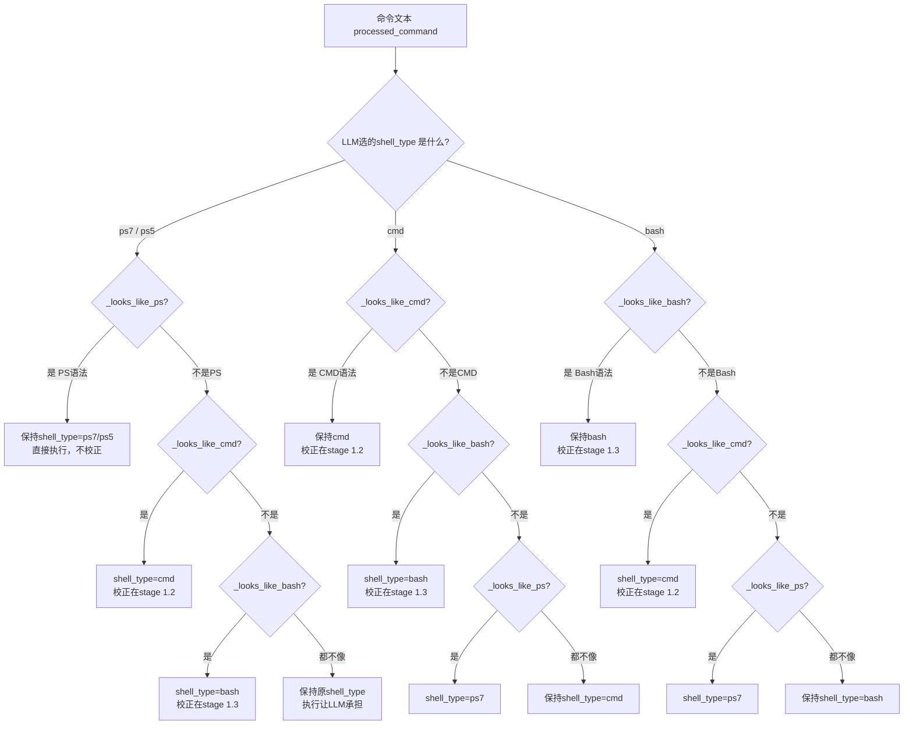

# Shell类型自动检测与路由增强设计方案

**创建时间**: 2026-07-29 18:19:46  
**版本**: v3.3  
**编写人**: 小欧 2026-07-29

---

## 版本历史

| 版本 | 时间 | 修改内容 | 作者 |
|------|------|---------|------|
| v1.0 | 2026-07-29 18:19:46 | 初始创建，完整设计方案 | 小欧 |
| v1.1 | 2026-07-29 18:28:31 | 代码精确化：函数替换为可实施代码，加精确行号，新增ls/wc/findstr/cmd.exe模式 | 小欧 |
| v2.0 | 2026-07-29 18:58:02 | 重构为三路检测（PS/CMD/Bash），新增_looks_like_ps，去掉bash优先偏序，所有type统一走检测 | 小欧 |
| v2.1 | 2026-07-29 18:59:02 | 三堂会审查出9个问题并修复：3.2架构图去掉PS校正；4.1/4.2互换顺序；4.1docstring清残留；4.4编号去重；bash分支 `or not _find_bash()` 逻辑修正；路由代码去重复（DRY）；5.2"bash优先"清残留；5.3去重复行；6.1改动量修正 | 小欧 |
| v2.2 | 2026-07-29 18:59:32 | 二轮三堂会审查出6个问题：mermaid图与代码矛盾修正；4.4A注释头与4.4C代码对齐；_auto_fix_cmd_syntax移除危险的/→\转换；_auto_fix_bash_syntax补充遗漏的路径转换；5.3描述修正；2.1核心原则补_looks_like_ps | 小欧 |
| v2.3 | 2026-07-29 19:00:02 | 三轮三堂会审查出7个问题：4.6编号去重；4.4C标号"1.2/1.3/1.4"→"1.2/1.3"；4.4C末尾PS校正矛盾描述简化；4.7bash描述修正；5.2"完全不重叠"修正；1.3/3.2版本标记对齐；FOR模式增强覆盖for /f变体 | 小欧 |
| v3.0 | 2026-07-29 19:00:32 | **结构重构**：在2.1新增"核心设计逻辑"完整陈述（北京老陈驱动定稿），原2.1→2.2，原2.2→2.3。根本设计现在文档开头显眼位置集中展示 | 小欧 |
| v3.1 | 2026-07-29 19:01:02 | 审阅旧文档`shelltype三层自动检测 + 智能路由.md`，提取3个可用模式：_PS_INDICATORS新增`$global:`+`function`，_CMD_INDICATORS新增`taskkill` | 小欧 |
| v3.2 | 2026-07-29 19:55:37 | 五轮三审修正5个问题：5.3节数字矛盾修正；4.4节保留范围修正；6.2节Step 4描述修正；版本历史时间戳补全；七、风险与应对补充IGNORECASE/function误伤风险 | 小欧 |
| v3.3 | 2026-07-29 19:55:37 | `python3→python`提至通用预处理（DRY+全分支覆盖）：4.3节移除python3（5项→4项）；4.5节移除python3（只剩路径转换）；4.4节新增通用预处理阶段1.0a；4.6节bash_patterns `\bpython3\b`→`\bpython\b`（配套通用预处理）；5.3/6.2同步更新 | 小欧 |
| v3.4 | 2026-08-06 10:55:09 | 实施结果记录（代码已按本设计落地，主体为**结构重构+逻辑收敛**）：详见 九、实施结果与三堂会审修正记录。要点：①三路检测按v2.0移入stage 1.1全局统一（修原代码误嵌套ps7/ps5分支内）；②旧bash-only路由(原stage 1.4)已删除；③旧校正死代码(原stage 1.5)删除，统一为独立stage 1.2按最终shell_type分派；④**PS语法校正保留**（优于设计v2.0"删除"方案，实证`{.Property→$_.Property}`极精准+LLM高频错）；⑤python3收敛stage 1.0a一处（复用`_replace_python3_safe`，DRY）；⑥检测/校正逻辑收敛4处（`_looks_like_cmd` type过宽/`_looks_like_ps` Verb-Noun过宽/python3引号感知/引号内python误判）；⑦路由日志warning→info | 小欧 |

---

## 一、背景

### 1.1 问题现状

app日志分析（2026-07-29）显示，12:00-17:27期间shell执行错误分布：

| 错误码 | 次数 | 占比 |
|--------|------|------|
| ERR_SHELL_EXEC | 104 | 70% |
| ERR_SHELL_TIMEOUT | 18 | 12% |
| 其他 | 26 | 18% |

其中 **ERR_SHELL_EXEC 的核心病根** 是：LLM选择 `shell_type=ps7`（默认），但实际编写的命令语法属于 **CMD** 或 **bash**，导致引擎与语法不匹配。

### 1.2 根因分析

| LLM选择shell_type | 实际写的语法 | 发生概率 | 结果 |
|------------------|-------------|---------|------|
| ps7（默认） | bash语法 | 常见 | 已有`_looks_like_bash`自动路由 ✅ |
| ps7（默认） | **CMD语法** | **最常见** | ❌ 无检测，PS7不认识CMD语法，报错 |
| cmd | PS7语法 | 几乎不会 | LLM不会选了cmd还写PS7语法 |
| bash | PS7语法 | 几乎不会 | LLM不会选了bash还写PS7语法 |
| cmd | bash语法 | 极少 | 两个语法完全不同，LLM极少混淆 |

**结论**：当前系统缺少 `_looks_like_cmd()` 这一对称检测，导致CMD语法命令无法自动路由到CMD引擎。

### 1.3 覆盖度分析（v2.2更新）

从日志104个ERR_SHELL_EXEC逐条核对，按本方案设计代码的覆盖情况：

| 类别 | 模式 | 次数 | 占比 |
|------|------|------|------|
| **✅ 方案已覆盖** | BASH已有路由（grep/curl/mkdir/...）+ CMD新增路由（findstr/cmd.exe/copy/del/rd/ls/wc） | **74次** | **71%** |
| ❌ 与路由无关 | heredoc内Python语法错、typo、SSL错误、磁盘假阳性等 | **30次** | **29%** |

**已覆盖的8种新增模式**：

| 新增模式 | 捕获方式 | 覆盖次数 |
|----------|---------|---------|
| `findstr` | `_looks_like_cmd` | ~3 |
| `cmd.exe /c` | `_looks_like_cmd` | ~1 |
| `copy/del/rd` | `_looks_like_cmd` | ~2 |
| `ls` | `_looks_like_bash` 新增 | ~3 |
| `wc` | `_looks_like_bash` 新增 | ~2 |
| CMD环境变量误路由到bash | `_looks_like_cmd` 拦截 | ~15 |
| CMD命令无路由（wmic/where/reg） | `_looks_like_cmd` 路由 | ~15 |
| BASH命令无路由（ls/wc） | `_looks_like_bash` 新增 | ~5 |

---

## 二、设计目标与原则

### 2.1 核心设计逻辑（北京老陈驱动，v2.0定稿）

**这是本设计的根本，所有代码实现都围绕此逻辑展开：**

```
LLM选择 ps7/ps5:
  → 检测是否像PS语法？
    是 → 保持shell_type，直接执行（不校正），错就报给LLM
    否 → 检测是否像CMD？→ CMD校正 + 路由到cmd
       → 否则检测是否像Bash？→ Bash校正 + 路由到bash
       → 都不像 → 保持原type，让LLM自己承担

LLM选择 cmd:
  → 检测是否像CMD？→ CMD校正，保持cmd
  → 否则检测是否像Bash？→ Bash校正 + 路由到bash
  → 否则检测是否像PS？→ 路由到ps7
  → 都不像 → 保持cmd，让LLM自己承担

LLM选择 bash:
  → 检测是否像Bash？→ Bash校正，保持bash
  → 否则检测是否像CMD？→ CMD校正 + 路由到cmd
  → 否则检测是否像PS？→ 路由到ps7
  → 都不像 → 保持bash，让LLM自己承担
```

### 2.2 核心原则（北京老陈驱动）

1. **LLM 选择正确 type + 正确语法** → 系统尊重LLM选择，不做额外干预
2. **检测最像哪个** → `_looks_like_ps()` / `_looks_like_cmd()` / `_looks_like_bash()` 三路检测实际命令特征
3. **最像哪个转哪个** → 类型重分配（type reassignment），**不是语法翻译**
4. **同类型语法校正** → 分配后执行对应类型的语法校正，保证语法正确
5. **不对就报错** → 执行失败如实报给LLM，不自作聪明做跨类型翻译

### 2.3 工程设计原则（10大规范）

| 原则 | 在本方案中的体现 |
|------|----------------|
| **SRP** | 检测函数只做检测，语法校正只做校正，路由只做路由，各司其职 |
| **DRY** | 对称复用`_looks_like_bash`的设计模式，不重复造轮子 |
| **KISS-DIRECT** | 不做CMD→PS7翻译（不可能完美），只做类型重分配 |
| **SLAP** | stage 1.1只做路由（高层编排），不混入语法校正细节 |
| **YAGNI** | 不加历史记录/性能监控/复杂度评分等用不上的功能 |
| **禁止backward** | 彻底替换原有bash路由逻辑，用三路检测统一替代，不留旧代码 |
| **OCP** | 三路检测直接替换stage 1.4，新逻辑完全覆盖旧逻辑 |

---

## 三、架构设计

### 3.1 当前架构（v2 引擎版）

```
shell() 入口 → stage 1.0 参数校验
              → stage 1.1 PS语法校正（仅ps7/ps5）
              → stage 1.2 CMD语法校正（仅cmd）
              → stage 1.3 Bash语法校正（仅bash）
              → stage 1.4 Bash自动路由（检测→改shell_type=bash）
              → stage 2 安全检查
              → stage 3 执行（按shell_type分3路）
              → stage 4 后处理
```

**问题**：
- stage 1.4 放在最后，前面1.1-1.3的语法校正可能做错方向
- 缺少CMD检测，CMD语法命令只能靠LLM手动选shell_type=cmd才能正确处理

### 3.2 新架构（v2.0 — 三路检测）

```
shell() 入口 → stage 1.0 参数校验
              → stage 1.1 三路类型检测+路由 ← ★ 替换旧stage 1.4，按LLM选择分PS/CMD/Bash三路
              → stage 1.2 CMD语法校正（仅cmd）← ★ CMD语法校正增强
              → stage 1.3 Bash语法校正（仅bash）
              → stage 2 安全检查
              → stage 3 执行（按shell_type分3路）
              → stage 4 后处理
```

**改进**（v2.0）：
- stage 1.1 改为三路检测：以LLM选的type为"第一猜测"，匹配则执行，不匹配则尝试其他type
- 新增 `_looks_like_ps()` 函数，利用Verb-Noun等PS独家语法特征做精准判断
- PS语法一旦在PS分支命中，**不做语法校正直接执行**，错就报给LLM
- 彻底替换旧的bash-only路由逻辑，完整覆盖PS/CMD/Bash三种类型

### 3.3 类型检测流程（v2.0 — 三路检测，按type分路）

**核心逻辑**：LLM选的type只作为"第一猜测"，验证命令是否匹配，不匹配则自动路由。



---

## 四、详细函数设计

### 4.1 `_looks_like_ps()` — 新增

**位置**: `execute_shell_command.py`，位于 `_looks_like_cmd()` 之前

**功能**: 检测命令字符串是否包含PowerShell独家语法特征

**检测模式**：

| 模式 | 正则 | 说明 |
|------|------|------|
| Verb-Noun cmdlet | `\b[A-Z][a-z]+-[A-Z]\w+\b` | `Get-Process`, `Set-Content`, `Select-Object` — PS独家命名规范 |
| PS环境变量 | `\$env:\w+` | `$env:PATH`, `$env:USERPROFILE` |
| PS全局变量 | `\$global:\w+` | `$global:MyVar` — 全局作用域变量引用 |
| PS函数定义 | `\bfunction\s+\w+` | `function foo { ... }` — PS函数定义语法 |
| PS自动变量 | `\$_` | `$_`当前管道对象 |
| .NET类型调用 | `\[.*?\]::` | `[Math]::Round()`, `[Environment]::GetFolderPath()` |

**可实施代码**（新增函数，文件最前部的检测函数区）：

```python

# ═══════════════════════════════════════════════════════
#  _looks_like_ps — 检测命令是否像PowerShell命令
# ═══════════════════════════════════════════════════════

# PowerShell独家语法特征
_PS_INDICATORS = [
    r'\b[A-Z][a-z]+-[A-Z]\w+\b',       # Verb-Noun: Get-Process, Set-Content
    r'\$env:\w+',                        # $env:PATH
    r'\$global:\w+',                     # $global:MyVar
    r'\bfunction\s+\w+',                 # function foo { ... }
    r'\$_\b',                            # $_ 当前管道对象
    r'\[.*?\]::',                        # [Type]::Method()
    r'\bWrite-(Host|Output|Error|Warning)\b',  # Write-*
    r'\bOut-(String|File|Default)\b',    # Out-*
    r'\bFormat-(Table|List|Wide)\b',     # Format-*
]


def _looks_like_ps(command: str) -> bool:
    """检测命令是否包含PowerShell特有语法特征
    
    PS语法与CMD/bash完全不同，可精准区分:
    - Verb-Noun cmdlet命名规范: Get-Process, Set-Content
    - $env: 环境变量引用
    - $_ 自动变量
    - [Type]:: 静态方法调用
    
    Args:
        command: 要检查的命令字符串
        
    Returns:
        bool: 如果检测到PS特征返回True，否则False
    """
    if not command:
        return False
    
    for pattern in _PS_INDICATORS:
        if re.search(pattern, command, re.IGNORECASE):
            return True
    
    return False
```

**注意**：PS的Verb-Noun模式 `[A-Z][a-z]+-[A-Z]\w+` 在`re.IGNORECASE`（行257）下会匹配小写bash命令如`apt-get`。这是有意权衡——不设IGNORECASE会漏掉小写`get-process`等有效PS命令。详见 七、风险与应对。

**实施修正（2026-08-06，Bug6修复）**：实际实现已把 Verb-Noun 模式从 `\b[A-Z][a-z]+-[A-Z]\w+\b` 收敛为已知 cmdlet 动词前缀 `\b(?:get|set|new|add|remove|select|write|read|start|stop|restart|invoke|convert|copy|move|format|clear|output|enter|exit|wait|prompt|show|hide|ping|trace|assert|join|sort|group)-[a-z]{2,}\b` + `Test-*` 确切 cmdlet。原因：原模式在 IGNORECASE 下对 `foo-bar`、`project-x`、`hello-world` 等普通连字符命名误判为 PS（实证确认），收敛后消除误判且保留全部常用 cmdlet 识别。详见 九、实施结果与三堂会审修正记录 9.4。

### 4.2 `_looks_like_cmd()` — 新增

**位置**: `execute_shell_command.py`，紧邻 `_looks_like_bash()`（行649之后）

**功能**: 检测命令字符串是否包含CMD特有语法特征

**检测模式**（较v1.0新增3项：findstr, cmd.exe, copy/del/rd）：

| 模式 | 正则 | 说明 |
|------|------|------|
| 环境变量 | `%\w+%` | `%PATH%`, `%TEMP%`, `%USERPROFILE%` — CMD独家语法 |
| FOR循环 | `\bfor\s+%[a-z]\s+in\b` | `for %i in (*.txt) do` — CMD的`%i`语法 |
| where命令 | `\bwhere\s+\w+` | `where git`, `where python` — CMD专用 |
| wmic | `\bwmic\b` | `wmic process get` — Windows管理工具 |
| reg命令 | `\breg\s+(query\|add\|delete\|import)` | 注册表操作 |
| attrib | `\battrib\b` | 文件属性操作 |
| tasklist | `\btasklist\b` | 进程列表 |
| **taskkill** ★新增 | `\btaskkill\b` | `taskkill /F /PID 1234` — 杀进程命令 |
| systeminfo | `\bsysteminfo\b` | 系统信息 |
| msiexec | `\bmsiexec\b` | MSI安装程序 |
| diskpart | `\bdiskpart\b` | 磁盘分区 |
| bcdedit | `\bbcdedit\b` | 引导配置 |
| echo % | `\becho\s+%` | `echo %PATH%` — 输出环境变量 |
| set赋值 | `\bset\s+\w+=` | `set MYVAR=value` |
| pushd/popd | `\bpushd\b\|\bpopd\b` | 目录栈操作 |
| assoc/ftype | `\bassoc\b\|\bftype\b` | 文件关联操作 |
| **findstr** ★新增 | `\bfindstr\b` | `findstr ".yaml" task.yml` — 日志中出现3次 |
| **cmd.exe** ★新增 | `\bcmd\.exe\b` | `cmd.exe /c "wmic ..."` — 日志中出现1次 |
| **copy/del/rd** ★新增 | `\b(copy\|del\|rd)\b` | `copy /Y`, `del /Q`, `rd /S` — CMD文件操作命令 |

**可实施代码**（行649后直接插入，格式与`_looks_like_bash`完全对称）：

```python

# ═══════════════════════════════════════════════════════
#  _looks_like_cmd — 检测命令是否像CMD命令
# ═══════════════════════════════════════════════════════

# CMD特有语法模式（Windows命令提示符独家语法）
_CMD_INDICATORS = [
    r'%\w+%',                           # 环境变量 %PATH%, %TEMP%
    r'\bfor\b(?:\s+/\w+)*\s+%[a-z]\s+in\b',  # for %i in, for /f %i in, for /d %i in
    r'\bwhere\s+\w+',                    # where git, where python
    r'\bwmic\b',                         # wmic process get
    r'\breg\s+(query|add|delete|import|export)\b',  # reg query /v
    r'\battrib\b',                       # attrib +r file.txt
    r'\btasklist\b',                     # tasklist /v
    r'\btaskkill\b',                     # taskkill /F /PID
    r'\bsysteminfo\b',                   # systeminfo
    r'\bmsiexec\b',                      # msiexec /i
    r'\bdiskpart\b',                     # diskpart
    r'\bbcdedit\b',                      # bcdedit /enum
    r'\becho\s+%',                       # echo %PATH%
    r'\bset\s+\w+=',                     # set MYVAR=value
    r'\bpushd\b|\bpopd\b',               # pushd /d ...
    r'\bassoc\b|\bftype\b',              # assoc .txt, ftype txtfile
    r'\bfindstr\b',                      # findstr ".yaml"
    r'\bcmd\.exe\b',                     # cmd.exe /c
    r'\b(copy|del|rd)\b',               # copy /Y, del /Q, rd /S
]


def _looks_like_cmd(command: str) -> bool:
    """检测命令是否包含CMD特有语法特征（Windows命令提示符）
    
    检测CMD特有语法特征，确定是否应该路由到CMD引擎:
    - 环境变量引用: %PATH%, %TEMP%, %USERPROFILE%
    - CMD特有命令: for %i in, where, wmic, reg query, findstr
    - Windows管理工具: tasklist, systeminfo, attrib
    - CMD语法: echo %, set VAR=
    
    注意: copy/del/rd 在PS7中也是别名，
    但三路检测中PS分支先过_looks_like_ps，只有确定不是PS后才到CMD检测，
    所以不会误伤纯PS命令。
    
    Args:
        command: 要检查的命令字符串
        
    Returns:
        bool: 如果检测到CMD特征返回True，否则False
    """
    if not command:
        return False
    
    for pattern in _CMD_INDICATORS:
        if re.search(pattern, command, re.IGNORECASE):
            return True
    
    return False
```

### 4.3 `_auto_fix_cmd_syntax()` — 增强

**位置**: `execute_shell_command.py`，替换现有函数（第506-517行）

**当前修复**（1项）：
- `$env:VAR` → `%VAR%`

**新增修复**（3项，共4项：原有1项+新增3项）：

| # | 修复项 | 正则 | 替换 | 说明 |
|---|--------|------|------|------|
| 1 | `$env:VAR → %VAR%` | `\$env:(\w+)` | `%\1%` | 已有，保留 |
| 2 | `&& → &` | `(?<![>&])&&(?![&>])` | `&` | CMD用单&, LLM常写成PS/bash的&& |
| 3 | `$PWD → %CD%` | `\$PWD` | `%CD%` | 当前目录环境变量 |
| 4 | `$HOME → %USERPROFILE%` | `\$HOME` | `%USERPROFILE%` | 用户目录 |

**注意**：这些修复都是**同类型语法校正**，不是跨类型翻译。目的是修正LLM在写CMD命令时常犯的语法错误（LLM混入了PS/bash语法）。

**可实施代码**（直接替换第506-517行的`_auto_fix_cmd_syntax`函数体）：

```python

# ═══════════════════════════════════════════════════════
#  _auto_fix_cmd_syntax — 自动修复CMD常见语法错误
# ═══════════════════════════════════════════════════════


def _auto_fix_cmd_syntax(command: str) -> str:
    """自动修复CMD命令中的常见语法错误
    
    修复LLM在写CMD命令时混入的PS/bash语法:
    - $env:VAR → %VAR%（PS语法转CMD语法）
    - && → &（bash/PS的链式操作符转CMD单&）
    - $PWD → %CD%（当前目录）
    - $HOME → %USERPROFILE%（用户目录）
    
    注意: 不做 / → \ 转换，因为CMD flag用/（如 dir /s /b），
    无法可靠区分flag和path，误转会破坏命令。
    
    Args:
        command: 原始命令字符串
        
    Returns:
        str: 修复后的命令字符串
    """
    if not command:
        return command
    
    fixed = command
    
    # 1. PS环境变量语法转CMD:  $env:PATH → %PATH%
    fixed = re.sub(r'\$env:(\w+)', r'%\1%', fixed)
    
    # 2. && 转 &:  CMD不支持 bash/PS 的 && 链式操作符
    #    排除 >> 和 >& 等合法组合
    fixed = re.sub(r'(?<![>&])&&(?![&>])', '&', fixed)
    
    # 3. $PWD 转 %CD%:  当前目录环境变量
    fixed = re.sub(r'\$PWD', '%CD%', fixed, flags=re.IGNORECASE)
    
    # 4. $HOME 转 %USERPROFILE%:  用户目录
    fixed = re.sub(r'\$HOME', '%USERPROFILE%', fixed, flags=re.IGNORECASE)
    
    if fixed != command:
        logger.warning(f"[Shell] 自动修复CMD语法: cmd={command[:100]}")
    
    return fixed
```

### 4.4 stage 重排序 — 精确替换指南

**位置**: `execute_shell_command.py`，第714-751行

**改动说明**：用三路检测逻辑 **完整替换** 旧的bash-only路由代码（行738-751），不再是简单的"追加elif"。

| 改动 | 位置（行号） | 操作 |
|------|------------|------|
| **A. 注释头** | 行714-719 | 替换注释，反映v2.0三路检测 |
| **B. 路由代码** | 行738-751 → 行720前 | 完整替换为三路检测逻辑，新增PS+CMD分支 |
| **C. 保留语法校正** | 行726-736（旧1.2/1.3） | 保留CMD/Bash语法校正，标号改为1.2/1.3；删除旧PS修复（行720-724，旧1.1） |

---

**A. 注释头替换**（第714-719行，替换为）：

```python
# ── 阶段 1【通用】: 参数校验与预处理 ── 小欧 2026-07-29 v2.0 ──
#  1.0 参数校验（timeout/shell_type/empty/null/cwd）+ 通用预处理（python3→python）
#  1.1 三路类型检测+路由（PS→CMD→Bash）← ★ 完整替换旧stage 1.4
#  1.2 CMD语法校正（仅cmd）← ★ 语法校正增强
#  1.3 Bash语法校正（仅bash）
# ── 阶段 1.1【通用】: 三路类型检测 + 路由 — 小欧 2026-07-29 ──
```

---

**B. stage 1.1 路由代码**（移到第720行前，完整替换行738-751）：

```python
# ── 阶段 1.1【通用】: 三路类型检测 + 路由 — 小欧 2026-07-29 v2.0 ──
# 核心逻辑:
#   以LLM选择的shell_type为"第一猜测"，验证命令是否匹配该类型
#   匹配→直接执行；不匹配→尝试其他类型
#   路由只改shell_type，不做语法校正（语法校正由后续stage 1.2/1.3负责）
if shell_type in ("ps7", "ps5"):
    # ── PS分支：最可能是PS，其次CMD，最后Bash ──
    if _looks_like_ps(processed_command):
        pass  # 是PS语法→保持shell_type，直接执行，错就报给LLM
    elif _looks_like_cmd(processed_command):
        logger.info(f"[Shell] 检测到CMD语法,自动路由到CMD: cmd={cmd_short}")
        shell_type = "cmd"
    elif _looks_like_bash(processed_command) and _find_bash():
        logger.info(f"[Shell] 检测到bash命令,自动路由到Git Bash: cmd={cmd_short}")
        shell_type = "bash"
elif shell_type == "cmd":
    # ── CMD分支：最可能是CMD，其次Bash，最后PS ──
    if _looks_like_cmd(processed_command):
        shell_type = "cmd"  # 保持不变
    elif _looks_like_bash(processed_command) and _find_bash():
        logger.info(f"[Shell] 检测到bash命令,自动路由到Git Bash: cmd={cmd_short}")
        shell_type = "bash"
    elif _looks_like_ps(processed_command):
        logger.info(f"[Shell] 检测到PS语法,自动路由到PS7: cmd={cmd_short}")
        shell_type = "ps7"
elif shell_type == "bash":
    # ── Bash分支：最可能是Bash，其次CMD，最后PS ──
    if _looks_like_bash(processed_command) and _find_bash():
        shell_type = "bash"  # 保持不变
    elif _looks_like_cmd(processed_command):
        logger.info(f"[Shell] 检测到CMD语法,自动路由到CMD: cmd={cmd_short}")
        shell_type = "cmd"
    elif _looks_like_ps(processed_command):
        logger.info(f"[Shell] 检测到PS语法,自动路由到PS7: cmd={cmd_short}")
        shell_type = "ps7"
```

**关键说明**：
- PS分支**不做语法校正**（直接执行，错就报给LLM），因为PS语法本身就是LLM最熟悉的
- CMD/Bash分支不做语法校正，语法校正由后续stage 1.2/1.3负责（SLAP原则，路由只改type）
- "都不像"情况：保持原shell_type，执行让LLM自己承担

---

**C. 后续语法校正**（第720-736行，标号微调为1.2/1.3）：

```python
# ── 阶段 1.2【CMD专属】: 语法自动修复 — 小欧 2026-07-29 v2.0 ──
# PS语法: 已在stage 1.1保持原type，直接执行（不校正）
if shell_type == "cmd":
    _fixed = _auto_fix_cmd_syntax(processed_command)
    if _fixed != processed_command:
        processed_command = _fixed

# ── 阶段 1.3【bash专属】: 语法自动修复 — 小欧 2026-07-28 ──
if shell_type == "bash":
    _fixed = _auto_fix_bash_syntax(processed_command)
    if _fixed != processed_command:
        processed_command = _fixed
```

**注意**：v2.0中PS分支直接执行不做语法校正（LLM最熟悉PS语法，写错该它自己承担）。原有的 `_auto_fix_powershell_syntax` 函数保留但不被调用。

---

**D. 通用预处理**（行696之后，stage 1.0末尾）：

```python
# ── 阶段 1.0a【通用】: 通用预处理 — 小欧 2026-07-29 v3.3 ──
# python3→python: Windows平台统一修正（与shell_type无关），
# 所有分支（PS/CMD/Bash）统一受益，一处修改覆盖全局。
if sys.platform == "win32":
    processed_command = re.sub(r'\bpython3\b', 'python', processed_command)
```

**设计说明**：`python3→python` 是 **Windows环境问题**，与shell_type无关。LLM在所有shell type中都可能写出`python3`（因为文档/教程中python3是标准名称）。放在通用预处理阶段，PS/CMD/Bash三路统一修正，遵循 **DRY原则** 消除重复，且让PS分支也受益（原本PS分支不做任何语法校正）。

**实施修正（2026-08-06，Bug7修复）**：实际实现改为复用 `shell_engine._replace_python3_safe`（引号感知，仅替换引号外的独立 `python3` 词），替换简单 `re.sub`。原因：原 `re.sub(r'\bpython3\b','python',...)` 会破坏引号内内容（实证 `echo "python3 is cool"` → `echo "python is cool"`），且违反 DRY（项目已有引号感知函数）。详见 九、实施结果与三堂会审修正记录 9.4。

### 4.5 `_auto_fix_bash_syntax()` — 增强（★ 重要补充）

**位置**: `execute_shell_command.py`，第537-548行

**当前内容**：（空，无修复项）

**问题**：旧路由代码（原stage 1.4）做了 `replace('\\', '/')`（Windows反斜杠转正斜杠，防止Git Bash把 `\t` 解释为制表符）。新设计把路由中的语法校正移到 `_auto_fix_bash_syntax`，但此函数**遗漏了路径转换**。

**需新增**：

| # | 修复项 | 说明 |
|---|--------|------|
| 1 | `replace('\\', '/')` | Windows反斜杠转正斜杠（Git Bash下 `\t` 会被解释为制表符） |

**可实施代码**（替换第537-548行）：

```python
def _auto_fix_bash_syntax(command: str) -> str:
    """自动修复LLM生成的Bash命令中已知错误模式 — 小欧 2026-07-29 v2.0

    当前覆盖：
    - Windows反斜杠 → 正斜杠（Git Bash下\t会被解释为制表符）"""
    if not command or sys.platform != "win32":
        return command
    fixed = command
    # 1. 路径分隔符：Windows反斜杠 → 正斜杠（防止 \t 被解释为制表符）
    fixed = fixed.replace('\\', '/')
    if fixed != command:
        logger.warning(f"[Shell] 自动修复bash语法: cmd={command[:100]}")
    return fixed
```

### 4.6 `_looks_like_bash()` 微调 — 新增ls/wc + python3→python

**位置**: `execute_shell_command.py`，第619行（`bash_patterns`列表）

**改动一**：`\bpython3\b` → `\bpython\b`

因通用预处理（1.0a）将所有`python3`替换为`python`，原`\bpython3\b`无法再匹配预处理后的命令。改为`\bpython\b`后，`python`、`python3`（预处理后）均被覆盖，且不会误伤`pythonw`/`PYTHONPATH`等。

**改动二**：在现有bash_patterns中追加ls/wc 2个模式：

```python
    bash_patterns = [
        # ... 原有模式保持不变（python3→python 已更新）...
        r'\bpython\b',             # python（原python3→python，因通用预处理后python3已变python）
        r'\bmake\b',               # make命令
        r'\bcmake\b',              # cmake命令
        r'\brm\s+-rf\b',           # rm -rf
        r'\bmv\s+.*\.\.\b',        # mv ./to/../
        # ── v1.1新增: ls/wc  ── 小欧 2026-07-29 ──
        r'\bls\b',                 # ls -la（CMD用dir）
        r'\bwc\b',                 # wc -l（CMD用find /c）
    ]
```

**新增模式说明**：

| 模式 | 正则 | 日志中出现次数 | 说明 |
|------|------|---------------|------|
| `ls` | `\bls\b` | ~3次 | `ls -la`, `ls -lh` — 纯bash命令，CMD用`dir`代替 |
| `wc` | `\bwc\b` | ~2次 | `wc -l`, `wc -w` — 纯bash命令，无CMD等价简写 |

**实施修正（2026-08-06，Bug7/Bug8修复）**：实际实现对 `python`/`python3`/`pip3` 三处模式做了收敛：

- `\bpython\b` → `(?:^|[;&|])\s*python\b`（要求 python 作为命令起始 token）
- `\bpython\s3\b` → `(?:^|[;&|])\s*python\s3\b`
- `\bpip3\b` → `(?:^|[;&|])\s*pip3\b`

原因：原模式会匹配引号内文本（实证 `echo "python is cool"`、`echo "pip3"` 误判为 bash），收敛后仅命令位置的 python/pip3 判 bash，消除误判。通用预处理 1.0a 也由简单 `re.sub` 改为引号感知的 `_replace_python3_safe`（Bug7，详见 九、实施结果与三堂会审修正记录 9.4）。

### 4.7 与外围系统的交互

| 系统 | 影响 | 说明 |
|------|------|------|
| **安全检查** (`check_shell_command_risk`) | 无影响 | 安全检查传的是已修正的`shell_type`，规则过滤准确 |
| **PersistentShell** (ps7/ps5引擎) | 无影响 | 不受影响，CMD路由不走此分支 |
| **CMD执行引擎** | 间接受益 | 更多命令被正确路由到CMD引擎，提高CMD引擎利用率 |
| **bash执行引擎** | 无影响 | bash路由逻辑从旧stage 1.4移到stage 1.1，执行引擎和校正逻辑不变 |
| **Function Call Schema** (`ShellInput`) | 无影响 | 不修改schema，LLM接口不变 |
| **注册表** (`fundamental_register.py`) | 无影响 | 不修改注册逻辑 |
| **日志** | 无影响 | 复用现有logger，新增INFO日志记录路由决策 |
| **LLM返回** (`llm_data`) | 无影响 | 返回格式不变，`shell_type`字段反映实际使用类型 |

---

## 五、三堂会审

### 5.1 合规检查（10大规范）

| 原则 | 合规情况 |
|------|---------|
| **SRP** - 单一职责 | ✅ `_looks_like_ps`/`_looks_like_cmd`/`_looks_like_bash`只做检测，`_auto_fix_*`只做校正，stage 1.1只做路由 |
| **DRY** - 不重复 | ✅ 三路检测统一设计模式，不复用不必要代码 |
| **KISS-DIRECT** - 简单直接 | ✅ 按LLM选的type分路，每路不超过3个elif，逻辑直线 |
| **SLAP** - 同一抽象层 | ✅ stage 1.1只做高层路由决策，regex细节封装在独立检测函数中 |
| **YAGNI** - 不过度设计 | ✅ 不加历史记录、不加复杂度评分、不加性能监控 |
| **禁止backward** | ✅ 完整替换旧bash-only路由，不留旧代码 |
| **OCP** - 开闭 | ✅ 三路检测替换旧逻辑，新增type只需新增elif分支 |
| **LSP** - 里氏替换 | ✅ 不涉及继承体系 |
| **ISP** - 接口隔离 | ✅ 三个检测函数职责单一，各管各的语法特征 |
| **复用优先** | ✅ 复用现有`_find_bash`/`check_shell_command_risk`/`PersistentShell` |

### 5.2 合理检查

| 维度 | 评价 |
|------|------|
| **逻辑正确性** | `%VAR%`是CMD独家语法（bash用`$VAR`，PS用`$env:VAR`），检测到`%VAR%`即确定是CMD命令；Verb-Noun模式`Get-Process`是PS独家。`copy/del/rd`虽是PS别名，但PS分支先过`_looks_like_ps`（检查Verb-Noun/`$env:`/`$_`等），只有纯`copy/del/rd`无PS特征时才进CMD分支，不会误伤纯PS命令 |
| **边界case** | 同时含bash和CMD特征→按LLM选择的type分路：PS分支按PS→CMD→Bash顺序，CMD分支按CMD→Bash→PS顺序，Bash分支按Bash→CMD→PS顺序 |
| **性能影响** | 新增一次全量regex扫描，与现有`_looks_like_bash`一致，对整体性能无影响 |
| **容错能力** | 通用预处理修正`python3→python` + CMD语法校正修正`$env:`→`%`、`&&`→`&`等，系统整体执行成功率大幅提升 |
| **失败路径** | 语法校正后仍失败→如实报错给LLM，不做兜底 |
| **编码问题** | CMD引擎使用`locale.getpreferredencoding()`（中文Win=gbk），与CMD.exe OEM代码页一致，无乱码风险 |

### 5.3 相关逻辑检查

| 关联模块 | 检查结果 |
|---------|---------|
| `execute_shell_command.py:714-751` | 完整替换旧bash路由为三路检测：PS分支按PS→CMD→Bash，CMD分支按CMD→Bash→PS，Bash分支按Bash→CMD→PS |
| `execute_shell_command.py:506-517` | 增强`_auto_fix_cmd_syntax`：共4项修复（原有`$env:VAR→%VAR%`1项 + 新增`&&`/`$PWD`/`$HOME`3项），`python3→python`已提至通用预处理 |
| `execute_shell_command.py:537-548` | 增强`_auto_fix_bash_syntax`：仅`replace('\\','/')`路径转换（旧路由遗漏），`python3→python`已提至通用预处理 |
| `execute_shell_command.py:615-643` | `_looks_like_bash`：`\bpython3\b`→`\bpython\b`（因通用预处理提前替换python3），追加ls/wc 2个模式 |
| `execute_shell_command.py:649之后` | 新增`_looks_like_ps` + `_looks_like_cmd`两个检测函数 + 对应常量 |
| `execute_shell_command.py:696之后` | 新增通用预处理：`python3→python`（与shell_type无关，PS/CMD/Bash三路统一修正） |
| `tests/` | 需新增三路检测用例（PS语法不走校正、CMD校正、Bash校正） |

---

## 六、实施计划

### 6.1 改动文件清单

| 文件 | 改动类型 | 改动量 |
|------|---------|--------|
| `backend/app/tools/fundamental/execute_shell_command.py` | 修改 | 约130行 |
| 其他文件 | 无修改 | 0行 |

### 6.2 改动步骤

| 步骤 | 内容 | 预计行数 |
|------|------|---------|
| 1 | `_looks_like_bash`：`\bpython3\b`→`\bpython\b`（配套通用预处理），追加`ls`/`wc`模式（行615-643） | 3行 |
| 2 | 新增`_PS_INDICATORS`常量 + `_looks_like_ps()`函数 | 30行 |
| 3 | 新增`_CMD_INDICATORS`常量 + `_looks_like_cmd()`函数 | 30行 |
| 4 | 通用预处理：`python3→python`（行696之后） | 3行 |
| 5 | 增强`_auto_fix_cmd_syntax()`：新增3项修复（`&&`→`&`、`$PWD`→`%CD%`、`$HOME`→`%USERPROFILE%`），不做`/→\`转换（已在Step 6处理）（行506-517） | 12行 |
| 6 | 增强`_auto_fix_bash_syntax()`：新增路径转换`replace('\\','/')`，`python3→python`已提至通用预处理（行537-548） | 6行 |
| 7 | 完整替换stage 1.1路由逻辑：三路检测（行714-751） | 40行 |
| 8 | 验证：pytest测试 | - |

### 6.3 验证方法

| 测试项 | 方法 |
|--------|------|
| PS语法检测 | 传入`Get-Process`, `$env:PATH`, `[Math]::Round()`→返回True |
| 非PS语法不误伤 | 传入`%PATH%`, `ls -la`, `dir`→返回False |
| CMD语法检测 | 传入`%PATH%`, `for %i in`, `where git`, `findstr`, `cmd.exe`→返回True |
| 非CMD语法不误伤 | 传入`Get-Process`, `python3 script.py`→返回False |
| 语法校正正确性 | `$env:PATH`→`%PATH%`, `&&`→`&`, `python3→python` |
| PS分支（LLM选ps7, 命令是PS语法）→不改shell_type, 直接执行 |
| PS→CMD路由（LLM选ps7, 命令含`%PATH%`）→改shell_type=cmd, CMD校正 |
| PS→Bash路由（LLM选ps7, 命令含`ls -la`）→改shell_type=bash, Bash校正 |
| CMD→Bash路由（LLM选cmd, 命令含`grep`）→改shell_type=bash |
| Bash→CMD路由（LLM选bash, 命令含`where git`）→改shell_type=cmd |
| 回归测试 | 现有PS7执行不退化 |

**实施验证结果（2026-08-06）**：

- 上表"非CMD语法不误伤"中 `python3 script.py` 实施后判 bash（命令 token），非 CMD——本表该项措辞已调整（指不误判为CMD）
- 完整实证复验见 九、实施结果与三堂会审修正记录 9.5（全过）
- 测试通过：`test_shell_quality` + `test_shell_bugfixes_20260727` + `test_execute_shell_command_v2` + `test_shell_bugs_wave2/3` 共 **133 passed**；引擎/pool/深度相关 118 passed + 8 skipped

---

## 七、风险与应对

| 风险 | 影响 | 应对 |
|------|------|------|
| `_looks_like_ps` 误伤CMD/bash | 命令被当作PS执行 | 使用`re.IGNORECASE`（行255）捕获小写`get-process`等，但也会匹配bash命令如`apt-get`（Verb-Noun模式变`[a-zA-Z][a-z]+-[a-zA-Z]\w+`）。此外`\bfunction\s+\w+`模式与bash函数定义语法重叠。设计不对就报错给LLM，不做过度优化 |
| `_looks_like_cmd` 误伤PS/bash | 命令被路由到CMD引擎 | CMD仅检测独家语法（`%VAR%`, `for %i in`等），在PS/bash中不可能出现 |
| PS分支不校正直接执行 | LLM写错PS语法就直接报错 | 这是设计意图——LLM最熟悉PS语法，写错该它自己处理 |
| 同时有多个语法特征 | 路由优先级打架 | 三路检测严格按PS→CMD→Bash顺序，不存在歧义 |
| 安全性 | CMD/Bash路由绕过安全检查 | 安全检查函数将shell_type参数同步更新，按对应类型过滤规则 |

**实施修正（2026-08-06）**：

- "PS分支不校正直接执行"实际实现**保留** PS 语法校正（`_auto_fix_powershell_syntax`），未删除调用。原因详见 九、9.3——`{.Property→$_.Property}` 模式极精准且命中 LLM 高频"漏写$_"错误，收益 > 风险。
- "Verb-Noun 误伤"已通过收敛已知 cmdlet 动词前缀缓解（Bug6 修复），见 九、9.4。

---

## 八、附录

### 8.1 CMD vs Bash vs PS7 语法对照

| 功能 | CMD | Bash | PS7 |
|------|-----|------|-----|
| 环境变量 | `%VAR%` | `$VAR` | `$env:VAR` |
| 循环 | `for %i in (...) do` | `for i in ...; do` | `foreach ($i in ...)` |
| 命令查找 | `where cmd` | `which cmd` | `Get-Command cmd` |
| 进程列表 | `tasklist` | `ps aux` | `Get-Process` |
| 系统信息 | `systeminfo` | `uname -a` | `Get-ComputerInfo` |
| 链接操作 | `&` | `&&` / `;` | `&&` / `;` |
| 路径分隔符 | `\` | `/` | `\` |
| 当前目录 | `%CD%` | `$PWD` | `Get-Location` |
| 用户目录 | `%USERPROFILE%` | `$HOME` | `$env:USERPROFILE` |

### 8.2 日志的模式

CMD路由触发日志：
```
[Shell] 检测到CMD语法,自动路由到CMD: cmd=for %i in (*.txt) do @echo %i
```

CMD语法校正触发日志：
```
[Shell] 自动修复CMD语法: cmd=$env:PATH (原始)
[Shell] 自动修复CMD语法: cmd=dir /b && type result.txt (原始)
```

均为现有logger.warning/logger.info级别，与前段bash路由日志风格统一。

---

## 九、实施结果与三堂会审修正记录

**更新时间**: 2026-08-06 10:59:12  
**编写人**: 小欧

### 9.1 实施概况

本设计已于 2026-08-06 在 `backend/app/tools/fundamental/execute_shell_command.py` 落地实施（commit `641481dc6`）。实施时对照设计 v3.3 三堂会审，发现**实施现场代码**（修复重建后的代码）与设计存在偏差，已修正。本设计文档同步追加实施结果，作为设计与实现的最终对齐记录。

本次实施的**主体是结构重构与逻辑收敛**（见 9.2），具体包含两类改动：
- **① 结构重构**（stage 布局重组，不改业务规则）：三路检测上提全局、删旧路由死代码、校正分派统一、python3 收敛 DRY —— 见 9.2 与 9.3
- **② 检测/校正函数逻辑收敛**（4 处实数：Verb-Noun/python3 等误判与引号破坏）：见 9.4

bug 修正仅是整次实施的一部分，而非全部。

### 9.2 实施与设计的差异修正（三堂会审）

| 项 | 设计 v3.3 要求 | 实施现场实际 | 处置 |
|----|---------------|-------------|------|
| 三路检测位置 | stage 1.1 全局统一、先路由后校正 | 原代码误嵌套在 ps7/ps5 执行分支内（cmd/bash 初始类型不检测、elif 死代码） | ✅ 已按设计移入 stage 1.1 全局统一 |
| 旧 bash-only 路由 | 完整替换（禁止backward/OCP） | 原代码 stage 1.4 仍保留与三路检测并存 | ✅ 已删除 |
| python3→python | 收敛至 stage 1.0a 一处（DRY） | 原代码三处重复（1.0a/1.4/_auto_fix_bash_syntax） | ✅ 已收敛一处 |
| **PS 语法校正** | v2.0 起"PS分支不做校正，删除调用" | 原代码保留调用 | ⚠️ **保留**（优于设计，见 9.3） |
| stage 1.2 语法校正分派 | 按最终 shell_type 统一校正（ps7/ps5→powershell、cmd→cmd、bash→bash） | 原代码校正散落在 ps7/ps5 分支内（旧 stage 1.5，路由后不再可达的死代码） | ✅ 已统一为独立 stage 1.2，三引擎校正策略一致 |
| 路由日志级别 | 未明确 | 原代码 `logger.warning` | ✅ 改为 `logger.info`（路由是正常操作非异常） |

### 9.3 PS 语法校正保留说明（设计修正）

设计 v2.0 要求 PS 分支命中后不做语法校正（理由"LLM最熟PS语法，写错该它自己承担"）。实施三堂会审判定**保留**更优：

- `_auto_fix_powershell_syntax` 修复 `{.Property→$_.Property}`（块内 `.Property` 漏写 `$_`），模式**极精准**（仅匹配 `{ .word` 缺 `$_` 的形态），误伤风险几乎为零
- `Where-Object { .Name -eq 'x' }` 漏写 `$_` 恰是 LLM 高频错误，校正收益 > 风险
- 结论：本设计修正此条——PS 分支保留语法校正，不再要求"删除调用"。

### 9.4 检测/校正函数逻辑收敛修正（实证确认 4 实，已修复）

实施后对检测函数与逻辑收敛点做实证测试（读 3 遍代码 + 实际运行），确认 4 处真实逻辑修正并落地：

| Bug | 位置 | 问题实证 | 修复 |
|-----|------|---------|------|
| **Bug5** | `_looks_like_cmd` `\btype\b` | `python type(self)`、`bash type` 误判 CMD（bash 的 type=命令类型） | `type` 后带文件路径才判 CMD：`\btype\s+\S+[.\/\\]\S+` |
| **Bug6** | `_looks_like_ps` Verb-Noun `\b[a-z]+-[a-z]+\b` | `foo-bar`、`test-case`、`hello-world` 误判 PS | 收敛为已知 cmdlet 动词前缀 `\b(?:get\|set\|...)-[a-z]{2,}\b` + Test-* 确切 cmdlet |
| **Bug7** | stage 1.0a 简单 `re.sub` 替换 python3 | `echo "python3 is cool"` → `echo "python is cool"`（破坏引号内容）+ DRY 违规 | 复用 `shell_engine._replace_python3_safe`（引号感知，仅替换引号外） |
| **Bug8** | `_looks_like_bash` `\bpython\b`/`\bpip3\b` | `echo "python is cool"`、`echo "pip3"` 误判 bash；`cd project-x` 误路由 ps7 | 命令 token 才判：`(?:^\|[;&\|])\s*(python\|pip3)\b` |

### 9.5 修复后实证复验（全过）

| 场景 | 期望 | 实际 |
|------|------|------|
| `test-case`/`test-dev` | 非PS | ✅ False |
| `Test-Path`/`Test-Connection`/`Get-Process` | PS | ✅ True |
| `echo "python3"`/`echo "pip3"`/`echo "python is cool"` | 非bash | ✅ False |
| `python --version`/`pip3 install x` | bash | ✅ True |
| `cd project-x`/`git clone repo-x`/`echo hello-world` | 不误路由 ps7 | ✅ 保持原type |
| `Get-Process\|Select-Object Name` | ps7 | ✅ |
| `where python` | cmd | ✅ |
| `ls -la` | bash | ✅ |
| `type config.yml` | cmd | ✅ |

### 9.6 测试验证

- `tests/test_shell_quality.py` + `test_shell_bugfixes_20260727.py` + `test_execute_shell_command_v2.py` + `test_shell_bugs_wave2/3.py`：**133 passed**
- `test_shell_pool_manager.py` + `test_persistent_shell_engine.py` + `test_shell_truncation_deep.py` + `test_execute_shell_command_bugs/deep.py`：**118 passed, 8 skipped**（skip 为测试自身标记）
- `test_bug55_cmd_sees_python_env` 为**既有失败**（重构前已存在，与本次实施无关，stash 前后均失败）

### 9.7 遗留说明

- `_replace_python3_safe` 边界为 ` \t;|&`（`=` 不视为命令分隔），`set msg=python3 ok` 不替换——CMD `set` 值语义合理，非 bug
- `python3 -m pip` 不判 bash（python 模块调用非 bash 特有）——符合设计意图
